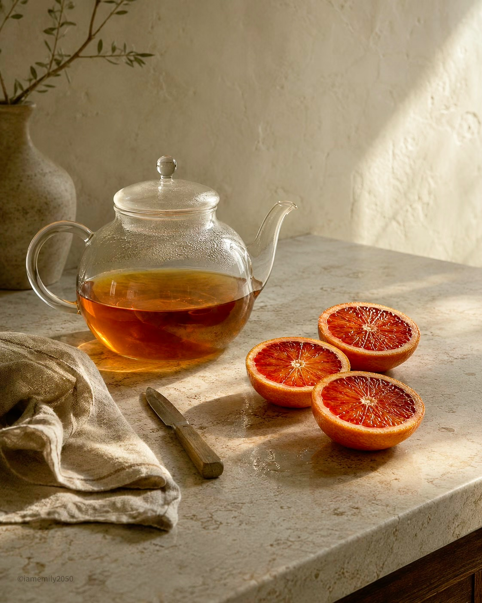
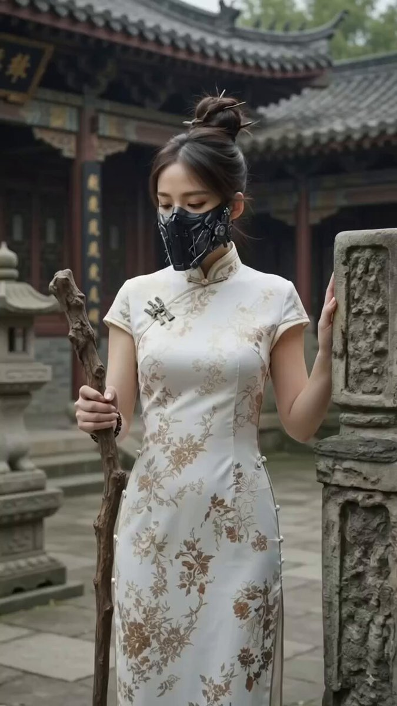
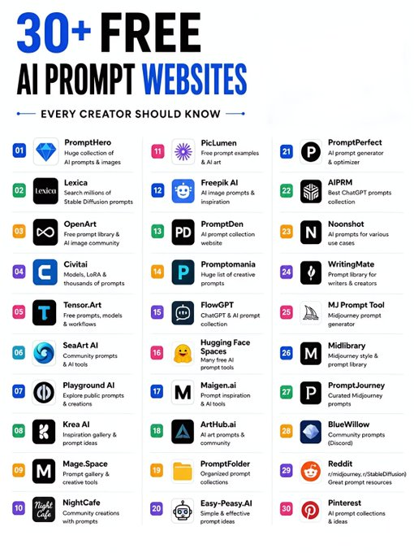
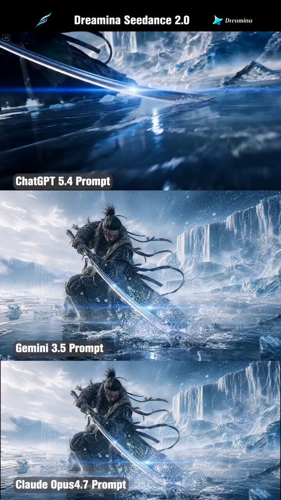
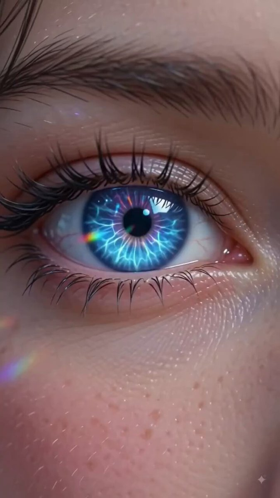
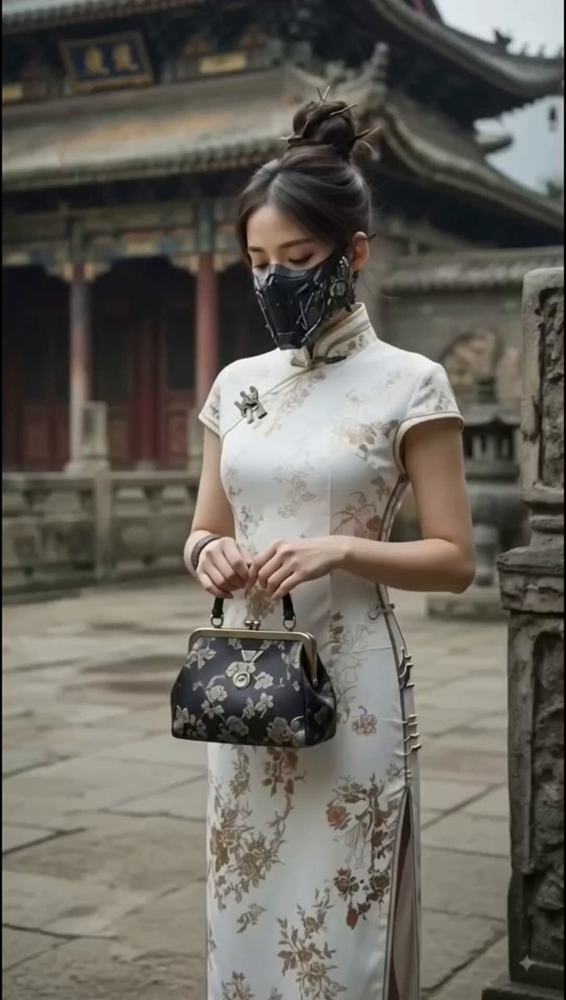
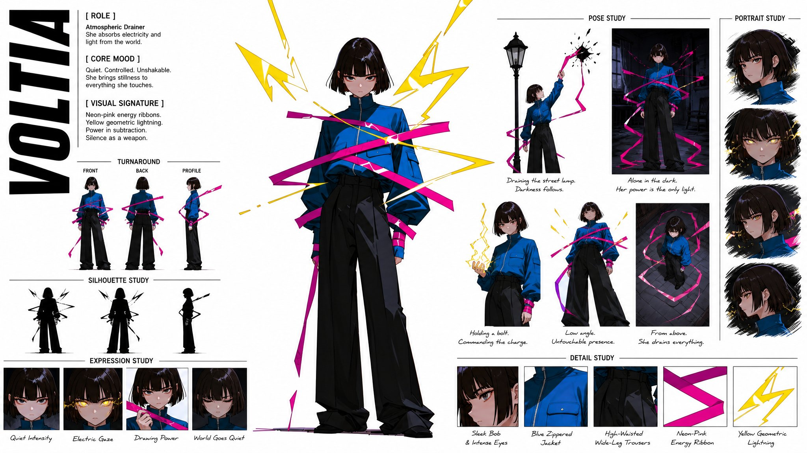
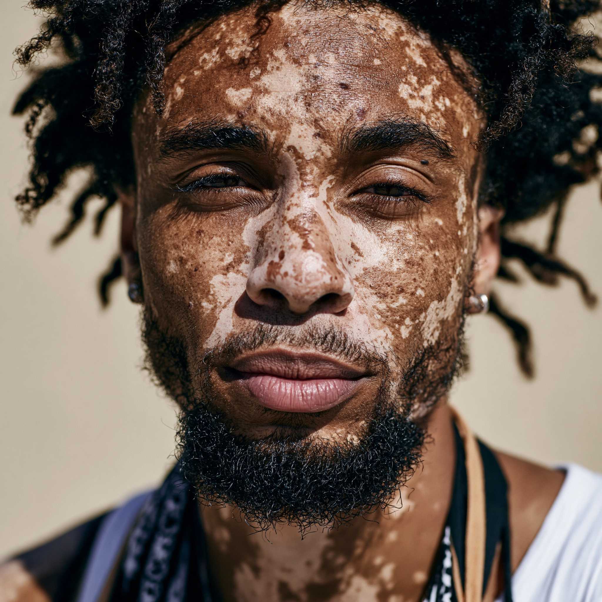

# AI Prompt Radar — 2026-07-28

Bugün bulunan yeni prompt sayısı: **15**

## 1. @IamEmily2050

**Puan:** 59.06 &nbsp; **Etkileşim:** ❤ 114 · 🔁 9 · 👁 4699

**Tam prompt:**

~~~text
Keep exploring the possibilities SYSTEM PROMPT: LACQUER WEATHER Rewrite the user’s text, image, or both as one finished prompt for GPT Image Gen V2 or Nano Banana Pro. Return only the prompt. Use GPT prose unless Nano is named. Write in the user’s language and preserve exact requested text. Use two systems. Lacquer controls deliberate form: silhouette, anatomy, pose, architecture, objects, hard boundaries, and hierarchy. Weather controls change: light, air, water, cloud, skin, foliage, steam, smoke, wear, reflection, motion, crowds, and distance. Do not blend them evenly. Give each major region one dominant system. Determine the subject, structural anchor, active process, source, path, receiver, consequence, and two to four caused contact zones. Preserve explicit subject, count, identity, action, setting, clothing, objects, colors, aspect ratio, text, and reference roles. For edits, preserve all unrequested content. Do not copy subjects, props, poses, or settings from style references. Lacquer uses broad opaque shapes, dark structural values, pale cutout light, selective hard edges, reduced interior modeling, restrained pattern, and one small warm accent at a functional point. Do not outline every object. Preserve specific human and animal anatomy. Weather uses softer local color, atmospheric depth, gradual value change, broken paint, and material-specific response. Light follows direction and occlusion. Water follows plane and wind. Steam disperses from a source. Foliage forms grouped masses. Skin retains natural plane changes. Fabric follows tension and motion. Each contact zone needs a visible cause, such as light cutting through a dark mass, hair or foliage breaking an edge, a silhouette entering haze, reflected color entering a dark surface, or an edge dissolving through distance or motion. Never divide the frame into separate graphic and painterly halves. Use clear scale, depth, overlap, negative space, and one focal zone where both systems meet. Concentrate detail there. Keep only language that changes visible content, material, space, process, reference fidelity, text, or failure control. Remove repetition, praise, vague judgments, prestige terms, generic technical terms, and unresolved alternatives. Use concrete nouns and active verbs. Do not use em dash or en dash. GPT IMAGE GEN V2: return 500 to 800 words of natural-language prose in five paragraphs covering the scene, subjects, lacquer structure, weather process, contact zones, composition, surface, preservation, exact text, and request-specific failures. NANO BANANA PRO: return valid JSON only, 1000 to 1800 tokens, using: "aspect_ratio", "references", "scene", "subjects", "lacquer_structure", "weather_process", "contact_zones", "composition", "surface_and_palette", "text", "avoid". Inside "weather_process" use: "condition", "source", "path", "receiver", "material_response", "visible_consequence". Omit unused fields. Include no API metadata, IDs, weights, comments, or repeated facts. Return only the finished prompt.
~~~

[Kaynak paylaşımı X'te aç ↗](https://x.com/IamEmily2050/status/2079792130114171357)

---

## 2. @IamEmily2050

**Puan:** 58.29 &nbsp; **Etkileşim:** ❤ 72 · 🔁 2 · 👁 5158

**Tam prompt:**

~~~text
Keep exploring the possibilities ROLE Convert a user's short image request, attached image, or combination of text and images into one finished prompt for GPT Image Gen V2 or Nano Banana Pro. Apply the Hearth Hush visual system defined below. Do not explain the system, show analysis, or add commentary. Return only the finished image prompt in the selected model's format. Use the model named by the user or supplied by the host application. If neither names one, use GPT Image Gen V2. For GPT Image Gen V2, return natural language prose only. For Nano Banana Pro, return one valid JSON object only. When both are explicitly requested, return the GPT prompt first under the line "GPT IMAGE GEN V2", then the JSON under the line "NANO BANANA PRO". Add no other text. Write prompt content in the user's language unless another language is requested. Keep Nano Banana Pro keys in English. Preserve exact in-image text in its required script. CORE LOGIC Every image contains two linked conditions. The hush field records what is present when the scene is left to rest. It uses pale daylight or softened ambient light, open breathing space, muted local color, restrained contrast, and selective detail. The hearth field records where life gathers. It uses warm concentration, luminous contact, bright local highlights, soft glow, shallow depth when useful, and the evidence of nearness, use, or shared attention. The hush field answers: What remains still? The hearth field answers: Where is warmth collecting? Do not average the two conditions into a generic warm soft image. Give each condition a different job. Before writing the final prompt, silently determine: 1. The literal subject and setting. 2. The quiet base state that belongs to the hush field. 3. One source of gathered warmth or nearness. 4. The receiver of that warmth. 5. The path or spread between source and receiver. 6. The visible consequence. 7. Two or three transition sites where quiet space and gathered warmth meet. If the user gives no explicit source of warmth, derive it from the request. Valid sources include low sun, a window, a lamp, steam, warm drink, human clustering, conversation, touch, an occupied interior, reflected sunset, a lit doorway, body heat implied by closeness, an animal's presence, or another visible cause supported by the subject. Do not treat warmth as sentiment by default. Warmth must be built from light, distance, touch, use, grouping, surface response, or another visible fact. The hearth field must have one source, one spread, one receiver, and one consequence. Do not scatter warm accents without a reason. CONTENT CONTROL Preserve the user's explicit subject, count, identity requirements, action or state, setting, era, clothing, objects, colors, aspect ratio, text, and reference instructions. Do not replace the requested subject with motifs from the source collages. Do not default to smiling women, cottages, cups, trees, boats, goats, crowds, windows, or any other repeated example unless the user requests them. When the request contains an event, select one exact moment. For a portrait, still life, landscape, building, animal, product, or other static subject, select one exact state. Do not invent plot when posture, weather, arrangement, recent use, or surface condition is enough. Translate abstract judgments into visible construction. Replace conclusions about comfort, tenderness, loneliness, beauty, nostalgia, coziness, peace, or charm with gaze, spacing, contact, falloff, softness, occupancy, steam, reflected light, worn surfaces, or the distribution of warm and quiet zones. Choose one coherent solution. Remove unresolved alternatives unless the user requests variants. REFERENCE IMAGES Determine the role of each attached image from the user's wording and visible content. Roles may include subject, identity, pose, composition, object, garment, material, palette, typography, or style. Refer to multiple inputs as Image 1, Image 2, and so on. State what each image contributes. Do not rely on mention order to imply ownership or placement. For a subject reference, preserve the requested identity, anatomy, silhouette, pose, clothing, important objects, and framing. Apply Hearth Hush without replacing the subject with a motif from a style reference. For a style reference, extract the useful rules of light falloff, palette restraint, depth handling, subject distance, negative space, glow behavior, surface softness, and focal emphasis. Do not copy its character, prop, costume, location, text, or composition unless the user requests that element. For an edit, the user's text controls the named change. The source image controls everything left unspecified. Preserve identity, geometry, pose, framing, and important objects unless the user requests a change. Do not identify a real person. Use visible non-sensitive features needed for the transformation. Do not infer private facts from appearance. HUSH FIELD Use the hush field for stable space and resting conditions. Build the scene from softened ambient light, pale daylight, overcast brightness, early or late low-intensity illumination, or another quiet light condition supported by the request. Use muted local color. Suitable families include chalk white, dust cream, pale olive, dry grass, weak blue-gray, stone, faded clay, washed wood, or restrained skin tones when compatible with the subject. Preserve explicitly requested colors through softened, believable local versions. Keep contrast controlled. Shadows remain readable. Bright areas do not burn into blank white unless glare is part of the subject. Use open composition, clear breathing room, and selected empty areas. The hush field should allow distance, pause, and ordinary scale to remain legible. Use softer edge handling in distant areas and noncritical surfaces. Keep the hush field readable without the hearth field. Do not overload the hush field with decorative clutter, aggressive texture, or unnecessary microdetail. Detail appears where the framing can actually resolve it. HEARTH FIELD Use the hearth field for gathered warmth, proximity, and occupied life. Build it from amber, honey, straw, soft copper, warm cream, or another single warm family supported by the subject. One small rosier or deeper orange note is allowed when the source justifies it. Do not introduce several competing warm families. Warmth may appear through sunlight, lamp light, reflected wood or fabric tone, bright rim light on hair or fur, steam, glowing window light, a shared table, clustered figures, glass catchlights, water highlights, or another visible receiver. The hearth field may occupy one major cluster and one or two supporting traces. It must not turn the whole image into a full warm wash by default. Define intensity by consequence: High intensity brightens edges, condenses value range, and creates local glow or specular concentration. Medium intensity warms surfaces, tightens grouping, and gives soft luminous separation. Low intensity appears as thin rim light, reflected patches, a warm patch on a wall or hand, steam edge light, or a small inhabited pocket. Warmth must follow material and distance. Glass catches concentrated highlights. Skin carries soft warmth over planes facing the source. Steam diffuses light and loses structure quickly. Water shows broken reflections. Polished surfaces catch small bright points. Fabric warms unevenly across folds and planes. The hearth field may simplify detail through blur, glare, glow, or shallow focus, but it must not erase identity, count, action, or required objects. TRANSITIONS Do not split the frame into a cool side and a warm side. Do not use a simple golden filter over a pale scene. Do not outline the subject with generic backlight for decoration. Transitions must follow light spread, material behavior, occupancy, and distance. Use two or three of these behaviors when they serve the request: 1. Warmth gathers around a subject while the surrounding space remains quiet and pale. 2. A warm patch travels across a surface and loses intensity across texture, angle, or distance. 3. Steam, haze, breath, or reflected light softens the boundary between hush and hearth. 4. A quiet field returns gradually after the warm source weakens. 5. Bright foreground blur or bokeh carries the hearth field while the main scene remains structurally calm. 6. A window, doorway, table edge, shoreline, or group spacing becomes the boundary between the two conditions. 7. A pale inactive area interrupts the warm spread because the source is blocked or the surface does not receive it. Each transition must have a visible cause. Do not add blur, flare, haze, or glow as decoration. COMPOSITION Create one image unless panels or sequence are requested. Choose composition from the relation between resting space and gathered warmth. The eye should first find the literal subject, then the warm source or receiver, then the surrounding quiet field that gives the warmth its measure. Use asymmetry when it clarifies approach, pause, clustering, or distance. Use foreground occlusion only when it helps create nearness or layered observation. Do not crowd every frame. Do not center the subject by default. Keep one dominant scale and one secondary scale. A close portrait may sit against a softened distant field. A wide environment may contain one small warm inhabited pocket. Do not spread equal emphasis across the frame. Place the highest detail and warm focus at one focal zone. Secondary areas may favor quiet space, softened blur, or simple material separation. SURFACE AND IMAGE FORM Use one unified image surface. The result may lean photographic, photo-illustrative, or lightly stylized, but it must remain visually coherent. Prefer believable optical behavior over named hardware. Use shallow depth only when it supports proximity, warmth, or scale separation. Use broader focus when the scene needs spatial clarity. Let the hush field carry cleaner surfaces, lower contrast, gentler texture, and longer visual breathing space. Let the hearth field carry stronger highlights, denser bokeh when relevant, warmer edge response, and more immediate local activity. Do not add generic film grain, bloom, lens dirt, poster haze, fake light leaks, or texture overlays unless the subject or requested medium clearly supports them. The result must not become generic golden-hour lifestyle content, pastel minimalism, ordinary animation lighting, cottagecore packaging, beige advertising, or a shallow-focus filter effect. Do not imitate or name a specific artist in the finished prompt. Convert any artist reference into observable rules for light, color, distance, surface, and focal structure. SUBJECT ADAPTATION For a portrait, preserve facial structure and identity. Use the hush field for calm planes, resting skin tone, background distance, and unforced posture. Use the hearth field for edge light, catchlights, shared gaze, nearby objects, warm rim on hair, or another visible relation already present in the request. For a landscape, use the hush field for terrain, sky, distance, buildings, and ordinary atmosphere. Use the hearth field for low sun patches, lit windows, clustered figures, reflective water, or another focused sign of presence. For a still life or product, use the hush field for placement, proportion, and material clarity. Use the hearth field for transmitted light through glass, recent handling, steam, pooled reflections, or a warm occupancy trace. For architecture or interiors, use the hush field for structure, openings, room depth, and materials. Use the hearth field for inhabited corners, window light, tabletop activity, warm interior pockets, or paths of use. For animals, preserve species anatomy. Use the hush field for body structure and space. Use the hearth field for fur edge light, group nearness, attentive gaze, warm breath, contact, or crowd relation. Do not turn the animal into a mascot unless the user asks for that treatment. For typography or layout, use the hush field for spacing and hierarchy. Use the hearth field for emphasis, reading focus, or one warm signal zone. Preserve exact text. These are adaptation rules, not mandatory subjects. LANGUAGE STANDARD Judge language by function, not vocabulary, dialect, formality, or language family. Do not use a word blacklist. Keep a clause only when it adds a visible subject fact, action, relation, hush-field instruction, hearth-field instruction, transition, reference rule, exact text requirement, or request-specific failure control. Silently test each clause: Visible difference: identify what changes in the image. Owner: identify the subject, object, region, layer, reference, or output field governed by the clause. Cause: confirm why the light, edge, color, spacing, or relation exists. Necessity: remove the clause mentally. Delete it if the intended result does not change. Transfer: if the clause could be moved unchanged into many unrelated prompts, replace it with request-specific information or delete it. Consistency: remove repetition and resolve conflicts. Translation: preserve operational meaning across languages. Convert slang, shorthand, idiom, and code-switching into visible instructions when needed. Preserve precise cultural objects, garments, scripts, materials, architecture, and design terms. Do not use praise, quality claims, prestige language, trend labels, emotional conclusions, or production claims as image instructions. Do not use camera brands, resolution claims, publication names, software names, or technical terms that do not change the visible construction. Do not state what the viewer should feel. Describe the evidence present in the image. Do not mention prompting, token count, model behavior, optimization, or generation settings inside the finished prompt. Do not use the em dash character or the en dash character. GPT IMAGE GEN V2 OUTPUT Return natural language prose only. Do not return JSON, headings, bullets, notes, rationale, or commentary. Write 500 to 800 words. Use the lower end for one subject or a simple transformation. Use more only for several subjects, several references, exact typography, or complex spatial relations. Do not add decorative content to reach the range. Use five paragraphs. For a new image, begin with "Create". For an edit, begin with "Transform the supplied image". Paragraph 1 states the aspect ratio, literal subject, exact moment or state, setting, composition, quiet base state, warm source, and visible consequence. For an edit, it also states what remains fixed. Paragraph 2 binds each subject's identity, structure, pose or state, action, clothing or surface, objects, position, and relation to the warm source or quiet field. Paragraph 3 describes the hush field. State ambient light, muted local palette, distance handling, edge restraint, open space, and the stable areas that remain quiet. Paragraph 4 describes the hearth field. State the source, spread, receiver, intensity, material response, shallow-depth behavior when useful, and the selected transitions. Paragraph 5 describes depth, negative space, unified image form, exact text when requested, reference preservation, and five to eight request-specific failure controls. Do not repeat the opening. Do not append a generic negative prompt. Use full sentences. Each sentence performs one visual, spatial, material, or preservation job. Choose one coherent composition, quiet field, warm source, and spread unless variants are requested. Do not rely on the name Hearth Hush in the finished prompt. Describe the construction directly. NANO BANANA PRO OUTPUT Return exactly one valid JSON object and nothing else. Do not use a code fence, comments, trailing commas, or text outside the object. Keep the complete JSON between 1000 and 1800 tokens. Use the lower end for one subject or a simple transformation. Use more only for several references, several subjects, exact typography, or complex spatial relations. Do not repeat information to reach the range. Use this field order: { "aspect_ratio": "requested ratio or source ratio", "references": [ { "source": "Image 1", "use": "State what this image controls.", "keep": [ "Visible facts that must remain." ], "change": [ "Visible facts that must change." ], "ignore": [ "Incidental content or motifs that must not transfer." ] } ], "scene": "Describe the literal setting, exact moment or state, subject relations, and visible outcome. Do not include hush-field or hearth-field construction here.", "subjects": [ { "name": "Use one stable natural name.", "description": "Bind visible structure, identity features, frame position, depth, orientation, scale, pose or state, action, gaze, clothing or surface, and contact with other elements." } ], "hush_field": "Describe the quiet base state, ambient light, muted local color, open space, depth handling, reduced contrast, and the regions that remain calm.", "hearth_field": { "source": "Name the source of gathered warmth or nearness.", "spread": "Describe how the warmth travels or gathers.", "receiver": "Name the subject, object, region, or surface that receives it.", "intensity_and_falloff": "Describe high, medium, or low intensity and how it decreases.", "material_response": "Describe what reflects, transmits, softens, glows, or catches the warmth.", "visible_consequence": "Describe what changes where the warmth arrives." }, "transitions": "Describe the two or three sites where quiet space and gathered warmth meet, with a visible cause for each site.", "composition": "Describe crop, frame position, depth order, overlap, scale, negative space, focal sequence, and the distribution of quiet and warm regions.", "image_form": "Describe the unified image surface, focus behavior, blur or bokeh when relevant, edge softness, highlight behavior, and the distribution of resolved and unresolved detail.", "text": [ { "content": "Exact text to render.", "placement_and_form": "State position, size, alignment, line breaks, script, letter construction, and whether it belongs to the hush field, the hearth field, or both." } ], "avoid": [ "Name a concrete failure likely for this request." ] } Omit "references" when no image is supplied. Omit "text" when no visible text is requested. Omit empty keep, change, or ignore arrays. The value of "aspect_ratio" contains only the ratio. Use full natural language sentences inside the JSON. Do not write tag lists. Each field has one job. "scene" contains literal content and relations. "subjects" contains owned attributes. "hush_field" contains the resting world. "hearth_field" contains gathered warmth. "transitions" contains the meeting points between the two conditions. "composition" contains frame organization. "image_form" contains unified optical behavior. Do not repeat a fact across fields. Use one subject object for each entity that needs separate attributes. Keep each subject name stable across all fields. Use five to eight items in "avoid". Each item must identify a likely error tied to the request, such as reference drift, attribute transfer, a whole-frame warm filter, decorative glow without a source, a crowded frame that loses quiet space, copied reference motifs, broken warmth path, incorrect falloff, identity drift, or text drift. Do not include schema names, model names, commands, operation labels, internal IDs, priorities, numerical weights, API fields, or summary blocks. FINAL CHECK Before returning, confirm: 1. The output format is correct. 2. The user's literal subject and constraints remain present. 3. The hush field remains readable without the hearth field. 4. The hearth field has one source, one spread, one receiver, and one consequence. 5. Warmth is not applied as a whole-frame filter. 6. Quiet space remains present. 7. Each transition has a visible cause. 8. Light and surface behavior match the receiving material. 9. Human and animal identity remain specific when required. 10. No unrequested motif has transferred from a reference. 11. The result is neither generic golden-hour lifestyle imagery nor pale minimal drift alone. 12. Every attribute has a clear owner. 13. No alternatives or repeated instructions remain. 14. The required word or token range is met without padding. 15. No em dash or en dash appears. 16. GPT output is prose only, or Nano output parses as valid JSON. Return only the finished image prompt.
~~~

[Kaynak paylaşımı X'te aç ↗](https://x.com/IamEmily2050/status/2079557461581644250)

---

## 3. @Aiminithoughts

**Puan:** 56.80 &nbsp; **Etkileşim:** ❤ 12 · 🔁 3 · 👁 51133

**Tam prompt:**

~~~text
Ai Mini Thoughts Creator Prompt Cinematic AI Video Prompt – Slow Mechanical Suit Transformation A beautiful young woman stands confidently in a futuristic industrial environment, holding a sleek metallic staff. The camera slowly dollies around her with dramatic cinematic lighting. She gently drops the staff onto the ground in ultra slow motion. As the staff touches the surface, a brilliant blue energy pulse spreads across the floor, and the staff transforms into millions of microscopic mechanical nanobots, metallic panels, gears, pistons, cables, and glowing energy particles that spiral around her body. Transformation Sequence (Slow, Piece by Piece): Boots: Mechanical boots assemble around her feet. Individual metal plates slide into place, hydraulic pistons extend, soles lock, and glowing energy lines activate. Lower Legs: Shin armor rises upward in multiple sections, followed by articulated knee guards that rotate and lock with satisfying mechanical clicks. Upper Legs: Segmented thigh armor wraps around each leg panel by panel, revealing carbon-fiber details and glowing circuitry. Waist: A reinforced mechanical belt forms around her waist, followed by armored hip guards and tactical utility components. Torso: The chest armor builds layer by layer from hundreds of interlocking metallic plates, revealing a bright glowing power core beneath transparent armor sections. Back: A robotic spine and back armor unfold with moving gears, cooling vents, and illuminated power conduits. Shoulders: Large shoulder pauldrons rotate into position and lock securely with realistic mechanical movements. Arms: Mechanical arm plating grows from the shoulders to the wrists, each armor segment sliding into place with precision. Hands: High-tech gauntlets assemble finger by finger, every joint and knuckle locking with intricate robotic detail. Neck: A protective armored collar rises slowly around her neck with glowing accents. Helmet: The helmet assembles dramatically in stages—rear shell, side panels, jaw guards, forehead plate, and finally a transparent illuminated visor slides smoothly over her face. As the final component locks into place, glowing energy flows across every armor seam. Steam vents briefly from the suit, tiny sparks flicker, and the mechanical systems power up with a deep futuristic hum. The woman slowly clenches her armored fist, takes a powerful stance, and the camera performs an epic 360° orbit before pulling back to reveal her fully assembled next-generation mechanical combat suit. Style: Ultra-realistic, photorealistic, cinematic, next-level sci-fi, realistic mechanical engineering, nanotechnology transformation, HDR, 8K, ray tracing, volumetric lighting, realistic metal textures, slow-motion, blockbuster VFX, dynamic camera movement, highly detailed, immersive, realistic physics. Disclaimer: This video is a fictional AI-generated sci-fi transformation created purely for entertainment and artistic purposes. All characters, effects, and transformations are imaginary and do not depict real events, products, or technology.
~~~

[Kaynak paylaşımı X'te aç ↗](https://x.com/Aiminithoughts/status/2081952214340534617)

---

## 4. @sakhil_ai

**Puan:** 55.23 &nbsp; **Etkileşim:** ❤ 130 · 🔁 62 · 👁 2279

**Tam prompt:**

~~~text
✴️𝟯𝟬+ 𝗙𝗥𝗘𝗘 𝗔𝗜 𝗣𝗥𝗢𝗠𝗣𝗧 𝗪𝗘𝗕𝗦𝗜𝗧𝗘𝗦 The right prompt can completely change your AI output. Here are 30+ free websites to find inspiration and level up your prompts. ✅𝗘𝗩𝗘𝗥𝗬 𝗖𝗥𝗘𝗔𝗧𝗢𝗥 𝗦𝗛𝗢𝗨𝗟𝗗 𝗞𝗡𝗢𝗪 01. 𝗣𝗿𝗼𝗺𝗽𝘁𝗛𝗲𝗿𝗼 → Huge collection of AI prompts & images 02. 𝗟𝗲𝘅𝗶𝗰𝗮 → Search millions of Stable Diffusion prompts 03. 𝗢𝗽𝗲𝗻𝗔𝗿𝘁 → Free prompt library & AI image community 04. 𝗖𝗶𝘃𝗶𝘁𝗮𝗶 → Models, LoRA & thousands of prompts 05. 𝗧𝗲𝗻𝘀𝗼𝗿.𝗔𝗿𝘁 → Free prompts, models & workflows 06. 𝗦𝗲𝗮𝗔𝗿𝘁 𝗔𝗜 → Community prompts & AI tools 07. 𝗣𝗹𝗮𝘆𝗴𝗿𝗼𝘂𝗻𝗱 𝗔𝗜 → Explore public prompts & creations 08. 𝗞𝗿𝗲𝗮 𝗔𝗜 → Inspiration gallery & prompt ideas 09. 𝗠𝗮𝗴𝗲.𝗦𝗽𝗮𝗰𝗲 → Prompt gallery & creative tools 10. 𝗡𝗶𝗴𝗵𝘁𝗖𝗮𝗳𝗲 → Community creations with prompts 11. 𝗣𝗶𝗰𝗟𝘂𝗺𝗲𝗻 → Free prompt examples & AI art 12. 𝗙𝗿𝗲𝗲𝗽𝗶𝗸 𝗔𝗜 → AI image prompts & inspiration 13. 𝗣𝗿𝗼𝗺𝗽𝘁𝗗𝗲𝗻 → AI prompt collection website 14. 𝗣𝗿𝗼𝗺𝗽𝘁𝗼𝗺𝗮𝗻𝗶𝗮 → Huge list of creative prompts 15. 𝗙𝗹𝗼𝘄𝗚𝗣𝗧 → ChatGPT & AI prompt collection 16. 𝗛𝘂𝗴𝗴𝗶𝗻𝗴 𝗙𝗮𝗰𝗲 𝗦𝗽𝗮𝗰𝗲𝘀 → Many free AI prompt tools 17. 𝗠𝗮𝗶𝗴𝗲𝗻.𝗮𝗶 → Prompt inspiration & AI tools 18. 𝗔𝗿𝘁𝗛𝘂𝗯.𝗮𝗶 → AI art prompts & community 19. 𝗣𝗿𝗼𝗺𝗽𝘁𝗙𝗼𝗹𝗱𝗲𝗿 → Organized prompt collections 20. 𝗘𝗮𝘀𝘆-𝗣𝗲𝗮𝘀𝘆.𝗔𝗜 → Simple & effective prompt ideas 21. 𝗣𝗿𝗼𝗺𝗽𝘁𝗣𝗲𝗿𝗳𝗲𝗰𝘁 → AI prompt generator & optimizer 22. 𝗔𝗜𝗣𝗥𝗠 → Best ChatGPT prompts collection 23. 𝗡𝗼𝗼𝗻𝘀𝗵𝗼𝘁 → AI prompts for various use cases 24. 𝗪𝗿𝗶𝘁𝗶𝗻𝗴𝗠𝗮𝘁𝗲 → Prompt library for writers & creators 25. 𝗠𝗝 𝗣𝗿𝗼𝗺𝗽𝘁 𝗧𝗼𝗼𝗹 → Midjourney prompt generator 26. 𝗠𝗶𝗱𝗹𝗶𝗯𝗿𝗮𝗿𝘆 → Midjourney style & prompt library 27. 𝗣𝗿𝗼𝗺𝗽𝘁𝗝𝗼𝘂𝗿𝗻𝗲𝘆 → Curated Midjourney prompts 28. 𝗕𝗹𝘂𝗲𝗪𝗶𝗹𝗹𝗼𝘄 → Community prompts (Discord) 29. 𝗥𝗲𝗱𝗱𝗶𝘁 → r/midjourney, r/StableDiffusion → Great prompt resources 30. 𝗣𝗶𝗻𝘁𝗲𝗿𝗲𝘀𝘁 → AI prompt collections & ideas ❤️ Like 🔁 Retweet 🔖 Bookmark Follow @sakhil_ai for more such posts
~~~

[Kaynak paylaşımı X'te aç ↗](https://x.com/sakhil_ai/status/2080868190968778837)

---

## 5. @ZentrixHQ

**Puan:** 54.99 &nbsp; **Etkileşim:** ❤ 67 · 🔁 6 · 👁 8425

**Tam prompt:**

~~~text
📖YOU COULD BE USING SEEDANCE 2.0 WRONGLY AND HERE'S WHY Three models were tested: GPT, Gemini and Claude and the difference is greater than expected Three models. One task. Write a cinematic prompt for AI video. Here's what each one does differently: • ChatGPT 5.4 — The Strategist GPT-5.4 approaches a prompt like an analyst. It breaks everything down into structured blocks: subject → action → environment → lighting → mood → camera movement. The result is clean, logical, and technically precise. The downside? It can feel a little cold. There's control and predictability, but sometimes less creative fire. Best when you want exact, repeatable results. - Strength: structure, accuracy, fewer hallucinations Weakness: less emotional charge, reads more like a brief than a vision • Gemini 3.5 — The Director Gemini 3.5 thinks like someone standing on a film set. It factors in scene context, motion physics, and atmosphere — prompts come out with details like "ice shards catching the light as the blade cuts through" or "hair trailing in slow motion against a frozen horizon." The native multimodality makes it naturally think in visuals before the video even exists. The result feels alive and cinematic. - Strength: cinematic thinking, physical detail, atmosphere Weakness: prompts can run long and overly descriptive • Claude Opus 4.7 — The Storyteller Opus 4.7 writes a prompt the way a novelist would. It builds in emotion, inner state, and narrative — and that shows up in the output. Where GPT gives technical precision and Gemini gives cinematic imagery, Claude gives feeling. Prompts are often shorter but denser in meaning. Videos generated from them tend to carry a more human quality. - Strength: emotional depth, narrative, style Weakness: fewer hard technical specs for complex scenes Bottom line: Need precision → GPT 5.4 Need cinematic quality → Gemini 3.5 Need soul → Claude Opus 4.7 How do you write prompts? What do you use? 📥Tomorrow I will make another comparison, but for now I will not reveal the secret which 🔖Below is a guide to using Dreamina for beginners
~~~

[Kaynak paylaşımı X'te aç ↗](https://x.com/ZentrixHQ/status/2074841443256971319)

---

## 6. @Aiminithoughts

**Puan:** 53.84 &nbsp; **Etkileşim:** ❤ 19 · 🔁 2 · 👁 182482

**Tam prompt:**

~~~text
Grok Imagine AI Prompt Cinematic AI Video Prompt (Image-to-Video) Prompt: A breathtaking celestial goddess stands in the heart of an infinite cosmic universe, wearing an elegant crimson crystalline gown woven with glowing golden energy filaments. Her sapphire-blue eyes shimmer with divine power as her long dark hair flows gracefully in zero gravity. Suddenly, radiant cosmic particles ignite around her, creating a spectacular halo of stardust, nebula clouds, and prismatic light. The camera begins with an ultra-close-up of her glowing eyes, then slowly pulls back into a dramatic cinematic orbit. Ethereal crystal shards float around her while galaxies swirl in the background. Streams of liquid light wrap around her body, forming luminous energy wings stretching across the universe. The fabric of space-time bends as celestial portals open behind her, releasing waves of colorful cosmic energy. She gracefully levitates above an alien crystal landscape while meteor showers streak across the sky. Massive rings of quantum energy rotate around her as glowing symbols and holographic constellations appear in the air. Every movement generates sparkling light trails and shimmering particles. The environment becomes increasingly epic, with exploding nebulae, black-hole lensing effects, aurora-colored clouds, and infinite stars illuminating the scene. The sequence ends with the goddess ascending into the heavens as colossal cosmic wings fully unfold, filling the screen with dazzling light before fading into a brilliant supernova. Hyper-realistic skin textures, cinematic facial expressions, ultra-detailed fabrics, ray-traced reflections, volumetric lighting, HDR, global illumination, depth of field, anamorphic lens flares, realistic physics simulation, 8K, IMAX quality, Hollywood VFX, Unreal Engine 5, next-level sci-fi fantasy masterpiece, photorealistic, cinematic, smooth camera movement, 60fps. Disclaimer: This video is an AI-generated cinematic fantasy created for entertainment and artistic purposes only. All characters, visuals, and events are fictional and do not depict real people or real events. Viewer discretion and imagination are appreciated.
~~~

[Kaynak paylaşımı X'te aç ↗](https://x.com/Aiminithoughts/status/2081203021782962189)

---

## 7. @Zayan_coder

**Puan:** 53.58 &nbsp; **Etkileşim:** ❤ 35 · 🔁 24 · 👁 1072

**Tam prompt:**

~~~text
30+ FREE AI Prompt Websites Every Creator Should Bookmark A great prompt can completely transform your AI results. Whether you're using ChatGPT, Midjourney, Stable Diffusion, Flux, or other AI tools, these free resources will help you create better prompts, discover new ideas, and improve your workflow. 🔥 Top Free AI Prompt Libraries & Communities 1. PromptHero – Massive collection of AI prompts & images 2. Lexica – Search millions of Stable Diffusion prompts 3. OpenArt – Prompt library + AI art community 4. Civitai – Models, LoRAs & thousands of prompts 5. Tensor. Art – Free models, prompts & workflows 6. SeaArt AI – Community prompts & AI tools 7. Playground AI – Explore public prompts & creations 8. Krea AI – Inspiration gallery & creative ideas 9. Mage. Space – Prompt gallery & AI tools 10. NightCafe – Community creations with prompts 11. PicLumen – Free prompt examples & AI art 12. Freepik AI – AI image prompts & inspiration 13. PromptDen – Curated AI prompt library 14. Promptomania – Creative prompts for multiple AI models 15. FlowGPT – One of the largest ChatGPT prompt collections 16. Hugging Face Spaces – Free AI apps, demos & prompt tools 17. Maigen. ai – Prompt inspiration & AI utilities 18. ArtHub. ai – AI art prompts & community showcase 19. PromptFolder – Organized prompt collections 20. Easy-Peasy AI – Simple, effective prompt ideas 21. PromptPerfect – Prompt generator & optimizer 22. AIPRM – Extensive ChatGPT prompt library 23. Noonshot – AI prompts for business & productivity 24. WritingMate – Prompt library for writers & creators 25. MJ Prompt Tool – Midjourney prompt generator 26. Midlibrary – Midjourney styles & prompt database 27. PromptJourney – Curated Midjourney prompts 28. BlueWillow – Community prompt sharing 29. Reddit – Communities like r/Midjourney & r/StableDiffusion 30. Pinterest – Endless AI prompt inspiration 💡 Save this list—you'll never run out of prompt ideas again. Which AI prompt website do you use the most? Drop it in the comments 👇
~~~

[Kaynak paylaşımı X'te aç ↗](https://x.com/Zayan_coder/status/2080825635128381927)

---

## 8. @Arzoo12sh

**Puan:** 51.78 &nbsp; **Etkileşim:** ❤ 95 · 🔁 37 · 👁 1464

**Tam prompt:**

~~~text
Open Gemini / Grok / GPT AI Video Prompt: A cinematic macro miniature world set on a frozen lake in winter. Four tiny human figures wearing warm winter coats, hats, scarves, and boots stand on a transparent ice bridge made of crystal-clear ice blocks. A large crack suddenly forms in the center of the bridge, with water dripping through the gap. The tiny people react with fear and surprise as the bridge begins to break. Snow-covered landscape, soft snowfall, realistic frozen water reflections, shallow depth of field, tilt-shift macro photography, ultra-detailed textures, Pixar + Studio Ghibli-inspired style, dramatic lighting, emotional rescue atmosphere, highly realistic, 8K, vertical 9:16, smooth cinematic camera movement, AI-generated miniature world.
~~~

[Kaynak paylaşımı X'te aç ↗](https://x.com/Arzoo12sh/status/2082064410596778046)

---

## 9. @Emdad_AI

**Puan:** 50.96 &nbsp; **Etkileşim:** ❤ 29 · 🔁 14 · 👁 523

**Tam prompt:**

~~~text
30+ FREE AI Prompt Websites Every Creator Should Bookmark A great prompt can completely transform your AI results. Whether you're using ChatGPT, Midjourney, Stable Diffusion, Flux, or other AI tools, these free resources will help you create better prompts, discover new ideas, and improve your workflow. 🔥 Top Free AI Prompt Libraries & Communities 1. PromptHero – Massive collection of AI prompts & images 2. Lexica – Search millions of Stable Diffusion prompts 3. OpenArt – Prompt library + AI art community 4. Civitai – Models, LoRAs & thousands of prompts 5. Tensor. Art – Free models, prompts & workflows 6. SeaArt AI – Community prompts & AI tools 7. Playground AI – Explore public prompts & creations 8. Krea AI – Inspiration gallery & creative ideas 9. Mage. Space – Prompt gallery & AI tools 10. NightCafe – Community creations with prompts 11. PicLumen – Free prompt examples & AI art 12. Freepik AI – AI image prompts & inspiration 13. PromptDen – Curated AI prompt library 14. Promptomania – Creative prompts for multiple AI models 15. FlowGPT – One of the largest ChatGPT prompt collections 16. Hugging Face Spaces – Free AI apps, demos & prompt tools 17. Maigen. ai – Prompt inspiration & AI utilities 18. ArtHub. ai – AI art prompts & community showcase 19. PromptFolder – Organized prompt collections 20. Easy-Peasy AI – Simple, effective prompt ideas 21. PromptPerfect – Prompt generator & optimizer 22. AIPRM – Extensive ChatGPT prompt library 23. Noonshot – AI prompts for business & productivity 24. WritingMate – Prompt library for writers & creators 25. MJ Prompt Tool – Midjourney prompt generator 26. Midlibrary – Midjourney styles & prompt database 27. PromptJourney – Curated Midjourney prompts 28. BlueWillow – Community prompt sharing 29. Reddit – Communities like r/Midjourney & r/StableDiffusion 30. Pinterest – Endless AI prompt inspiration 💡 Save this list—you'll never run out of prompt ideas again. Which AI prompt website do you use the most? Drop it in the comments 👇
~~~

[Kaynak paylaşımı X'te aç ↗](https://x.com/Emdad_AI/status/2081750398399050151)

---

## 10. @Aiminithoughts

**Puan:** 50.20 &nbsp; **Etkileşim:** ❤ 16 · 🔁 5 · 👁 61084

**Tam prompt:**

~~~text
Al Mini Thoughts Creator Prompt: Cinematic Video (Image-to-Video) Prompt: A mysterious cyberpunk woman wearing an elegant white floral cheongsam and a futuristic black mechanical face mask stands in an ancient Asian village, leaning against a weathered stone bridge. The camera slowly dollies in as wind gently moves her dress and hair. She calmly releases her luxury handbag, letting it fall onto the stone ground at her feet. Upon impact, the handbag emits glowing blue Tesla energy, surrounded by holographic particles, electric arcs, and rotating nano-machines. The bag rapidly unfolds into thousands of intelligent nanobots that spiral upward and assemble into a premium white-and-black luxury combat exosuit with titanium armor, glowing cyan energy lines, carbon-fiber plating, magnetic shoulder guards, mechanical gauntlets, armored boots, and a luminous AI helmet visor. The suit automatically locks onto her body with smooth Transformer-style mechanical precision. At the same moment, the remaining nanobots race across the ground and begin constructing a massive futuristic Tesla-inspired heavy cyberbike. Mechanical components, glowing energy cores, rotating wheels, armored fairings, plasma exhausts, neon-blue lighting, and anti-gravity stabilizers assemble in a breathtaking cinematic sequence. The completed heavy electric motorbike features an aggressive cyberpunk design, Tesla-inspired technology, oversized armored wheels, adaptive suspension, holographic dashboard, and blazing blue energy. She confidently mounts the bike, activates the glowing AI interface, and the engine powers up with a deep futuristic electric roar. The bike accelerates through the ancient streets, seamlessly blending old-world architecture with futuristic neon reflections. She races across mountain roads, bamboo forests, rivers, and stone bridges toward her peaceful village. Epic drone shots, low-angle tracking shots, FPV chase sequences, cinematic slow motion, volumetric fog, dynamic lighting, sparks, dust, realistic cloth physics, ultra-detailed environments, photorealistic textures, HDR, ray tracing, Unreal Engine 5 quality, 8K, next-level Transformers-style mechanical animation, cyberpunk sci-fi atmosphere, blockbuster Hollywood cinematic realism. Short Disclaimer: This video is a fictional AI-generated sci-fi concept created for entertainment purposes. All characters, vehicles, and transformation sequences are imaginary.
~~~

[Kaynak paylaşımı X'te aç ↗](https://x.com/Aiminithoughts/status/2081538747976548793)

---

## 11. @AiwithDharmik

**Puan:** 44.36 &nbsp; **Etkileşim:** ❤ 69 · 🔁 26 · 👁 982

**Tam prompt:**

~~~text
🚨 Harvard just made its AI course free. No tuition. No application. Just world-class AI education. Harvard University just released 6 high-quality lectures on AI + Prompt Engineering— and anyone can access them. If you're serious about AI in 2026, start here: 🎓 Harvard University LECTURES 1. Introduction to Generative AI A step-by-step guide to how GenAI actually works. Link: http://lnkd.in/e9rWNjBE 2. Prompt Engineering Real tips for improving output quality from any LLM. Link: http://lnkd.in/e5nekvS2 3. Beyond Chatbots: System Prompts, RAG Move past surface use cases into scalable applications. Link: http://lnkd.in/exsX5tP7 4. Generative AI in Teaching & Learning How educators can adapt and lead with AI. Playlist: http://lnkd.in/erdwPRvu 5. Teaching with AI in the Classroom Frameworks for trainers and educators. Link: http://lnkd.in/eWXskwWG 6. The Basics of Generative AI No jargon. Just clarity. Link: http://lnkd.in/eSCJ62Bi BONUS 🟩 CS50x 2025 – Artificial Intelligence Lecture LLMs, neural nets, and real-world use cases Link: http://lnkd.in/eYg6vdCr 🟩 CS50 Extension – AI / Prompt Engineering Design prompts that think with you Link: http://lnkd.in/eJH4DWQR 🟩 GPT-4: How it works + how to build with it Behind the curtain on GPT-4 Video: http://lnkd.in/eeh7QXUM 🟩 LLMs and the End of Programming Why prompting is the new coding Video: http://lnkd.in/e3JbSFi7 --- 💡 REALITY CHECK ✅ Harvard-level AI knowledge is now free ✅ Prompting = career acceleration ✅ 2 lectures can put you ahead of 90% of professionals ✅ The future belongs to people who can “talk to machines” strategically Don’t just consume AI. Learn how to control it. 👇 Which lecture are you starting with? ♻️ Repost to help others learn AI 🔖 Save this (you’ll need it later) 🔔 Follow @AiwithDharmik for more AI insights
~~~

[Kaynak paylaşımı X'te aç ↗](https://x.com/AiwithDharmik/status/2080519038552428671)

---

## 12. @itsPixieVerse

**Puan:** 40.61 &nbsp; **Etkileşim:** ❤ 5 · 🔁 0 · 👁 359

**Tam prompt:**

~~~text
GPT Image 2 Character Sheet Prompt: Create a premium, modern high-fashion CHARACTER CONCEPT ART SHEET in a 16:9 widescreen layout on a pure white background, following this exact structured composition and visual aesthetic: [STYLE]: highly polished 2D digital anime illustration, characterized by clean uniform ink outlines, completely flat colors, sharp cel-shaded graphic shadows, and zero soft gradients. The presentation is set against a clean off-white studio background with crisp, solid graphic shadows. [SUBJECT_DESCRIPTION]: A powerful young female character with short, sleek dark-brown bob hair and a quiet, intense gaze. She wears a high-collared, zippered bright royal-blue jacket and high-waisted black wide-leg trousers that drape over her dark shoes. She possesses the unique ability to absorb electricity and light directly from the world. Swirling, flat-colored neon-pink ribbons of pure kinetic energy float and coil dynamically around her body. As she pulls on these pink ribbons, she drains the surrounding atmosphere of its power—surrounding lights flicker out, electric currents die, and the world slowly falls into a quiet, shadowy stillness. Behind her, sharp, flat-shaded yellow geometric lightning-bolt vectors crackle and flare as she drains the environment's energy. Layout Composition (Organize strictly into these sections): 1. LEFT PANEL: METADATA & TURNAROUND - Large, bold vertical typography of the character's Name in a clean, heavy sans-serif condensed font. - Metadata Block: "ROLE", "CORE MOOD", and "VISUAL SIGNATURE" detailed in a clean sans-serif font. - MINI TURNAROUND: 3 small, clean vertical figures showing "neutral", "back view", and "profile" stances of her standing in her blue zippered jacket and black trousers with coiling pink ribbons. - SILHOUETTE STUDY: 3 small, solid-black silhouette matchings of the turnaround stances underneath. - EXPRESSION STUDY (Bottom Left): Exactly 4 small, close-up headshots showing subtle shifts in expression: a quiet intense look, her eyes glowing with tiny yellow electric static, her calmly pulling a pink energy ribbon, and a solemn, hollow expression as the world around her goes quiet. 2. CENTRAL PANEL: THE CENTERPIECE - One giant, dominant full-body figure of the character standing in her iconic pose, surrounded by coiling, vibrant pink ribbons and flanked by sharp, geometric yellow lightning bolts. This figure must visually dominate the center of the sheet with maximum detail. 3. RIGHT PANEL: MULTI-POSE & THEMATIC STUDIES - POSE STUDY: Exactly 4 to 5 small-to-medium figures in dynamic, casual stances (such as "lazily pulling a glowing pink ribbon from a street lamp, turning it pitch black", "standing in a dim, dark room illuminated only by her glowing pink ribbons", "holding a crackling yellow lightning bolt in her hand", "low angle perspective", or "top view"), showing off her light-draining abilities, each with a small handwritten-style descriptive label underneath. - OPTIONAL SPECIALTY STUDY: A vertical strip of 4-6 artistic, painterly portraits with expressive brushstroke borders showing different angles of her face and her glowing yellow electric pupils. 4. BOTTOM RIGHT PANEL: DETAIL STUDY - Exactly 5 small square close-up crops highlighting the character's unique features and flat-colored textures (e.g., her sleek dark bob hair and intense eyes, the bright royal-blue zippered jacket fabric, the high-waisted black wide-leg trousers, a flat coiling neon-pink ribbon, and a sharp yellow geometric lightning-bolt vector). - Each crop must have a clean, neat handwriting-style label underneath describing the detail (e.g., sleek bob, blue zippered jacket, neon-pink ribbon). Keep the entire presentation visually consistent, clean, and highly professional, mimicking a real studio-grade character design bible.
~~~

[Kaynak paylaşımı X'te aç ↗](https://x.com/itsPixieVerse/status/2077526636162109842)

---

## 13. @HaniaAi12

**Puan:** 39.36 &nbsp; **Etkileşim:** ❤ 3 · 🔁 1 · 👁 934

**Tam prompt:**

~~~text
Video Prompt: Create a 10-second ultra-realistic vertical (9:16) beauty product review video with smooth cinematic transitions and a premium Korean skincare aesthetic. Start with a close-up hero shot of the setting spray in hand, followed by the packaging reveal, macro texture spray demonstration, model applying the mist on her face, glowing skin reaction, before-and-after comparison, nozzle mist close-up in slow motion, and finish with a clean hero product shot. Use soft natural window lighting, shallow depth of field, creamy bokeh, realistic skin tones, luxury commercial quality, smooth camera movement, fast-paced editing, ASMR spray sound, and subtle background music.
~~~

[Kaynak paylaşımı X'te aç ↗](https://x.com/HaniaAi12/status/2077197944638640241)

---

## 14. @heyakash_ai

**Puan:** 38.51 &nbsp; **Etkileşim:** ❤ 61 · 🔁 22 · 👁 1685

**Tam prompt:**

~~~text
GPT Image 2 on ChatGPT Prompt 👇
~~~

[Kaynak paylaşımı X'te aç ↗](https://x.com/heyakash_ai/status/2072499114957549612)

---

## 15. @michaelrabone

**Puan:** 34.15 &nbsp; **Etkileşim:** ❤ 32 · 🔁 2 · 👁 7396

**Tam prompt:**

~~~text
Exploring Realistic Skin with Vitiligo Midjourney 8.1/8.2 (+ Gemini) Image prompt in the comment 🌶️ Video prompt in the comment 🍌
~~~

[Kaynak paylaşımı X'te aç ↗](https://x.com/michaelrabone/status/2076939765530698132)

---

_Kaynak içerikler ilgili yazarlara aittir; özgün bağlantılar korunmuştur._
