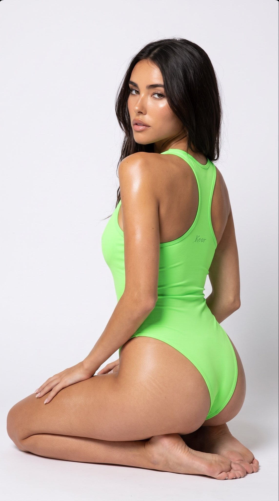
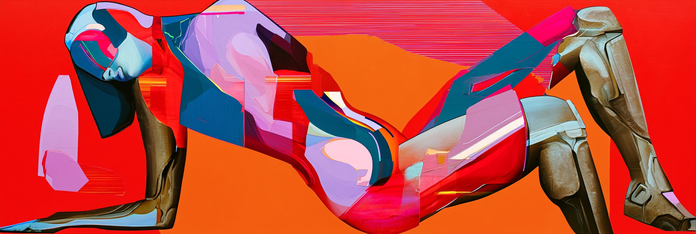
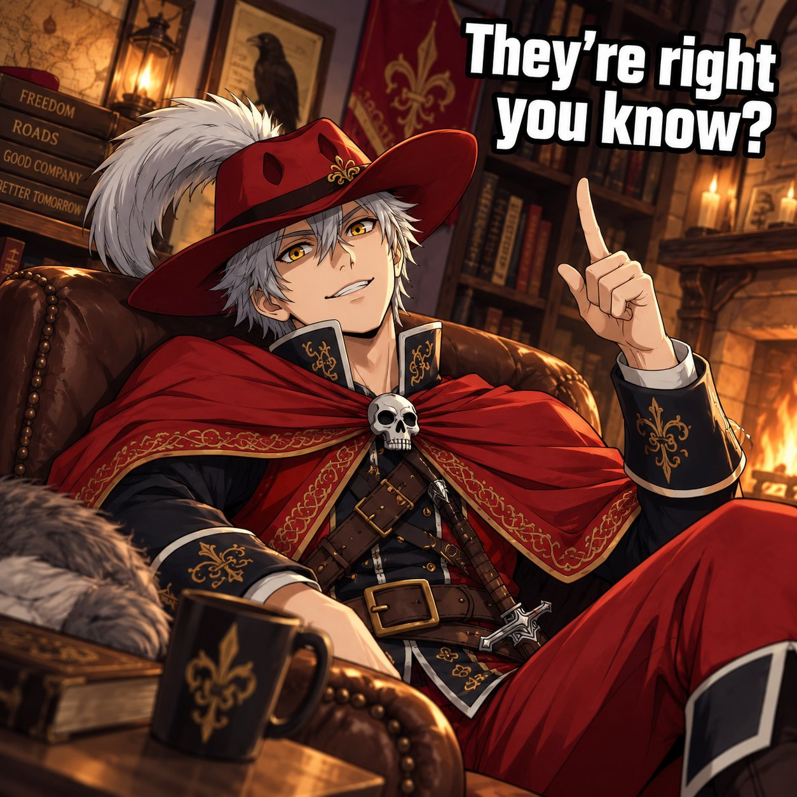
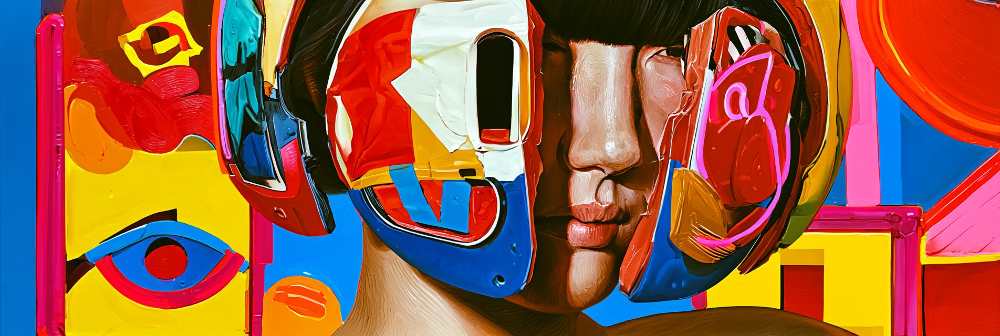

# AI Prompt Radar — 2026-07-29

Bugün bulunan yeni prompt sayısı: **4**

## 1. @KeorUnreal

**Puan:** 66.51 &nbsp; **Etkileşim:** ❤ 349 · 🔁 14 · 👁 15531

**Tam prompt:**

~~~text
Let’s add colors to the evening!🎨What’s your favorite?😉 Madison Beer💚Keeley Hazell🤍Emily Rudd 🩷Dua Lipa💛 👉🏻Subscribe for more content ⚡️ Nano Banana Pro via Hailuo AI Prompt: { "type": "image_prompt", "version": "1.0", "description": { "subject": { "identity": "Use the uploaded reference face exactly. Preserve identical facial identity, realistic body proportions, hairstyle, and natural skin texture.", "appearance": { "face": "Soft feminine facial features, naturally fair hydrated skin with visible pores, subtle blush, glossy nude lips, defined eyelashes, natural brows, smooth luminous complexion, realistic facial highlights and shadows.", "hair": "Long wavy hair with soft curtain bangs, natural volume, silky texture, realistic individual strands.", "expression": "Calm confident expression with soft direct eye contact over the shoulder, relaxed lips, elegant editorial mood." }, "body": { "type": "Slim athletic feminine figure with naturally balanced curves and realistic anatomy." } }, "clothing": { "outfit": [ "Deep neon green athletic one-piece bodysuit", "Smooth stretch performance fabric", "Open racerback design", "Minimal premium activewear aesthetic" ] }, "pose": { "details": [ "Kneeling on both knees with feet tucked naturally underneath", "Body facing away from the camera at about a 45-degree angle", "Upper body gently twisted back toward the camera", "Head turned over the shoulder maintaining direct eye contact", "One hand resting softly on the thigh", "Other arm relaxed beside the body", "Straight posture with relaxed shoulders", "Natural elegant fitness editorial pose" ] }, "environment": { "location": "Professional photography studio", "background": [ "Seamless white backdrop", "Minimal clean studio setting", "Softbox light partially visible at frame edge", "High-end commercial photoshoot atmosphere" ] }, "lighting": { "type": "Ultra realistic professional studio lighting", "details": [ "Large diffused softbox key light", "Soft fill light reducing harsh shadows", "Natural skin reflections", "Balanced exposure", "True-to-life skin tones", "Smooth highlight roll-off", "Soft shadow transitions", "Professional beauty lighting" ] }, "camera": { "angle": "Eye-level portrait angle matching the reference", "lens": "50mm portrait lens", "framing": "Vertical three-quarter body composition", "focus": "Sharp focus on face, hair and outfit with crisp studio detail", "style": "Ultra realistic commercial fitness photography" }, "watermark": { "details": [ "Tiny embroidered text 'Keor' stitched subtly on the upper back of the bodysuit, matching the garment branding and blending naturally into the fabric." ] }, "quality": { "render": "Ultra photorealistic 8K", "details": [ "Visible skin pores", "Natural hydrated glossy skin", "Detailed fabric weave", "Realistic hair strands", "Professional studio photography quality", "Natural cinematic color grading", "True-to-life lighting physics", "No AI-looking artifacts" ] } } }
~~~

[Kaynak paylaşımı X'te aç ↗](https://x.com/KeorUnreal/status/2082165472347529415)

---

## 2. @BirddogAI

**Puan:** 37.54 &nbsp; **Etkileşim:** ❤ 12 · 🔁 1 · 👁 1203

**Tam prompt:**

~~~text
Finally getting to play with the new midjourney v 8.2. Using an old v3 prompt and image as the image prompt really does a nice job at getting that old look with more added details. Really liking the wide aspect ratios with them too... ❤️👄❤️
~~~

[Kaynak paylaşımı X'te aç ↗](https://x.com/BirddogAI/status/2082211753019207813)

---

## 3. @TolvanSkull

**Puan:** 36.67 &nbsp; **Etkileşim:** ❤ 25 · 🔁 2 · 👁 460

**Tam prompt:**

~~~text
Here's a quick and fun meme reaction AI prompt for you to agree with the poster above! A comfy chair and character-based custom living room comes free with every generation! #AIart #Prompts #tolvanplugnplayprompts 👇PROMPT BEGINS BELOW👇 The character from @image1 leaning back in a comfortable chair in a living room themed after their vibe. He is looking up with a casual warm grin and pointing up. Block text in white with a black stroke outline says "They're right you know?" smooth coloring, appealing cozy lighting with a blend of light and shadow, slight dutch angle. perfect anatomy. perfect hands. take your time and get it right. do not oversexualize the character. deemphasize sensuality, emphasize coolness and beauty. carefully analyze the reference image and preserve the character's identity and, if present, creature and/or species traits and unique features. use the most appropriate art style based on the reference image to preserve its unique tone and aesthetic quality. closeup. square aspect ratio.
~~~

[Kaynak paylaşımı X'te aç ↗](https://x.com/TolvanSkull/status/2082287447954591909)

---

## 4. @BirddogAI

**Puan:** 29.34 &nbsp; **Etkileşim:** ❤ 9 · 🔁 0 · 👁 465

**Tam prompt:**

~~~text
Diego | Birddog (@BirddogAI) on X 1 day ago · Finally getting to play with the new midjourney v 8.2. Using an old v3 prompt and image as the image prompt really does a nice job at getting that old look with more added details.
~~~

[Kaynak paylaşımı X'te aç ↗](https://x.com/BirddogAI/status/2082242258381033676)

---

_Kaynak içerikler ilgili yazarlara aittir; özgün bağlantılar korunmuştur._
