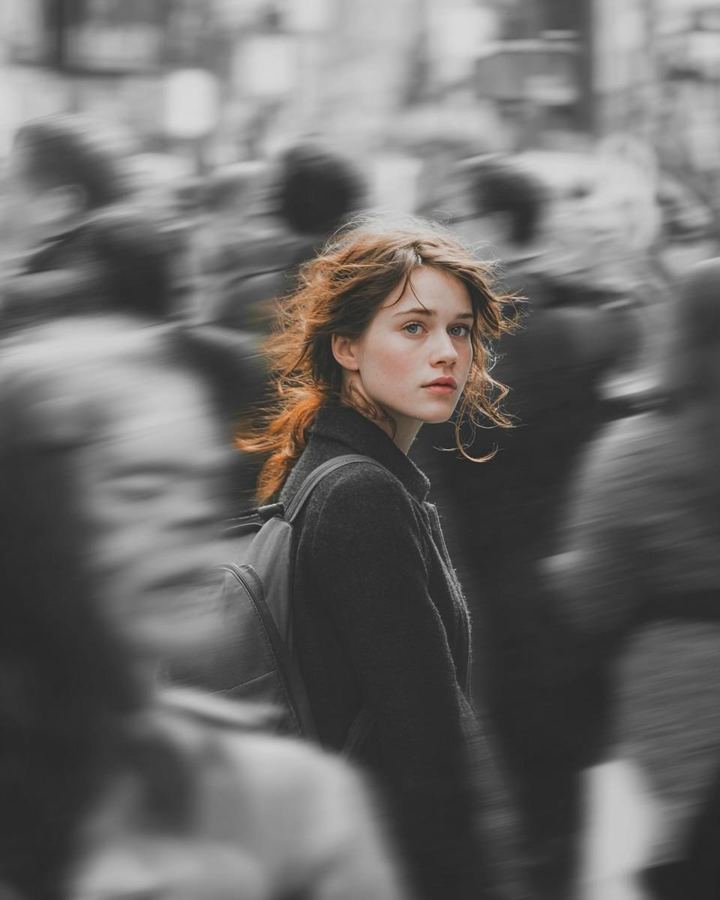
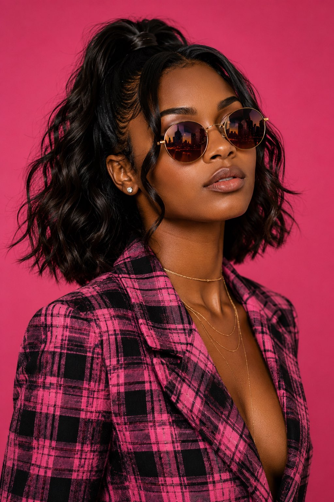
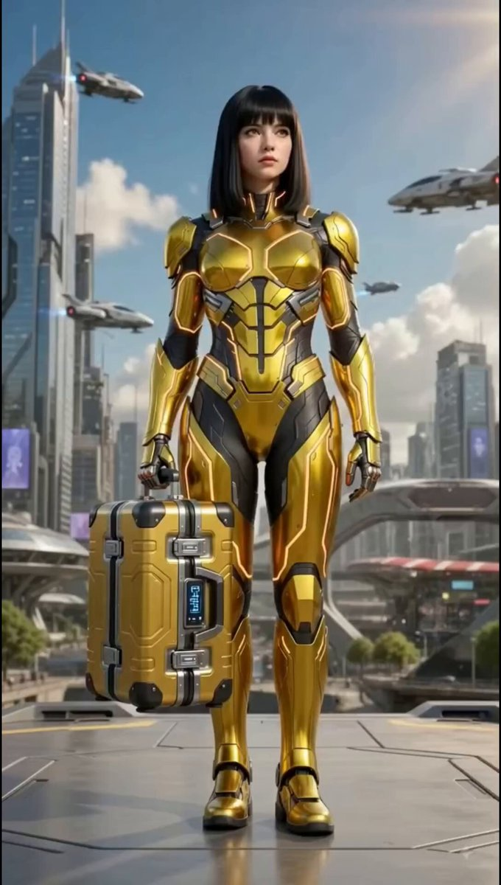
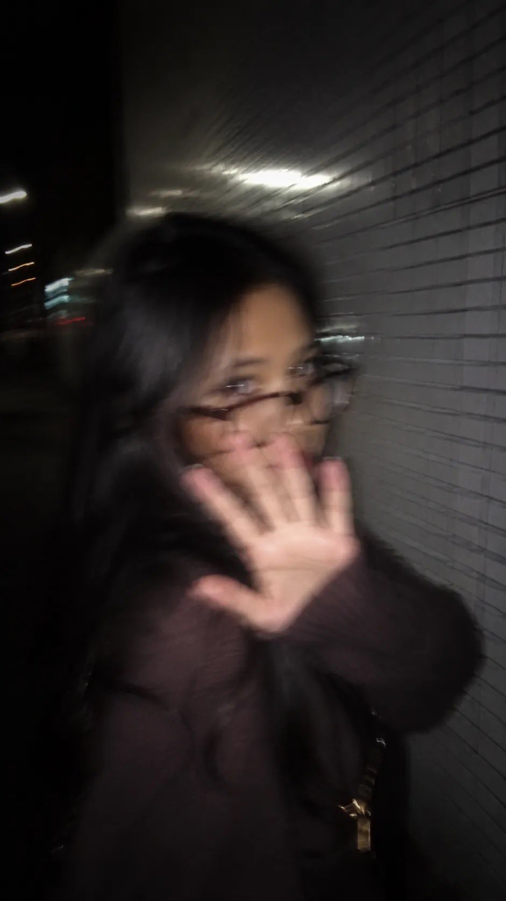
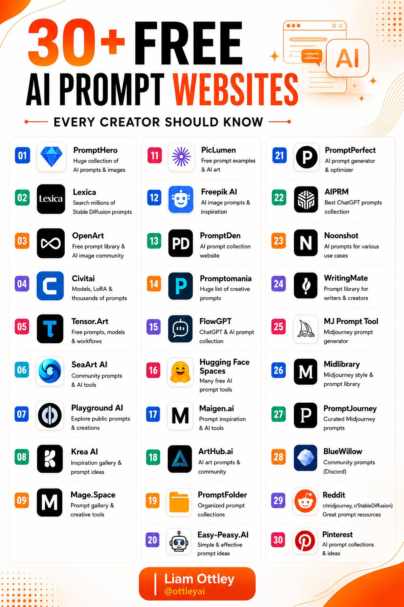
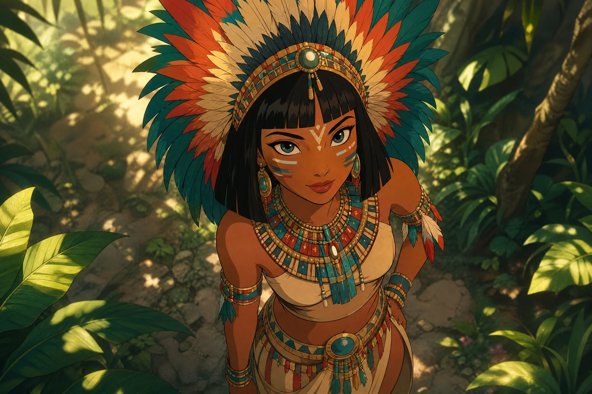

# AI Prompt Radar — 2026-07-30

Bugün bulunan yeni prompt sayısı: **10**

## 1. @Taaruk_

**Puan:** 74.98 &nbsp; **Etkileşim:** ❤ 592 · 🔁 88 · 👁 33843

**Tam prompt:**

~~~text
GPT image 2 on Chatgpt Prompt: A cinematic street portrait of a young woman walking through a crowded city, with the subject perfectly sharp while the surrounding pedestrians are blurred using a dramatic panning motion effect. The entire image is monochrome black and white except for the woman's deep navy-blue (or customizable) wool coat, which remains the only vivid color in the scene. She glances back over her shoulder with a calm, thoughtful expression, loose wind-swept hair, soft natural makeup, and a minimalist shoulder bag. The busy urban background is filled with fast-moving commuters rendered as ghostly motion blur, emphasizing loneliness amidst the crowd. Soft overcast daylight, shallow depth of field, subtle film grain, realistic skin texture, cinematic contrast, emotional storytelling, editorial fashion photography, premium fine-art street photography, ultra-photorealistic, Leica M11 look, Kodak Tri-X black and white film aesthetic with selective color, 50mm lens, f/1.8, ISO 100, 1/20s shutter speed, natural ambient lighting, high dynamic range, ultra-detailed, award-winning composition, 8K. Color Variations: • Navy blue coat • Mustard yellow coat • Emerald green coat • Crimson red coat • Burnt orange coat • Teal coat Keywords: Selective color, monochrome background, panning photography, motion blur crowd, isolated subject, urban loneliness, cinematic street portrait, editorial fashion, realistic photography, emotional storytelling, ultra-realistic, high detail.
~~~

[Kaynak paylaşımı X'te aç ↗](https://x.com/Taaruk_/status/2072543411429871670)

---

## 2. @AmaraNoxVisuals

**Puan:** 61.00 &nbsp; **Etkileşim:** ❤ 55 · 🔁 8 · 👁 3445

**Tam prompt:**

~~~text
Behind every great portrait is confidence, not just in the model, but in the light. Fashion photography is about creating moments where style, emotion, and storytelling come together in a single frame. Gpt image 2 on ChatGPT Prompt: Create an ultra-realistic image using the uploaded reference image as the identity source. Preserve the subject’s exact facial features, bone structure, facial proportions, complexion, skin tone, hairstyle, and identity with 100% facial accuracy. Do not beautify, reshape, lighten, darken, or alter the face. Maintain authentic facial geometry, rich natural melanin, realistic skin texture, and true likeness. Subject: 24-year-old Black woman, fit physique (173 cm, 65 kg), deep warm-brown melanin skin, no nose or facial piercings. Pose: Medium close-up, dynamic three-quarter angle, chin slightly raised, head gently tilted back, eyes gazing just below the camera, lips softly parted, calm, confident editorial expression. Hair: Short textured wavy bob, softly swept back with natural volume, wispy side bangs, face-framing curls, rich espresso-black hair with layered movement and realistic flyaways. Makeup: Satin-finish melanin skin with visible pores, softly sculpted cheeks, sharp jet-black winged eyeliner, defined brows, subtle neutral eyeshadow, warm nude-brown matte lips. Wardrobe: Tailored pink-and-black plaid blazer with premium woven texture. Accessories: Round vintage gold-frame sunglasses with warm rose-tinted lenses, layered delicate gold necklaces, minimalist gold choker, small diamond stud earrings. Background: Vibrant matte pink seamless studio backdrop with a clean luxury editorial aesthetic. Lighting: Soft diffused beauty lighting from above with subtle fill and rim light, creating cinematic contrast, dimensional shadows, and natural highlights. Camera: Phase One XF IQ4, Schneider Kreuznach 80mm lens, f/2.2, ISO 100, eye autofocus, shallow depth of field, creamy bokeh. Quality: Ultra-HD 32K, photorealistic pores, authentic melanin rendering, individual hair strands, detailed fabric weave, crisp metallic reflections, HDR, physically accurate lighting, Vogue-style luxury fashion editorial, hyper-realistic. Negative Prompt: Low quality, blurry, flat lighting, washed-out colors, plastic skin, oversmoothed skin, CGI, cartoon, anime, distorted face, altered facial structure, identity drift, bad anatomy, extra limbs, duplicate features, poor hair detail, watermark, logo, text, facial or nose piercings, excessive retouching, unrealistic skin texture.
~~~

[Kaynak paylaşımı X'te aç ↗](https://x.com/AmaraNoxVisuals/status/2081246180214808887)

---

## 3. @I_AM_AYASHA

**Puan:** 54.37 &nbsp; **Etkileşim:** ❤ 22 · 🔁 11 · 👁 916

**Tam prompt:**

~~~text
30+ FREE AI Prompt Websites Every Creator Should Bookmark A great prompt can completely transform your AI results. Whether you're using ChatGPT, Midjourney, Stable Diffusion, Flux, or other AI tools, these free resources will help you create better prompts, discover new ideas, and improve your workflow. 🔥 Top Free AI Prompt Libraries & Communities 1. PromptHero – Massive collection of AI prompts & images 2. Lexica – Search millions of Stable Diffusion prompts 3. OpenArt – Prompt library + AI art community 4. Civitai – Models, LoRAs & thousands of prompts 5. http://Tensor.Art – Free models, prompts & workflows 6. SeaArt AI – Community prompts & AI tools 7. Playground AI – Explore public prompts & creations 8. Krea AI – Inspiration gallery & creative ideas 9. http://Mage.Space – Prompt gallery & AI tools 10. NightCafe – Community creations with prompts 11. PicLumen – Free prompt examples & AI art 12. Freepik AI – AI image prompts & inspiration 13. PromptDen – Curated AI prompt library 14. Promptomania – Creative prompts for multiple AI models 15. FlowGPT – One of the largest ChatGPT prompt collections 16. Hugging Face Spaces – Free AI apps, demos & prompt tools 17. http://Maigen.ai – Prompt inspiration & AI utilities 18. http://ArtHub.ai – AI art prompts & community showcase 19. PromptFolder – Organized prompt collections 20. Easy-Peasy AI – Simple, effective prompt ideas 21. PromptPerfect – Prompt generator & optimizer 22. AIPRM – Extensive ChatGPT prompt library 23. Noonshot – AI prompts for business & productivity 24. WritingMate – Prompt library for writers & creators 25. MJ Prompt Tool – Midjourney prompt generator 26. Midlibrary – Midjourney styles & prompt database 27. PromptJourney – Curated Midjourney prompts 28. BlueWillow – Community prompt sharing 29. Reddit – Communities like r/Midjourney & r/StableDiffusion 30. Pinterest – Endless AI prompt inspiration 💡 Save this list—you'll never run out of prompt ideas again. Which AI prompt website do you use the most? Drop it in the comments 👇
~~~

[Kaynak paylaşımı X'te aç ↗](https://x.com/I_AM_AYASHA/status/2081312264183808033)

---

## 4. @ZentrixHQ

**Puan:** 51.31 &nbsp; **Etkileşim:** ❤ 33 · 🔁 5 · 👁 61739

**Tam prompt:**

~~~text
Zentrix⌚️ (@ZentrixHQ) on X Jul 6, 2026 · Image prompt for Midjourney / Flux: A dark glass dictionary page floating in space with glowing terms highlighted in blue, soft depth of field, abstract knowledge-base aesthetic, minimal and clean. --ar 16:9 --style raw --v 6
~~~

[Kaynak paylaşımı X'te aç ↗](https://x.com/ZentrixHQ/status/2074062939888210196)

---

## 5. @Aiminithoughts

**Puan:** 49.02 &nbsp; **Etkileşim:** ❤ 13 · 🔁 3 · 👁 230269

**Tam prompt:**

~~~text
Cinematic AI Tech Video Prompt: A futuristic cyberpunk city at golden hour. A beautiful woman wearing a sleek metallic gold sci-fi combat suit walks confidently down the center of the road while carrying a high-tech golden suitcase. The camera follows with smooth cinematic tracking shots. She suddenly releases the suitcase, letting it fall naturally onto the asphalt with a heavy metallic impact. Blue energy pulses spread across the road as the suitcase begins transforming. Mechanical panels unfold, gears rotate, glowing neon circuits activate, wheels extend, and the suitcase expands into a futuristic cyberpunk hoverbike with gold and black armor, realistic mechanical movement, sparks, smoke, and holographic effects. She calmly steps forward, mounts the fully transformed bike, and starts riding slowly through the futuristic streets. The camera circles around her with dramatic low-angle shots as the engine emits a deep electric hum. The hoverbike gradually accelerates, glowing energy trails appear behind the wheels, and she speeds through the city at high velocity. Dynamic drone shots, FPV chase camera, cinematic motion blur, volumetric lighting, reflections on the gold armor, ultra-detailed sci-fi architecture, photorealistic textures, 8K, HDR, Unreal Engine quality, blockbuster action sequence, smooth animation, realistic physics, epic ending with the bike disappearing into the futuristic skyline. Disclaimer: Disclaimer: This video is a fictional AI-generated sci-fi transformation created for entertainment purposes only. All transformation sequences, vehicles, and visual effects are imaginary and do not depict real technology or real-world events. Any resemblance to actual persons, products, or brands is purely coincidental.
~~~

[Kaynak paylaşımı X'te aç ↗](https://x.com/Aiminithoughts/status/2082281304746520994)

---

## 6. @Sairah_0

**Puan:** 47.55 &nbsp; **Etkileşim:** ❤ 46 · 🔁 1 · 👁 1964

**Tam prompt:**

~~~text
GPT Image 2 On ChatGPT Prompt: A candid nighttime street portrait of a young woman with long black hair wearing oversized rectangular glasses and a dark brown oversized knit sweater. She raises her hand toward the camera, partially covering her face, creating a playful "no photos" pose. Shot with an iPhone flash, featuring strong motion blur, soft focus, cinematic low-light atmosphere, glossy white tiled wall on the side, dark urban street with distant streetlights, Y2K aesthetic, natural skin tones, moody, spontaneous, unedited, 35mm flash photography, high ISO, authentic nightlife vibes, vertical composition (9:16). Prompt: (Blue Dress) A candid flash photo of a young woman at night wearing a blue-and-white striped puff-sleeve dress. She smiles subtly while covering part of her face with her hand, creating a playful and shy expression. Captured with direct iPhone flash and intentional motion blur, soft focus, glossy tiled wall beside her, dark city sidewalk with blurred streetlights in the background, nostalgic 2000s digital camera aesthetic, cinematic, natural lighting, realistic skin texture, casual street photography, dreamy nightlife mood, vertical composition (9:16). Universal Style Prompt: Candid nighttime flash photography, direct iPhone flash, motion blur, soft focus, playful hand covering the face, glossy tiled wall, dark city street, blurred streetlights, authentic street photography, Y2K digital camera aesthetic, nostalgic, cinematic, realistic, natural skin tones, shallow depth of field, unedited, spontaneous moment, high ISO, grainy, vertical 9:16.
~~~

[Kaynak paylaşımı X'te aç ↗](https://x.com/Sairah_0/status/2080926878039224803)

---

## 7. @ottleyai

**Puan:** 47.00 &nbsp; **Etkileşim:** ❤ 27 · 🔁 9 · 👁 4504

**Tam prompt:**

~~~text
✴️𝟯𝟬+ 𝗙𝗥𝗘𝗘 𝗔𝗜 𝗣𝗥𝗢𝗠𝗣𝗧 𝗪𝗘𝗕𝗦𝗜𝗧𝗘𝗦 Your AI is only as good as your prompts. Here are 30+ free websites to discover better prompts, spark new ideas, and get dramatically better AI results. ✅𝗘𝗩𝗘𝗥𝗬 𝗖𝗥𝗘𝗔𝗧𝗢𝗥 𝗦𝗛𝗢𝗨𝗟𝗗 𝗞𝗡𝗢𝗪 01. 𝗣𝗿𝗼𝗺𝗽𝘁𝗛𝗲𝗿𝗼 → Huge collection of AI prompts & images 02. 𝗟𝗲𝘅𝗶𝗰𝗮 → Search millions of Stable Diffusion prompts 03. 𝗢𝗽𝗲𝗻𝗔𝗿𝘁 → Free prompt library & AI image community 04. 𝗖𝗶𝘃𝗶𝘁𝗮𝗶 → Models, LoRA & thousands of prompts 05. 𝗧𝗲𝗻𝘀𝗼𝗿.𝗔𝗿𝘁 → Free prompts, models & workflows 06. 𝗦𝗲𝗮𝗔𝗿𝘁 𝗔𝗜 → Community prompts & AI tools 07. 𝗣𝗹𝗮𝘆𝗴𝗿𝗼𝘂𝗻𝗱 𝗔𝗜 → Explore public prompts & creations 08. 𝗞𝗿𝗲𝗮 𝗔𝗜 → Inspiration gallery & prompt ideas 09. 𝗠𝗮𝗴𝗲.𝗦𝗽𝗮𝗰𝗲 → Prompt gallery & creative tools 10. 𝗡𝗶𝗴𝗵𝘁𝗖𝗮𝗳𝗲 → Community creations with prompts 11. 𝗣𝗶𝗰𝗟𝘂𝗺𝗲𝗻 → Free prompt examples & AI art 12. 𝗙𝗿𝗲𝗲𝗽𝗶𝗸 𝗔𝗜 → AI image prompts & inspiration 13. 𝗣𝗿𝗼𝗺𝗽𝘁𝗗𝗲𝗻 → AI prompt collection website 14. 𝗣𝗿𝗼𝗺𝗽𝘁𝗼𝗺𝗮𝗻𝗶𝗮 → Huge list of creative prompts 15. 𝗙𝗹𝗼𝘄𝗚𝗣𝗧 → ChatGPT & AI prompt collection 16. 𝗛𝘂𝗴𝗴𝗶𝗻𝗴 𝗙𝗮𝗰𝗲 𝗦𝗽𝗮𝗰𝗲𝘀 → Many free AI prompt tools 17. 𝗠𝗮𝗶𝗴𝗲𝗻.𝗮𝗶 → Prompt inspiration & AI tools 18. 𝗔𝗿𝘁𝗛𝘂𝗯.𝗮𝗶 → AI art prompts & community 19. 𝗣𝗿𝗼𝗺𝗽𝘁𝗙𝗼𝗹𝗱𝗲𝗿 → Organized prompt collections 20. 𝗘𝗮𝘀𝘆-𝗣𝗲𝗮𝘀𝘆.𝗔𝗜 → Simple & effective prompt ideas 21. 𝗣𝗿𝗼𝗺𝗽𝘁𝗣𝗲𝗿𝗳𝗲𝗰𝘁 → AI prompt generator & optimizer 22. 𝗔𝗜𝗣𝗥𝗠 → Best ChatGPT prompts collection 23. 𝗡𝗼𝗼𝗻𝘀𝗵𝗼𝘁 → AI prompts for various use cases 24. 𝗪𝗿𝗶𝘁𝗶𝗻𝗴𝗠𝗮𝘁𝗲 → Prompt library for writers & creators 25. 𝗠𝗝 𝗣𝗿𝗼𝗺𝗽𝘁 𝗧𝗼𝗼𝗹 → Midjourney prompt generator 26. 𝗠𝗶𝗱𝗹𝗶𝗯𝗿𝗮𝗿𝘆 → Midjourney style & prompt library 27. 𝗣𝗿𝗼𝗺𝗽𝘁𝗝𝗼𝘂𝗿𝗻𝗲𝘆 → Curated Midjourney prompts 28. 𝗕𝗹𝘂𝗲𝗪𝗶𝗹𝗹𝗼𝘄 → Community prompts (Discord) 29. 𝗥𝗲𝗱𝗱𝗶𝘁 → r/midjourney, r/StableDiffusion → Great prompt resources 30. 𝗣𝗶𝗻𝘁𝗲𝗿𝗲𝘀𝘁 → AI prompt collections & ideas 🔖 Bookmark this for later. Follow @ottleyai for more AI tools, prompts, and productivity resources. #AITools #ChatGPT #AI #PromptEngineering #GenerativeAI #Productivity #ArtificialIntelligence
~~~

[Kaynak paylaşımı X'te aç ↗](https://x.com/ottleyai/status/2081613059135803684)

---

## 8. @kinovi_ai

**Puan:** 42.05 &nbsp; **Etkileşim:** ❤ 17 · 🔁 1 · 👁 483

**Tam prompt:**

~~~text
Created using GPT-Image-2. Use Chagpt/Gemini to alter the prompt to to better match what you want. Just copy the prompt below and add what yo want prior to the prompt! "A beautiful, hand-drawn 2D animated portrait in the classic Disney style, capturing a young woman with a strong, confident expression looking up toward the viewer from a high-angle perspective. She wears magnificent traditional tribal attire, featuring a massive headdress of colorful, layered feathers, intricate beadwork necklaces and belts, and delicate feather accessories on her arm. Her face is adorned with beautiful tribal paint patterns, and her hair is styled in a clean, Egyptian-inspired bob. She stands amidst a lush, vibrant jungle background with soft, dappled sunlight filtering through the canopy, creating a soft, magical depth of field. The style features clean linework, smooth cel shading, and a nostalgic, cinematic feel. Aspect ratio 9:16."
~~~

[Kaynak paylaşımı X'te aç ↗](https://x.com/kinovi_ai/status/2081422413490004003)

---

## 9. @VigoCreativeAI

**Puan:** 41.51 &nbsp; **Etkileşim:** ❤ 1 · 🔁 0 · 👁 1597

**Tam prompt:**

~~~text
04 — VIDEO PROMPT CHARACTER LOCK: - HERO-A: short silver-white hair, cyan eyes, black tactical crop outfit with cyan accents, modular cyan-black assault rifle. Match female reference exactly. - HERO-B: messy black hair with amber-orange tips, amber eyes, black coat with orange accents, heavy black shotgun. Match male reference exactly. - Always two partners fighting together; do not swap outfits or weapons; do not merge them. BOSS LOCK: Giant dark rocky-armor bipedal beast, red glowing chest core, red horns/spikes, massive bulk. Match boss reference. Chest core stays INTACT in this clip (not destroyed yet). ENVIRONMENT LOCK: Rainy night circular industrial arena from the blue environment plate: wet cracked concrete, cyan neon ring lights, amber warm lights, rain, mist, steam. Keep this location the whole clip. STORY — first 15 seconds only, follow storyboard S01→S10 order: 0–3s: HERO-A and HERO-B enter the arena, guns ready, tense walk into frame. 3–6s: dark bat-like minions appear; both open fire, muzzle flashes, minions scatter. 6–9s: ground cracks, smoke; BOSS rises/fully appears center stage, red core lights up, huge scale. 9–13s: BOSS attacks (slam / charge); hunters dodge and return fire under pressure, still losing ground. 13–15s: SEAM FREEZE ending — almost static final beat: both hunters side by side in foreground aiming at BOSS; BOSS fills background with intact bright red core; rain continues; hold the pose for the last second for a clean cut to clip 2. STYLE: Japanese anime cel-shaded action, modern shonen, bold silhouettes, cinematic camera, rain, sparks, impact dust. Continuous single sequence, no hard scene change to another location. No text, no watermark, no logo. CAMERA: Wide establishing → medium combat tracking → low dramatic boss reveal → push into the final freeze two-shot. Clear readable action, identity stable every second.
~~~

[Kaynak paylaşımı X'te aç ↗](https://x.com/VigoCreativeAI/status/2078354367694913899)

---

## 10. @digitalskillsws

**Puan:** 36.03 &nbsp; **Etkileşim:** ❤ 18 · 🔁 5 · 👁 608

**Tam prompt:**

~~~text
Want to create ads like this for any brand?Here’s the simple formula I use: 1. Write a strong 4-line voice-over 2. Break the video into 8 clear scenes 3. Write detailed image prompts first 4. Turn each image into a video prompt with camera angle + lens + movement Add SFX and edit in CapCut This is how I create professional AI ads for FMCG, fashion, fintech, and more.Want me to create one for your brand? Drop a comment or DM #GlorAI #Indomie #AIAds #NigerianBrands #ContentCreator
~~~

[Kaynak paylaşımı X'te aç ↗](https://x.com/digitalskillsws/status/2082445147577405856)

---

_Kaynak içerikler ilgili yazarlara aittir; özgün bağlantılar korunmuştur._
