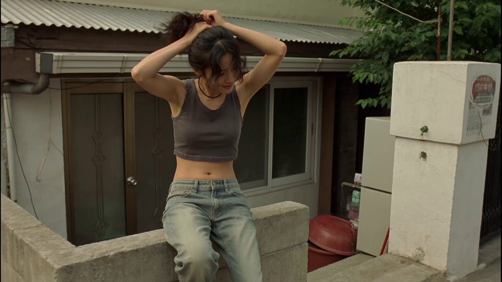
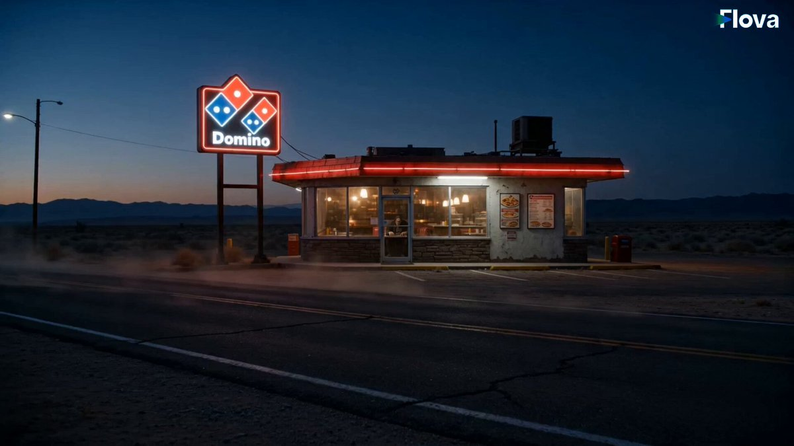
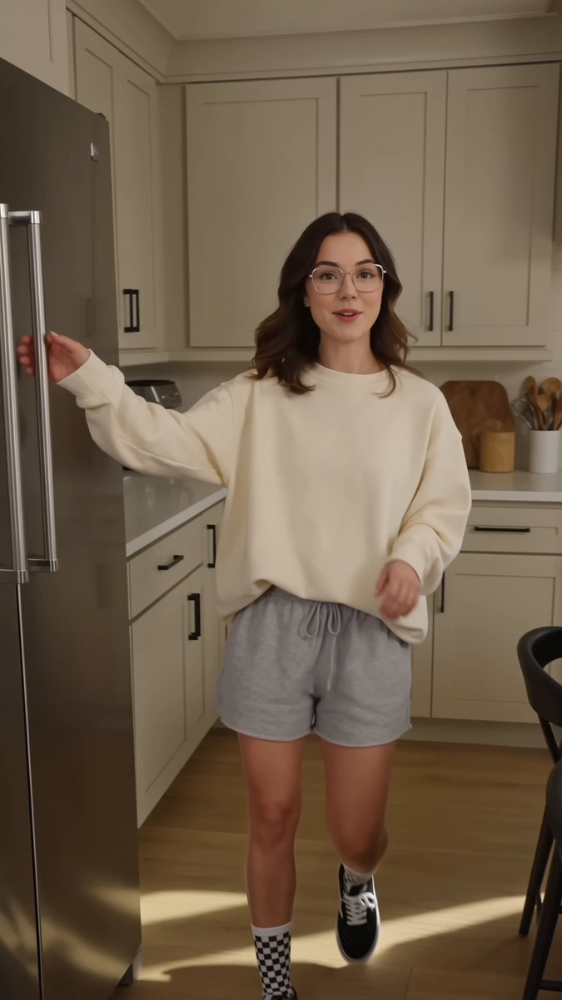
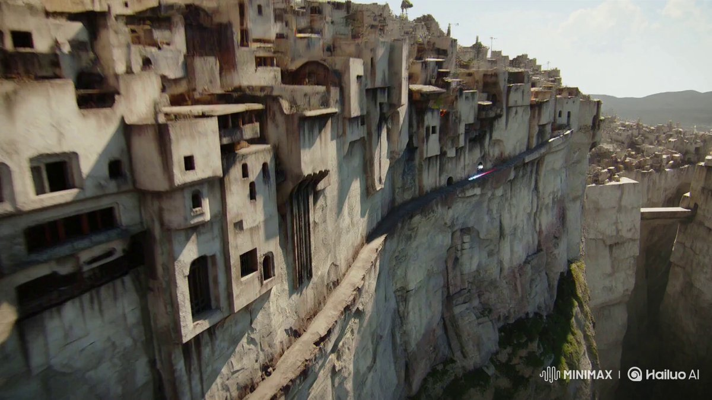
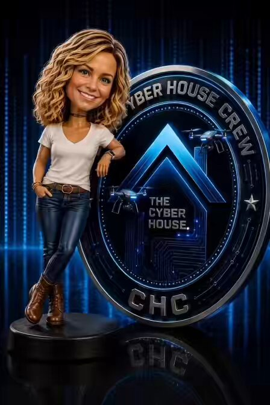
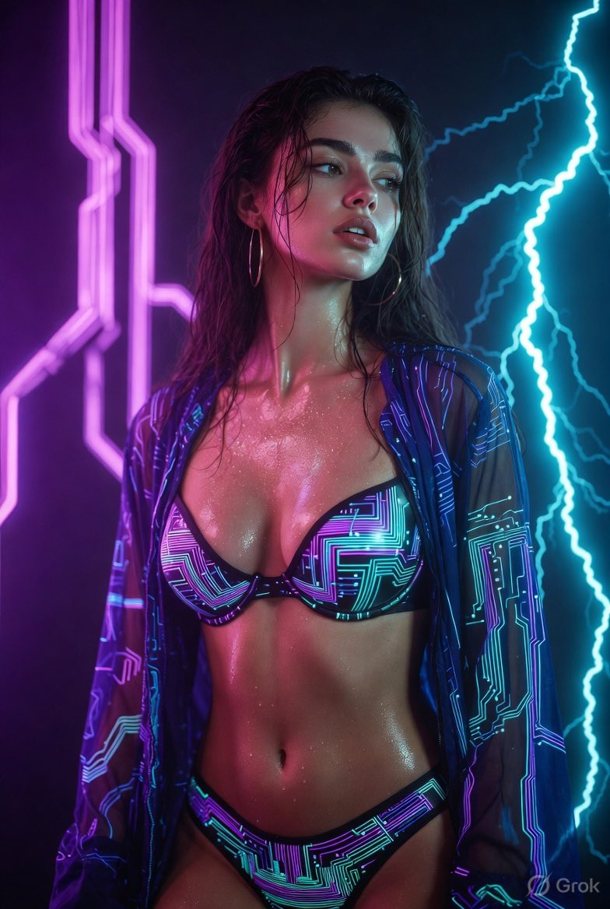

# AI Prompt Radar — 2026-07-31

Bugün bulunan yeni prompt sayısı: **11**

## 1. @john_my07

**Puan:** 97.10 &nbsp; **Etkileşim:** ❤ 16024 · 🔁 1549 · 👁 12800740

**Tam prompt:**

~~~text
Seedance 2.0 on OpenArt AI Prompt: Main subject: young Korean woman, early 20s, natural everyday appearance, faded charcoal-grey sleeveless crop top, loose high-waisted light-wash jeans, black canvas sneakers, black cord necklace, black wavy hair in a messy side ponytail with wispy bangs. Realistic skin texture, minimal makeup, warm and approachable personality. Maintain consistent identity, clothing, hairstyle, and appearance throughout the entire video. Location: Authentic Korean residential neighborhood during a calm late morning. Narrow concrete alleys, low-rise homes, small terraces, potted plants, laundry lines, bicycles, utility poles, overhead wires, mature trees casting moving shadows, quiet residential atmosphere. No stores, advertisements, cafés, crowds, or commercial activity. Visual Style: Ultra-realistic documentary realism. Genuine candid behavior. Natural body language. Unscripted slice-of-life feeling. Strong environmental authenticity. Rich real-world details and believable human motion. Camera Style: Early-2000s consumer DV camcorder aesthetic. Friend casually recording everyday moments. Heavy handheld shake, imperfect framing, frequent autofocus hunting, lens breathing, exposure pumping when moving between sun and shade, occasional motion blur, subtle rolling shutter, mild digital compression artifacts, faded colors, soft contrast, slight sensor noise. No stabilization. No cinematic camera moves. No modern color grading. 00:00–00:02 Outside a small house entrance. She sits on a low concrete wall adjusting her ponytail with both hands raised. A light breeze moves loose strands of hair. She smiles naturally while the camera struggles to hold focus. 00:02–00:04 The camera follows her into a narrow alley lined with potted plants and concrete walls. She notices a stray cat approaching and crouches down. Framing drifts off-center as the operator tries to keep up. 00:04–00:06 She gently pets and feeds the cat. Autofocus repeatedly shifts between her face and the animal. Morning sunlight flickers through leaves overhead. 00:06–00:08 Small front yard beside her house. She hangs laundry on a clothesline while fabrics sway in the breeze. Exposure changes as clouds briefly pass overhead. 00:08–00:10 On a quiet terrace with a ceramic coffee cup. She sits comfortably watching the neighborhood, occasionally brushing hair behind her ear. Loose handheld side angle with natural camera drift. 00:10–00:12 Close side profile. Someone off-camera greets her. She turns, raises her hand, smiles warmly, and casually says, “Annyeong.” The camera catches the moment slightly late. 00:12–00:15 Walking slowly down a tree-lined residential lane holding her coffee cup. She notices the camera, gives a small genuine smile, then looks away and continues walking. Recording cuts abruptly to black mid-motion as if the camcorder was switched off. Audio: Natural ambient sound only — morning birds, distant motorcycles, light wind, leaves rustling, faint neighborhood chatter, cat sounds, footsteps on concrete, fabric moving on clotheslines, subtle residential ambience. No music. No sound design. No narration. Goal: Authentic Korean neighborhood life captured like a forgotten home video from the early 2000s — candid, imperfect, realistic, warm, and deeply believable.
~~~

[Kaynak paylaşımı X'te aç ↗](https://x.com/john_my07/status/2071977017474789557)

---

## 2. @AIwithJessica

**Puan:** 63.19 &nbsp; **Etkileşim:** ❤ 590 · 🔁 98 · 👁 54228

**Tam prompt:**

~~~text
He was ready to destroy the place, until one slice changed everything. 🍕 Hangry monster. One pizza girl. Zero chill. Turns out even monsters have a soft spot for Domino's. Made with GPT Image 2 and Seedance 2.0 on @Flovaai Prompt in the comments 👇
~~~

[Kaynak paylaşımı X'te aç ↗](https://x.com/AIwithJessica/status/2078653350653157678)

---

## 3. @Naiknelofar788

**Puan:** 58.92 &nbsp; **Etkileşim:** ❤ 53 · 🔁 3 · 👁 2780

**Tam prompt:**

~~~text
Seedance 2.0 4K on Higgsfield Prompt: Create a photorealistic, cinematic lifestyle vlog featuring a **22-year-old female influencer** in a bright, modern apartment kitchen during golden morning light. The video should feel like it was casually filmed on a high-end smartphone with natural handheld camera movement, subtle autofocus shifts, realistic lighting, authentic kitchen sounds, and believable facial expressions. Maintain the same character throughout the entire sequence. **Scene 1 (0–3s):** She walks into the kitchen wearing an oversized cream sweatshirt and grey lounge shorts, smiling at the camera while opening the refrigerator. She grabs eggs, milk, butter, yogurt, berries, granola, and coffee beans. **Dialogue:** "Come make breakfast with me... I'm starving." **Scene 2 (3–6s):** Close-up of butter sizzling in a pan as she cracks two eggs with one hand. She gently stirs them into fluffy scrambled eggs while steam rises naturally. **Dialogue:** "Scrambled eggs are non-negotiable." **Scene 3 (6–9s):** She pours pancake batter onto a hot pan, flips a golden pancake in one smooth motion, then laughs after catching it perfectly. **Dialogue:** "Okay... that flip was actually kind of impressive." **Scene 4 (9–12s):** She assembles a yogurt bowl with thick Greek yogurt, crunchy granola, fresh strawberries, blueberries, banana slices, and a drizzle of honey. Quick macro shots capture the textures and movement. **Dialogue:** "This might be my favorite part." **Scene 5 (12–15s):** She pours a fresh cup of coffee, carries everything to a sunny dining table, sits down, takes a bite of pancake, then a sip of coffee while smiling at the camera. **Dialogue:** "Breakfast is served. Hope you have the best day." **Style Notes:** Ultra-realistic, premium influencer aesthetic, natural skin texture, soft morning sunlight through windows, cozy neutral kitchen, realistic food textures, shallow depth of field, smooth handheld camera, subtle cinematic motion blur, authentic ambient sounds (sizzling pan, coffee pouring, utensils, birds outside), warm color grading, 4K quality, highly detailed, TikTok/Instagram Reel lifestyle vlog, seamless continuity, no jumpy character changes, natural lip-sync matching dialogue.
~~~

[Kaynak paylaşımı X'te aç ↗](https://x.com/Naiknelofar788/status/2074466678550020295)

---

## 4. @umesh_ai

**Puan:** 50.31 &nbsp; **Etkileşim:** ❤ 295 · 🔁 28 · 👁 16841

**Tam prompt:**

~~~text
Minimax H3 from Hailuo AI is here! One of my first tests! more coming soon.. Prompt : Speeder chase across a cliff city (single continuous shot) From a monumental cliffside city carved into stone, the camera dives toward a tiny streak of light ripping along a narrow ledge-road. Lock-on: a speeder hugging the wall at insane speed. The camera slingshots ahead, whips back, then drops tight to the rear thrusters: heat haze, grit snapping off the ledge, warning lights flashing. A collapsing balcony rains debris; the rider snaps a last-inch swerve under a falling arch, then threads through hanging laundry lines and open windows in one fluid line. The camera darts through the same openings, staying glued to the motion. One final bend and sudden calm: the camera blasts outward into a reveal of the city opening onto a boundless waterfall-fed valley, mist turning into rainbow. @Hailuo_AI #MiniMaxH3
~~~

[Kaynak paylaşımı X'te aç ↗](https://x.com/umesh_ai/status/2082499539735588916)

---

## 5. @DataChaz

**Puan:** 49.12 &nbsp; **Etkileşim:** ❤ 6 · 🔁 1 · 👁 1754

**Tam prompt:**

~~~text
1/ Here is the complete prompt for this video: single continuous shot, one take no cuts, cinematic oner, realistic cinematic film quality, photorealistic, natural skin texture, film grain, naturalistic color grading, sharp focus, soft realistic studio lighting, shallow cinematic depth of field CAMERA STYLE PRESET: Cinematographic style of Sean Baker, subtle handheld with operator body weight shift, camera rises and falls gently with operator breathing, intimate observation distance, no aggressive handheld, no crane, no dolly MODE: One Take continuous (single unbroken shot, no cuts) USE THE REFERENCE: >> — character identity lock: young East Asian woman, dark hair in a high windswept ponytail, silver over-ear headphones on a headband, fitted baby-tee with a photographic car print (blue and purple tones), yellow plaid flannel shirt tied around the waist, light-wash baggy jeans, chunky white sneakers, red lips, expressive lively face. Lock face, hair, headphones and outfit. Identity and wardrobe only — NOT the reference pose; she is upright, frontal, close to camera. >> — dialogue track / lip-sync driver: the woman's spoken line. Her mouth and facial movement must sync to this audio. The voice originates from her mouth ON CAMERA, frontal. GLOBAL CONSISTENCY LOCK: the woman's face, ponytail, headphones and car-print tee stay identical throughout; the car print on the shirt stays stable and undistorted; the white cyclorama stays clean and seamless; the soft studio lighting stays consistent across the whole take. SOUND: diegetic only, no music. Speech is driven by >> — the woman lip-syncs to it on camera, her lips moving in sync with the supplied track, the voice physically originating from her mouth in frame. This is NOT a voiceover and NOT narration. Behind her, near silence — only a faint clean studio room tone, kept well under >>. CAMERA BEHAVIOR: wide-angle close-up, camera held close to her face at eye level. The wide lens gives gentle realistic perspective depth and slight foreground volume to her features — natural, never fisheye. Only motion is the subtle organic breathing of the Sean Baker handheld — soft rise and fall, no drift, no zoom, no orbit. She stays frontal and centered, mouth clearly readable for sync. TIMELINE: [0:00] Wide-angle close-up: her face fills much of the frame against the soft-lit white cyclorama, headphones on, real skin texture and fine detail, lips already moving in sync with >>, eyes locked to camera, lively natural delivery. [mid] The frame breathes gently with the handheld; she talks with natural energy, small head and brow movement, lips tracking >>, the wide lens holding her close with realistic depth. [end] Her line finishes on >>, a beat of held eye contact, red lips and gaze steady to camera. STYLE: realistic, cinematic, grounded, natural skin and light, intimate, lived-in, photoreal, film-like. negative: voiceover, narration, off-screen voice, disembodied voice, mistimed lip-sync, mouth desync, fisheye, extreme distortion, warped face, glossy plastic skin, over-retouched, beauty-ad look, headphones morphing / warping / duplicating, car print on shirt morphing or warping, outfit changing, extra fingers, extra limbs, deformed hands, anatomy distortion, hair morphing, flicker, morphing, grey or dirty background, visible cyclorama seam, aggressive camera shake, zoom, orbit, dutch tilt, foreign text, garbled characters, captions, subtitles, text overlay, watermark, music score
~~~

[Kaynak paylaşımı X'te aç ↗](https://x.com/DataChaz/status/2078704304530272451)

---

## 6. @StephGrey50

**Puan:** 48.08 &nbsp; **Etkileşim:** ❤ 26 · 🔁 8 · 👁 495

**Tam prompt:**

~~~text
💥 It's another Cyber House Crew AI Prompt! Upload my bobblehead (template) and a reference image of you into Grok or another AI. CHALLENGE: Turn your bobblehead image into a video. If you need help, a prompt is provided in the comments, but I would love to see your creativity. Have fun!!! 😊 #TheCyberHouseCrew #CyberBobblehead Copy the prompt below. 👇 Use the uploaded Cyber House Crew bobblehead image as the master composition and environment template. Replace only the bobblehead character with the person from the uploaded reference image. Preserve the new person's exact facial identity with maximum accuracy, including facial structure, expression, hairstyle, hair color, eye color, skin tone, age, body type, and all recognizable features. The finished collectible should instantly be recognizable as the person in the reference image. Transform the new person into the same premium collectible bobblehead style as the template: Oversized realistic bobblehead head (approximately 2.7× normal size). Small, naturally proportioned collectible body. Realistic sculpted facial features. Premium painted resin/vinyl collectible appearance. High-end professionally manufactured collectible quality. Museum-quality craftsmanship with subtle satin finish and realistic textures. Use the template for composition only—not for the character's appearance. The new bobblehead should wear clothing that matches the person's own style, personality, or clothing shown in their reference image. If the reference image only partially shows the outfit, create a complete outfit that naturally matches their style and color palette. Preserve or appropriately recreate the person's: Clothing style. Accessories. Jewelry. Hairstyle. Makeup. Overall aesthetic. Do not copy the template character's clothing, hairstyle, accessories, or personal appearance unless specifically requested. Keep the same relaxed pose and body language as the template while naturally adapting it to the new person's hairstyle and outfit. Keep absolutely everything else exactly the same as the template, including: Cyber House Crew emblem. CHC logo. Drones. Lighting. Reflections. Background. Camera angle. Perspective. Display base. Floor. Overall composition. Color grading. Cinematic atmosphere. Scale and placement of all background elements. The only thing that changes is the bobblehead character. Blend the new character seamlessly into the existing Cyber House Crew environment so it appears the scene was originally created specifically for that person. The final image should look like an officially licensed Cyber House Crew Premium Collectible Bobblehead, with ultra-photorealistic materials, cinematic lighting, realistic reflections, shallow depth of field, hyper-detailed sculpting, and 8K quality. Do not redesign the scene. Do not alter the Cyber House environment. Replace only the bobblehead character while preserving the exact style, composition, and premium collectible aesthetic of the original template.
~~~

[Kaynak paylaşımı X'te aç ↗](https://x.com/StephGrey50/status/2082511353265144136)

---

## 7. @jarvis_og_AI

**Puan:** 47.19 &nbsp; **Etkileşim:** ❤ 23 · 🔁 0 · 👁 4429

**Tam prompt:**

~~~text
Neon love Prompt: Ultra-photorealistic cinematic portrait of a beautiful young Indian woman, mid-20s, fair glowing skin with natural texture, visible pores and fine water droplets, long wet dark brown hair slicked back and cascading over her shoulders with wet strands clinging to her face and chest, large thin gold hoop earrings, confident slightly upward gaze, full lips slightly parted, subtle wet sheen on skin. She is wearing a fitted black bra and matching black low-rise bikini bottoms, both covered in intricate glowing neon circuit-board patterns in electric cyan, purple and blue that follow the fabric contours. Over it she wears an open sheer dark blue-purple robe that also has matching glowing neon circuit lines running across the fabric. No neon lines on her bare skin. Standing in a three-quarter pose, body slightly angled, one hand resting near her hip, wet skin glistening under dramatic lighting. Background is a solid dark charcoal-grey studio backdrop filled with glowing neon circuit-board pathways and soft lightning energy trails in cyan, electric blue and purple that frame her body. Cinematic neon rim lighting from left and right (purple + cyan), soft volumetric glow, high contrast, shallow depth of field, creamy bokeh, shot on Sony A7R V with 85mm f/1.4 lens, 8K RAW, hyper-detailed skin and fabric texture, film grain, ultra-realistic.
~~~

[Kaynak paylaşımı X'te aç ↗](https://x.com/jarvis_og_AI/status/2081690028564979786)

---

## 8. @Alina_with_Ai

**Puan:** 41.09 &nbsp; **Etkileşim:** ❤ 137 · 🔁 46 · 👁 3422

**Tam prompt:**

~~~text
🎥 AI Video Prompt ① Open ChatGPT (GPT-2.0) or Grok ② Paste the prompt below ③ Generate your video ✨۔
~~~

[Kaynak paylaşımı X'te aç ↗](https://x.com/Alina_with_Ai/status/2082791033793069515)

---

## 9. @AllaAisling

**Puan:** 41.03 &nbsp; **Etkileşim:** ❤ 3 · 🔁 0 · 👁 322

**Tam prompt:**

~~~text
Using the storyboard image as reference, give Seedance 2.0 this prompt: Animate a 15-second comedic 3D Pixar-style short using the storyboard as visual reference for the character, wardrobe, bedroom set, and lighting. Keep the same young man in pajamas throughout. Warm morning bedroom light, dust motes in sunbeams, cinematic shallow depth of field, exaggerated animation, snappy comedic timing. 0.0–1.9s (STANDOFF): slow dramatic push-in on the man at the foot of the bed, narrowing his eyes at a single fitted sheet. Showdown energy, a bead of sweat rolls. 1.9–3.8s (APPROACH): he snatches up the sheet, holds it high, sizes up the enemy with a confident squint. 3.8–5.6s (FIRST ATTEMPT): tight close-up on his hands smugly tucking one elastic corner into another, small cocky grin. 5.6–7.5s (BETRAYAL): the corners snap loose, the sheet springs open and puffs into his face, whip-fast reaction, eyes bug out. 7.5–9.4s (TANGLE): fast chaotic motion — he spins and gets fully wrapped, only his panicked face poking through, arms flailing. 9.4–11.3s (DEFEAT): he sinks to the floor, sheet in a heap, slow exhale, defeated thousand-yard stare into the camera. 11.3–13.1s (SURRENDER): he scoops and crushes the whole sheet into a lumpy ball with grim determination. 13.1–15.0s (THE STUFF): he stuffs the ball into the closet, slams the door, leans back with relief — final beat: one eye twitches, hold. Camera: heroic low angles, tight hand close-ups, one whip-pan during the tangle. Exaggerated reactions, smooth Pixar cloth physics. No text, no captions, no on-screen words.
~~~

[Kaynak paylaşımı X'te aç ↗](https://x.com/AllaAisling/status/2080038137926230232)

---

## 10. @PromptSin

**Puan:** 40.81 &nbsp; **Etkileşim:** ❤ 0 · 🔁 0 · 👁 253

**Tam prompt:**

~~~text
🚨 Behind the scenes! To achieve this flawless continuous camera zoom-out—from an extreme macro shot to a massive wide reveal—and control the glowing energy physics, I used a highly detailed time-stamped prompt. Check out the exact prompt structure I used in the image below! 👇 SEEDANCE 2.0 PRODUCTION PROMPT: Cinematic 15-second multi-shot narrative sequence. Visual Style: Ancient, dark fantasy aesthetic. The Norse God has weathered, dark basalt stone skin carved with glowing, intricate gold runic symbols pulsing with divine light. The environment is composed of deep, translucent glacial blue ice and colossal scale. [Temporal Breakdown & Action Progression] 0-3s (Shot 1 - Close-up): Extreme close-up tracking shot pushing in on deep, translucent glacial blue ice. A glowing golden runic pulse radiates from deep within. A massive, ancient eye slowly opens behind the frost, revealing a brilliant, piercing golden iris. Web-like fracture lines rapidly crack outward across the screen. 3-6s (Shot 2 - Medium Close-up): Medium orbit-right camera sweep. Reveal the giant, basalt-stone textured face of the Norse God half-buried under millennial ice. The runic markings across his cheekbones and forehead flare with intense gold light. His mouth parts slightly, releasing a dense, freezing cloud of white vapor condensation that rolls toward the camera. 6-11s (Shot 3 - Wide Master Shot): Wide-angle, slow crane-up and dramatic pull-back. Reveal the colossal scale; the god's massive, muscular stone-like torso and shoulders are fused directly into the bedrock of a towering glacier mountain range. Overhead, a vivid green and violet aurora borealis pulses violently in the dark sky, casting kinetic reflections on the icy peaks. 11-15s (Shot 4 - Drone Ascent / Payoff): Rapid, vertical drone-climb looking straight down at the glacier. The god's face looms beneath the shattered, glowing ice sheets. The ice fractures completely burst outward in slow motion, filling the screen with glowing frost particles and a bright golden-blue light flare before fading to black. [Camera & Lens Language] Anamorphic widescreen, 35mm lens feel, deep depth of field in wide shots, dramatic shallow depth of field in the opening close-up. Camera transitions are smooth, heavy, and physically grounded. [Atmosphere & Color] High-contrast chiaroscuro lighting, dramatic shadows, volumetric freezing fog. Cold, dark cinematic color palette dominated by deep glacial blues, stark blacks, and high-intensity golden emissive light. High particle density with swirling snow embers and floating ice dust. [Audio & Rhythm Direction] Deep sub-bass rumbling, heavy cracking ice sound effects synced to the visual fractures, building into a powerful, slow-tempo orchestral brass swell that peaks at 11 seconds.
~~~

[Kaynak paylaşımı X'te aç ↗](https://x.com/PromptSin/status/2073864877337117038)

---

## 11. @ZephyraLeigh

**Puan:** 31.93 &nbsp; **Etkileşim:** ❤ 0 · 🔁 0 · 👁 458

**Tam prompt:**

~~~text
Prompt: A cinematic poster featuring colossal 3D typography spelling "[Movie/Anime Name]" in dark red, filling the background with dramatic perspective. A diverse ensemble cast walks toward the viewer in coordinated formal attire, partially obscured by the monumental letters. Minimal white backdrop, monochrome figures with selective red typography, long shadows, blockbuster promotional design, premium editorial aesthetic, ultra-detailed, 8K.
~~~

[Kaynak paylaşımı X'te aç ↗](https://x.com/ZephyraLeigh/status/2072203332253597771)

---

_Kaynak içerikler ilgili yazarlara aittir; özgün bağlantılar korunmuştur._
