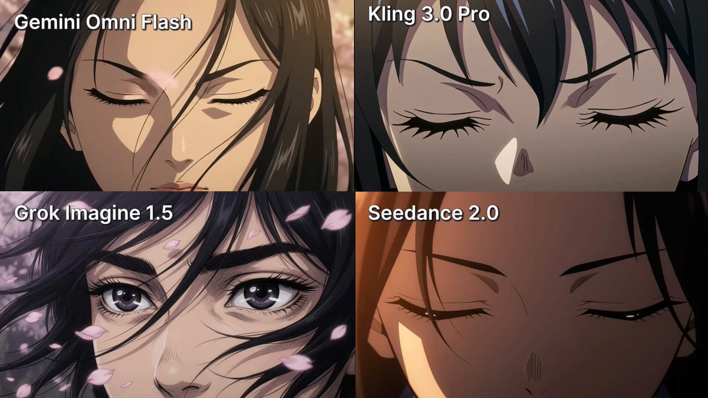
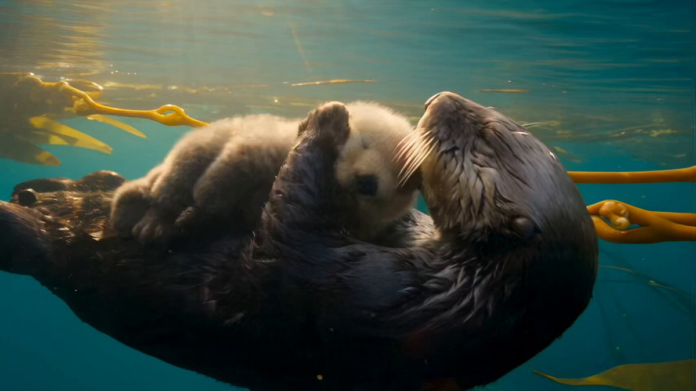
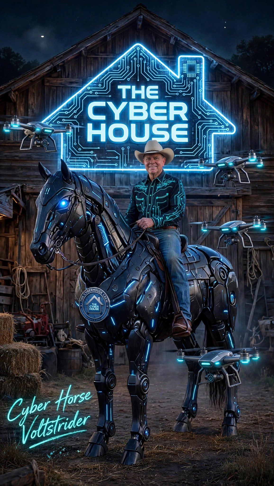

# AI Prompt Radar — 2026-08-03

Bugün bulunan yeni prompt sayısı: **3**

## 1. @YourAlphaMom

**Puan:** 40.15 &nbsp; **Etkileşim:** ❤ 10 · 🔁 0 · 👁 987

**Tam prompt:**

~~~text
Which AI video model is best for creating anime? I tested 4 of the most popular AI video models: Seedance 2.0, Kling 3.0 Pro, Gemini Omni Flash, and Grok Imagine 1.5. Same prompt for all four (I’ll drop it in the comments), and each model got up to 4 attempts. None of them got it perfect, but I definitely have a favorite. - Gemini Omni Flash There were a lot of mistakes, and I’m not very impressed with the final result. It doesn’t fully feel like anime, and Omni Flash is also very expensive. For this specific task, I don’t think it’s the best choice. - Grok Imagine 1.5 The weakest result here. The character consistency is poor, and overall it struggled the most with the task. - Kling 3.0 Pro Actually pretty decent. Considering how affordable it is, you can comfortably spend more attempts refining the result without burning through your budget. A solid option. - Seedance 2.0 My winner. It gave me the best result and needed fewer attempts to get there. For anime-style video, this is the model I’d pick right now. And with the full release of Seedance 1.5 coming very soon, it should become an even stronger option for this kind of content. So my recommendation: Seedance. Which result do you think looks best? And what AI model do you use? Follow for more useful AI video tests. Love, Alpha Mom 💙 #AIVideo
~~~

[Kaynak paylaşımı X'te aç ↗](https://x.com/YourAlphaMom/status/2082520302052163820)

---

## 2. @Dheepanratnam

**Puan:** 35.84 &nbsp; **Etkileşim:** ❤ 49 · 🔁 3 · 👁 1940

**Tam prompt:**

~~~text
AI Created this nature documentary text to video prompt with seedance 2.5 - 30s. including the narration. added soft bgm and subtitles with capcut Prompt in the comments ⤵️
~~~

[Kaynak paylaşımı X'te aç ↗](https://x.com/Dheepanratnam/status/2083954548255727668)

---

## 3. @_Brad_Mixon

**Puan:** 35.24 &nbsp; **Etkileşim:** ❤ 20 · 🔁 6 · 👁 3759

**Tam prompt:**

~~~text
It's time for another Cyber House Crew AI Prompt! Make your own CyberHorse 🐎 Save my image (it's a template) and upload it first and then a reference image of you in Grok or another AI. Paste the copied prompt below and run it. If you want to do it without my template, that's cool too! Try both if you want. 😃 Prompt in first reply post #TheCyberHouseCrew #CHCCyberHorse
~~~

[Kaynak paylaşımı X'te aç ↗](https://x.com/_Brad_Mixon/status/2083936616901386564)

---

_Kaynak içerikler ilgili yazarlara aittir; özgün bağlantılar korunmuştur._
