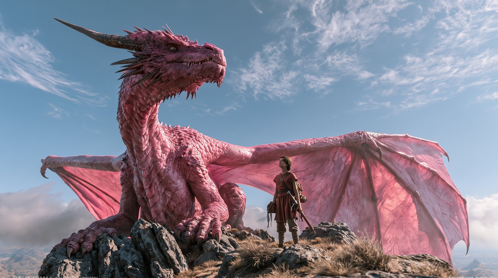
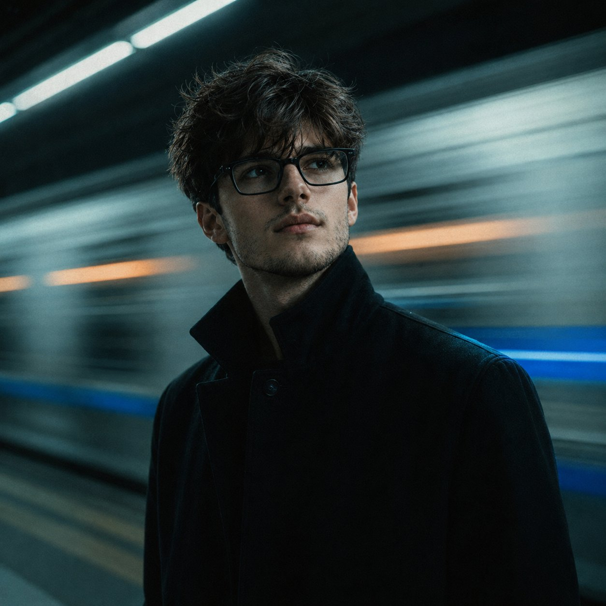

# AI Prompt Radar — 2026-08-04

Bugün bulunan yeni prompt sayısı: **2**

## 1. @minuitIA

**Puan:** 57.90 &nbsp; **Etkileşim:** ❤ 35 · 🔁 4 · 👁 3217

**Tam prompt:**

~~~text
My friend @Just_sharon7 asked me for the prompt I used to create this video with Seedance 2 😊 Instead of sharing only the final prompt, here’s my full workflow: 1 — Create the starting image I first generated a cinematic image featuring a young hero standing beside a giant pink dragon on a mountain summit. 2 — Create the design sheets I uploaded the image to GPT Image 2 or Nano Banana 2 and used this prompt: Based on this image, create three separate and highly detailed design sheets: one for the character, one for the dragon, and one for the environment. Show multiple angles, close-up portraits, clothing, accessories, textures, colors, proportions, and scale references. Keep exactly the same design, colors, proportions, and visual direction as the original image. These sheets give Seedance much more precise references and help maintain consistency across the character, dragon, and environment. 3 — Seedance 2 prompt : Create a 15-second hyper-realistic live-action multi-shot cinematic video in 16:9. Fast-paced, spectacular, emotionally warm, visually original, with strong viral short-form impact. REFERENCE ASSIGNMENT: Use @Image1 only as the main visual reference for the relationship, relative scale and physical proximity between the young man and the dragon. Use @Image2 only to preserve the young man’s exact identity, youthful face, age, haircut, body proportions, red-brown tunic, trousers, boots, leather straps, bracers, satchel, sword and accessories. Do not reproduce the design-sheet layout, labels, panels or studio background. Use @Image3 only to preserve the dragon’s exact identity, pink-red coloration, reptilian head, amber eyes, horn placement, neck spines, scale patterns, claws, body proportions, tail, wing anatomy and translucent wing membranes. Do not reproduce the design-sheet layout, labels, panels or studio presentation. Use @Image4 as the exclusive environment reference for every shot. Preserve the same exposed rocky mountain summit, jagged gray metamorphic rocks, layered stone formations, loose gravel, rocky soil, isolated tufts of dry golden alpine grass, treeless terrain, distant brown mountain ranges, deep blue sky, thin cirrus clouds and low white cumulus clouds along the horizon. Use the late-morning daylight study from @Image4: crisp natural sunlight, cool blue sky, warm dry grass, detailed gray rocks and clear atmospheric visibility. Do not reproduce the environment design-sheet layout, text, labels, color swatches, scale diagram or separate panels. Reconstruct the location as one continuous real mountain summit. ENVIRONMENT CONTINUITY: All shots take place within the same compact area of the summit. Preserve the exact geographic relationship between the prominent central rock formation, the narrow ridge, the cliff edge, the gravel clearing and the distant mountain horizon. The dragon and the young man must remain correctly positioned within this continuous geography. Camera changes must reveal new sides of the same location rather than generating unrelated mountain landscapes. No forests, no trees, no green meadow, no snow, no buildings, no ruins, no castles, no artificial paths and no additional scenery absent from @Image4. WIND DIRECTION AND PHYSICAL BEHAVIOR: The wind is a major visual force and acts as a third character throughout the sequence. A powerful alpine crosswind travels consistently in one fixed world-space direction along the ridge. Its apparent screen direction must change naturally according to each camera angle, while remaining geographically coherent. The wind continuously affects: the young man’s hair, tunic, trouser fabric, leather straps, loose cords and satchel; the dragon’s thin wing membranes, neck spines, loose skin, nostrils and breathing; the dry alpine grass, suspended dust, small gravel, clouds and airborne debris. Wind intensity evolves dramatically: strong irregular gusts during the opening; violent turbulence caused by the dragon’s approach; a brief protected calm when their foreheads touch; a sudden playful gust during the dragon’s snort; an explosive radial pressure wave during takeoff. Every gust must have believable physical consequences. Dust and gravel follow the terrain. Grass bends from its base. Clothing reacts with weight and delayed secondary motion. Wing membranes ripple under aerodynamic tension without deforming unnaturally. DRAGON REALISM: Treat the dragon as a genuine previously undiscovered biological animal filmed in the real world. It has irregular reptilian scales, subtle scars, dust embedded between scales, moist reflective eyes, moving nostrils, visible breathing, heavy muscles shifting beneath the skin and realistic weight. Its feet compress soil and displace gravel. Its claws grip rock surfaces. Its wing membranes react to sunlight and wind like real thin organic tissue. Never present it as a visual effect or rendered creature. SHOT 1 — 0.0 TO 1.6 SECONDS GROUND-LEVEL WIND TUNNEL HOOK Extreme ground-level camera hidden between dry grass and sharp foreground stones, 14mm ultra-wide lens. The frame begins almost completely obstructed by violently bending grass. Wind drives dust and tiny gravel directly over the lens. Through the moving grass, the young man is visible standing alone on the exposed ridge. A gigantic dragon shadow races across the terrain. One pink wing suddenly crosses the entire sky above him, causing an abrupt exposure drop and a violent pressure gust. The camera remains dangerously close to the ground, creating enormous scale, aggressive foreground movement and an immediate scroll-stopping opening. SHOT 2 — 1.6 TO 3.5 SECONDS DRAGON-SCALE POV BETWEEN THE HORNS Hard cut to a fast forward-moving perspective framed organically between the dragon’s horns and facial spines. The camera travels low and rapidly toward the young man as if physically attached near the dragon’s head. The summit rocks rush past on both sides with strong parallax. The young man turns calmly toward the approaching animal. His hair and tunic whip sideways in the crosswind. The dragon’s breathing causes subtle vertical camera movement. Avoid a perfectly centered composition. Keep the young man slightly off-axis while the rocks create diagonal leading lines toward him. SHOT 3 — 3.5 TO 5.7 SECONDS HIGH-SPEED LATERAL ROCK SLALOM Cut to a lateral tracking camera moving rapidly parallel to the ridge, 28mm lens. The camera passes extremely close behind several foreground boulders, repeatedly revealing and hiding the action. The dragon runs beside the young man with massive but controlled momentum. Its claws strike loose gravel. Real stones bounce toward the lens. Dry grass is flattened sequentially by the wind pressure following the dragon’s body. The dragon suddenly brakes and rotates its body beside the young man. Its claws carve visible tracks into the rocky soil. A thick horizontal sheet of dust sweeps across the composition. Use a foreground boulder as a natural wipe into the next shot. SHOT 4 — 5.7 TO 8.1 SECONDS INTIMATE REVERSE ORBIT INSIDE THE WIND SHADOW Emerge from behind the rock into a close reverse-direction circular orbit around the two subjects, 40mm lens. The dragon lowers its head until its eye is level with the young man. The young man steps forward and places one hand against the dragon’s snout. As their foreheads gently touch, the dragon’s enormous body and partially folded wing create a temporary wind shadow. For one brief emotional moment, the young man’s clothing settles and nearby dust floats softly instead of racing sideways. The camera moves from behind the translucent edge of the wing, passes close to the hand touching the scales, then racks focus from the young man’s fingers to the dragon’s amber eye and finally to the young man’s subtle smile. Natural intimacy, physical weight and restrained emotion. No posing. SHOT 5 — 8.1 TO 10.5 SECONDS SNOUT-MOUNTED PLAYFUL REACTION SHOT Cut to an unusual camera position extremely close beside the dragon’s muzzle, looking diagonally toward the young man with slight wide-angle distortion. The dragon gives a short playful snort. The concentrated gust instantly blows the young man’s hair, tunic, straps and satchel backward. Dust bursts from the rocks behind him. He closes his eyes, laughs naturally, loses one step of balance, then pushes the dragon’s muzzle away affectionately with both hands. The dragon gently resists, tilts its head and nudges him again. The camera receives a subtle physical bump from the interaction, creating a spontaneous documentary feeling. SHOT 6 — 10.5 TO 12.6 SECONDS VERTICAL TOP-DOWN PRESSURE RING Smash cut to a perfectly vertical top-down camera directly above the gravel clearing. The jagged rocks and golden grass from @Image4 create a natural radial composition around the young man. The dragon unfolds both wings around him. The wings nearly fill the frame without changing anatomy or scale. One extremely powerful downward wingbeat produces a visible expanding pressure ring across the terrain. Dust, grass, fabric and small gravel move outward from the dragon in physically correct concentric motion. The young man crouches and shields his face while still laughing. The dragon takes two heavy running steps toward the cliff edge. SHOT 7 — 12.6 TO 15.0 SECONDS CLIFF-DIVE CAMERA AND UNDER-WING FLY-BY Cut to a camera positioned just beyond the cliff edge, looking slightly upward toward the summit. The dragon launches directly over the camera. Its claws leave the ground, loose stones fall past the lens, and one translucent wing passes extremely close overhead. Sunlight reveals veins, scars and tension inside the membrane. The camera rapidly rolls beneath the dragon, dives backward along the cliff face, then stabilizes into a sweeping wide reveal of the same mountain summit and distant ranges from @Image4. The dragon immediately banks around the prominent rock formation and performs one fast low fly-by above the young man. The residual wake violently bends the grass and clothing a final time. A wing crosses the lens as a natural wipe, revealing the final wide composition: the young man standing on the exposed ridge while the dragon glides over the vast real mountain valley. End with the young man small in frame, the dragon crossing the open sky and wind-driven dust catching the sunlight. CAMERA LANGUAGE: Every shot must have a clearly different viewpoint and movement: extreme ground-level hidden camera; creature-scale horn-framed point of view; high-speed lateral rock slalom; close reverse circular orbit; snout-level reaction camera; perfect vertical top-down shot; cliff-edge under-wing aerial reveal. Use bold perspective changes while preserving clear spatial continuity. Use practical-feeling camera inertia, natural handheld micro-movement, realistic acceleration, controlled motion blur, organic lens breathing and brief exposure changes when the wings block the sun. Transitions must be motivated by physical objects: moving grass; dragon shadow; foreground boulder; dust sheet; wing membrane; falling gravel. VISUAL REALISM: Absolute live-action photographic realism, indistinguishable from footage captured on a remote mountain location with real cinema cameras. Natural late-morning sunlight, physically accurate shadows, realistic atmospheric perspective, authentic rock textures, restrained film grain, subtle optical imperfections, realistic skin tones, natural highlight roll-off and detailed motion in bright daylight. Maintain detail in the dragon’s dark scales and the bright sky without artificial HDR. Keep the essential interaction within the central 60 percent of the 16:9 frame while using rocks, wings, grass and dust to create strong motion near the edges. CONSISTENCY: Preserve exactly the same young man, face, haircut, costume, accessories and body proportions in every shot. Preserve exactly the same dragon, scale, coloration, horn placement, wing structure, claws, tail and anatomy in every shot. The dragon remains vastly larger than the young man. Maintain consistent sunlight direction, cloud arrangement, wind direction, terrain geography, cliff position, rock formations and distant mountain horizon across the full sequence. NEGATIVE CONSTRAINTS: No fantasy aesthetic, no magical atmosphere, no fire breathing, no glowing eyes, no supernatural particles, no spells, no castles, no ruins, no enchanted landscape, no artificial fog, no heroic posing. No 3D-render appearance, no CGI aesthetic, no VFX look, no animation, no video-game graphics, no synthetic skin, no plastic scales, no weightless creature movement, no impossible hovering. No anatomy changes, no extra limbs, no duplicated subjects, no changing horns, no changing wings, no deformed membrane, no inconsistent scale, no morphing, no teleportation and no disconnected geography. No random changes to weather, daylight, terrain, rocks, vegetation or mountain background. No text, no title, no caption, no logo, no interface and no watermark, no music, no subtitle
~~~

[Kaynak paylaşımı X'te aç ↗](https://x.com/minuitIA/status/2080029449169584395)

---

## 2. @harboriis

**Puan:** 54.82 &nbsp; **Etkileşim:** ❤ 104 · 🔁 10 · 👁 4258

**Tam prompt:**

~~~text
GPT Image 2 on ChatGPT Prompt: Upload one reference photo of your face. Using the uploaded image, accurately reconstruct your face and place yourself in this exact subway station scene as an upper body portrait only. You are standing on the platform, body slightly angled left, head tilted upward and to the right at 20 to 25 degrees, looking up past the camera with a deeply introspective, melancholic expression, not looking at the lens. Thick black rectangular frame glasses. Dark black high collar structured overcoat buttoned up. Directly behind you, a subway train is rushing past at full speed. Extreme horizontal motion blur fills the entire background, silver grey train body blur with vivid electric blue stripe streak and warm orange light streak within the blur. Cool teal blue green fluorescent overhead lighting falls naturally on your face and hair from above. Subtle blue train light catches the edge of your right shoulder. Cool cinematic color grade with teal shadows and cool skin tones. Fine film grain. Do NOT paste your face. The cool fluorescent teal light must fall naturally on your face from above with realistic shadows, a subtle blue rim light on your right shoulder, and a consistent cool color cast across your face that perfectly matches the underground subway environment. 1:1.
~~~

[Kaynak paylaşımı X'te aç ↗](https://x.com/harboriis/status/2078691005604454432)

---

_Kaynak içerikler ilgili yazarlara aittir; özgün bağlantılar korunmuştur._
