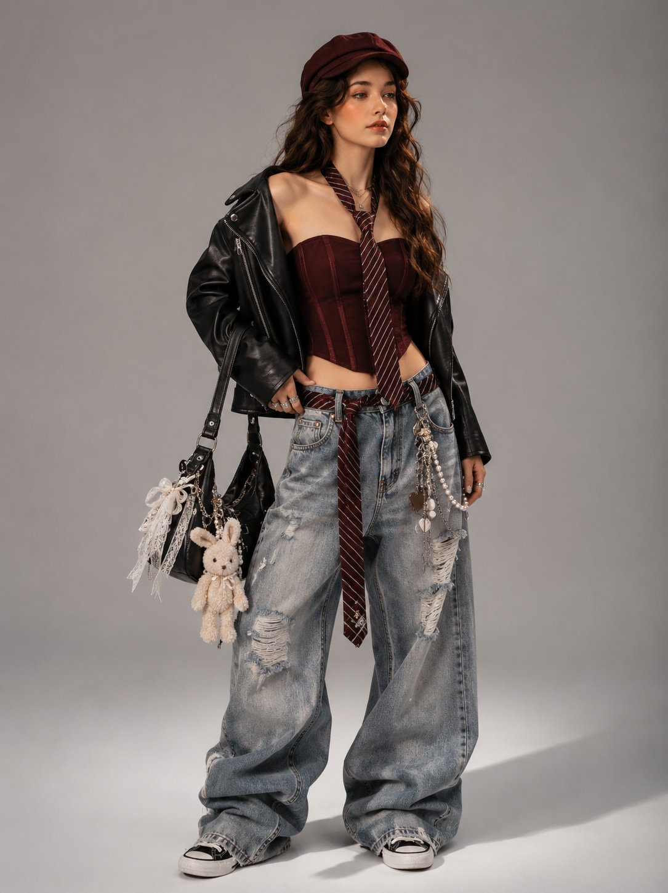

# AI Prompt Radar — 2026-08-06

Bugün bulunan yeni prompt sayısı: **1**

## 1. @ZephyraLeigh

**Puan:** 60.71 &nbsp; **Etkileşim:** ❤ 40 · 🔁 7 · 👁 5200

**Tam prompt:**

~~~text
GPT Image 2 on ChatGPT PROMPT ⬇ [Reference Image] Use the reference photo while keeping the face completely unchanged and identical to the original subject, create an ultra-realistic high-fashion streetwear editorial portrait inspired by Korean luxury fashion campaigns, Y2K aesthetics, and modern designer lookbooks. The model stands confidently in a full-body pose against a seamless light gray studio backdrop, photographed with premium editorial lighting. She has long, voluminous wavy dark brown hair, soft Korean-inspired glam makeup, glowing porcelain skin, naturally flushed cheeks, glossy nude lips, and expressive almond-shaped eyes. She gazes slightly away from the camera with a confident, effortless attitude. Outfit Burgundy newsboy cap Cropped black leather biker jacket draped naturally over the shoulders Burgundy structured corset tube top Burgundy striped necktie loosely hanging around the neck Oversized ultra-baggy light-wash distressed denim jeans with stacked fabric pooling over the shoes Matching burgundy striped tie threaded through the belt loops as a decorative accessory Vintage chain wallet, keychains, pearls, and layered Y2K accessories attached to the jeans Black-and-white canvas sneakers Accessories Black designer shoulder bag decorated with pearl ribbons, lace bows, heart charms, chains, and a plush bunny keychain Layered necklaces Rings Minimal earrings The composition emphasizes oversized proportions, premium fabric textures, realistic denim folds, polished leather reflections, and luxury styling details. The lighting is soft yet dramatic, highlighting the textures of leather, denim, and accessories while maintaining clean editorial contrast. Captured using a medium-format camera, 85mm fashion lens, shallow depth of field, Vogue-inspired styling, luxury studio photography, photorealistic skin texture, ultra-detailed clothing, cinematic color grading, masterpiece quality, and 8K resolution. Style Keywords Korean fashion editorial, Y2K luxury, oversized baggy jeans, streetwear lookbook, black leather jacket, burgundy aesthetic, Vogue fashion, Pinterest outfit inspiration, photorealistic, designer styling, luxury campaign, ultra detailed, 8K. Negative Prompt low quality, blurry, bad anatomy, distorted face, extra fingers, extra limbs, poorly drawn hands, duplicate accessories, cartoon, anime, CGI, plastic skin, watermark, logo, random text, noisy image, poor lighting, oversaturated colors, low resolution, artifacts.
~~~

[Kaynak paylaşımı X'te aç ↗](https://x.com/ZephyraLeigh/status/2074747109140775296)

---

_Kaynak içerikler ilgili yazarlara aittir; özgün bağlantılar korunmuştur._
