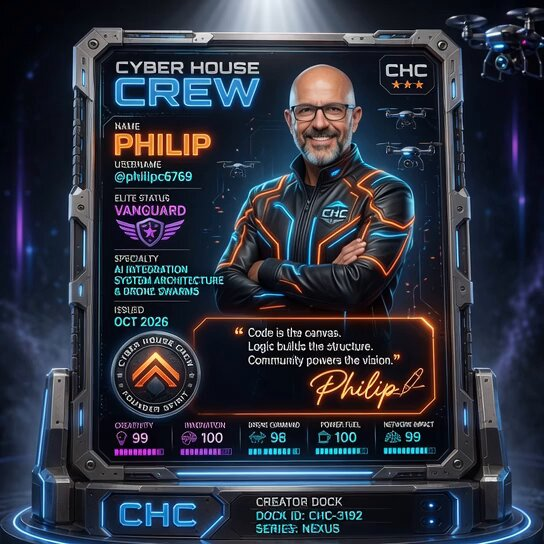

# AI Prompt Radar — 2026-08-07

Bugün bulunan yeni prompt sayısı: **2**

## 1. @saniaspeaks_

**Puan:** 68.01 &nbsp; **Etkileşim:** ❤ 231 · 🔁 16 · 👁 13274

**Tam prompt:**

~~~text
GPT image 2 in chatgpt Prompt: Ultra-realistic smartphone photo, genuinely looks like it was casually captured with a mobile phone, not a DSLR or AI render. A beautiful young East Asian woman with very fair porcelain skin, a delicate V-shaped face, large soft brown eyes, subtle Korean makeup with light pink lips, and long silky platinum silver hair with full straight bangs flowing naturally over her shoulders. She is standing on a quiet urban street at night outside a modern café and commercial building with glowing neon storefront signs, glass windows, black barriers, yellow-and-black safety tape, and softly blurred city lights in the background. She wears an oversized black, gray, and white plaid knit poncho layered over a crisp white collared shirt with loose sleeves, creating a cozy Korean street-fashion aesthetic. She faces the camera directly with a calm, slightly shy expression, shoulders relaxed, hands naturally out of frame. The image is framed from the waist up with a slightly high handheld angle, as if a friend quickly took the picture using a smartphone. Soft ambient streetlights and nearby shop lighting illuminate her face naturally, with realistic skin texture, slight mobile-camera noise, gentle HDR processing, subtle motion softness, authentic night exposure, shallow computational depth of field, and natural color balance. No professional lighting, no studio setup, no overly sharp AI look, no beauty filter, no exaggerated bokeh. The composition feels spontaneous, candid, and effortlessly aesthetic, exactly like a real flagship smartphone night-mode photo shared on social media. Aspect Ratio: 3:4 Style: Ultra-photorealistic, natural mobile photography, candid street portrait, Korean aesthetic, authentic smartphone camera, high detail, realistic night lighting.
~~~

[Kaynak paylaşımı X'te aç ↗](https://x.com/saniaspeaks_/status/2078321725100757096)

---

## 2. @philipc6769

**Puan:** 39.86 &nbsp; **Etkileşim:** ❤ 20 · 🔁 5 · 👁 4755

**Tam prompt:**

~~~text
It’s time for another AI prompt for The CyberHouse Crew Mine is a video prompt and you will need Eliza’s Trading Card from Tuesday’s prompt, which is on the quoted post. Just upload the trading card into Grok or your AI video app and paste the prompt below . Seems to work better as a 10 second video #TheCyberHouseCrew #CHCTradingCard —–——————————————- Start on the uploaded “Cyber House Crew” ID card exactly as shown with the holograph-style card frame glowing blue and orange, drones hovering in the background. The camera holds steady for a beat, then the entire card begins a smooth, continuous 360-degree rotation around its vertical center axis, as if suspended in the air on the glowing creator dock beneath it. As the card turns, the front face of the card sweeps past and out of view while dramatic light trails and particle sparks streak along the card’s metallic edges. Randomize complimenting neon rim-lighting colors (such as blue and purple, teal and magenta, yellow and aqua) intensify mid-turn, casting reflections onto the dock platform below. Small drones continue their idle hover-loop in the background, unaffected by the rotation, adding parallax depth. As the rotation completes past 180 degrees, the back of the card comes into view — a matching Cyber House Crew design featuring the CHC emblem centered in a holographic circuit pattern, dock ID barcode, random series watermark, and the same random neon color rim-lighting. The rotation continues smoothly through 270 and back to 360, landing exactly back on the original front-facing portrait shot, completing a seamless full-circle loop. Camera locked on a slow, cinematic dolly-in throughout. Ambient sci-fi hum and soft electronic chime as the card completes its rotation.
~~~

[Kaynak paylaşımı X'te aç ↗](https://x.com/philipc6769/status/2083586466026828244)

---

_Kaynak içerikler ilgili yazarlara aittir; özgün bağlantılar korunmuştur._
