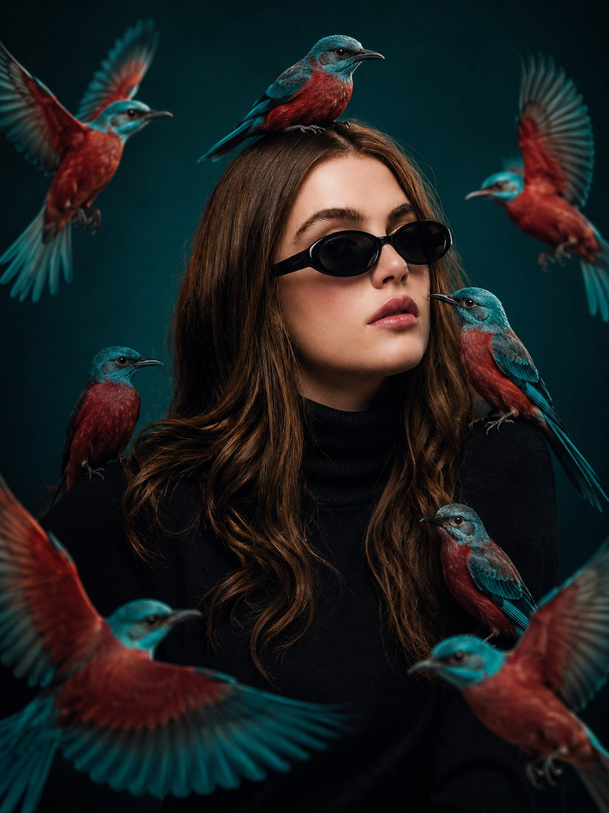

# AI Prompt Radar — 2026-08-10

Bugün bulunan yeni prompt sayısı: **1**

## 1. @codewithhajra

**Puan:** 58.27 &nbsp; **Etkileşim:** ❤ 75 · 🔁 1 · 👁 1808

**Tam prompt:**

~~~text
GPT Image 2 on ChatGPT Try with your own image and show the results. Prompt: MAIN PROMPT Transform the uploaded person into a premium cinematic fashion editorial portrait while preserving the exact facial identity, facial structure, skin tone, hairstyle, eye shape, nose, lips, jawline, expression, and recognizable appearance from the reference image. FORMAT LOCK Vertical 3:4 composition. Waist-up portrait. Centered symmetrical framing. Luxury fashion editorial photography. IDENTITY LOCK Use the uploaded image as the only identity source. Preserve the exact facial features, facial proportions, hairstyle, skin tone, expression, and overall appearance. Do not redesign or alter the person’s identity. STYLING Dress the subject in a premium black turtleneck and black oval sunglasses. Keep the styling elegant, modern, and minimalist with realistic fabric textures. BIRDS Surround the subject with multiple vibrant turquoise-and-crimson birds. Some birds perch naturally on the shoulders, one rests gently on the head, one sits near the jawline, while several others fly around the subject with fully extended wings. The birds should feel alive, graceful, and naturally integrated into the composition with ultra-detailed feathers and realistic movement. BACKGROUND Dark teal seamless studio background with a soft gradient. Clean, minimal, and distraction-free. LIGHTING & STYLE Dramatic cinematic studio lighting. Soft directional highlights. High contrast. Photorealistic skin texture. Ultra-detailed feather textures. Shallow depth of field. Premium luxury fashion editorial aesthetic. Teal and crimson color palette. HDR lighting. Ultra-realistic 8K quality. Magazine-cover photography. NEGATIVE PROMPT Avoid changing the face, hairstyle, expression, or identity. Avoid blurry details, distorted anatomy, extra limbs, unrealistic birds, plastic feathers, cluttered composition, text, logos, watermarks, low quality, or CGI-looking skin.
~~~

[Kaynak paylaşımı X'te aç ↗](https://x.com/codewithhajra/status/2085957585958514928)

---

_Kaynak içerikler ilgili yazarlara aittir; özgün bağlantılar korunmuştur._
