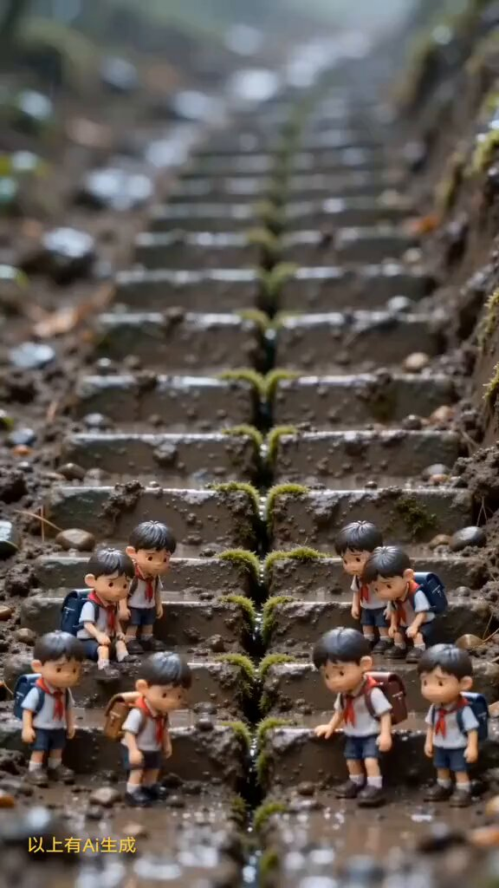
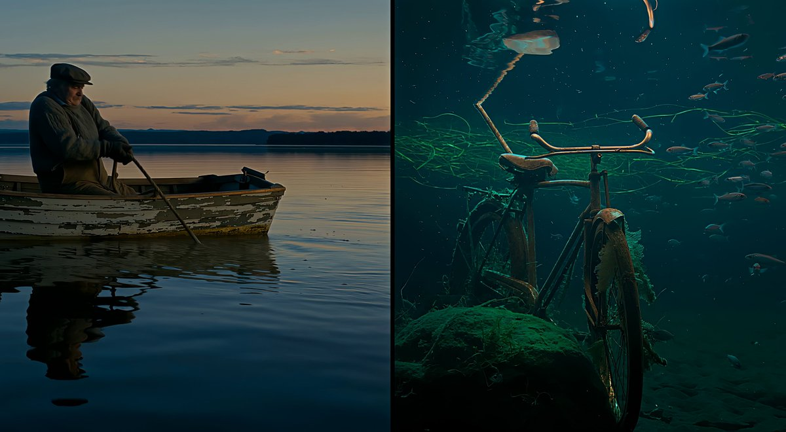

# AI Prompt Radar — 2026-08-16

Bugün bulunan yeni prompt sayısı: **4**

## 1. @Arzoo12sh

**Puan:** 66.09 &nbsp; **Etkileşim:** ❤ 184 · 🔁 49 · 👁 14038

**Tam prompt:**

~~~text
video prompt: A cinematic macro miniature scene of tiny school children wearing white school shirts, red neckties, navy blue shorts, black shoes, and colorful backpacks, carefully walking and climbing a long muddy stone staircase in a lush forest after rain. The stone steps are covered with green moss, wet soil, and small pebbles. The children look adorable with realistic facial expressions and slightly oversized heads in a miniature style. Ultra-realistic macro photography, shallow depth of field, soft natural lighting, highly detailed textures, dreamy bokeh background, 8K, photorealistic, vertical 9:16 composition, heartwarming atmosphere, smooth cinematic camera movement.
~~~

[Kaynak paylaşımı X'te aç ↗](https://x.com/Arzoo12sh/status/2081698760124686704)

---

## 2. @umesh_ai

**Puan:** 54.11 &nbsp; **Etkileşim:** ❤ 254 · 🔁 20 · 👁 18725

**Tam prompt:**

~~~text
Flux 3 is incredible at split screen generations! Prompt : 15-second split-screen video, two equal vertical halves, one continuous take, no cuts. Both cameras show the same event at the same time, perfectly frame-synchronized. Scene: Calm lake at dusk. An old fisherman in a small wooden rowboat pulls a rope from the water. Left: Water-level camera from another boat. Show only the fisherman, boat, rope above water, ripples, and splashes. Nothing below the waterline is visible. Right: Underwater camera looking up. The rope leads to a sunken bicycle tangled in glowing green weeds, surrounded by small silver fish. 0–6s: The fisherman pulls. Left: he strains and the boat rocks. Right: the bicycle rises with every matching tug. 6–11s: A violent jolt. Left: he nearly falls backward. Right: a wheel catches on a rock, then pops free on the exact same frame. Fish scatter. 11–15s: The bicycle crosses the surface continuously. It must appear above water on the left only when that exact part crosses the waterline on the right. Both halves must match its height, angle, motion, rope tension, splashes, and timing frame by frame. Once fully raised, the fisherman stares, then laughs. No duplicate bicycle, broken rope, teleporting, timing offset, or camera change. Upscaled with Topaz Astra. @bfl_ai
~~~

[Kaynak paylaşımı X'te aç ↗](https://x.com/umesh_ai/status/2082010903097311553)

---

## 3. @jerrod_lew

**Puan:** 32.88 &nbsp; **Etkileşim:** ❤ 7 · 🔁 0 · 👁 478

**Tam prompt:**

~~~text
Prompt: Cinematic movie scene, an overcast, windy and storm day, a woman with a Scottish accent stands on the top of a cliff looking over the rough Scottish highlands seas, the wind moving her long brown hair, the scene starts wide with her in the distance looking over the sea, it then cuts to her side where she looks at the camera, smiles and says: "It's not perfect, but it's home for me."
~~~

[Kaynak paylaşımı X'te aç ↗](https://x.com/jerrod_lew/status/2081465224503459969)

---

## 4. @Arzoo12sh

**Puan:** 31.02 &nbsp; **Etkileşim:** ❤ 3 · 🔁 0 · 👁 318

**Tam prompt:**

~~~text
🎬 Video Prompt Create a cinematic surreal 3D animation on a wooden desk. Start with a giant black ant slowly crawling toward a tiny frightened bearded man sitting inside a cardboard box. The man is wrapped in a red-and-white checkered blanket and begins crying in fear, with tears and water dripping from his messy spiky hair and clothes. He looks at the ant, screams and moves backward inside the box while the ant slowly moves its legs and approaches him. Add subtle camera movement, realistic character animation, natural water droplets, expressive facial reactions, shallow depth of field, warm cinematic lighting, realistic desk objects in the background, smooth motion, dramatic yet funny atmosphere, vertical 9:16, high-quality 3D animation.
~~~

[Kaynak paylaşımı X'te aç ↗](https://x.com/Arzoo12sh/status/2088441032879051125)

---

_Kaynak içerikler ilgili yazarlara aittir; özgün bağlantılar korunmuştur._
