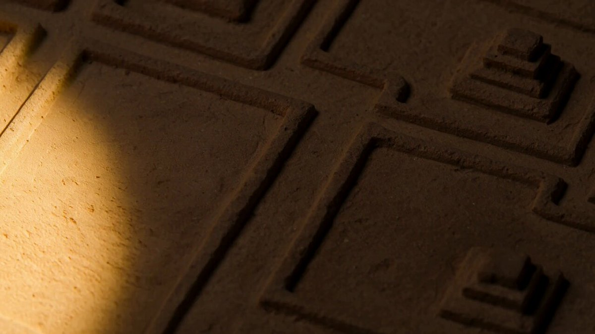

# AI Prompt Radar — 2026-08-17

Bugün bulunan yeni prompt sayısı: **2**

## 1. @HBCoop_

**Puan:** 52.73 &nbsp; **Etkileşim:** ❤ 992 · 🔁 76 · 👁 38880

**Tam prompt:**

~~~text
Title animation for an ancient period series with MiniMax H3 🔺 Text to video prompt below:
~~~

[Kaynak paylaşımı X'te aç ↗](https://x.com/HBCoop_/status/2087539373420228818)

---

## 2. @FutureVibesAi

**Puan:** 44.11 &nbsp; **Etkileşim:** ❤ 3 · 🔁 0 · 👁 111

**Tam prompt:**

~~~text
Seedance 2.0 Video Prompt Cinematic premium 3D action short film, 15 seconds. A confident young female superbike rider wearing a premium black leather racing suit with electric blue and metallic silver accents, aerodynamic armor, fitted racing gloves, knee sliders, racing boots, and a stylish cropped racing jacket. The racing suit features the number "07" and subtle "FUTURE VIBES AI" branding. She rides a matching black, blue, and silver superbike. Throughout the sequence, both the rider and motorcycle become progressively covered in realistic wet mud. LOCATION: A rugged muddy motocross circuit beneath dark storm clouds. Wet churned-up dirt, deep ruts, puddles, flying mud, dramatic mountains in the distance, no audience, only raw terrain. AUDIO: Aggressive superbike engine roaring continuously from the first frame. Loud tire spin, mud splashes, drifting sounds, suspension impacts, gear shifts, and powerful throttle bursts synchronized with every acceleration and jump. 0:00–0:03 She drifts aggressively through a muddy corner at high speed. The rear tire launches a massive wall of mud toward the camera. Close-up tracking shot focused on the spinning rear wheel as mud explodes in slow motion. 0:03–0:05 She accelerates toward a large jump. The superbike launches into the air. Wide cinematic drone shot captures the bike silhouetted against dramatic storm clouds while mud flies from the spinning tires. 0:05–0:07 She lands hard. Mud erupts in every direction. Immediately powers into a deep muddy rut. Low front tracking shot with dirt chunks flying directly toward the camera. 0:07–0:10 Fast cinematic montage: • Close-up of gloved hands twisting the throttle. • Close-up of racing boots gripping the foot pegs. • Mud splashing across the helmet visor. • Suspension compressing through rough terrain. • Rear tire spinning violently. 0:10–0:13 She launches from a larger jump, performing a dramatic sideways whip in mid-air. Wide IMAX-style shot against the stormy sky followed by an ultra-close shot of the wheels leaving the jump. 0:13–0:14 She lands smoothly and accelerates directly toward the camera, throwing a towering rooster tail of mud behind her while the engine screams at full power. 0:14–0:15 Final hero shot. She performs a powerful roost directly into the camera, filling the entire frame with flying mud before fading to black. STYLE: Ultra-realistic cinematic CGI, AAA racing game quality, Unreal Engine 5, realistic mud physics, dynamic camera movement, dramatic overcast lighting, volumetric fog, film grain, premium action-film color grading, hyper-detailed materials, photorealistic superbike, blockbuster cinematography, 8K, vertical 9:16.
~~~

[Kaynak paylaşımı X'te aç ↗](https://x.com/FutureVibesAi/status/2088924608640741707)

---

_Kaynak içerikler ilgili yazarlara aittir; özgün bağlantılar korunmuştur._
