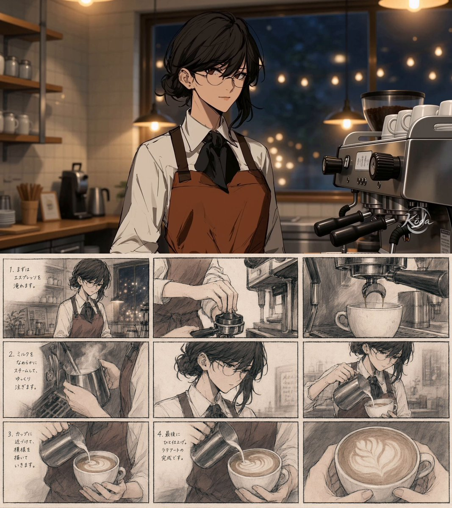
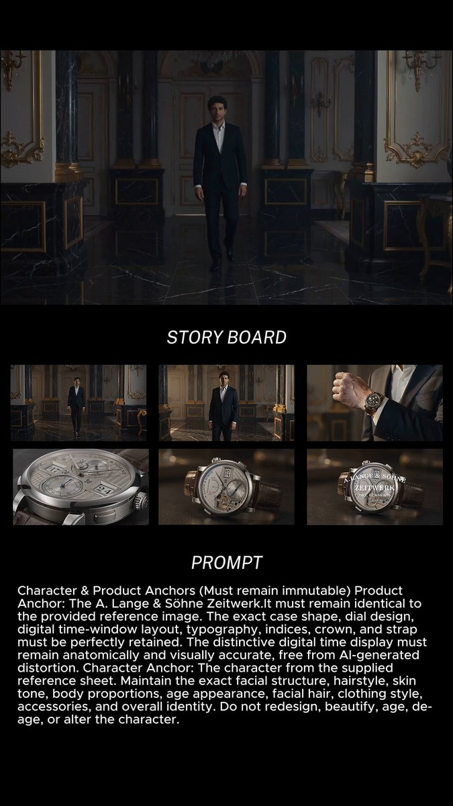
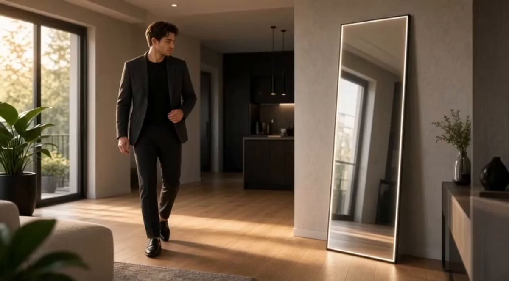

# AI Prompt Radar — 2026-08-21

Bugün bulunan yeni prompt sayısı: **5**

## 1. @aimikoda

**Puan:** 54.33 &nbsp; **Etkileşim:** ❤ 176 · 🔁 16 · 👁 5469

**Tam prompt:**

~~~text
MiniMax H3 with GPT Image 2 Storyboards I think we can safely say storyboards work incredibly well with MiniMax H3. I'd definitely recommend adding storyboards to your workflow. I didn't include any scene descriptions in the video prompt at all. Its ability to understand reference images is really impressive. MiniMax H3 Prompt for this video: Use the storyboard @[storyboard ref] as sequential shot guidance, not as a static image. Do not treat the storyboard as one image. Follow each panel as a separate beat. Use @[character ref] as character reference. She talks while preparing the latte: まずはエスプレッソを淹れます。 ミルクをなめらかにスチームして、ゆっくり注ぎます。 カップに近づけて、模様を描いていきます。 最後にひと仕上げ。ラテアートの完成です。 -- You can find storyboard and character image prompt in the replies.
~~~

[Kaynak paylaşımı X'te aç ↗](https://x.com/aimikoda/status/2090556776156742071)

---

## 2. @AI_with_Antonio

**Puan:** 50.09 &nbsp; **Etkileşim:** ❤ 278 · 🔁 9 · 👁 46382

**Tam prompt:**

~~~text
Where precision becomes art and time is reimagined. Check out this meticulously crafted 10-second cinematic video prompt for the iconic A. Lange & Söhne Zeitwerk. Created with @nemovideoai
~~~

[Kaynak paylaşımı X'te aç ↗](https://x.com/AI_with_Antonio/status/2090089877341974549)

---

## 3. @Arzoo12sh

**Puan:** 35.35 &nbsp; **Etkileşim:** ❤ 3 · 🔁 0 · 👁 147

**Tam prompt:**

~~~text
Video Prompt (Matching Scene):2 A miniature angry man sits on a giant sliced mango while a colony of giant black ants carries the mango across a sunny tropical beach. The ants walk steadily over the sand as ocean waves move gently in the background. The tiny man keeps his arms crossed and looks frustrated. Cinematic camera tracking shot, macro lens effect, realistic ant movement, detailed mango textures, tropical daylight, soft shadows, shallow depth of field, photorealistic, ultra-detailed, 4K, viral AI video, smooth motion, whimsical fantasy realism.
~~~

[Kaynak paylaşımı X'te aç ↗](https://x.com/Arzoo12sh/status/2090256825417650512)

---

## 4. @AIPromptLabAI

**Puan:** 31.51 &nbsp; **Etkileşim:** ❤ 0 · 🔁 0 · 👁 56

**Tam prompt:**

~~~text
The prompt behind the concept ↓ Create a 15-second ultra-realistic cinematic product advertisement featuring one consistent stylish young creative professional wearing original, unbranded premium AI smart glasses. Use a slim matte-black frame, refined modern design, clear lenses and realistic premium materials. Show a natural progression: Person → lifestyle → product detail → cinematic hero frame. Use smooth controlled camera movement, realistic human motion, natural expressions, shallow depth of field, cinematic lighting and physically accurate reflections. Keep the same character, outfit, face and glasses design throughout. No logos, copied products, holograms, floating UI, excessive VFX, distorted hands, extra fingers, product morphing or artificial-looking effects. Final feeling: technology that feels invisible, sophisticated and naturally part of the moment.
~~~

[Kaynak paylaşımı X'te aç ↗](https://x.com/AIPromptLabAI/status/2090113397929218518)

---

## 5. @AIPromptLabAI

**Puan:** 28.94 &nbsp; **Etkileşim:** ❤ 8 · 🔁 0 · 👁 34

**Tam prompt:**

~~~text
What if a product ad could feel this real? A cinematic smart mirror concept created with @Imagvio_AI. I wanted to turn a simple product idea into a complete visual story — character, environment, reflection, camera movement, and a premium hero shot. Built to explore what’s possible when AI meets product storytelling. Prompt below ↓ #AICreatives #ProductAd
~~~

[Kaynak paylaşımı X'te aç ↗](https://x.com/AIPromptLabAI/status/2090474198431137886)

---

_Kaynak içerikler ilgili yazarlara aittir; özgün bağlantılar korunmuştur._
