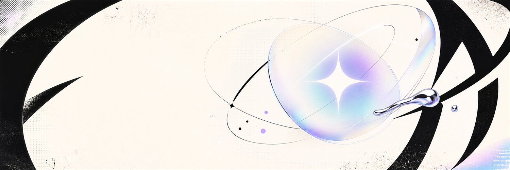
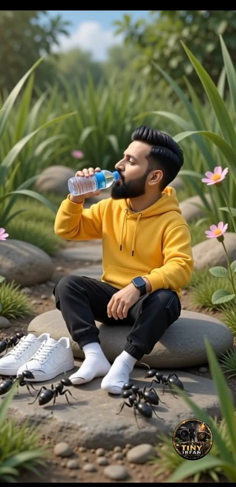
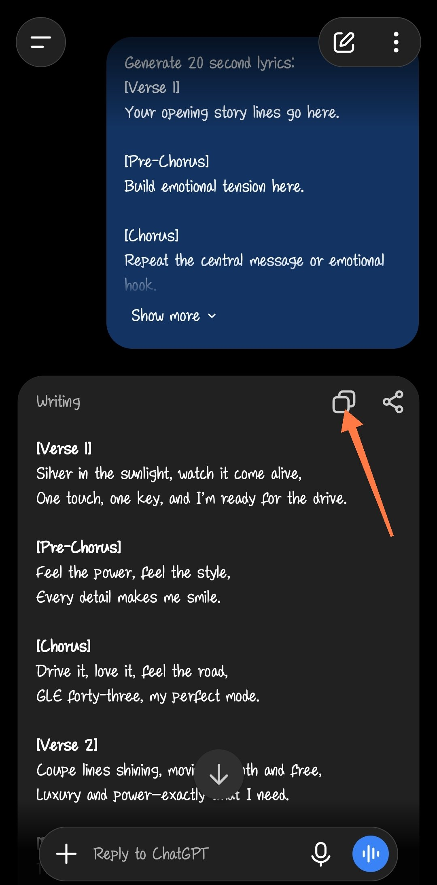

# AI Prompt Radar — 2026-08-24

Bugün bulunan yeni prompt sayısı: **5**

## 1. @magic_ai_skill

**Puan:** 61.02 &nbsp; **Etkileşim:** ❤ 46 · 🔁 13 · 👁 2891

**Tam prompt:**

~~~text
두둥.... 제가 실제 쓰는 Seedance 2.5 프롬프트 양식 공개 👇아래 내용 AI에 복붙하고, 만들고 싶은 영상 말하면 끝 ■ 30 SECOND VIDEO PROMPT - WRITING RULES - 8 SHOT STRUCTURE ■ HOW TO USE 1. Paste this whole document into an AI first. 2. Describe the video you want in one or two lines. e.g. "a subway station at night in the rain, one woman left alone, something appears at the end" 3. The AI returns a finished 30 second prompt in the format below. 4. Paste that result straight into Seedance 2.5. ■ INSTRUCTIONS TO THE AI · Replace every bracket [ ] with real content. Never leave a bracket in. · Delete any line that does not apply to the material. Do not force it. · Lines starting with > and sections marked ■ are guidance only - follow them, never copy them into the output. · Do not break any of the eight COMMON FAILURES listed at the end. [TITLE] - 30 seconds SUBJECT: [age] [nationality] [gender]. [how many people appear - if only one, say so; if more, describe each so they stay apart]. [face shape], [eyes], [nose], [lips], [skin]. Whatever face is set in the first shot is carried by every shot after it - the same features, the same colouring. Nobody turns into a different person partway through and no lookalike appears. Hair is [colour and shape]. [how skin and texture should read - real human skin, or the texture of whatever style this is drawn or rendered in]. WARDROBE: whichever apply of [outer], [worn under], [neck], [lower], [shoes], [accessories]. [If it changes, state exactly when and where / if not] identical throughout, and there is no shot of anyone changing. SPACE: [size, exits, windows]. [anything that has to be in this space - delete this line if nothing does] PROPS: [anything held, if any]. [anything that enters the frame, if any] EXPOSURE: [state directly whether it runs bright or dark]. [how wide the gap between lit areas and black areas should be] LOOK: the eight cuts are one single video shot on the same camera in one continuous run. Colour and grain are identical from cut to cut. The light is only [source], a [colour]. Saturation is [level]. Blacks are true black with few mid tones. PICTURE QUALITY: shot on [camera type]. [grain / noise / bloom around light sources - only what applies]. There is no damage - no breaking, smearing, or colour blotching of the image. SHOOTING STYLE: [should it look staged, or like something that happened to be caught]. [what focal length and depth of field]. [square framing, or tilted and off centre]. [does the frame shake, does focus and exposure lag - only use this when you want it to feel shot on a camera]. CAMERA: cut one is [shot type], held [height]. Cut two is [shot type]. [and so on per cut]. The same shot size never comes twice in a row. Faces are seen only in [which cuts]. DIALOGUE: every line is [language], [to herself / conversation]. Lines are short and run on one breath. An interjection plus one short sentence is fine, but never two complete sentences run together. Punctuation appears once, never doubled. ■ 8 SHOTS Write each shot in this order: 1. what the subject does (from where to where) 2. how the surroundings or the other person reacts 3. how the camera moves Face, clothes and space are set here. Freeze the first second: it should already make you ask "what is that?" 2 (0:04-0:08) APPROACH [place]. [shot], [camera]. [what the subject comes face to face with - an object, a person, a space, anything] [how it moves toward them] Transition: [cut where the motion ends] > This is where the film reveals what it is about. 3 (0:08-0:11) REACT [place]. [shot], close. [the reaction to the previous shot] [how the face and body shift] Transition: [cut as the expression softens] > This is where the audience is told how to feel about it. Keep it short. 4 (0:11-0:14) MOVE [place]. [shot], [camera]. [the subject changes position] [what is coming next catches briefly behind them] Transition: [cut on the forward motion] > Leak the next thing early. Focus stays on the subject, background spreads softly. 5 (0:14-0:18) * FIRST PEAK [place]. [what opens and how - the camera tilts up from below / the lights come on all at once / a door swings open]. [how the light catches it] Dialogue: "[one breath]" [speed] > The one thing this film exists to show. 6 (0:18-0:22) TURN [new place / new situation]. [shot], [camera]. [what signals the situation has changed] [their first action here] Dialogue: "[one breath]" Transition: [cut] > The place changes or the mood flips. If clothes or hair change, restate all of it here. 7 (0:22-0:26) TIGHTEN [place]. [shot], [camera]. [the event just before the final peak] [how the surroundings react] Transition: [cut] > Do not spend everything here. Save it for the last shot. 8 (0:26-0:30) * CLOSE [place]. [the last thing that opens]. Dialogue: "[closing line, one breath]" [how the frame ends - a hand covers the lens / it goes white / it stops on black] > Always specify the final image. Without it the last few seconds drag. AUDIO: from [time] to [time] [what is heard]. [whether a low tone runs underneath the whole thing]. [whether there is a silent gap - and exactly from when to when]. [the exact time each hit lands] CONSISTENCY: the same face, the same clothes and the same [shoes/gear or whatever must hold] in every shot. Hands are natural with no smeared fingers. No text, subtitles, logo or watermark anywhere. No filming equipment is visible. CLOSING: [what should this look like it was made as - a record someone captured, a shot production, something drawn]. [smooth out the artefacts, or let them work for you]. Expressions and movement do not switch in one step; they move through stages. Every syllable is clearly articulated, never slurred, never clipped at the end. Gestures are what the moment produces. ■ SHOT BUDGET - 8 SHOT STRUCTURE 1 ESTABLISH 0:00-0:04 4s 2 APPROACH 0:04-0:08 4s 3 REACT 0:08-0:11 3s 4 MOVE 0:11-0:14 3s 5 FIRST PEAK * 0:14-0:18 4s 6 TURN 0:18-0:22 4s 7 TIGHTEN 0:22-0:26 4s 8 CLOSE * 0:26-0:30 4s 30s · Give the peak shots 4 seconds. Under 3 and they pass by before they open. · The shot count is not fixed. Eight is a starting point - move it with the material. More shots (12-15) and scenes turn over fast. Fewer shots (4-6) and the eye stays on one frame, so tension builds. When cutting the count, decide which of the eight roles merge and give them the time. ■ HOW TO FILL THE BRACKETS Never just drop a name in. Replace it with what the eye actually sees. If someone who has never seen that place or object reads it and pictures the same image, you wrote it right. [place] x a famous tourist spot o a back lane where a double-decker and a red phone box lie inverted in the wet asphalt [what opens] x the building appears o the camera tilts up from below and the clock tower opens against the sky, the gold numerals sharp o every candle catches alight at once and a grey-white figure stands revealed in that spot [something comes toward the subject] x something is received / something appears o the owner lifts it out of the fryer, wraps it in newspaper and sets the parcel down into two waiting hands o at the far end of the corridor a grey-white figure crosses the left edge of frame in one pass [reaction] x they like it / they are startled o it is too hot, so an open mouth gets fanned with a hand, the eyes go wide and break into a laugh o the walking stops, only the head turns that way, not startled but unsure of what was just seen ■ COMMON FAILURES AND HOW TO BLOCK THEM A negative with no scope "X is not visible" erases the entire frame. -> Bound it: "only the far end of the corridor is sunk in darkness". Written in the top blocks, ignored in the shots -> Restate what matters inside the shot description. Result words instead of motion "he collapses" / "he goes down" produces nothing. -> Write the path: "he slides back into the wall". Something materialises out of thin air -> Write who moves it, from where, to where. Two lines of dialogue in one shot The camera goes hunting for the talking face and the framing breaks. -> One line per shot. Move the rest to the next shot or turn it into action. Too many events in one shot What cannot be drawn gets dropped - and what gets dropped is the important part. -> Two events per shot, maximum. Added text and broke what was working As the whole gets longer, existing instructions lose their share. -> Cut the same amount you add. Hold the total.
~~~

[Kaynak paylaşımı X'te aç ↗](https://x.com/magic_ai_skill/status/2091478818859139549)

---

## 2. @j_smeaton99

**Puan:** 49.03 &nbsp; **Etkileşim:** ❤ 59 · 🔁 2 · 👁 1116

**Tam prompt:**

~~~text
Seedance 2.5 on Pollo AI Prompt: Concept: "Golden Hour in the Old Town" Create a hyper-realistic observational video filmed on a modern mirrorless camera with a handheld documentary style. The camera is never visible, and the woman is not recording herself. The footage is captured naturally by someone walking nearby, creating the feeling of an authentic lifestyle documentary rather than a vlog or commercial. Use realistic handheld camera movement with subtle footsteps, gentle breathing, occasional autofocus adjustments, natural exposure adaptation, slight framing imperfections, and authentic environmental sound. Avoid cinematic camera moves, slow motion, transitions, or dramatic editing. Everything should feel like genuine candid footage. Visual Style Modern documentary-style footage with natural colours, balanced dynamic range, soft golden-hour sunlight, realistic skin texture, and accurate exposure. No beauty filters, excessive sharpening, cinematic colour grading, lens flares, or artificial effects. Character A beautiful young European woman in her twenties with long wavy chestnut hair, fair skin, and elegant natural makeup. She wears a fitted white crop top, high-waisted beige linen shorts, white sneakers, delicate gold jewellery, sunglasses resting on her head, and carries a woven shoulder bag. Her appearance remains consistent throughout. Location A charming historic European old town with narrow cobblestone streets, cafés spilling onto the sidewalks, flower-covered balconies, cyclists, outdoor markets, and warm sunlight reflecting from centuries-old stone buildings. The recording begins as she exits a small artisan bakery carrying a paper bag of fresh pastries and an iced coffee. She pauses for a moment to enjoy the warm afternoon sun before continuing down the cobblestone street. She stops outside a flower stall, smiles while smelling a bouquet of fresh lavender, and exchanges a friendly smile with the florist before continuing. As she walks through a lively square, a violinist performs nearby. She slows down, listens for a few seconds, gently applauds with a genuine smile, and drops a coin into the musician's case before walking away. A light breeze moves her hair as pigeons scatter across the square. She glances back toward the unseen camera operator with a warm smile and a small wave before continuing toward a narrow sunlit alley lined with cafés and climbing ivy. The camera lingers for a moment as she gradually disappears into the bustling old town, ending the recording naturally. Generation Requirements Produce one continuous 15-second handheld recording with consistent facial identity, realistic anatomy, authentic walking mechanics, believable interactions, natural eye movement, and physically accurate lighting. Include realistic ambient sounds such as footsteps on cobblestones, distant conversations, birds, café activity, bicycles, and soft street music. Avoid AI artifacts, duplicated pedestrians, warped anatomy, floating objects, perfect symmetry, cinematic effects, or unnatural motion. The final result should be indistinguishable from genuine documentary footage casually filmed during an afternoon in a European city.
~~~

[Kaynak paylaşımı X'te aç ↗](https://x.com/j_smeaton99/status/2091524606427623527)

---

## 3. @Arzoo12sh

**Puan:** 42.72 &nbsp; **Etkileşim:** ❤ 175 · 🔁 48 · 👁 7147

**Tam prompt:**

~~~text
① Select your AI tool — ChatGPT, Gemini, or Grok ② Upload a photo you love ③ Paste the prompt below ④ Generate your personalized AI image + video 👇💬 Prompt ⤵️
~~~

[Kaynak paylaşımı X'te aç ↗](https://x.com/Arzoo12sh/status/2090751891265528097)

---

## 4. @OlatundeAI

**Puan:** 39.97 &nbsp; **Etkileşim:** ❤ 38 · 🔁 4 · 👁 2582

**Tam prompt:**

~~~text
As promised, below is the SUNO AI prompt for generating a tailored background song for your UGC video. How to use the prompt: Copy the prompt and paste it into the same ChatGPT chat where you generated your Section 1 and Section 2 video prompts. Copy the result and open the Suno AI app. Tap the music icon in the centre (pink), switch to Simple at the top, and enable Instrumental. Paste the prompt and tap Create. Wait a few seconds for it to generate. You’ll see 2–4 results. Two are free, while the other two require a paid plan. Download the best one from the free options. "Generate suitable 20-second UGC-style lyrics for the above script. [Verse 1] Your opening story lines go here. [Pre-Chorus] Build emotional tension here. [Chorus] Repeat the central message or emotional hook. [Verse 2] Continue the story and introduce new details. [Bridge] Add the major emotional turning point. [Final Chorus] Deliver the emotional resolution. [Outro] End with a memorable closing line."
~~~

[Kaynak paylaşımı X'te aç ↗](https://x.com/OlatundeAI/status/2091216217922998483)

---

## 5. @Aiwithpoonam

**Puan:** 31.41 &nbsp; **Etkileşim:** ❤ 5 · 🔁 0 · 👁 906

**Tam prompt:**

~~~text
1. Find Viral Topics Prompt: “Act as a YouTube Shorts strategist. Give me 20 high-potential Shorts topics in [NICHE] that have strong curiosity, emotional appeal, and shareability. For each, provide the hook, target audience, and why viewers would watch until the end.”
~~~

[Kaynak paylaşımı X'te aç ↗](https://x.com/Aiwithpoonam/status/2089049551504367828)

---

_Kaynak içerikler ilgili yazarlara aittir; özgün bağlantılar korunmuştur._
