# AI Prompt Radar — 2026-08-27

Bugün bulunan yeni prompt sayısı: **18**

## 1. @buraktuyan

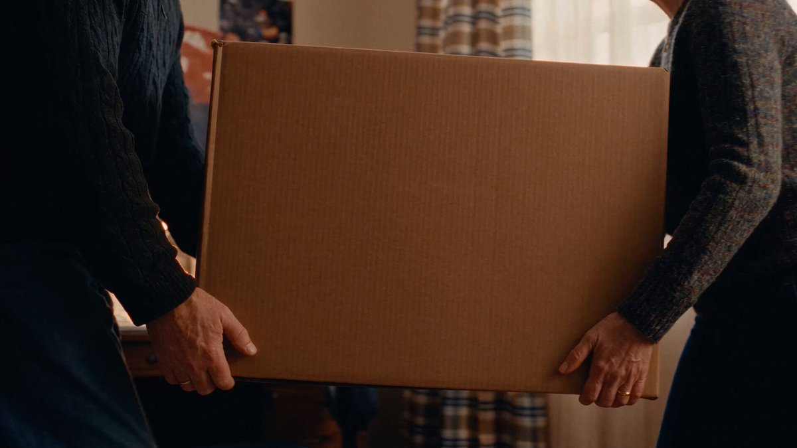

**Puan:** 78.68 &nbsp; **Etkileşim:** ❤ 1909 · 🔁 210 · 👁 625603

**Tam prompt:**

~~~text
Here's my 30-second spec ad for WinRAR (that nobody asked for). Okay, perhaps Rourke Heath did. He shared this fun brief with his GenHQ community last week, and I took it on. In this experimental project, I wanted to turn one of the internet's longest-running jokes into a subtle family drama about WinRAR's 40-day trial that somehow lasted almost three decades. Here's how I made it: After writing the script (the old school way), I worked with ChatGPT 5.6 Sol Max to turn it into a 14,000-character prompt for Seedance 2.5 (yes, Dreamina allows prompts that long). I used GPT Image 2 to create the reference image for WinRAR's trial screen, while Seed Audio 1.0 generated the audio reference for the full voiceover and dialogue. After 20+ Seedance 2.5 tests at 480p, with the prompt evolving throughout, I generated the final versions at 720p. I then lightly edited the video and upscaled it to 1080p with Topaz Labs Astra Starlight Precision 2.6. However, the screenshot text didn't survive the upscale (I should have used Astra's scene detection feature and selected a different model for that particular shot), so I recreated it using Seedance 2.0 at 1080p. (I also tried Hailuo H3 and Kling 3.0, but in this particular case, Seedance 2.0 gave me the best overall result in one go.) For the sound, I selected a solo-instrument soundtrack from Epidemic Sound and added extra sound effects to improve the overall sound design. And here's the result. I'm curious to hear what you think. Did this bring back memories, or is this genuinely your first time hearing about WinRAR? I’d love to know.
~~~

[Kaynak paylaşımı X'te aç ↗](https://x.com/buraktuyan/status/2092008235075084363)

---

## 2. @iamsofiaijaz

**Puan:** 62.16 &nbsp; **Etkileşim:** ❤ 83 · 🔁 8 · 👁 3216

**Tam prompt:**

~~~text
GPT image 2 on the Chatgpt ai Prompt 👇 A cinematic, ultra-realistic close-up portrait of a stylish man, using the provided image as an accurate face reference. Preserve his natural facial identity, thick naturally curly dark brown hair, neatly trimmed salt-and-pepper beard, strong masculine facial structure, and realistic facial proportions. He wears sophisticated round vintage amber-brown sunglasses and a premium deep burgundy suede jacket over a fitted black silk-knit shirt, creating a refined luxury fashion aesthetic. Warm cinematic studio lighting with a soft amber-golden key light illuminating the face from the front-left, complemented by a subtle crimson-red rim light outlining the hair and shoulders. The background is a rich burgundy, wine-red, and dark plum gradient, with soft atmospheric haze and subtle diffused light creating depth without distracting from the subject. Elegant warm highlights contrast beautifully against the dark clothing. Extremely detailed natural skin texture, individual beard hairs, realistic pores, subtle facial imperfections, sharp eyes visible behind slightly tinted lenses, natural reflections on the sunglasses, rich dimensional shadows, realistic fabric and suede texture, shallow depth of field. Sophisticated luxury fashion campaign, mysterious and confident mood, premium men's editorial photography, cinematic color grading, photorealistic, HDR, professional studio photography, 85mm portrait lens, f/1.8, crisp facial details, soft background bokeh, centered composition, head-and-shoulders framing, powerful masculine presence, understated elegance, 3:4 aspect ratio.
~~~

[Kaynak paylaşımı X'te aç ↗](https://x.com/iamsofiaijaz/status/2090294894187413883)

---

## 3. @iamsofiaijaz

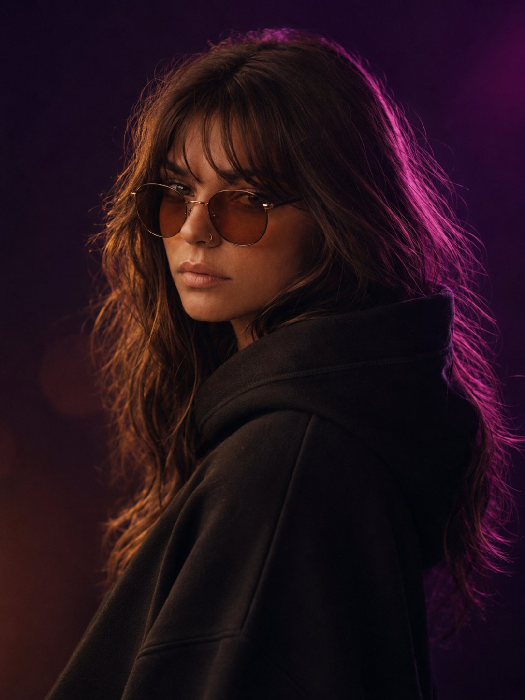

**Puan:** 61.51 &nbsp; **Etkileşim:** ❤ 68 · 🔁 9 · 👁 2069

**Tam prompt:**

~~~text
IMAGE with GPT image 2 on the Chatgpt ai Prompt 👇 A cinematic, ultra-realistic close-up portrait of a charming, elegant woman, using the provided image as a face reference. She has naturally voluminous, softly wavy dark brown hair, beautifully defined feminine facial features, expressive almond-shaped eyes, naturally full lips, and a graceful, confident presence. She is wearing stylish round vintage amber-brown sunglasses and a sophisticated black oversized hoodie with the hood resting naturally around her neck. Moody luxury studio lighting with a dramatic deep violet and magenta rim light illuminating the right side of her hair and face, contrasted by a soft warm champagne-golden light from the front. Highly detailed natural skin texture, realistic individual hair strands, subtle facial imperfections, delicate makeup, naturally defined eyebrows, realistic lips and eyes, rich dimensional shadows, soft highlights, shallow depth of field. Background features a luxurious gradient of deep plum, burgundy, and midnight purple with subtle cinematic haze and glowing bokeh, creating a glamorous and mysterious atmosphere. High-fashion editorial photography, sophisticated and alluring mood, effortless elegance, 85mm portrait lens, f/1.8, crisp facial details, cinematic color grading, photorealistic, high dynamic range, professional studio photography, centered composition, head-and-shoulders framing, natural proportions, 3:4 aspect ratio.
~~~

[Kaynak paylaşımı X'te aç ↗](https://x.com/iamsofiaijaz/status/2090999865333694488)

---

## 4. @john_my07

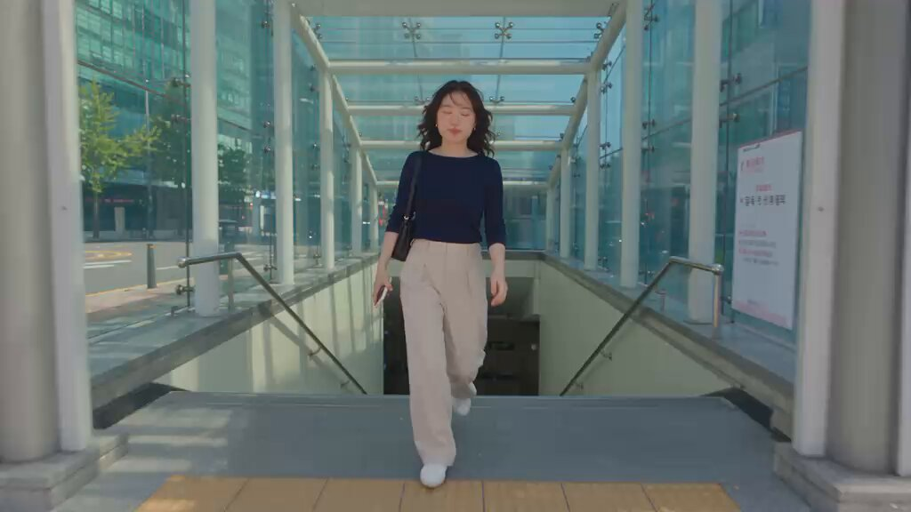

**Puan:** 60.17 &nbsp; **Etkileşim:** ❤ 70 · 🔁 3 · 👁 4048

**Tam prompt:**

~~~text
Seedance 2.5 on Pollo AI Prompt: Create a 30-second ultra-realistic live-action-style video featuring the same clearly adult Korean woman throughout. The concept, locations, actions, and visual language must be completely different from the previous residential home-video concept. MAIN SUBJECT: Young Korean woman in her early 20s, natural everyday appearance, warm and approachable personality. Black wavy hair with wispy bangs, naturally styled. She wears a fitted dark navy knit top, relaxed beige wide-leg trousers, white minimalist sneakers, and a small black shoulder bag. Minimal makeup, realistic skin texture, subtle facial asymmetry and natural imperfections. Maintain EXACTLY the same face, identity, body proportions, hairstyle, clothing, accessories, and appearance in every shot. CONCEPT: A spontaneous modern-day afternoon in Seoul — she is meeting a friend, navigating a busy contemporary neighborhood, grabbing a drink, and catching a brief sunset moment. It should feel like genuine footage captured casually by a friend on a modern smartphone, NOT a commercial, music video, fashion shoot, or AI-generated sequence. VISUAL STYLE: Extremely photorealistic modern smartphone footage. Natural 2026 smartphone-camera appearance with realistic computational photography, accurate skin tones, subtle HDR, natural dynamic range, realistic exposure, fine sensor detail, mild digital sharpening, authentic smartphone motion blur, and occasional autofocus adjustment. Use ordinary handheld smartphone recording with imperfect but believable framing. Slight hand movement and natural walking shake. Occasional tiny focus adjustments. Realistic rolling shutter during quick movement. No artificial cinematic camera moves, no impossible transitions, no excessive bokeh, no dramatic lighting, no film grain, no stylized color grading, no slow motion. ENVIRONMENT: Modern Seoul neighborhood with contemporary apartment buildings, glass storefronts, pedestrian crossings, buses, bicycles, small cafés, convenience stores, Korean signage, parked cars, people naturally going about their day, street trees, traffic lights, and realistic urban clutter. Everything should have believable scale, reflections, shadows, perspective, and physical interaction. 00:00–00:05 The video starts naturally with the phone already recording. She exits a modern subway station into bright afternoon sunlight. She squints slightly and adjusts her hair while checking her phone. The camera operator follows a few steps behind. A bus passes in the background, briefly changing the lighting and creating realistic motion blur. 00:05–00:10 She crosses a busy but ordinary pedestrian intersection. The camera remains at normal human height. She waits for the signal, glances at the approaching traffic, then notices her friend filming and gives a quick amused smile. A cyclist passes behind her without interacting with her. 00:10–00:15 They enter a small modern café. The camera follows through the doorway. She orders an iced drink at the counter, briefly points at something on the menu, pays with her phone, and steps aside. Reflections appear naturally on the glass door and counter. Background customers remain ordinary and slightly out of focus because of distance, not artificial blur. 00:15–00:20 Outside again. She takes the first sip while walking and immediately makes a subtle satisfied expression. She checks a message on her phone while walking, then nearly walks past her friend because she is distracted. She looks up, laughs quietly, and continues. 00:20–00:25 They arrive beside a modern riverside pedestrian path. She rests her drink on a railing and looks across the water. The camera moves naturally to her side. Wind gently moves her hair and clothing. Distant pedestrians, cyclists, bridges, buildings, and water remain physically consistent in the background. 00:25–00:30 The sun is beginning to set. She turns back toward the camera and says casually, “Wait, look at that.” She points toward the skyline. The camera instinctively turns away from her toward the sunset, briefly overexposing before the smartphone automatically corrects exposure. The final frame settles on the realistic skyline and water while her voice and footsteps remain audible. AUDIO: Authentic location audio only. No music and no cinematic sound effects. Include realistic Seoul street ambience, traffic, pedestrian crossing sounds, footsteps, distant conversations, subway-station ambience, café sounds, refrigerator/air-conditioning hum, cup and ice sounds, bicycle bells, wind, and distant city noise. Dialogue should sound naturally captured by a smartphone microphone, with realistic changes in volume depending on distance. STRICT REALISM / ANTI-AI REQUIREMENTS: Every human must have anatomically correct hands and exactly five fingers per hand. NEVER generate extra fingers, duplicated hands, fused fingers, missing limbs, duplicated people, distorted faces, malformed ears, warped teeth, floating objects, impossible reflections, or physically impossible body positions. Hands must interact correctly with phones, cups, doors, clothing, and other objects. If she holds the drink, only ONE believable hand should occupy each grip position. Her phone must remain a normal rectangular smartphone with consistent dimensions. Maintain strict object continuity: the same drink, phone, bag, clothing, accessories, and hairstyle must remain consistent throughout. Objects cannot spontaneously appear, disappear, duplicate, change color, or change shape. Human motion must obey real-world physics. Walking, sitting, turning, drinking, touching objects, hair movement, clothing movement, reflections, shadows, glass surfaces, water, traffic, and background pedestrians must behave naturally. Faces must remain stable and recognizable from frame to frame. No identity drift, facial morphing, plastic skin, beauty-filter effect, unnatural eye movement, frozen expressions, or AI-perfect symmetry. Do not make every background person look identical. Background pedestrians should have natural variation in clothing, body shape, movement, and appearance. Do NOT make the video look like an AI commercial. No perfect cinematic compositions. No excessive shallow depth of field. No impossible camera movement. No hyper-saturated colors. No glossy skin. No artificial lens flares. The final result should be indistinguishable from authentic footage recorded by a real person on a high-end modern smartphone during an ordinary day in Seoul.
~~~

[Kaynak paylaşımı X'te aç ↗](https://x.com/john_my07/status/2089368085199507671)

---

## 5. @Aykutuces

**Puan:** 60.03 &nbsp; **Etkileşim:** ❤ 57 · 🔁 4 · 👁 25418

**Tam prompt:**

~~~text
Bende geçende instagram da spunkram paylaşımında logo video promptu gördüm çok hoşuma gitti. Bu vesile ile onu paylaşıyım gemini de yarına kadar video üretme ücretsiz. Mutlaka deneyin. Video promptu: Use the uploaded image as the EXACT and ONLY reference for the logo. Do not redesign, simplify, recolor, or reinterpret it. Preserve its exact silhouette, proportions, aspect ratio, corner radii, internal shapes, negative space, color palette, gradients, and finish exactly as shown. If the logo contains text or a wordmark, reproduce the letterforms and spacing exactly. The final frame must match the uploaded reference pixel-for-pixel in shape and color. Create a 10-second premium logo reveal on a clean white background. The camera remains completely static throughout. No camera movement, no zoom, no rotation, no scene cuts. The logo stays centered in the frame at all times. 0–1.5s: The white background is empty. Tiny glowing particles begin appearing from the four edges of the frame. Their colors are sampled directly from the uploaded logo — use only colors present in the reference. If the logo is single-color or monochrome, use that color with soft neutral white highlights. The particles drift gracefully toward the center with smooth, intelligent motion, leaving subtle glowing trails. 1.5–3.0s: The particles accelerate and begin orbiting an invisible center. Their flowing trails gradually sketch the outer contour of the uploaded logo, following its true shape whatever that shape may be, including any inner cutouts or counters. The outline is made entirely of moving light, soft and elegant. 3.0–5.0s: The glowing outline becomes brighter and more defined. The logo's own colors flow inward from the edges, filling the interior naturally and reproducing the exact color placement, gradient direction, and blending of the reference. No invented colors, no added gradients where the reference is flat. 5.0–7.0s: The logo solidifies into a premium surface that matches the reference finish. Remaining particles are gently absorbed into the logo until none remain. A subtle bloom surrounds the logo before fading away. 7.0–8.5s: A soft shimmer of light sweeps diagonally across the surface of the logo, revealing its finish. The shimmer is elegant and understated and does not alter the logo's colors or edges. 8.5–10.0s: The logo remains perfectly still and centered. The glow fades completely, leaving only the clean logo on a pure white background, identical to the uploaded reference. Hold this final composition until the end. Visual Style: premium minimal motion graphics, brand-agnostic, Apple-style animation, clean white background, elegant easing, soft volumetric lighting, realistic light particles, subtle bloom, smooth transitions, ultra clean, photorealistic, 4K, HDR, 60fps. Negative Prompt: no camera movement, no zoom, no rotation, no spinning logo, no morphing, no distortion, no logo redesign, no simplification, no added or removed shapes, no changed proportions, no altered or invented colors, no altered/misspelled/added text, no explosions, no excessive glow, no lens flare, no smoke, no fire, no sparks, no floating objects after completion, no watermark, no additional graphics, no background elements.
~~~

[Kaynak paylaşımı X'te aç ↗](https://x.com/Aykutuces/status/2084359949862228031)

---

## 6. @sagar_0984

**Puan:** 59.32 &nbsp; **Etkileşim:** ❤ 59 · 🔁 29 · 👁 1126

**Tam prompt:**

~~~text
🚀 30+ FREE AI Prompt Websites Every Creator Should Bookmark A great prompt can completely transform your AI results. Whether you're using ChatGPT, Midjourney, Stable Diffusion, Flux, or other AI tools, these free resources will help you create better prompts, discover new ideas, and improve your workflow. 🔥 Top Free AI Prompt Libraries & Communities 1. PromptHero – Massive collection of AI prompts & images 2. Lexica – Search millions of Stable Diffusion prompts 3. OpenArt – Prompt library + AI art community 4. Civitai – Models, LoRAs & thousands of prompts 5. http://Tensor.Art – Free models, prompts & workflows 6. SeaArt AI – Community prompts & AI tools 7. Playground AI – Explore public prompts & creations 8. Krea AI – Inspiration gallery & creative ideas 9. http://Mage.Space – Prompt gallery & AI tools 10. NightCafe – Community creations with prompts 11. PicLumen – Free prompt examples & AI art 12. Freepik AI – AI image prompts & inspiration 13. PromptDen – Curated AI prompt library 14. Promptomania – Creative prompts for multiple AI models 15. FlowGPT – One of the largest ChatGPT prompt collections 16. Hugging Face Spaces – Free AI apps, demos & prompt tools 17. http://Maigen.ai – Prompt inspiration & AI utilities 18. http://ArtHub.ai – AI art prompts & community showcase 19. PromptFolder – Organized prompt collections 20. Easy-Peasy AI – Simple, effective prompt ideas 21. PromptPerfect – Prompt generator & optimizer 22. AIPRM – Extensive ChatGPT prompt library 23. Noonshot – AI prompts for business & productivity 24. WritingMate – Prompt library for writers & creators 25. MJ Prompt Tool – Midjourney prompt generator 26. Midlibrary – Midjourney styles & prompt database 27. PromptJourney – Curated Midjourney prompts 28. BlueWillow – Community prompt sharing 29. Reddit – Communities like r/Midjourney & r/StableDiffusion 30. Pinterest – Endless AI prompt inspiration 💡 Save this list—you'll never run out of prompt ideas again. Which AI prompt website do you use the most? Drop it in the comments 👇 ❤️ Like if this helped 🔁 Repost to help other creators 🔖 Bookmark for future reference Follow me.@sagar_0984
~~~

[Kaynak paylaşımı X'te aç ↗](https://x.com/sagar_0984/status/2082356806492606949)

---

## 7. @ridark_eth

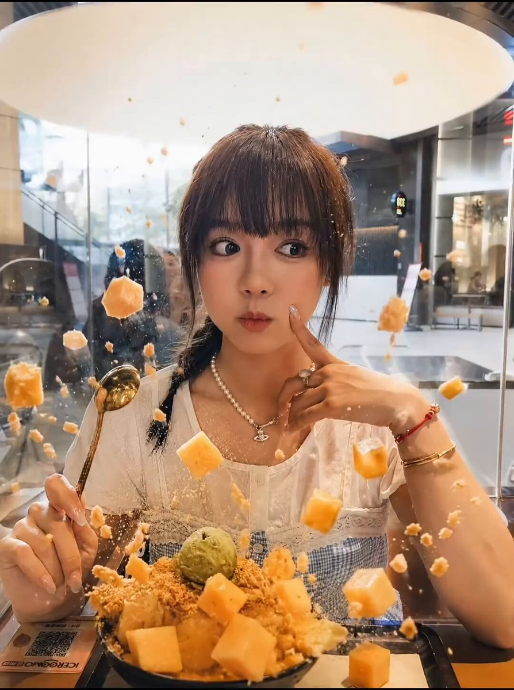

**Puan:** 57.16 &nbsp; **Etkileşim:** ❤ 91 · 🔁 3 · 👁 7989

**Tam prompt:**

~~~text
🚨 Traditional production studios charge $15,000 for a commercial video a 19-year-old spent $25 last month and made $4,800 > AI image prompt renders hyper-realistic food setup: 2 min > video generator adds dynamic 3D splashes and motion: 10 min > remix scenes by swapping products or models: 3 min > package into monthly content retainers for brands: ongoing cost: $25/month (Kling / Runway / Midjourney) 8 AI video packs sold to local cafes at $600 each their budget hires a film set. hers hires a prompt. one clip here. full breakdown & prompts in the article 👇
~~~

[Kaynak paylaşımı X'te aç ↗](https://x.com/ridark_eth/status/2087157546775613905)

---

## 8. @KeorUnreal

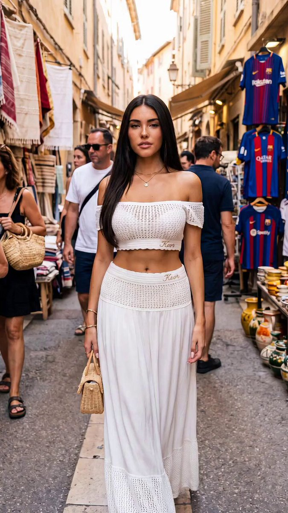

**Puan:** 54.91 &nbsp; **Etkileşim:** ❤ 37 · 🔁 0 · 👁 9241

**Tam prompt:**

~~~text
Let’s end the day with an action movie scene starring Madison Beer 🎬🔥 Good night folks!✨💫 Seedance 2.0 via Hailuo AI Prompt: Video Prompt: Cinematic 15-second continuous shot starting exactly from the uploaded photo: a striking woman with long straight dark hair, wearing a white off-shoulder open-knit crop top and matching high-waisted white skirt with delicate crochet details and “Keor” embroidery, holding a small woven straw bag in her right hand, walking confidently toward camera down a narrow sunlit European market street lined with hanging textiles, pottery stalls, clothing racks, and passersby.Action & Camera (high-octane stylish action-thriller style, tense, precise, kinetic):0–3s: Smooth tracking shot backward at walking pace, keeping her centered in a medium full-body frame as she advances through the crowd with calm focus. Soft natural sunlight filters between the buildings. Subtle handheld micro-shake adds realism. Background pedestrians move naturally.3–6s: Her eyes suddenly lock onto something off-screen to the right. She stops mid-stride, drops the bag, and pivots sharply. Two hostile figures push through the crowd toward her. Camera snaps into a quick lateral dolly left, then locks into a tight over-the-shoulder as she raises her guard.6–10s: She launches into a rapid, precise fight sequence — ducking a grab, delivering a sharp elbow, spinning to sweep a leg, then using a nearby pottery stall for cover as she throws a ceramic pot that shatters. Camera circles her at high speed in a continuous 360° orbit at chest height, intercut with brief whip-pans to capture impacts, with motion blur on limbs and flying debris. Dust and fabric scraps kick up in the sunlight.10–13s: She dispatches the second attacker with a controlled takedown, then sprints forward through the narrow street, weaving between startled shoppers. Camera switches to a low, aggressive tracking shot racing alongside her at knee height, then rises into a dynamic following shot as she vaults over a low market table.13–15s: She reaches a corner, glances back once, then disappears into a side alley as the camera slows into a final wide shot of the chaotic market street behind her — overturned stalls, scattered goods, and remaining figures recovering. Dust settles in the bright sunlight.Maintain ultra-realistic detail, high-contrast natural daylight with sharp shadows, subtle motion blur on fast action, photorealistic physics, intense kinetic energy, and continuous 15-second take with no cuts.
~~~

[Kaynak paylaşımı X'te aç ↗](https://x.com/KeorUnreal/status/2086191522387472680)

---

## 9. @DanKornas

**Puan:** 50.31 &nbsp; **Etkileşim:** ❤ 10 · 🔁 0 · 👁 2829

**Tam prompt:**

~~~text
Finding a usable AI image prompt for a specific content format can mean searching through scattered examples instead of starting from a relevant template. AI Image Prompts is an AI agent skill for Claude, OpenClaw, Cursor, and other assistants that searches a curated library of 10,000+ image-generation prompts and recommends matches for a use case. You describe the image you need or provide content to illustrate, then the skill searches matching templates, returns up to three recommendations with sample images, and can remix a selected prompt with your details. Key features: • Searches 10,000+ professionally categorized prompts rather than an unstructured prompt collection. • Returns up to three recommendations with a translated title and description, truncated prompt preview, sample image, and customization option. • Supports content illustration by analyzing an article's or script's theme, tone, and audience before matching visual styles. • Organizes prompts across 11 use-case categories, including social posts, product marketing, avatars, infographics, e-commerce images, and YouTube thumbnails. • Works with Nano Banana Pro, Nano Banana 2, Seedream 5.0, GPT Image 1.5, Midjourney, DALL-E 3, Flux, Stable Diffusion, and more. The project is MIT licensed, and its community-sourced prompts are free to use. Link in the reply 👇
~~~

[Kaynak paylaşımı X'te aç ↗](https://x.com/DanKornas/status/2087091894597689626)

---

## 10. @dustinharding

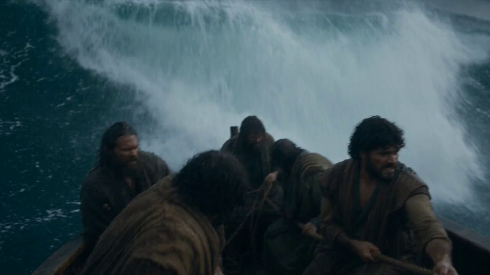

**Puan:** 49.18 &nbsp; **Etkileşim:** ❤ 104 · 🔁 6 · 👁 18607

**Tam prompt:**

~~~text
New experiment: Multiple times a week, I'll run one AI video prompt head-to-head — Grok vs. another model. No editing. No cherry-picking. One prompt, and I post whatever comes out. First up: Christ Calming the Storm Left = Seedance 2.5 Right = Grok See prompt below 👇
~~~

[Kaynak paylaşımı X'te aç ↗](https://x.com/dustinharding/status/2087668685146321351)

---

## 11. @AiwithLucas_

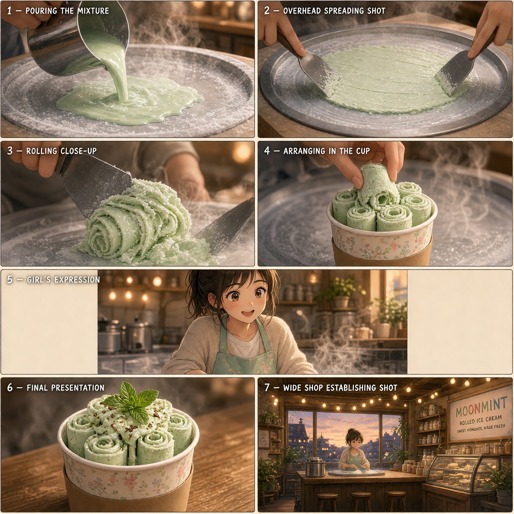

**Puan:** 48.04 &nbsp; **Etkileşim:** ❤ 70 · 🔁 14 · 👁 1148

**Tam prompt:**

~~~text
Full AI Prompt for This Anime Ice Cream Scene (+ Frames)" Here's the exact prompt + frame images (Grok 2.0) I used for this anime-style dessert shop scene 🍨 Copy it, tweak it, make it yours 👇 @Lart_AI http://lartai.com/?TG=17725 Try Prompt 👇 Clip (0:00–0:15) — Rolled Ice Cream Making Anime cinematic aesthetic, soft hand-painted background, warm nostalgic atmosphere. Close-up shot of a girl's hands in a cozy dessert shop, pouring pale mint-green ice cream mixture onto a frost-covered steel cold plate. Steam curls softly as the liquid instantly freezes, crystallizing at the edges. Cut to a smooth overhead tracking shot as she uses two metal spatulas to spread and chop the mixture into a thin even layer, motion fluid and rhythmic. Transition to a close-up as she skillfully rolls the frozen mixture into tight little cylinders, lining them upright in a small paper cup like a blooming flower. Soft warm shop lighting glows against the icy plate's cold mist, gentle steam rising and catching the light. Cut to a medium shot of the girl, cheerful expression, sliding the finished mint rolled ice cream cup toward the camera, fresh mint leaf and drizzle on top glistening. Highly detailed textures, cinematic depth of field, soft rim lighting, subtle film grain, delicate steam and frost shading, smooth camera motion, emotionally warm and inviting mood, Makoto Shinkai-inspired quiet charm.
~~~

[Kaynak paylaşımı X'te aç ↗](https://x.com/AiwithLucas_/status/2090792054465147374)

---

## 12. @camiinthisthang

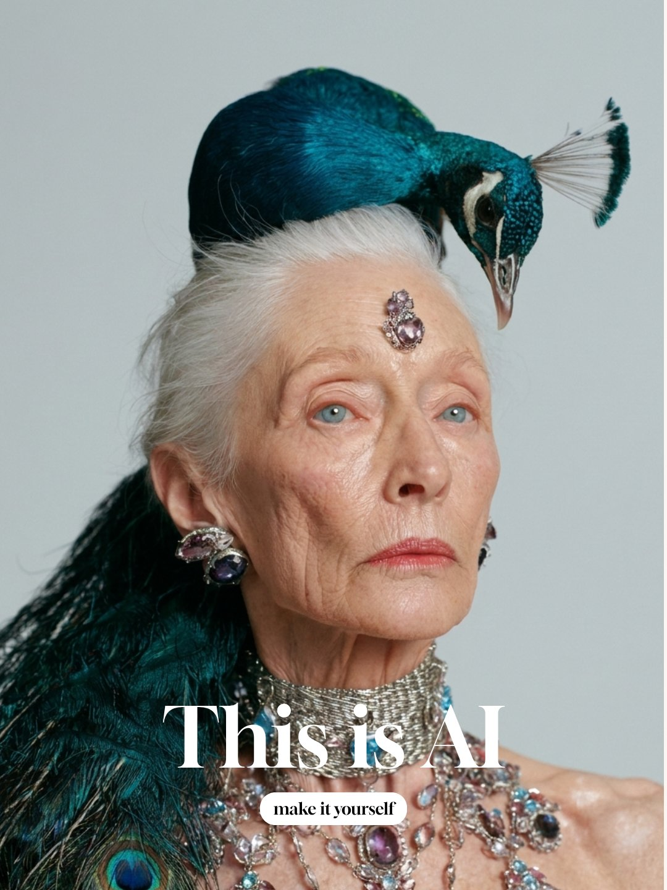

**Puan:** 47.25 &nbsp; **Etkileşim:** ❤ 9 · 🔁 1 · 👁 1313

**Tam prompt:**

~~~text
how to generate AI images and get different close up shots of the same character without losing consistency↓ 1 - generate your hero image on midjourney. I find that mj v8.2 has been the best model to work with for hyperrealistic portraits 2 - Use that hero image as a reference with nano banana 2 to get close up shots or new angles of the same shot. In addition to the reference image, prompt it with details of how the model looks. I find that combining a reference image + prompting descriptively helps keep it the most consistent. Here's the prompt for this one: ~Extreme macro close-up of the same woman from the reference image, keeping her exact identity, pale blue eyes, warm aged skin and silver hair. Tight crop on one eye and eyebrow, straight-on eye-level angle, serene expression. Hyperrealistic detail: pale blue iris with fine striations and a soft catchlight, natural sparse lashes, fine crepey eyelid texture, deep natural wrinkles and age spots, a soft silver brow. Soft even studio beauty light, pale gray background, 100mm macro, razor sharp, photorealistic, not airbrushed, no text.~ The gap between AI generated and real photography is closing a lot faster than most people think. A couple months ago even I thought models still weren't good enough to look human realistic, but now you have such fine control to get things like pores distributed naturally across the skin, individual eyebrow hairs and eyelashes. Natural skin creepiness and peach fuzz along the skin. Take these images and use them as references in videos for strong consistency even in complex shots
~~~

[Kaynak paylaşımı X'te aç ↗](https://x.com/camiinthisthang/status/2091950064491241584)

---

## 13. @GlitterPixely

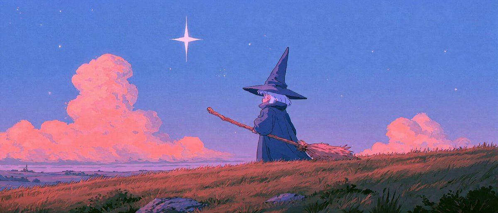

**Puan:** 46.90 &nbsp; **Etkileşim:** ❤ 77 · 🔁 6 · 👁 3456

**Tam prompt:**

~~~text
I tried a boring image just to test and it came out cute, short prompts are fun. I wonder if something a bit longer could be accomplished this way 🤔 Midjourney --profile rzcy617 Prompt: The witch rises onto her flying broom and dances as it glides through the pink clouds. She spins, balances on one foot, and performs a playful flip before landing back on the broom. Fast-paced magical flight. 14 different camera angles.
~~~

[Kaynak paylaşımı X'te aç ↗](https://x.com/GlitterPixely/status/2082305994290249991)

---

## 14. @sebatheepan

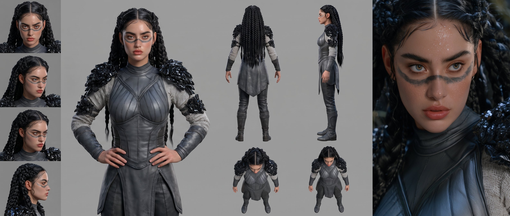

**Puan:** 46.70 &nbsp; **Etkileşim:** ❤ 5 · 🔁 0 · 👁 803

**Tam prompt:**

~~~text
Midjourney image prompt Cinematic portrait of a 21-year-old Indigenous Mesoamerican female warrior, intricate braided black hair, subtle dark obsidian war paint across nose bridge, alert warrior stance. Wearing a dark-gray fitted leather tunic with carved obsidian shoulder plates over a light woven linen top. Photorealistic bronzed skin, fine beads of sweat. Ancient Aztec sun-temple background draped in jungle vines with golden morning sunbeams piercing jungle mist, epic mythic realism. seedance 25 prompt ---------------------- Reference binding: strictly lock the woman's face, age, braided black hair, worn dark-gray leather warrior tunic with obsidian shoulder plates, light woven inner linen top, body proportions, and photorealistic skin texture to Image 1. She remains the same character in the same outfit throughout. Use a mythic Aztec Sun-Temple complex deep in a primal jungle for the worldbuilding: its stepped limestone pyramid architecture, humid rainforest atmosphere, overgrown stone aqueducts, ancient counterweight traps, jade-and-gold color palette, and piercing golden sunrise canopy light. Do not replicate the reference image's exact composition or setting. A 30-second single take with no edits or jump cuts. The woman is fleeing temple zealots, traveling from a sun-altar tomb chamber through a vertical jungle-pyramid city before soaring up to the apex of the Grand Sun Pyramid. The camera flies tightly around her like a high-speed FPV drone, continuously shifting between close pursuit, dives, ground-skimming passes, circling, barrel rolls, and dramatic upward pulls. Every location transition is naturally motivated by foreground occlusion from carved stone doorways, hanging vines, waterfall spray, tribal banners, jungle foliage, wooden scaffolding, and floating pollen dust. 00:00-00:04 | Sun-Altar Tomb Chamber Begin in close-up on the woman's soot-stained hands lifting a gold-and-jade sun disk from an altar. Golden dust particles swirl across the lens as she turns alertly toward the corridor. The camera races alongside her face as she glances back, steps onto a carved serpent pedestal, crouches, and leaps through a narrow stone wall opening. The camera follows through the opening as hanging woven vine curtains sweep across the lens, creating the first foreground wipe. 00:04-00:08 | Aqueduct Canyon Precipice As the camera bursts from the wall, it suddenly opens into a breathtaking wide shot: a colossal jungle city built around massive step-pyramids, with high stone aqueducts, wooden rope-bridges, cascading waterfalls, and sprawling tree-canopy dwellings stretching into the misty horizon. The woman lands on a narrow stone aqueduct wall and sprints forward. She wall-runs along a mossy carved stone facade into a long leap across a deep waterfall gorge between two pyramid terraces. The camera first dives close to her feet, then rises rapidly from the chasm to her side. 00:08-00:12 | Jungle Terrace Canopy Market The woman drops from above into a bustling open-air canopy market suspended on wooden platforms. The camera follows her downward trajectory, rolling half a turn, skimming low past wooden fruit stalls, clay urns, and beneath bamboo platform supports, then tilting up to track her. She vaults a wooden cocoa cart one-handed, side-flips over stacked pottery jars, lands in a low slide beneath a heavy wooden beam, then spins to sweep aside a hanging mat frame blocking her path. Market vendors, parrot feathers, fluttering cotton banners, and rolling terracotta vessels continuously cross the foreground. 00:12-00:16 | Waterfall Cavern Alleyway A full sheet of yellow-dyed woven cotton fabric covers the lens. The camera pushes through the cloth into a narrow damp stone alleyway flanked by waterfalls. The woman alternates between opposing carved stone walls with explosive wall-kicks, rapidly gaining height. She grabs a thick jungle vine hanging from above, swings over a pool of churning river water, rotates midair, and lands on a moving wooden logging sled. The camera snakes between hanging orchid vines in FPV motion, briefly barrel-rolling as vine leaves, mist, and water droplets spray past the lens. 00:16-00:20 | Mechanical Stone Counterweight Shaft The wooden sled rushes into a semi-underground stone mechanical chamber. Using the sled's momentum, the woman jumps forward, tucks into a tight flip, and kicks off the rim of a massive rotating stone sun-wheel gear. She uses hand plants on wooden beam supports, side flips, and low slides to duck under heavy stone counterweights dropping across her path. The camera passes through the central hub of a hollow stone gear wheel beside her shoulder, then shoots downward alongside a rushing aqueduct stream, skimming inches above the water beneath a low arch. Water splashes onto the lens without obscuring the subject. 00:20-00:24 | Great Banyan Hollow Shaft The woman runs up an angled stone conduit, takes three consecutive wall steps, and vaults into the hollow interior of a giant ancient banyan tree growing through a pyramid. The camera rises vertically from the water below, spiraling around her inside the hollow trunk. She catches the thick root structure of a swinging vine harness, lifted upward by rising thermal winds inside the tree. In midair, she performs a controlled spin and hand-switch, swinging toward an upper canopy window exit. Roots, wood splinters, and golden pollen streak rapidly through the foreground. 00:24-00:27 | Collapsing Sun-Bridge Ruin The camera and the woman burst out of the tree onto a crumbling stone sun-bridge high above the forest canopy. The bridge span is fracturing. She sprints across falling stone tiles and jumps just before the final stone drops into the jungle below. Two jaguar-masked pursuers emerge behind her on the bridge, remaining distant and never pulling focus from the woman. She performs a long qinggong leap over the emerald canopy drop, her tunic straps flying in the wind. The camera flies backward underneath her, arcs around her front, and continues flipping upward. 00:27-00:30 | Grand Sun Pyramid Apex As she approaches the main pyramid peak, she steps onto a long feathered banner flapping in the wind, using its lift to leap higher onto the golden summit platform. She lands on one knee, hand brushing the carved sun symbol on the floor before rising swiftly into a posture of triumph. The camera surges over her shoulder, pulls violently backward, and rises high into the sky, revealing the entire ancient pyramid city, endless green rainforest mist, winding rivers, and the golden sun rising dramatically over the jungle horizon. Camera movement: The entire shot follows one continuous, traceable spatial route. The camera maintains the high velocity, flow, and spatial rhythm of an FPV drone while remaining centered on the woman. Include at least one ground-skimming pass, one dive followed by a rapid climb, one narrow-space serpentine flight, one spiral ascent, and one large aerial pullback. Use environmental motion blur in high-speed moments while keeping her face and body actions sharp. The camera never teleports; every change in speed and direction is motivated by her acrobatics and temple architecture. Action performance: The woman is agile, fierce, and masterfully skilled in ancient martial parkour. Qinggong is expressed through grounded force, explosive spring-steps, momentum preservation, and clear physical effort rather than weightless levitation. Her actions include wall-running, vaulting, side flips, low slides, vine swings, gear kicks, and long leaps. Every movement connects seamlessly, showing clear landing impact, body weight transfer, and clothing dynamics. She is focused, breathing hard, hyper-aware of her route, and never looking into the camera lens. Environment and foreground transitions: Stone altars, vine curtains, waterfall spray, pottery jars, yellow cotton fabric, jungle vines, stone gears, dropping counterweights, aqueduct water, banyan roots, golden pollen, feathered banners, and canopy leaves enter the extreme foreground in sequence. Foreground elements may briefly obscure the frame, but the woman must quickly re-emerge. The pyramid structures and jungle spaces connect logically into one continuous ecosystem. Visual style: Photorealistic mythic ancient Mesoamerican fantasy, blending massive stone pyramid engineering with lush untamed jungle nature. Main colors: limestone yellow, jade green, weathered moss gray, deep obsidian, and warm sun gold, with the woman's dark tunic contrasting against golden sunrise light. Humid mist haze, sunbeams piercing tree canopy, realistic stone and fabric textures, high-contrast cinematic photography. The mood is ancient, energetic, and awe-inspiring.
~~~

[Kaynak paylaşımı X'te aç ↗](https://x.com/sebatheepan/status/2087533402815627593)

---

## 15. @Ronycoder

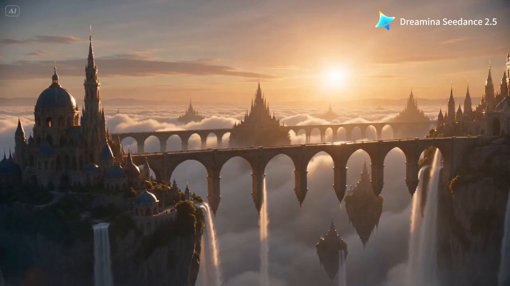

**Puan:** 46.10 &nbsp; **Etkileşim:** ❤ 42 · 🔁 17 · 👁 35833

**Tam prompt:**

~~~text
A good AI video prompt should not feel like a wish. It should feel like a shot list. What happens in the opening second? When does the camera move? Which detail changes halfway through? How should the scene end? That level of control is now entering a new phase. Dreamina has unveiled the world-first global launch of Dreamina Seedance 2.5, with early access live on Dreamina and US availability expected roughly one week later. With up to 50 multimodal references, 30-second single-generation video, and the lowest-cost access to the full Seedance family, Dreamina is the most cost-effective place to turn a rough idea into a directed, usable shot.
~~~

[Kaynak paylaşımı X'te aç ↗](https://x.com/Ronycoder/status/2083239872203239509)

---

## 16. @nrqa__

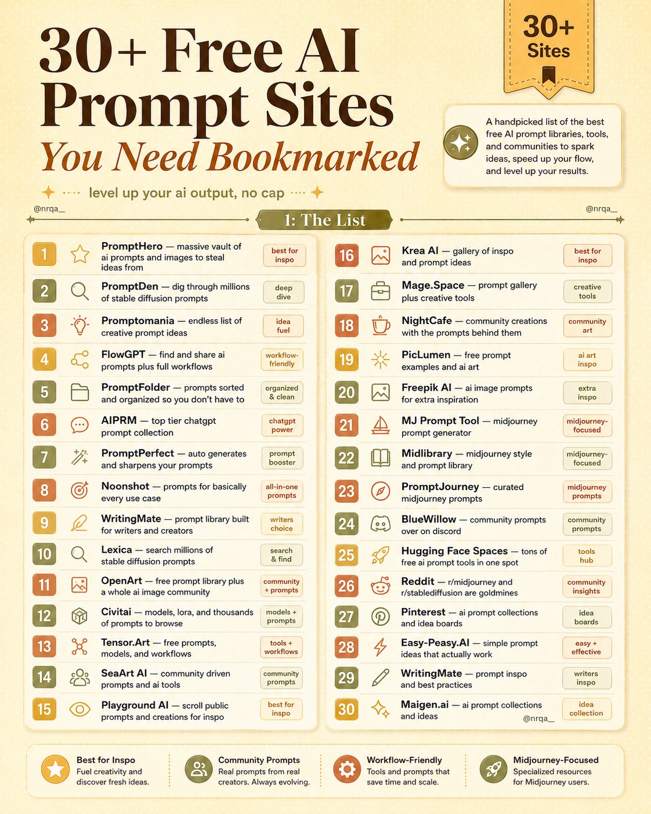

**Puan:** 43.27 &nbsp; **Etkileşim:** ❤ 17 · 🔁 0 · 👁 7813

**Tam prompt:**

~~~text
30+ ai prompt sites i finally put in one list, so you stop losing bookmarks in random tabs.. if you like scouting prompts before you create anything, here's where to look 1). for finding ideas & prompt references ↳ prompthero - a massive vault of prompts and images to steal from ↳ promptden - dig through millions of stable diffusion prompts ↳ promptomania - an endless list of creative prompt ideas ↳ flowgpt - find and share prompts plus full workflows ↳ promptfolder - prompts sorted so you don't have to ↳ aiprm - a top tier chatgpt prompt collection ↳ promptperfect - auto generates and sharpens your prompts ↳ noonshot - prompts for basically every use case ↳ writingmate - a prompt library built for writers and creators 2). for ai image, stable diffusion, and midjourney ↳ lexica - search millions of stable diffusion prompts ↳ openart - a free prompt library plus a whole ai image community ↳ civitai - models, lora, and thousands of prompts to browse ↳ http://tensor.art - free prompts, models, and workflows ↳ seaart ai - community driven prompts and ai tools ↳ playground ai - scroll public prompts and creations for inspo ↳ krea ai - a gallery of inspo and prompt ideas ↳ http://mage.space - a prompt gallery plus creative tools ↳ nightcafe - community creations with the prompts behind them ↳ piclumen - free prompt examples and ai art ↳ freepik ai - ai image prompts for extra inspiration 3). midjourney specific ↳ mj prompt tool - a midjourney prompt generator ↳ midlibrary - a midjourney style and prompt library ↳ promptjourney - curated midjourney prompts ↳ bluewillow - community prompts over on discord 4). extra sources worth checking too ↳ hugging face spaces - tons of free ai prompt tools in one spot ↳ reddit - r/midjourney and r/stablediffusion are goldmines ↳ pinterest - ai prompt collections and idea boards ↳ http://easy-peasy.ai - simple prompt ideas that actually work ↳ http://maigen.ai - ai prompt collections and ideas bookmark all of it, open it the next time you're stuck
~~~

[Kaynak paylaşımı X'te aç ↗](https://x.com/nrqa__/status/2083202563999256669)

---

## 17. @ContentStudioio

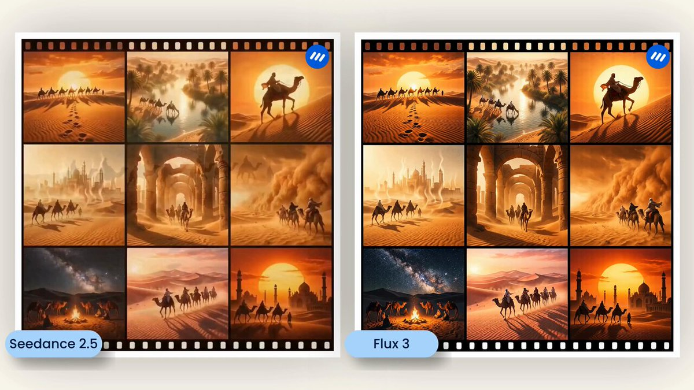

**Puan:** 38.30 &nbsp; **Etkileşim:** ❤ 6 · 🔁 0 · 👁 1091

**Tam prompt:**

~~~text
Seedance 2.5 vs Flux 3, same prompt, side by side. The prompt: "A 20 second desert caravan journey, glowing sun, rolling dunes, a mirage resolving into a golden city." Same prompt bar, two very different looks. Both live in ContentStudio. Which would you run? #AIVideo #Seedance25 #Flux3
~~~

[Kaynak paylaşımı X'te aç ↗](https://x.com/ContentStudioio/status/2086875426824028304)

---

## 18. @Voxyz_ai

**Puan:** 37.03 &nbsp; **Etkileşim:** ❤ 12 · 🔁 0 · 👁 2838

**Tam prompt:**

~~~text
Add a free `/generate` Skill to Claude Code and you can switch your AI video workflow from a monthly subscription to pay as you go. Give it a video prompt and it will: → choose a model for the task → generate a cheap still first → check the composition, text, POV and aspect ratio → quote the cost in credits and dollars → wait for approval before generating the video → check the MP4 dimensions and inspect sample frames → save the files and keep a spending log Based on the actual run in the article, a finished 10-second 1080p clip costs about $0.75. Generate nothing that month and the cost is $0. Once a clip passes the checks, Blotato can schedule it across TikTok, Instagram, YouTube, Facebook, Threads, Bluesky, Pinterest and X. Skill, model configs and full setup 👇
~~~

[Kaynak paylaşımı X'te aç ↗](https://x.com/Voxyz_ai/status/2089764034082111974)

---

_Kaynak içerikler ilgili yazarlara aittir; özgün bağlantılar korunmuştur._
