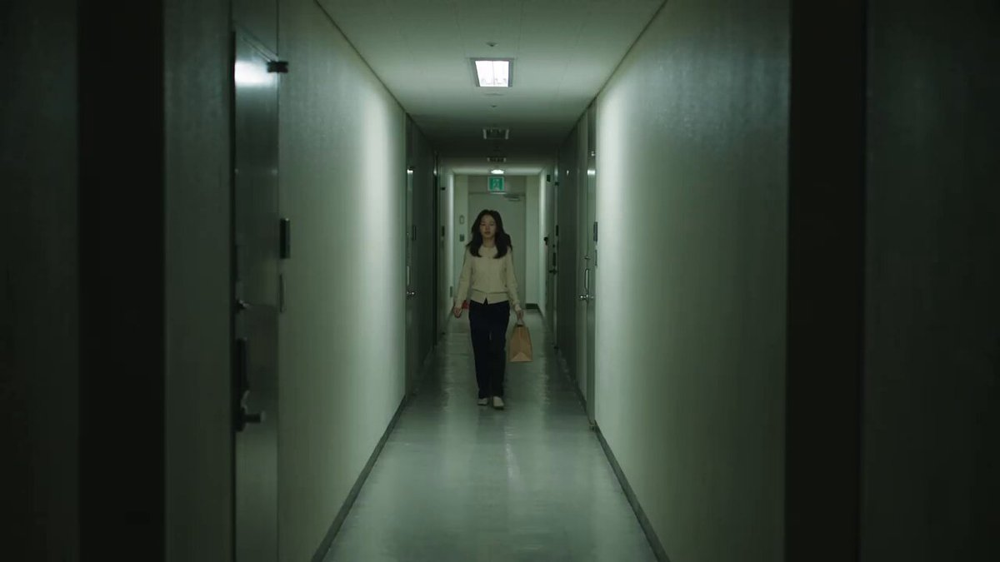
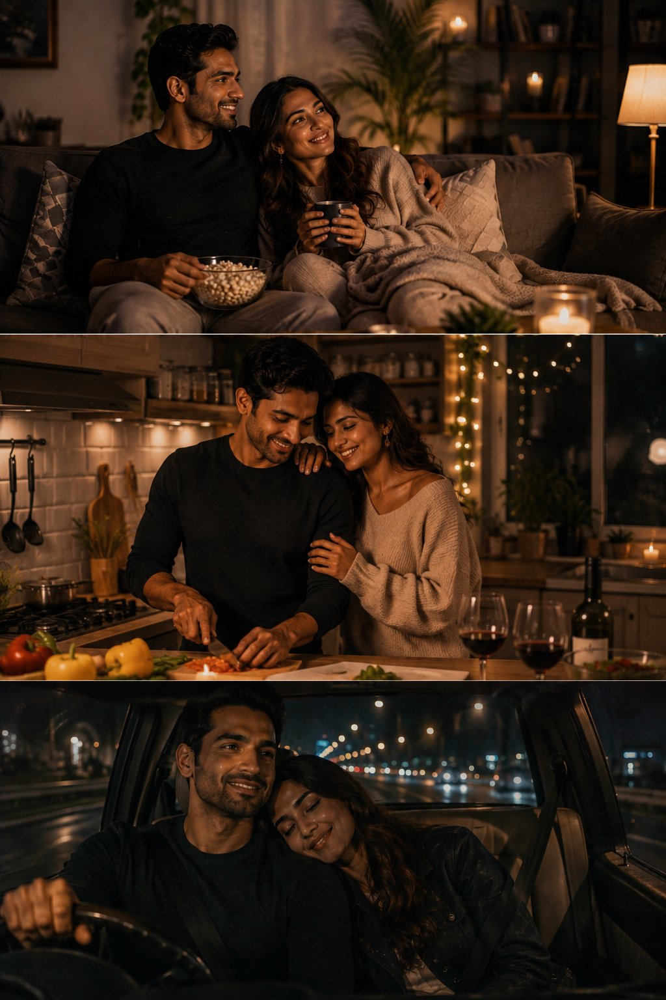
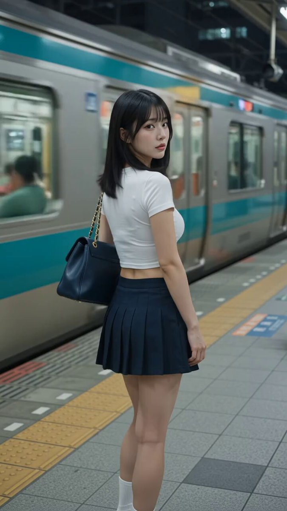
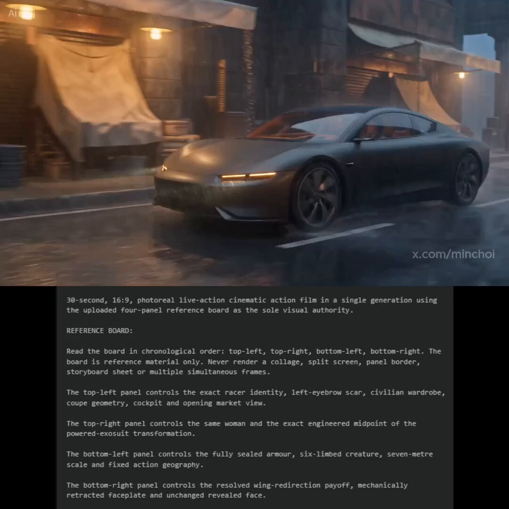
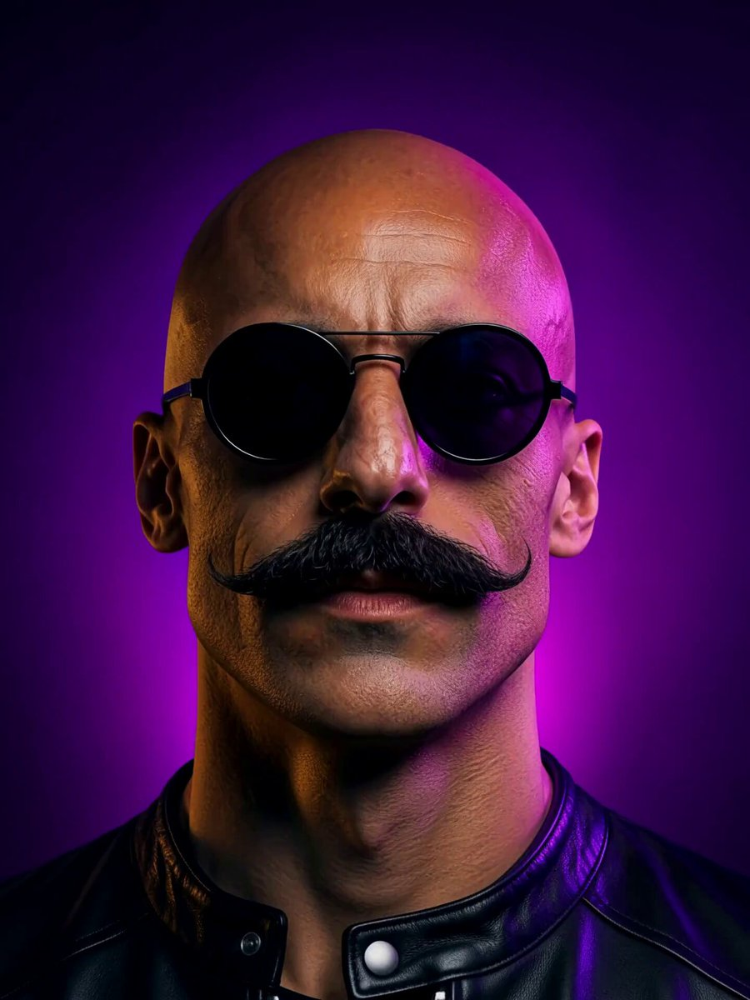

# AI Prompt Radar — 2026-08-29

Bugün bulunan yeni prompt sayısı: **9**

## 1. @john_my07

**Puan:** 59.93 &nbsp; **Etkileşim:** ❤ 61 · 🔁 2 · 👁 9205

**Tam prompt:**

~~~text
Horror nights with Seedance 2.5 at 1080p on Higgsfield AI Prompt: Create a 30-second ultra-realistic cinematic Korean apartment horror short in 16:9 widescreen, specifically designed to grab attention within the first few seconds and maintain escalating tension until the final frame. CORE CONCEPT: A young woman returns home late at night and notices that the automatic hallway lights are switching off one by one behind her. At first she thinks it is a faulty lighting system. Then she realizes something is using the darkness to get closer. SEQUENCE 0–1.5s Immediate hook: Wide cinematic shot of a quiet Korean apartment corridor late at night. A young Korean woman walks toward her apartment carrying a small grocery bag. The fluorescent light directly behind her suddenly switches off. She stops and looks back. 1.5–3s — First anomaly: She continues walking. Another ceiling light farther behind her flickers twice and turns off. For a single instant, a tall human-like silhouette is visible underneath the next remaining light. It does not move. 3–4.5s — Impossible movement: She cautiously looks back again. The corridor appears empty. She takes one step backward. Another light shuts off. When the light goes dark, the silhouette is suddenly several meters closer when the next light comes on. 4.5–6s — Fear reaction: Close-up of her face as she realizes something is wrong. Her breathing becomes tense. She slowly raises her phone and activates the flashlight. 6–7.5s — Empty corridor: Her flashlight sweeps across the hallway. Nothing is there. The camera follows the beam naturally. She starts to relax—then notices a single wet footprint directly in front of her. 7.5–9s — Invisible approach: More wet footprints slowly appear on the floor one after another, moving toward her from the darkness. No creature is visible. She freezes. 9–10.5s — Escape: She suddenly runs toward her apartment. Controlled handheld camera follows behind her. Corridor lights extinguish sequentially in her direction, creating the impression that darkness is chasing her. 10.5–12s — Door struggle: She reaches her apartment, hurriedly searches for her keys and unlocks the door. Her hands tremble naturally. She enters and immediately turns around. 12–13.5s — False safety: She looks down the hallway. It is completely empty. She slowly closes and locks her apartment door. 13.5–15s — Something is inside: The apartment is quiet. She takes several steps away from the door. The hallway light inside her apartment flickers. In the glass of a nearby cabinet, a dark human silhouette can be seen standing behind her. 15–17s — Reflection horror: She notices the reflection and slowly turns around. Nothing is there. She looks back at the glass. The silhouette is now much closer to her reflection. 17–19s — Reality breaks: She spins around again. The apartment remains empty. Her phone suddenly begins ringing. 19–21s — Unsettling call: Extreme close-up of the phone screen. The incoming call appears to be coming from her own phone number. She hesitates before answering. 21–23s — Sound reveal: She answers. No voice comes through. Instead, she hears the unmistakable sound of footsteps coming from her apartment hallway—matching the exact rhythm of the footsteps she made earlier. 23–25s — Final reveal begins: Her front door slowly opens by itself. Beyond it is the dark apartment corridor. At the far end stands a figure that looks almost identical to her, facing away from the camera. 25–27s — Unnatural turn: The woman remains frozen inside her apartment. The distant figure slowly rotates its head toward the camera while its body remains completely motionless. The movement is subtly unnatural and unsettling, but no gore or extreme deformation. 27–28.5s — Darkness: Every light in the corridor suddenly switches off simultaneously. Complete darkness for a brief moment. Hold the silence. 28.5–30s — Replay-worthy ending: The lights suddenly return. The corridor is empty. The woman is no longer visible. The camera remains inside the apartment, staring toward the open doorway. After a brief pause, the door slowly closes by itself. CUT TO BLACK immediately. VISUAL STYLE Ultra-realistic Korean apartment complex at night, authentic modern residential architecture, narrow corridor, realistic fluorescent lighting, subtle reflections, natural skin texture, believable clothing and hair movement, realistic phone illumination, cinematic shadows, atmospheric darkness, restrained psychological horror, sophisticated body-horror influence without gore, realistic environmental physics, cinematic film grain, natural motion blur, high dynamic range, premium horror-film cinematography. CAMERA & COMPOSITION 16:9 widescreen cinematic composition. Use the wide frame intentionally: leave negative space in corridors so subtle silhouettes and background movement can be noticed by viewers. Combine wide establishing shots, controlled handheld tracking shots, medium shots and occasional close-ups. Keep camera movement tense but controlled and physically believable. Avoid excessive shaking, random zooms, unnecessary cuts, or disorienting camera movement. Maintain clear geography of the apartment and hallway throughout the entire video. CONTINUITY & QUALITY CONTROL Maintain the exact same woman, face, hairstyle, clothing, grocery bag, phone, apartment door, corridor architecture and lighting environment throughout every shot. Ensure: - Consistent facial identity - Correct human anatomy and proportions - Natural hands and fingers - Realistic walking and running physics - Realistic reflections - Correct shadows and lighting direction - Consistent object placement - No duplicated characters - No disappearing or changing clothing - No warped faces - No extra limbs or fingers - No floating objects - No changing apartment architecture - No inconsistent doors or hallways - No random camera transitions - No accidental text or subtitles - No gore - No blood - No cartoonish monster design The horror should come primarily from anticipation, darkness, reflections, impossible positioning and subtle movement, keeping the entity mysterious rather than showing it constantly. SOCIAL-MEDIA RETENTION Make the first 1–2 seconds visually intriguing, introduce a new unsettling event approximately every 1–2 seconds, and progressively increase the tension. Avoid slow filler shots. The final reveal should be subtle enough that viewers may want to rewatch the video to find the exact moment the entity appeared, making the ending highly suitable for social-media sharing. OUTPUT: 16:9 widescreen, 30 seconds, photorealistic cinematic horror, premium film quality, coherent continuous story, polished professional cinematography, realistic motion, no text, no subtitles, no watermark.
~~~

[Kaynak paylaşımı X'te aç ↗](https://x.com/john_my07/status/2090462626547707960)

---

## 2. @KaminiKamini222

**Puan:** 54.02 &nbsp; **Etkileşim:** ❤ 30 · 🔁 7 · 👁 912

**Tam prompt:**

~~~text
This is real life thinking transformed by AI Prompt Create a three-panel vertical cinematic lifestyle image featuring the same young Indian couple throughout all three scenes. Keep their facial features, hairstyle, body proportions, and overall appearance consistent. Panel 1 — Cozy Movie Night: The couple relaxing together on a comfortable sofa at home after their weekend outing. The man holds a bowl of popcorn while the woman holds a warm mug, sitting close together under a soft blanket. Warm table lamps, candles, plants, elegant modern Indian home interior, intimate smiles, relaxed expressions, cozy evening atmosphere. Panel 2 — Cooking Together: The same couple preparing a late-night meal together in a stylish modern kitchen. The man is chopping vegetables while the woman stands close beside him, gently touching his arm and smiling. Warm under-cabinet lighting, small decorative lights, natural kitchen details, ingredients on the counter, romantic but completely natural couple interaction. Panel 3 — Late-Night Drive: The same couple driving home through a beautiful modern city at night. The man is driving while the woman comfortably rests her head on his shoulder, both looking peaceful and happy. Wet road reflections, glowing streetlights, colorful city bokeh outside the windows, cinematic night atmosphere. Visual style: ultra-realistic photography, premium Indian lifestyle advertisement, cinematic lighting, warm amber and deep blue tones, realistic Indian skin texture, natural facial expressions, sophisticated casual clothing, shallow depth of field, realistic reflections, subtle film grain, atmospheric bokeh, emotionally warm and intimate but tasteful. Composition: exactly three equal horizontal panels stacked vertically, forming one tall portrait image. No text, no captions, no logos, no side writing, no watermark. The couple should remain the visual focus in every panel.
~~~

[Kaynak paylaşımı X'te aç ↗](https://x.com/KaminiKamini222/status/2088622526444572745)

---

## 3. @heyfatema

**Puan:** 48.85 &nbsp; **Etkileşim:** ❤ 4 · 🔁 1 · 👁 1873

**Tam prompt:**

~~~text
Cinematic AI Video Prompt (16:9) – Pizza Making & Selling Story Style: Ultra-realistic, cinematic, commercial food ad, warm lighting, vibrant colors, shallow depth of field, smooth camera movement, 4K, HDR, highly detailed, energetic, realistic human expressions, professional restaurant kitchen, fast-paced editing. Scene 1 – Fresh Start (0–5s) A young entrepreneur unlocks a small pizza shop early in the morning. Sunlight shines through the windows as they turn on the lights and smile with excitement. Camera: Wide establishing shot → slow push-in → close-up on smiling face. Scene 2 – Preparing Ingredients (5–10s) Fresh pizza dough, mozzarella cheese, tomatoes, basil, mushrooms, pepperoni, onions, and colorful vegetables are arranged neatly on a wooden table. Hands wash vegetables and prepare ingredients. Camera: Macro close-ups, overhead shots, smooth slider movement. Scene 3 – Making the Dough (10–15s) Chef kneads soft dough, stretches it into a perfect pizza base, flour flying dramatically in slow motion. Camera: Slow-motion close-up, rotating cinematic shot. Scene 4 – Adding Toppings (15–22s) Tomato sauce spreads evenly across the dough. Cheese rains down in slow motion. Fresh toppings are carefully placed with artistic precision. Camera: Overhead top-down shot, macro close-ups, cinematic transitions. Scene 5 – Baking (22–28s) Pizza slides into a blazing stone oven. Flames glow behind it as cheese melts and crust turns golden brown. Camera: Inside-the-oven perspective, close-up of bubbling cheese, dramatic fire lighting. Scene 6 – Fresh Out of the Oven (28–34s) Chef removes the pizza with a wooden peel. Steam rises. Cheese stretches beautifully as the first slice is lifted. Camera: Slow-motion hero shot, extreme close-up. Scene 7 – Packaging (34–40s) Pizza is placed into a branded pizza box. Staff seals the box with a logo sticker and hands it to a smiling delivery rider. Camera: Close-up on packaging → tracking shot following the delivery rider. Scene 8 – Fast Delivery (40–48s) Delivery rider rides through busy city streets. Quick cuts of traffic, neighborhoods, and smiling people waiting for food. Camera: Drone shot, tracking shots, dynamic motion blur. Scene 9 – Happy Customer (48–56s) Family opens the pizza box at home. Steam rises. Everyone smiles, laughs, and enjoys the first bite together. Camera: Warm close-ups, slow-motion cheese pull, joyful reactions. Scene 10 – Business Success (56–60s) Pizza shop becomes busy with customers. Staff serves fresh pizzas while a line forms outside. Final shot of the storefront with glowing signage. Camera: Wide cinematic shot → slow aerial pull-back. Ending Text: "Fresh Ingredients. Perfect Pizza. Happy Customers." "Order Today!"
~~~

[Kaynak paylaşımı X'te aç ↗](https://x.com/heyfatema/status/2093288724880847275)

---

## 4. @meAsifAi

**Puan:** 44.44 &nbsp; **Etkileşim:** ❤ 43 · 🔁 5 · 👁 2090

**Tam prompt:**

~~~text
Created with @flowbygoogle Video Prompt : A young East Asian woman with straight, shoulder-length black hair and soft bangs, standing on a nighttime train platform and looking back over her left shoulder toward the camera with a calm, slightly pouty expression. She has fair skin, defined eyes with subtle makeup, and her right hand is raised near her lips, fingers lightly touching her chin. She wears a tight white short-sleeve crop top that exposes her midriff and lower back, paired with a short dark navy blue pleated mini skirt. A large structured navy blue leather handbag with a gold chain strap hangs from her left shoulder. She wears white ankle socks. The background shows a teal and cream-colored commuter train in motion with motion blur on the windows, warm orange interior lights glowing through the glass. The platform has tiled flooring with yellow safety tactile paving, a metal railing, and a yellow rectangular sign with black text. Cinematic night lighting with cool teal tones on the train contrasting against warm orange highlights on her skin and the platform, shallow depth of field, realistic photography style, high detail, 8k.
~~~

[Kaynak paylaşımı X'te aç ↗](https://x.com/meAsifAi/status/2092572000879534170)

---

## 5. @minchoi

**Puan:** 40.79 &nbsp; **Etkileşim:** ❤ 10 · 🔁 1 · 👁 3871

**Tam prompt:**

~~~text
10. Generate from a multi-panel storyboard PROMPT: 30-second, 16:9, photoreal live-action cinematic action film in a single generation using the uploaded four-panel reference board as the sole visual authority. REFERENCE BOARD: Read the board in chronological order: top-left, top-right, bottom-left, bottom-right. The board is reference material only. Never render a collage, split screen, panel border, storyboard sheet or multiple simultaneous frames. The top-left panel controls the exact racer identity, left-eyebrow scar, civilian wardrobe, coupe geometry, cockpit and opening market view. The top-right panel controls the same woman and the exact engineered midpoint of the powered-exosuit transformation. The bottom-left panel controls the fully sealed armour, six-limbed creature, seven-metre scale and fixed action geography. The bottom-right panel controls the resolved wing-redirection payoff, mechanically retracted faceplate and unchanged revealed face. GLOBAL CONTINUITY: One original 29-year-old female racer only. Preserve her exact facial landmarks, scar, skin, body proportions and identity in every shot. Preserve the exact coupe, market, powered exosuit and creature across the full film. The creature always has exactly six attached load-bearing limbs and remains exactly seven metres tall. Market geography never reverses: reinforced lamp post camera-left, protected stalls behind the racer, coupe camera-right, creature at the far court. Heavy rain and wind maintain one direction. [00:00–00:05 | SHOT 1 — CONTINUOUS OPENING] Low 35mm side-tracking camera races beside the exact coupe moving camera-right through the rain-soaked elevated market at night. Warm amber cockpit light reveals the exact racer gripping the wheel. Real tire spray, wet-road reflections, suspension movement, restrained shutter blur and believable vehicle mass. No armour or creature yet. [00:05–00:09 | SHOT 2 — SAME UNBROKEN CAMERA MOVE] Without cutting, accelerate around the front bumper as the coupe performs one controlled braking slide and stops. Continue through the open driver-side window while the exact racer exits in one physical motion. The car remains parked behind her and camera-right. No teleportation, door mutation, car redesign, hidden wipe or identity change. [00:09–00:14 | SHOT 3 — SAME UNBROKEN CAMERA MOVE] Continue orbiting around her. Wind lifts rain upward into thin conductive filaments. The filaments wrap around her body; then interlocking pearl-white ceramic-composite and graphite-titanium hard plates assemble visibly from boots to legs, torso, arms, collar and integrated cranial shell. The transformation passes through the exact midpoint shown in the top-right panel and finishes as the exact fully sealed powered exosuit shown in the bottom-left panel. Civilian jacket, trousers, boots, exposed hair and braid disappear completely beneath the suit. Restrained blue-white storm current travels through smoke-translucent storm-glass inserts and copper conductive seams. Preserve her height, proportions and identity. No motorcycle helmet, transparent visor, floating armour or franchise styling. CUT — [00:14–00:18 | SHOT 4 — CREATURE REVEAL AND SCALE] Hard cut to a street-level 35mm wide matching the bottom-left panel. The exact six-limbed mineral-glass creature lands in the far market court with heavy believable mass. Its upper ridge reaches third-floor windows. All six feet remain attached, grounded and countable. The exact coupe and three-storey facade provide visible scale anchors. Water and grit displace under its feet; rain runs over wet glass and ceramic armour. CUT — [00:18–00:24 | SHOT 5 — ATTACK] The creature sweeps one broad mineral-glass wing laterally across the street with heavy displaced air and realistic momentum. The sealed armoured racer slides underneath on one knee without changing anatomy. She projects one narrow blue-white conductive filament from the exact gauntlet and anchors it around the reinforced camera-left lamp post. The filament tightens under physical load; the post flexes slightly but stays fixed. The creature keeps exactly six load-bearing limbs. No destructive energy blast, new weapon or market explosion. [00:24–00:27 | SHOT 6 — REDIRECTION] Continue the same attack action without resetting geography. The anchored filament catches the sweeping wing and redirects it upward over the occupied stalls. The wing clears every person and roof. The creature’s momentum carries it beyond the market, where all six feet land on the open court. The racer plants herself between the creature and the protected stalls. Make the cause and effect visually unmistakable. CUT — [00:27–00:30 | SHOT 7 — RESOLVED PAYOFF] Hard cut to the bottom-right composition. Rain falls around the now-still racer. The fading filament remains connected to the reinforced lamp post. Her integrated pearl-white faceplate retracts mechanically along the exact temple and crown seams—plates slide and nest into the cranial shell without changing the suit—revealing the exact unchanged face and eyebrow scar. She exhales once while the protected crowd remains safe behind her. End on a stable medium-wide visual victory, not a cliffhanger. LIVE-ACTION FINISH: Photographic skin with pores and natural imperfections; real wet fabric, ceramic composite, graphite titanium, mineral glass, asphalt and rain. Physically plausible inertia, contact shadows, reflections, displaced water and debris. Practical amber market lamps plus restrained blue-white storm light. Natural dynamic range, realistic cinema shutter behavior and restrained color science. No glossy toy materials, plastic skin, cosplay finish, generic concept art or video-game rendering. NEGATIVE: No collage, split screen, panel border, storyboard sheet or reference-board text. No duplicate racer, duplicate car, face drift, age change, body change, car redesign, mixed civilian clothing after transformation, motorcycle helmet, transparent visor, exposed hair after sealing, alternate armour, red-and-gold armour, circular or triangular chest reactor, palm-repulsor geometry, floating plates, extra limb, missing limb, creature scale drift, creature flight, changing street geography, destroyed stalls, gore, random energy beam, readable sign, subtitle, logo or watermark. No dialogue or intelligible crowd speech.
~~~

[Kaynak paylaşımı X'te aç ↗](https://x.com/minchoi/status/2085401818922656208)

---

## 6. @seeksteve

**Puan:** 36.37 &nbsp; **Etkileşim:** ❤ 8 · 🔁 1 · 👁 355

**Tam prompt:**

~~~text
some cats are actually super sweet > midjourney image prompt > "Image of what a cat would look like if they were a pineapple and it was human sized, big smile, gritty realism, yellow and green pineapple skin --hd --stylize 200 --v 8.1 --raw --ar 9:16 --chaos 10 --profile 5ywa2s9" > grok imagine 480p prompt: "attractive 23 year old girl walks into the scene and cuts the pineapple in half, yellow juicy pineapple on inside"
~~~

[Kaynak paylaşımı X'te aç ↗](https://x.com/seeksteve/status/2092454370650591648)

---

## 7. @karatademada

**Puan:** 34.19 &nbsp; **Etkileşim:** ❤ 1 · 🔁 0 · 👁 219

**Tam prompt:**

~~~text
Prompt share: Create a 40-second cinematic continuous one-shot where both the world and a young female police officer are constantly moving. The transformation must never feel like a woman simply walking while backgrounds change. Her body, momentum, balance, position, and reactions should actively cause or motivate each transition. No cuts, no fades, no dissolves. The camera may whip, orbit, dive, roll, pass behind objects, move overhead, go low to the ground, rush toward her, or briefly lose sight of her behind foreground elements, but it must remain one physically continuous shot. She is a young woman with dark hair pulled into a ponytail, wearing a form-fitting dark navy-blue police uniform with a gold star badge on the chest, black boots, and a serious, determined expression that shifts into surprise and wonder. Start with her running and balancing on the roof of a sleek high-speed silver train racing through a dark tunnel at night. Sparks fly from the tracks, motion blur and wind whip her hair and uniform. She leans forward into the speed. The train roof smoothly becomes the glossy white floor of a modern glass-walled corridor. She drops to all fours and crawls forward on the polished surface, looking up startled as automatic glass doors and bright overhead lights race past. The corridor suddenly rotates vertical. She loses her footing and falls through a tall glass atrium of a skyscraper, body tumbling with arms and legs outstretched, modern glass towers visible outside the walls all around her. She crashes through a glowing rectangular surface that becomes the water of a brightly illuminated rectangular rooftop pool at night, neon city signs reflecting in the water. A massive splash erupts as she dives and swims forward underwater with strong strokes. The pool expands into a vast deep-blue moonlit ocean. She surfaces looking upward, water cascading off her face and uniform. She climbs onto a large floating wooden door bobbing on the open ocean under a full moon. A large orca fin cuts through the water nearby. She braces herself on the door, looking down in tension. The wooden door tips and becomes the enormous cover of a giant open book. Ocean water drains between the pages. She falls between the gigantic pages into a grand classical library with towering wooden bookshelves. Water pours down like waterfalls from the giant open book above. She lands and moves through the cascading water, arms outstretched for balance, wooden library ladders sliding past her as books and spray fly around. She jumps onto a large wooden reading table covered with open books, standing firmly, looking around in wonder and slight shock. Extreme close-up of her face: wide brown eyes, slightly open mouth, a single water droplet falling onto her forehead and sliding down. The world shifts underwater. She is now in a flooded bedroom, gripping a floating white mattress on a wooden bed frame. An alarm clock rests on the floor beneath her, pillows and furniture drift around. A large whale swims slowly above near the rippling water surface. Soft underwater light filters down. The entire sequence must feel like one impossible physical journey. Her actions (running, crawling, falling, diving, climbing, jumping, bracing) directly trigger every transition. Use physical match cuts: train roof → glossy floor, glass corridor → vertical atrium, glowing sign → pool surface, pool → open ocean, floating door → book cover, book pages → library, water drop → underwater bedroom. Tone: exhilarating, mysterious, dreamlike, photorealistic, large-scale, cinematic, fluid motion, high detail, seamless continuity, full of wonder and momentum. Camera stays locked in continuous physical movement with her at all times.
~~~

[Kaynak paylaşımı X'te aç ↗](https://x.com/karatademada/status/2088701867299627384)

---

## 8. @aziz4ai

**Puan:** 29.93 &nbsp; **Etkileşim:** ❤ 15 · 🔁 1 · 👁 2830

**Tam prompt:**

~~~text
Mix Media Flash Edit: Video prompt Works well with #MiniMaxH3 by @Hailuo_AI It works with any image Show me your tries ❤️‍🔥 Prompt in the next comment ⬇️
~~~

[Kaynak paylaşımı X'te aç ↗](https://x.com/aziz4ai/status/2092351678775247358)

---

## 9. @TheTechDiggest

**Puan:** 29.39 &nbsp; **Etkileşim:** ❤ 8 · 🔁 1 · 👁 403

**Tam prompt:**

~~~text
[OpenSource - AI Agent Skills & Image Generation] Spending hours manually hunting for the right image generation prompt across fragmented discord servers and galleries completely drains creative momentum. 🛑 ai-image-prompts-skill by YouMind-OpenLab is an MIT-licensed, open-source AI agent skill that connects coding agents like Claude Code, OpenClaw, and Cursor to an intelligently indexed library of 10,000+ curated image prompts with sample images. Here is how this agent skill automates image prompt discovery directly inside your workspace. 🧵👇 1/4
~~~

[Kaynak paylaşımı X'te aç ↗](https://x.com/TheTechDiggest/status/2093094642518810958)

---

_Kaynak içerikler ilgili yazarlara aittir; özgün bağlantılar korunmuştur._
