# AI Prompt Radar — 2026-08-30

Bugün bulunan yeni prompt sayısı: **17**

## 1. @SkildAI

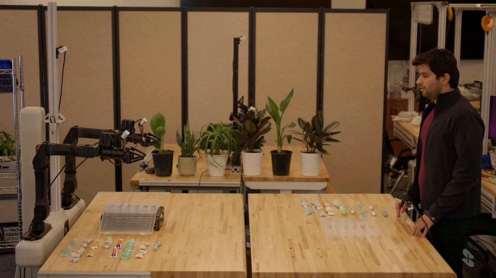

**Puan:** 73.57 &nbsp; **Etkileşim:** ❤ 7041 · 🔁 1011 · 👁 3373575

**Tam prompt:**

~~~text
Introducing S1, our new foundation model that learns from one example. It can be taught 10-minute long tasks that it has never seen before, from one video prompt without any fine-tuning. Watch S1 operate in real-time via in-context learning:
~~~

[Kaynak paylaşımı X'te aç ↗](https://x.com/SkildAI/status/2092300842900865389)

---

## 2. @Naiknelofar788

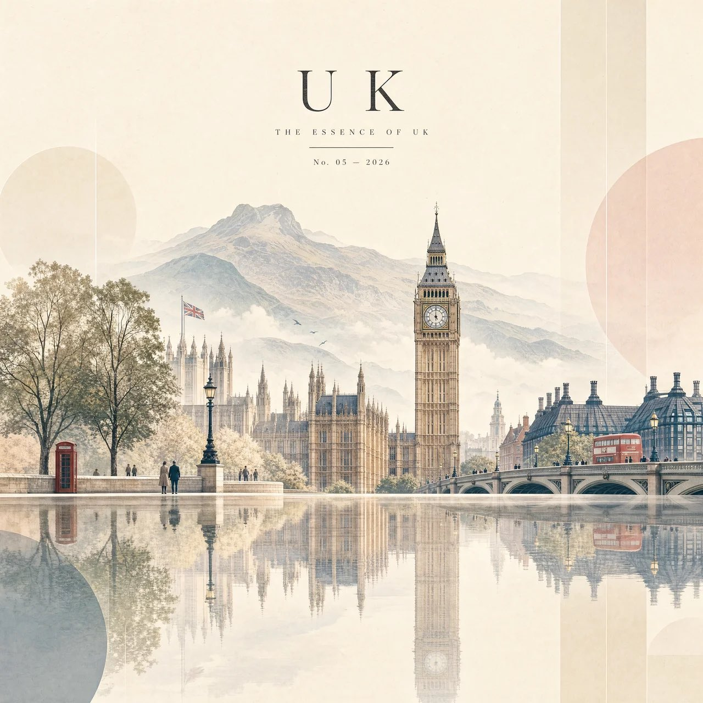

**Puan:** 70.93 &nbsp; **Etkileşim:** ❤ 940 · 🔁 131 · 👁 46146

**Tam prompt:**

~~~text
GPT image Prompt: Create a premium 4:5 vertical editorial travel artwork featuring [COUNTRY] transformed into a sophisticated minimalist landscape. The entire identity of [COUNTRY] should appear as one seamless, dreamlike composition rather than a collection of separate objects. Place the country’s most iconic natural landmark or landscape in the background, softly painted with atmospheric depth. In the foreground, feature one or two instantly recognizable architectural landmarks of [COUNTRY], rendered as elegant simplified forms with refined geometric details. Surround the architecture with subtle elements that represent the country — native trees, traditional rooftops, local streets, cultural details, and a few tiny human silhouettes — all integrated naturally into the scene. Use a soft luxury editorial palette: warm ivory, misty beige, muted pastel tones, dusty pink, pale blue, soft sage and gentle charcoal accents. Keep the colors slightly desaturated and harmonious. Create a beautiful glass-like reflective surface beneath the landscape so the architecture, trees and mountains create delicate vertical reflections. Add extremely subtle translucent geometric shapes around the edges, giving the artwork a contemporary art-gallery feel. Composition should be spacious, calm and elegant, with generous negative space and a clean horizon. Use soft atmospheric haze, delicate shadows, subtle paper texture, fine architectural linework and restrained watercolor/gouache aesthetics blended with modern digital illustration. At the top, add sophisticated magazine-style typography: [COUNTRY] THE ESSENCE OF [COUNTRY] No. 05 — 2026 Typography should be small, refined, widely spaced and perfectly aligned, like a luxury travel magazine cover. No clutter, no excessive details, no photorealistic collage, no oversized text. The result should feel like a high-end contemporary travel poster, collectible art print and luxury magazine cover — serene, artistic, instantly recognizable and visually unforgettable.
~~~

[Kaynak paylaşımı X'te aç ↗](https://x.com/Naiknelofar788/status/2090082472407245312)

---

## 3. @AizaAi12

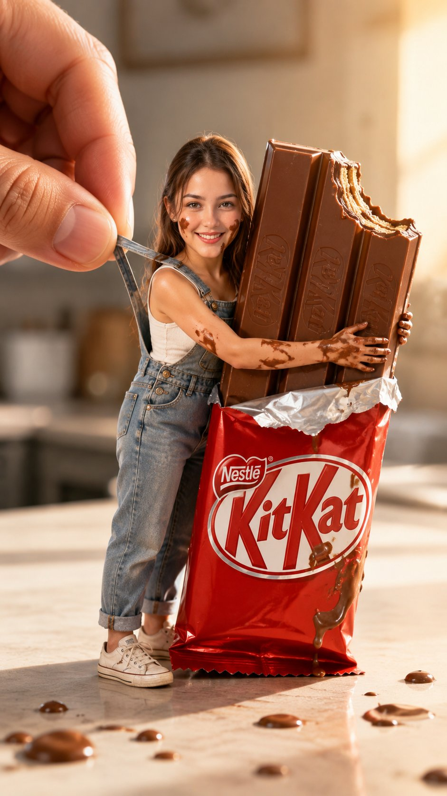

**Puan:** 61.56 &nbsp; **Etkileşim:** ❤ 69 · 🔁 9 · 👁 2215

**Tam prompt:**

~~~text
CHAT GPT IMAGE 2 on Nano banana Prompt : Using the uploaded photo as the strict facial and identity reference, recreate the reference scene as an ultra-photorealistic, whimsical forced-perspective photograph. IDENTITY PRESERVATION Transform the person from the uploaded photo into a tiny, child-proportioned miniature character while preserving their identity exactly. Keep the same: facial structure and proportions eyes, eyebrows, nose, lips, cheeks, jawline, and ears hairstyle, hairline, and hair color skin tone and natural skin texture recognizable age and overall appearance Do not beautify, reshape, stylize, age, de-age, or substitute the face. The finished character must immediately look like the exact person in the uploaded photograph, adapted naturally to the miniature body. SCENE AND COMPOSITION Create a vertical 9:16 portrait photograph of the miniature person standing on a smooth, light-colored kitchen counter or tabletop. Show their entire body from head to shoes. The tiny person is leaning slightly forward and happily hugging an enormous, upright KitKat-style chocolate bar almost as tall as they are. Their arms wrap tightly around the candy bar, with both hands visible. Give them a warm, playful smile while looking directly into the camera. Dress the person in: faded blue denim overalls with realistic stitching and brass buttons a light cream or white sleeveless shirt underneath clean white low-top sneakers Add several playful smears of melted chocolate across their cheeks, chin, forearms, hands, and fingers. Place a few small drops and blobs of melted chocolate on the counter in the foreground. FORCED-PERSPECTIVE HAND A gigantic realistic human hand enters from the upper-left corner. The thumb and index finger gently pinch and lift the back shoulder strap of the miniature person’s overalls. The oversized fingers should be sharply detailed, with natural skin texture, realistic fingernails, creases, and soft highlights. The strap should visibly stretch upward between the fingers, making it look as though the miniature person is being gently picked up while still holding tightly to the candy bar. CANDY BAR Make the oversized candy bar look realistic and delicious, with: glossy milk-chocolate coloring molded rectangular chocolate sections a partially opened red-and-white wrapper around its center a bite missing from the upper-right corner crisp wafer layers visible inside the bite slightly melted chocolate along the bitten edge and bottom Keep all visible lettering clean, correctly spelled, properly oriented, and naturally integrated into the wrapper. LIGHTING AND ENVIRONMENT Use warm golden sunlight streaming from the upper-right side, producing: a soft glowing rim light around the person’s hair warm highlights on the chocolate and denim gentle, realistic shadows beneath the person and candy bar a bright, cozy indoor atmosphere The background should resemble a softly lit modern kitchen or dining area, rendered as creamy beige and pale gray bokeh. Keep the background heavily blurred so the miniature person, giant hand, and candy bar remain the clear focus. CAMERA AND STYLE ultra-photorealistic commercial food photography whimsical forced perspective low camera angle near countertop level shallow depth of field sharp focus on the face, hands, denim, and chocolate soft foreground and background blur warm cinematic color grading realistic skin, fabric, wafer, and melted-chocolate textures approximately an 85mm macro-lens appearance high dynamic range vertical 9:16 composition premium advertising quality IMPORTANT Maintain believable physical contact between the character’s arms and the candy bar. Make the giant fingers anatomically correct, with no extra or malformed fingers. Keep the miniature body proportional and complete, with two arms, two hands, two legs, and two shoes.
~~~

[Kaynak paylaşımı X'te aç ↗](https://x.com/AizaAi12/status/2090254731621159280)

---

## 4. @TaliaAariz

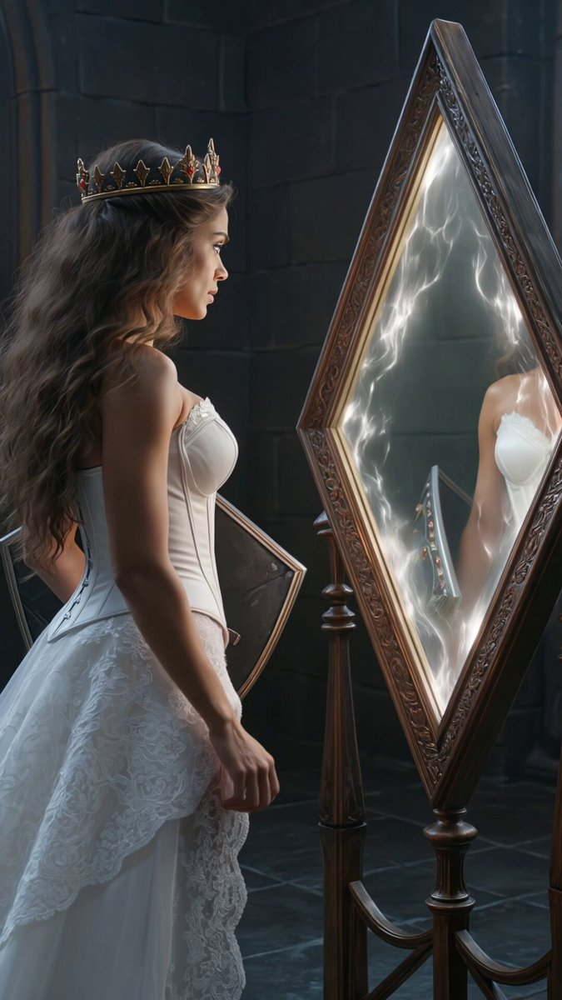

**Puan:** 60.26 &nbsp; **Etkileşim:** ❤ 242 · 🔁 5 · 👁 6740

**Tam prompt:**

~~~text
Created with Kling V3.0 Prompt: A cinematic high-fantasy video sequence beginning with a profile shot of a crowned princess with long, voluminous wavy hair, dressed in a regal white lace high-necked gown accented with crimson gemstones. She reaches out to touch an ornate, diamond-shaped gothic mirror glowing with magical energy. As her fingertips press against the glowing glass, a radiant pulse of light washes over her, instantly transforming her dress into a battle-ready warrior-queen outfit—a white corset gown with a dramatic thigh-high slit, knee-high armored boots, a glowing red energy broadsword, and an intricate silver shield studded with red gems. The camera smoothly pans around and zooms in as she steps forward to face the camera with a fierce, resolute expression, set against a dark, candlelit gothic hall with plush red drapes and glowing arcane circles in photorealistic, 8K cinematic detail.
~~~

[Kaynak paylaşımı X'te aç ↗](https://x.com/TaliaAariz/status/2092486725037650314)

---

## 5. @MrDasOnX

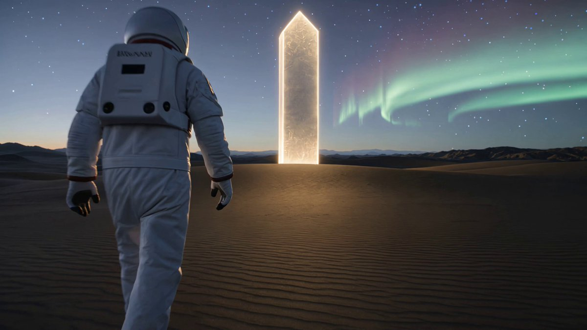

**Puan:** 58.55 &nbsp; **Etkileşim:** ❤ 46 · 🔁 4 · 👁 1047

**Tam prompt:**

~~~text
Kling 3.0 4K Epic Cosmic Transformation! Prompt: A lone astronaut walks across a vast desert of black volcanic sand beneath a sky filled with swirling auroras and countless stars, ultra-photorealistic, cinematic lighting, enormous sense of scale. Single continuous 15-second shot. The camera slowly tracks backward as the astronaut walks toward a colossal glowing monolith rising from the horizon. Every footstep creates ripples of golden light across the ground while fragments of rock begin floating upward. As the astronaut reaches the monolith, the surface fractures with brilliant white energy, sending luminous cracks across the landscape. Gravity appears to reverse as mountains, sand, and debris rise into the sky in slow motion. The astronaut levitates, surrounded by orbiting fragments of glowing stone. Final epic reveal: the astronaut’s entire body dissolves into billions of shimmering particles that rapidly assemble into a colossal living galaxy-shaped humanoid towering above the planet, its body formed from stars, nebulae, and swirling constellations. The giant opens its glowing eyes as galaxies spiral within its chest, then slowly reaches toward the camera while the entire planet is revealed beneath its feet. Ultra-realistic, HDR, volumetric lighting, smooth motion, perfect temporal consistency, cinematic scale, no flicker, no artifacts, no text, no watermark.
~~~

[Kaynak paylaşımı X'te aç ↗](https://x.com/MrDasOnX/status/2084487141963575765)

---

## 6. @mehvishs25

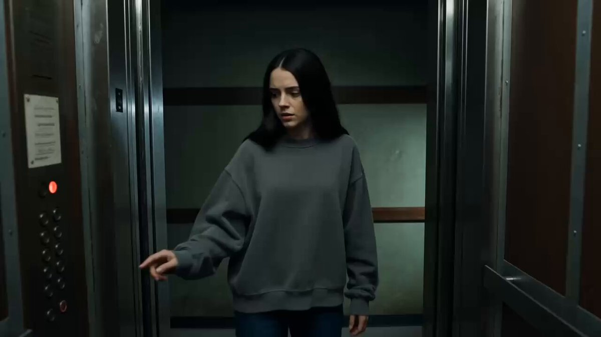

**Puan:** 53.92 &nbsp; **Etkileşim:** ❤ 75 · 🔁 1 · 👁 1741

**Tam prompt:**

~~~text
Seedance 2.5 on Pollo AI Prompt; Create a 15-second ultra-photorealistic live-action cinematic horror sequence set at 3:17 AM inside a quiet, aging apartment building. A young woman wearing a loose charcoal-gray sweatshirt, dark blue jeans, and simple white sneakers enters an old elevator alone. Natural facial features, realistic skin texture, subtle nervous expressions, believable human movement. 0–3 sec: The woman enters the elevator and presses a floor button. The doors close. The elevator lights briefly flicker and the elevator suddenly stops with a heavy mechanical jolt. She looks at the floor display, confused. The display reads 3:17 AM on a small digital clock mounted inside the elevator. 3–6 sec: The doors slowly open. Instead of the expected floor, there is a long, completely empty apartment corridor with faded walls and weak fluorescent lights. She cautiously looks out. At the very end of the corridor, a partially open apartment door slowly swings inward by itself. 6–9 sec: The elevator doors close and immediately reopen. The corridor looks identical, but now a young woman stands motionless beside the distant doorway. She is wearing the exact same charcoal sweatshirt, jeans, and sneakers. The original woman slowly realizes the stranger has her exact face. 9–12 sec: The double suddenly begins walking toward the elevator. At first she moves normally, then gradually accelerates into an unnaturally fast sprint. The original woman panics and repeatedly presses the door-close button. The fluorescent lights flicker rapidly as the double approaches. 12–15 sec: The elevator doors begin closing just as the double reaches the doorway. The original woman desperately backs away. The doors slam shut between them. Hard cut to the empty corridor. A smartphone lies on the floor near the elevator, screen glowing and displaying 3:17 AM. The screen flickers once. The corridor lights go completely dark. Ultra-photorealistic live-action horror, cinematic 16:9, realistic apartment-building textures, natural human skin, believable facial expressions, practical fluorescent lighting, deep shadows, subtle handheld camera movement, realistic low-light exposure, authentic motion blur, restrained color grading, escalating psychological tension, disturbing but non-gory horror, realistic human anatomy and movement, no CGI-looking characters, no glowing eyes, no monsters, no supernatural visual effects, no gore, no text overlays, no subtitles, no watermark. Maintain perfect character consistency throughout: identical face, hairstyle, body proportions, clothing, and shoes.
~~~

[Kaynak paylaşımı X'te aç ↗](https://x.com/mehvishs25/status/2091718181203362193)

---

## 7. @aimikoda

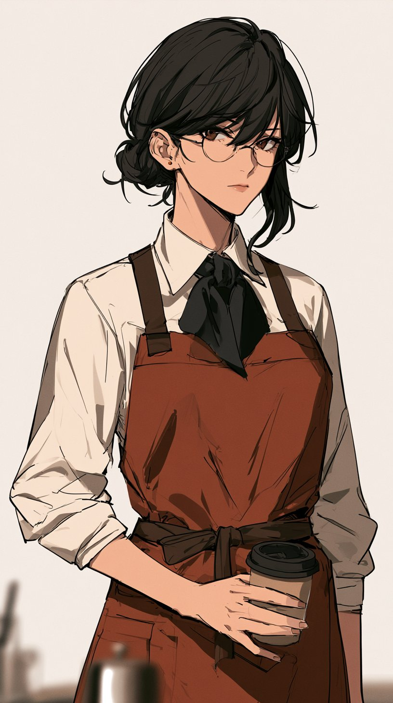

**Puan:** 52.51 &nbsp; **Etkileşim:** ❤ 40 · 🔁 4 · 👁 4245

**Tam prompt:**

~~~text
Midjourney v8.2 Prompt for character: Stylized female anime character, cafe barista, distinctive character-driven anime aesthetic, slightly unconventional facial proportions, sharp expressive eyes, delicate angular features, recognizable silhouette, clean background GPT Image 2 Storyboard Prompt: Create a 16:9, 9-panel storyboard for a quiet slice-of-life anime video about making latte and latte art. The uploaded character should appear throughout the storyboard. Use a basic Japanese animation storyboard sketch style with loose pencil lines, simple shading and cinematic anime compositions. The overall tone should feel intimate, understated and slightly melancholic, with late-evening café lighting, mundane moments made beautiful, subtle expressions, negative space, off-center framing and close-ups of hands, eyes, steam and small gestures. Avoid flashy commercial shots or exaggerated anime reactions. The character should softly talk to themselves while making the latte, with restrained natural body language. The latte design should gradually form but remain unreadable until the very end. Narration: まずはエスプレッソを淹れます。 ミルクをなめらかにスチームして、ゆっくり注ぎます。 カップに近づけて、模様を描いていきます。 最後にひと仕上げ。ラテアートの完成です。
~~~

[Kaynak paylaşımı X'te aç ↗](https://x.com/aimikoda/status/2090557069275664458)

---

## 8. @viva_artificial

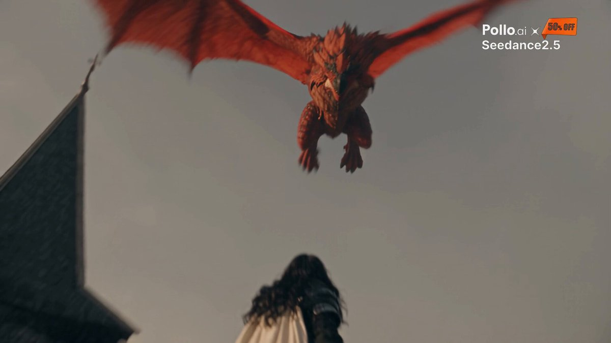

**Puan:** 47.62 &nbsp; **Etkileşim:** ❤ 50 · 🔁 5 · 👁 727

**Tam prompt:**

~~~text
[PR] ソウルライク vs 翼竜 SeeDance 2.5 / 1080p / 30s Reference: 1x Portrait Image Prompt Length: <10k chars Tools: Suno / Midjourney 攻撃密度には気を使いました！ Made with @PolloAIJP
~~~

[Kaynak paylaşımı X'te aç ↗](https://x.com/viva_artificial/status/2089992568805454229)

---

## 9. @GenIArt_Fr

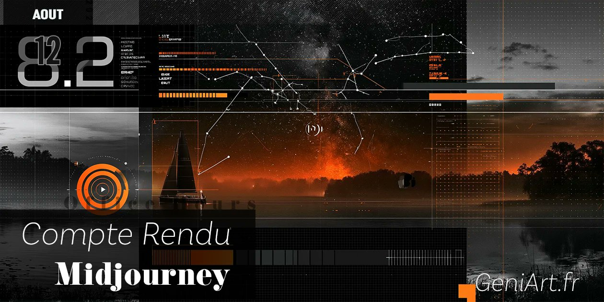

**Puan:** 45.48 &nbsp; **Etkileşim:** ❤ 15 · 🔁 3 · 👁 1196

**Tam prompt:**

~~~text
📅⛵ Compte rendu Midjourney du 13 août 2026 En bref: Midjourney dévoile sa nouvelle vision du produit avec l'arrivée de Banu à la tête du design. Une refonte profonde d'Alpha et une vision ambitieuse : rendre la création d'images plus intuitive, plus visuelle et toujours aussi puissante, à travers une interface simplifiée, la personnalisation renforcée, Omni et futur modèle d'édition en ligne de mire. Les prochains mois s'annoncent particulièrement importants pour l'évolution de Midjourney. 🎙️ On débrief ensemble jeudi à 21h30 sur http://twitch.tv/geniart_tv 📌 Article complet: https://geniart.fr/midjourney/office-hours/compte-rendu-midjourney-du-12-aout-2026/ 🔶 Nouvelle direction du design produit 🔹 Banu (fondatrice de Co–Star) a rejoint Midjourney pour diriger le design produit et le frontend. 🔹 Son objectif principal est d'améliorer l'expérience globale du produit tout en préservant la puissance créative sur laquelle les utilisateurs actuels s'appuient. 🔹 L'accent est mis à long terme sur l'ergonomie, l'accessibilité et les workflows d'itération, plutôt que sur la suppression des fonctionnalités avancées. 🔶 Refonte du site Alpha 🔹 Une refonte majeure est en cours de déploiement sur Alpha. 🔹 Le site de production principal reste inchangé pendant qu'Alpha est affiné. 🔹 La version actuelle d'Alpha doit être considérée comme un environnement de test actif avec de nombreux bugs connus et des imperfections d'expérience utilisateur. 🔹 Les retours des utilisateurs influencent activement le développement avant le déploiement en production. 🔶 Philosophie de conception 🔹 L'objectif est de rendre Midjourney plus simple sans le rendre moins puissant. 🔹 L'interface doit afficher quels paramètres sont actifs au lieu de masquer les réglages. 🔹 Les utilisateurs doivent immédiatement comprendre l'effet d'une modification de paramètre sur les résultats. 🔹 Réduire les états cachés déroutants où des paramètres sont actifs mais invisibles. 🔹 La divulgation progressive permettra de masquer la complexité aux débutants tout en conservant les capacités avancées. 🔹 La future interface vise à permettre aux utilisateurs de penser en images plutôt qu'en syntaxe de paramètres. 🔶 Vision à long terme de la création d'images 🔹 L'équipe a comparé les workflows actuels de création d'images aux premières interfaces de playground IA avant ChatGPT. 🔹 Les workflows actuels basés sur les prompts et les paramètres sont considérés comme transitoires. 🔹 L'expérience de création du futur devrait privilégier l'exploration visuelle itérative plutôt que la recherche du prompt parfait. 🔹 Le raffinement d'images en plusieurs étapes est considéré comme la direction à suivre pour la génération d'images, sans que cela passe nécessairement par des interfaces de chat. 🔶 Fonctionnalités ajoutées à Alpha 🔹 Barre latérale repensée. 🔹 Section Styles centralisée. 🔹 Accès facilité aux : 🔸 MoodBoards 🔸 Styles favoris 🔸 Styles Hot/Top 🔹 Prévisualisation des styles avant la génération. 🔹 Nouveau panneau Images. 🔹 Panneau Vidéo intégré. 🔹 Les paramètres apparaissent désormais sous forme de pastilles modifiables dans la barre de prompt. 🔹 Les systèmes de recherche et de filtrage sont en cours d'unification. 🔹 Les projets multiples sont désormais pris en charge. 🔹 La structure des projets est conçue pour permettre de futures fonctionnalités collaboratives. 🔶 Signalement des bugs 🔹 L'équipe encourage fortement les utilisateurs à tester Alpha de manière intensive. 🔹 Méthodes recommandées pour signaler les bugs : 🔸 Bouton de signalement de bug sur le site Alpha. 🔸 Canal Discord Bug Reports. 🔸 Canal Discord Ideas & Features. 🔹 Les signalements envoyés via le site sont automatiquement intégrés aux workflows internes. 🔹 Les messages privés aux développeurs sont déconseillés car ils sont difficiles à gérer. 🔶 Améliorations de la barre de prompt 🔹 L'implémentation actuelle est considérée comme temporaire. 🔹 Améliorations prévues : 🔸 Édition des paramètres plus propre. 🔸 Sélection des paramètres facilitée. 🔸 Meilleur comportement du copier/coller. 🔸 Moins de petits irritants d'interaction (« paper cuts »). 🔸 Meilleure expérience sur mobile. 🔶 Expérience mobile 🔹 Une barre de prompt rétractable est déjà en prototype. 🔹 L'ergonomie mobile est une priorité majeure. 🔹 L'équipe s'attend à proposer des améliorations prochainement. 🔶 Mood Boards & Styles 🔹 Améliorations actuelles : 🔸 Prévisualisation des styles. 🔸 Accès facilité pendant la rédaction du prompt. 🔹 Évolutions envisagées : 🔸 Meilleure gestion des très grandes collections de Mood Boards. 🔸 Amélioration des workflows de partage. 🔸 Meilleurs outils d'organisation. 🔶 Personnalisation & découverte de styles 🔹 Des investissements importants sont en cours. 🔹 Domaines explorés : 🔸 Meilleure personnalisation. 🔸 Meilleurs flux Explore. 🔸 Recherche de styles améliorée. 🔸 Découverte plus intelligente des esthétiques. 🔸 Meilleurs moyens d'initialiser la personnalisation à partir d'exemples pertinents plutôt que d'images génériques. 🔶 Organisation & projets 🔹 Améliorations à venir : 🔸 Retour des groupes de dossiers. 🔸 Meilleure recherche et meilleur filtrage. 🔸 Organisation des projets améliorée. 🔸 Le futur système de projets devrait devenir nettement plus puissant. 🔶 Style Creator 🔹 Le Style Creator actuel est considéré comme une étape intermédiaire. 🔹 L'équipe prévoit une refonte beaucoup plus large de la création d'images au cours des prochains mois. 🔹 Les concepts du Style Creator devraient être conservés dans un workflow de création beaucoup plus simplifié. 🔶 Références d'images & contrôles 🔹 Réflexion actuelle : 🔸 La distinction entre Image Prompt, Style Reference, Omni et Subject Reference doit devenir plus claire. 🔸 Les workflows actuels basés sur le glisser-déposer et les cases à cocher sont considérés comme temporaires. 🔸 L'équipe recherche des interactions de plus haut niveau plutôt que d'ajouter davantage de contrôles techniques. 🔸 Le poids des images (image weighting) a été évoqué mais n'est pas considéré comme la solution privilégiée. 🔶 Omni & modèle d'édition 🔹 Peu d'informations ont été partagées. 🔹 L'équipe a indiqué que : 🔸 Des capacités de type Omni sont attendues avant un modèle d'édition plus complet. 🔸 Le futur système d'édition devrait améliorer : 🔸 l'édition contextuelle des images ; 🔸 la cohérence des styles ; 🔸 les workflows de références. 🔸 Aucun calendrier de sortie n'a été communiqué. 🔶 Cohérence des personnages & des scènes 🔹 Une question a été posée concernant : 🔸 la cohérence des personnages ; 🔸 la continuité des scènes ; 🔸 la continuité des mouvements de caméra. 🔹 Réponse : 🔸 Les futurs travaux sur le modèle d'édition et Omni visent à rapprocher Midjourney de ces capacités. 🔸 Aucun détail supplémentaire n'a été partagé. 🔶 Paramètres vs simplicité 🔹 Philosophie actuelle : 🔸 Réduire le nombre de paramètres est généralement préféré. 🔸 L'équipe souhaite que les utilisateurs accomplissent davantage grâce à des interfaces intuitives plutôt qu'en mémorisant une syntaxe. 🔸 Les contrôles avancés restent importants, mais devraient idéalement évoluer vers des interactions plus visuelles. 🔶 Curseur EXP 🔹 Aucun projet actuel. 🔹 La direction préfère généralement réduire le nombre de paramètres plutôt que d'en ajouter. 🔹 L'équipe cherche davantage à comprendre pourquoi les utilisateurs ont besoin d'EXP que de simplement exposer un nouveau curseur. 🔶 Permutations 🔹 L'équipe reconnaît que les permutations sont largement utilisées par les utilisateurs avancés. 🔹 Le support actuel dans l'interface est imparfait. 🔹 L'objectif à long terme est de résoudre le problème d'exploration sous-jacent plutôt que de s'appuyer sur les permutations de paramètres. 🔹 L'exploration visuelle est considérée comme une meilleure direction à long terme. 🔶 Changements de terminologie 🔹 « Stylized Strength » a été renommé car son comportement diffère selon que la personnalisation est activée ou non. 🔹 L'équipe souhaite une terminologie qui reflète mieux le comportement réel. 🔹 Certaines incohérences de nommage subsistent encore et seront corrigées. 🔶 Créativité & expérimentation 🔹 Principe de conception récurrent : 🔸 La découverte créative nécessite de l'expérimentation. 🔸 Midjourney doit encourager une exploration ludique tout en offrant un contrôle pertinent aux utilisateurs. 🔸 L'objectif est d'équilibrer la surprise avec une direction créative intentionnelle. 🔶 Points marquants des retours de la communauté 🔹 Les questions ont principalement porté sur : 🔸 Mode avancé pour les utilisateurs expérimentés. 🔸 Ergonomie de la barre de prompt. 🔸 Interface mobile. 🔸 Gestion des Mood Boards. 🔸 Organisation des dossiers. 🔸 Gestion des paramètres. 🔸 Découverte de styles. 🔸 Personnalisation. 🔸 Cohérence des personnages. 🔸 Omni. 🔸 Modèle d'édition. 🔸 Contrôles des images. 🔸 Curseur EXP. 🔸 Permutations. 🔶 Notes de clôture 🔹 Alpha continuera de recevoir des mises à jour rapides. 🔹 Davantage de communication publique sur les évolutions d'Alpha est prévue. 🔹 L'équipe a de nouveau insisté sur le fait que les signalements de bugs envoyés via les canaux officiels sont le moyen le plus rapide d'améliorer le produit.
~~~

[Kaynak paylaşımı X'te aç ↗](https://x.com/GenIArt_Fr/status/2087818294711423083)

---

## 10. @azed_ai

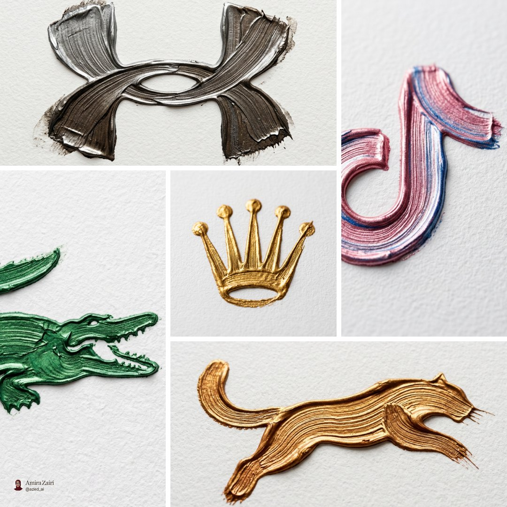

**Puan:** 40.44 &nbsp; **Etkileşim:** ❤ 60 · 🔁 2 · 👁 3339

**Tam prompt:**

~~~text
Creative Workflow / Nano Banana I built a reusable Nano Banana prompt that recreates any logo as realistic brushstrokes with natural paint texture and handcrafted details Prompt below
~~~

[Kaynak paylaşımı X'te aç ↗](https://x.com/azed_ai/status/2085093742747525419)

---

## 11. @promptsref

**Puan:** 39.78 &nbsp; **Etkileşim:** ❤ 14 · 🔁 0 · 👁 443

**Tam prompt:**

~~~text
Cyberpunk x cinematic photography: neon orange/cyan glow, dramatic shadows, holographic detail. Great for sci-fi posters, game art, album covers, and tech ads. Full prompt in comments. --sref 2521777022 #midjourney #sref
~~~

[Kaynak paylaşımı X'te aç ↗](https://x.com/promptsref/status/2088596820922401236)

---

## 12. @techhalla

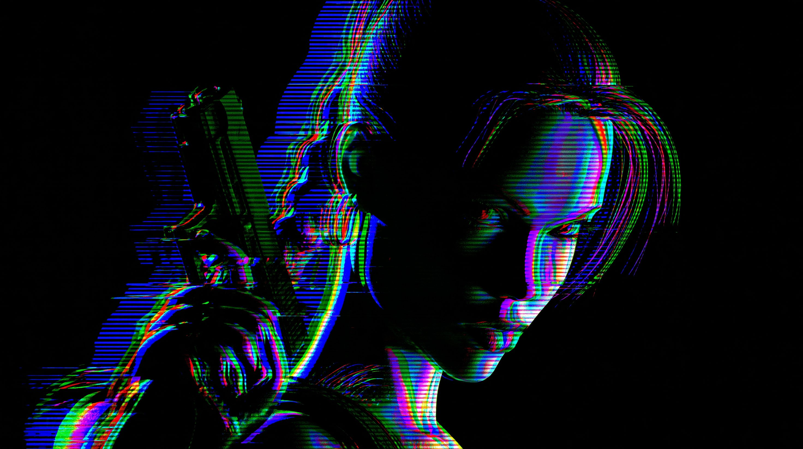

**Puan:** 39.76 &nbsp; **Etkileşim:** ❤ 18 · 🔁 0 · 👁 2404

**Tam prompt:**

~~~text
I've used 5 ref images from Midjourney (prompts in the ALTs) and then used this template for the final animation in H3: { "archetype": "Artistic / Fashion / Conceptual", "duration": "15s", "prompt": { "concept": { "title": "CRT Attract – Kinetic Title Sequence", "description": "Continuous 15s one-take 1990s arcade attract-mode motion graphics. Five characters already exist as RGB-split glowing outlines on pure black. They keep that exact treatment: black interiors, cyan/magenta/yellow-green channel offset, heavy horizontal CRT scanlines, chromatic aberration, occasional leftward glitch tears. Each holds a characteristic micro-motion inside its original framing. Formation direction alternates every 3s. Morphs only through the RGB outlines tearing, scanning and reforming. Kinetic uppercase arcade text is built from the same RGB-split scanline strokes on the complementary side. Final INSERT COIN. Always raster-alive, never a solid fill, never static.", "duration": "15s", "rhythm_structure": { "0-3s": "[image1] holds + micro-motion, text left", "3-6s": "Morph to [image2] + micro-motion, text right", "6-9s": "Morph to [image3] + micro-motion, text left", "9-12s": "Morph to [image4] + micro-motion, text right", "12-15s": "Morph to [image5] + micro-motion + final INSERT COIN" } }, "camera_direction": { "shot_type": "Strict continuous one-take, locked", "forbidden": ["No cuts", "No teleportation", "No hidden transitions", "No freeze frames", "No full-body reframes", "No solid-filled bodies", "No volumetric smoke"], "camera_journey": "Centered on pure black void. Locked. All energy from RGB outline jitter, scanline sweep, leftward glitch tears and the morphs. Framing of each character stays as in its reference: chest-up for 1–4, side-profile runner for 5." }, "typography": { "allowed_words": [ "CRT ATTRACT", "MOTION GRAPHICS", "MIDJOURNEY + H3", "PROMPTS by TechHalla", "INSERT COIN" ], "treatment": { "not_flat_overlay": true, "required_properties": [ "Built from the same cyan/magenta/yellow RGB-split strokes as the characters", "Heavy horizontal scanlines through every letter", "Chromatic aberration on the edges, matching the stills", "90s arcade slam: scale punch, slight raster bounce, leftward glitch smear on impact", "Extra-bold condensed uppercase, Street Fighter / Namco attract energy", "Kinetic emergence synchronized to morphs and scanline direction" ] } }, "visual_style": { "overall": "RGB-split CRT outline art on pure black. Characters are glowing wire silhouettes, interiors stay black, scanlines across the whole figure, cyan magenta yellow-green channel offset, horizontal glitch tears. Same look as the five stills, held for 15s.", "inspired_by": [ "[image1] – Chun-Li chest-up, ox-horn buns with ribbons, qipao collar, centered portrait, RGB-split outlines, scanlines, black fill", "[image2] – Cloud chest-up, spiky hair, Buster Sword hilt over the right shoulder, dark face and torso, magenta in the hair, cyan on hair tips and hilt, horizontal tears on hair and pauldrons", "[image3] – Snake chest-up, facing camera, bandana tails flying right, stubble, tactical collar, cyan-magenta line-art, no fill", "[image4] – Lara medium close-up on the right, one pistol held vertical against her cheek, hair tied back, scanlines, leftward smear behind the gun", "[image5] – Sonic side-profile facing right, hunched ready-to-run, quills and sneakers in RGB-split strokes, horizontal speed-glitch streaks going left" ], "color_palette": ["electric cyan", "magenta", "yellow-green", "electron-beam white", "pure black void"], "materials_and_texture": "RGB channel-offset line, CRT scanlines, phosphor bloom only on the strokes, horizontal displacement tears, black interiors" }, "motion_language": { "follows_music": false, "core_behavior": "Never static. Scanlines always travel. RGB channels always breathe a few pixels apart. Morphs happen only by the outlines tearing horizontally and reforming as the next silhouette. Each character stays inside its still's crop. Type slams like a 90s continue screen, made of the same strokes." }, "storyboard": { "total_beats": 5, "beat_duration": "3 seconds each", "beats": [ { "id": "01", "time": "0.0–3.0", "description": "Pure black. [image1] is already on: Chun-Li chest-up, ox-horn buns, qipao collar, RGB-split outlines, scanlines, black interior. Ribbons on the buns flicker. A micro chin turn. Outline vibration in cyan and magenta. Scanlines crawl down the face. Text “CRT ATTRACT” slams left, same RGB-split scanline strokes, extra-bold uppercase. End of beat: her outline tears horizontally into raw scanlines." }, { "id": "02", "time": "3.0–6.0", "description": "Scanlines reverse left-to-right and lock into [image2]: Cloud chest-up, spiky hair, Buster Sword hilt over the right shoulder, dark face, magenta in the hair, cyan on the tips and hilt. Hair spikes crawl with a horizontal RGB tear. Slow head turn. Hilt catches a scanline. Previous text dissolves. “MOTION GRAPHICS” slams right in the same stroke language. End of beat: hair and hilt tear into scanlines." }, { "id": "03", "time": "6.0–9.0", "description": "Scanlines reverse right-to-left and lock into [image3]: Snake chest-up, facing camera, bandana tails to the right, stubble, tactical collar, cyan-magenta line-art, no fill. Bandana tails flutter. Eyes narrow. RGB split on the bandana widens a few pixels. Text “MIDJOURNEY + H3” slams left. End of beat: the bandana tails tear into scanlines and take the face with them." }, { "id": "04", "time": "9.0–12.0", "description": "Scanlines reverse left-to-right and lock into [image4]: Lara medium close-up on the right, one pistol vertical against her cheek, hair tied back, scanlines, leftward smear already behind the gun. She holds the gun exactly there. A slow breath. The leftward glitch smear pulses. Text “PROMPTS by TechHalla” slams right out of that smear. End of beat: the gun-smear tears her into scanlines." }, { "id": "05", "time": "12.0–15.0", "description": "Scanlines reverse right-to-left and lock into [image5]: Sonic side-profile facing right, hunched ready-to-run, RGB-split quills and sneakers, horizontal speed-glitch streaks already going left. He leans a fraction more into the run. The leftward streaks stretch. Previous text dissolves. Residual outlines briefly reform titles, then “INSERT COIN” slams centered in the same RGB-split scanline strokes as the streaks fade into black, last scanline crossing the word, never fully static until end frame." } ] } } } Hope you enjoy it! 😎
~~~

[Kaynak paylaşımı X'te aç ↗](https://x.com/techhalla/status/2092352288321118599)

---

## 13. @umesh_ai

**Puan:** 39.15 &nbsp; **Etkileşim:** ❤ 23 · 🔁 1 · 👁 1762

**Tam prompt:**

~~~text
Prompt : Create a 30-second cinematic continuous one-shot where both the world and the museum guard are constantly moving. The transformation must never feel like a man simply walking while backgrounds change. His body, momentum, balance, position, and reactions should actively cause or motivate each transition. No cuts, no fades, no dissolves. The camera may whip, orbit, dive, roll, pass behind objects, move overhead, go low to the ground, rush toward him, or briefly lose sight of him behind foreground elements, but it must remain one physically continuous shot. Start in a silent grand museum at night. A museum guard hears a distant crash and spins around. The camera rushes backward in front of him as he runs through the gallery toward a gigantic painting of a storm at sea. He skids to a stop. A painted wave suddenly explodes out of the canvas. He dives sideways as real seawater crashes across the museum floor. The camera drops almost to floor level with the rushing water. The guard grabs a marble bench to stop himself from being swept away. The bench stretches beneath his hands and becomes the wooden railing of a ship. The camera swings around him. He is suddenly hanging from the side of a ship in a hurricane. He pulls himself onto the deck. A mast collapses toward him. He runs, jumps over a sliding barrel, ducks beneath a swinging rope, then grabs a sail before being thrown backward by the wind. The camera rises with the sail. The enormous sail wraps around him. He tears through the fabric and tumbles onto hot sand. The same cloth is now the roof of a desert tent. He rolls down a dune, pushes himself up, and immediately begins running as a herd of horses charges behind him. The camera races sideways with him. Tent poles whip past the lens and transform into spears. The charging horses become cavalry crossing an ancient battlefield. The guard drops flat as riders leap over him. From ground level, a giant war banner falls directly toward the lens. The guard grabs its edge. The wind yanks him upward. For a moment he is lifted completely off the ground. As the camera rotates with him, the war banner becomes a huge bedsheet hanging between buildings. He crashes into a pile of laundry in a bright hillside village. A woman pulls the sheet away. The guard is suddenly sitting at a crowded outdoor table. Before he can react, the table tilts. Plates slide toward him. He jumps onto the table, runs across it, and leaps through an open window. The camera follows him through the window. But he does not land inside a room. He falls through open sky. The village rooftops beneath him stretch into enormous canyon formations. The camera dives beside him. He catches a hanging rope. The rope becomes a vine. He swings across a jungle growing vertically from the canyon walls. He releases the vine and lands on the roof of a moving train. Now the camera races backward just inches above the train. He runs across the roof while tunnels approach at terrifying speed. He ducks under a signal gantry. A tunnel entrance fills the frame. He jumps through it. Inside the darkness, the train roof beneath him becomes a glossy office floor. He lands sliding on his knees through a skyscraper corridor. Glass walls race past on both sides. The camera rotates ninety degrees. The corridor appears to become vertical. The guard loses his footing and begins falling sideways through the building. Office windows become hundreds of apartment windows. Apartment windows become glowing city signs. He crashes through one glowing rectangle. It becomes the surface of a swimming pool. Now underwater. His momentum continues naturally. He swims upward toward the light. The camera circles underneath him. When he breaks the surface, the pool has become a vast moonlit ocean. He climbs onto a floating wooden door. A huge shadow passes underneath. He freezes. The wooden door suddenly tips upward. It becomes the cover of an enormous book. The ocean drains between gigantic pages. He falls between them. The camera falls with him into an endless library. He catches a ladder and swings around it. The ladder rolls rapidly along towering shelves. Books fly from the shelves around him. He jumps from the moving ladder onto a reading table. The camera passes beneath the table and emerges upside down. Gravity appears reversed. The guard is now standing on the ceiling. He looks down at the library hanging above him. Books begin falling upward. He runs across the ceiling as shelves collapse toward the sky. A circular clock rolls past him like a giant wheel. He jumps through its center. Instantly he lands sitting upright in bed. Morning. Silence. The camera is now extremely close to his face. He gasps awake. For the first time in the entire film, everything becomes completely still. His bedroom is ordinary. He looks around. He touches the mattress. Checks his hands. Relieved, he lies back down. Then something drips onto his forehead. He looks up. The ceiling above his bed is gently rippling like the surface of an ocean. A large shadow slowly swims across it. His expression changes from relief to disbelief. Then the entire bed suddenly tilts like the deck of a ship. He grabs the mattress as his alarm clock, pillow, lamp, and furniture begin sliding toward one side of the room. End exactly as he begins sliding out of bed, suggesting that waking up was only another stage of the transformation. The action should feel choreographed like a physical adventure. The guard must run, sprint, skid, dive, fall, climb, hang, swing, crawl, jump, roll, swim, land, sit, get thrown through spaces, and briefly become weightless. His position within the frame should constantly change: close-up, full-body, profile, silhouette, overhead, low-angle, behind him, directly in front of him, underwater, upside down, falling beside him, and orbiting around him. Transitions should often be triggered by his actions. When he grabs something, it becomes something else. When he falls, the next world catches him. When he jumps through an opening, that opening becomes another location. When an object crosses the camera, it transforms while hiding part of the environment. Use physical match transitions such as: sail → desert tent tent poles → battlefield spears war banner → village laundry window → open sky rope → jungle vine vine swing → train landing train tunnel → office corridor office windows → city lights glowing sign → swimming pool floating door → book cover book pages → library architecture clock face → bedroom wall clock The camera movement itself should help generate transitions. A whip-pan can turn one moving object into another. A 360-degree orbit can reveal a completely transformed environment by the time it completes. Passing behind fabric, pillars, people, waves, vehicles, doors, or the guard's body can briefly obscure parts of the frame while the transformation happens continuously. Despite the speed, every transformation must remain visually understandable. The result should feel less like a transformation montage and more like one impossible 30-second physical journey in which the guard is being chased, thrown, carried, dropped, and pulled through realities that continuously grow out of one another. Tone: exhilarating, mysterious, playful, cinematic, photoreal, large-scale, dreamlike, and full of wonder
~~~

[Kaynak paylaşımı X'te aç ↗](https://x.com/umesh_ai/status/2088636214077427805)

---

## 14. @masako_3d

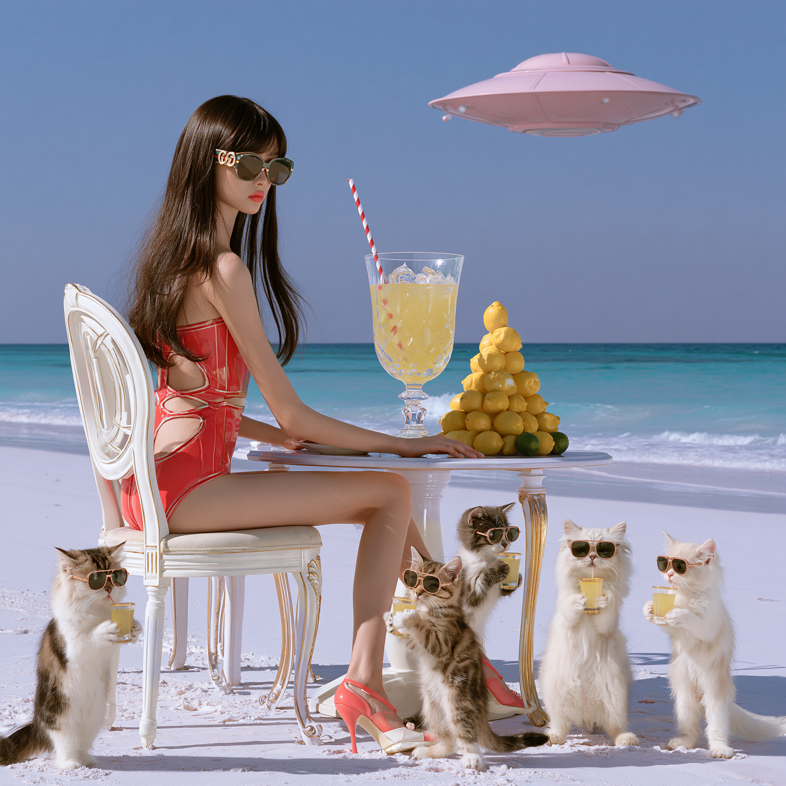

**Puan:** 35.76 &nbsp; **Etkileşim:** ❤ 7 · 🔁 2 · 👁 155

**Tam prompt:**

~~~text
Here is the secret behind the visual stability and prompt details! 👇🎬 To prevent any unexpected camera zoom-ins or model warping, I completely removed descriptive asset words from the video prompt and focused 100% on the motion physics. Swipe / check the reply below for the exact Midjourney image prompt and additional video variations. Feel free to try this static-camera technique! 🔥👇 #Midjourney #ImageToVideo 今回の美しい映像の安定感と、プロンプトの秘密を公開します！ 👇🎬 意図しないカメラのズームインやモデルの顔の歪みを防ぐため、動画用プロンプトからは静止画の説明（水着の色など）を完全にカットし、100%「動きの物理シミュレーション」だけに集中させました。 このリプ欄に、Midjourneyの静止画用プロンプトと、他の動画バリエーションを載せておきます。カメラをピタッと止めるこのテクニック、ぜひ試してみてください！ 🔥👇 🎬prompt Static camera wide shot. The original cinematic wide beach composition and the position of the female model and five kittens are perfectly locked and stable throughout the entire video. A long striped straw smoothly extends downward from the pale pink UFO in the distant clear sky and lands gracefully into the giant crystal glass of yellow lemon juice on the dining table. The vibrant yellow lemon juice flows dynamically upward inside the straw with realistic fluid simulation. The female model smiles beautifully and the five kittens look up toward the sky with complete visual consistency, maintaining their original faces and body sizes perfectly. Continuous natural ocean waves ripple in the background, keeping the tranquil beach atmosphere. High-resolution movie quality.
~~~

[Kaynak paylaşımı X'te aç ↗](https://x.com/masako_3d/status/2093679965531504973)

---

## 15. @aziz4ai

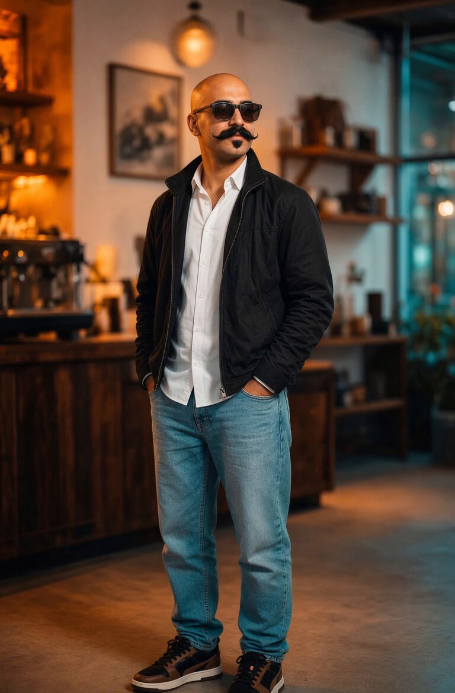

**Puan:** 32.46 &nbsp; **Etkileşim:** ❤ 17 · 🔁 4 · 👁 1644

**Tam prompt:**

~~~text
Grok @imagine image and video Video prompt ⬇️ He is standing in place , people passing around him in long exposure with time lapse and motion blur with push in dolly handheld camera motion, the camera orbiting around his body in 360 degrees
~~~

[Kaynak paylaşımı X'te aç ↗](https://x.com/aziz4ai/status/2093840506379755808)

---

## 16. @PamMktgNut

**Puan:** 30.53 &nbsp; **Etkileşim:** ❤ 5 · 🔁 1 · 👁 865

**Tam prompt:**

~~~text
Before you write another AI prompt: Breathe. Seriously. The quality of your interaction with AI isn’t only about the words you type. The human bringing the fear, urgency, curiosity, creativity or calm matters too. Mind ~> Brand ~> Machine In that order
~~~

[Kaynak paylaşımı X'te aç ↗](https://x.com/PamMktgNut/status/2088953882579718398)

---

## 17. @deepfates

**Puan:** 28.57 &nbsp; **Etkileşim:** ❤ 23 · 🔁 0 · 👁 1074

**Tam prompt:**

~~~text
this is the base image prompt somebody getting nano banana to work directly in AI studio without the rewriter. I just needed to store it somewhere that wouldn't get sunsetted
~~~

[Kaynak paylaşımı X'te aç ↗](https://x.com/deepfates/status/2085255324450369693)

---

_Kaynak içerikler ilgili yazarlara aittir; özgün bağlantılar korunmuştur._
