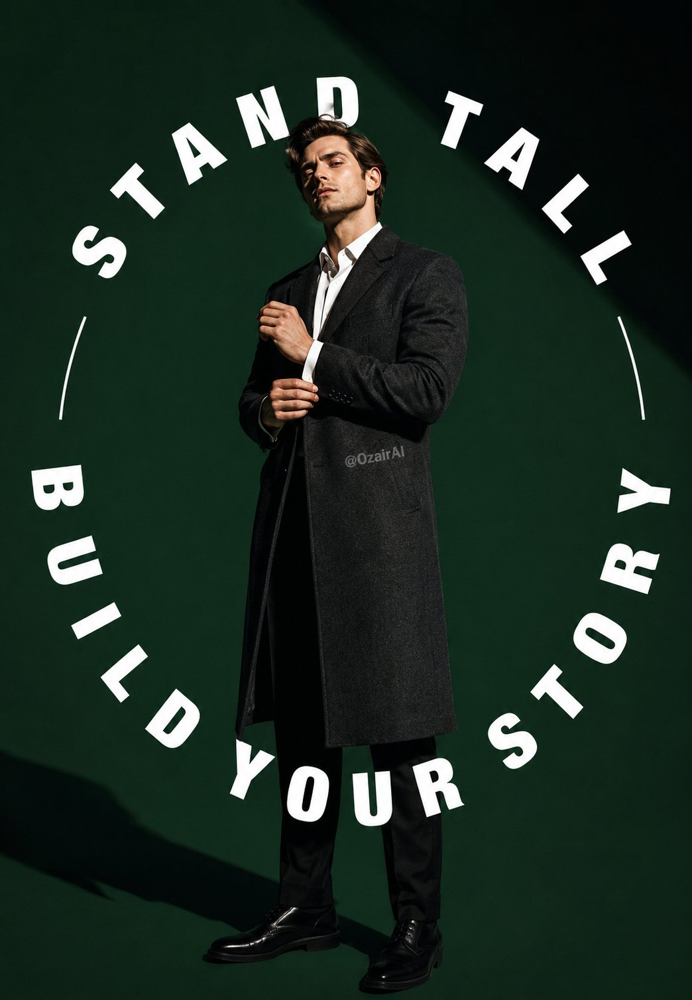
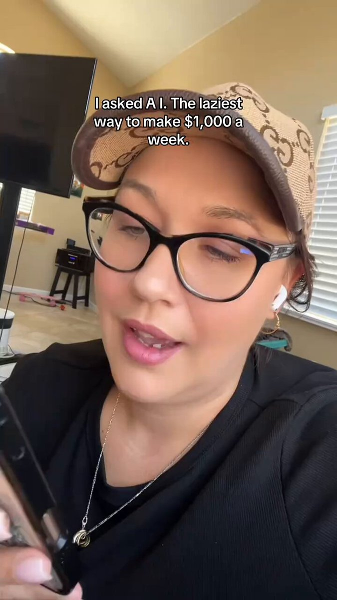
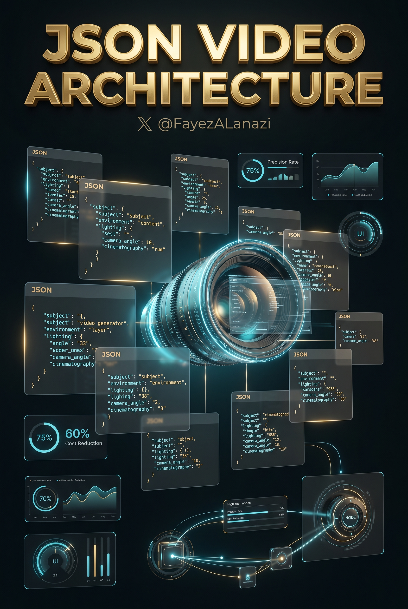
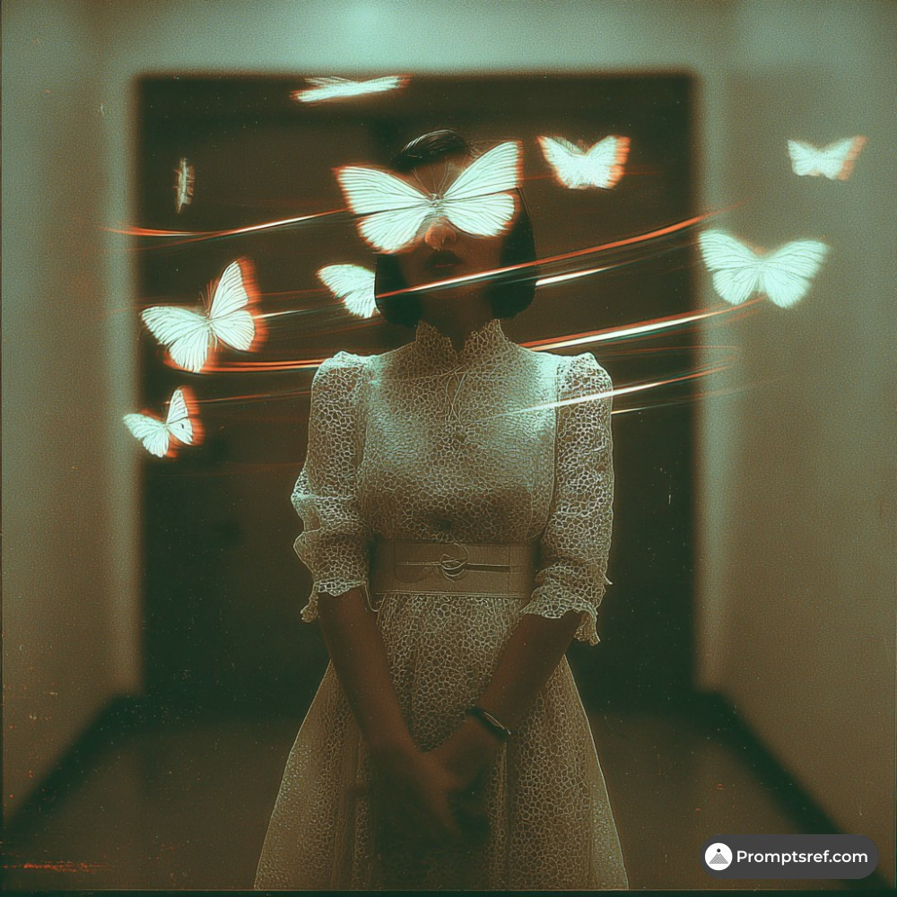
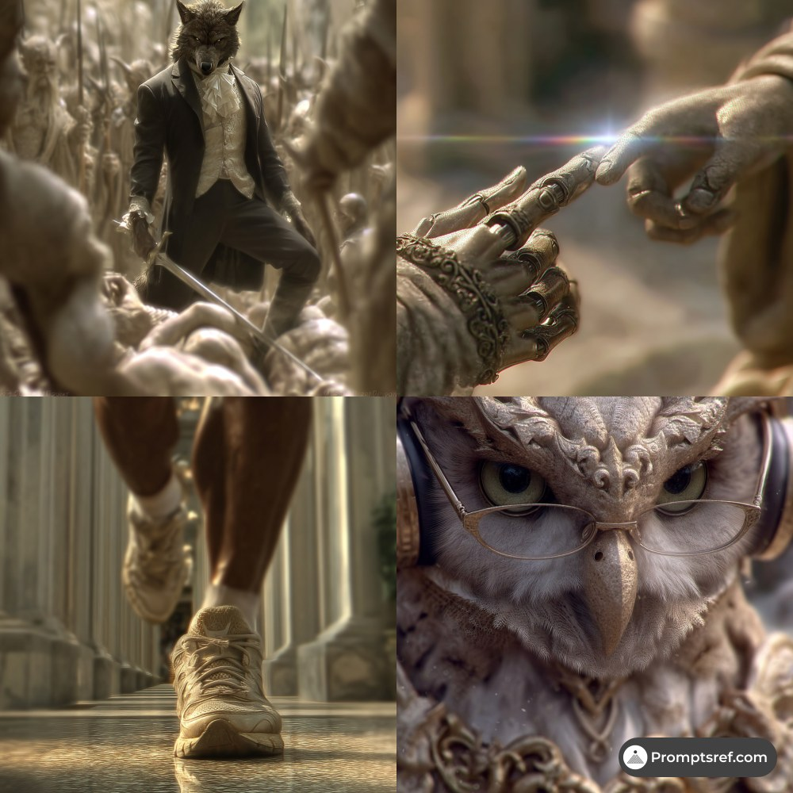
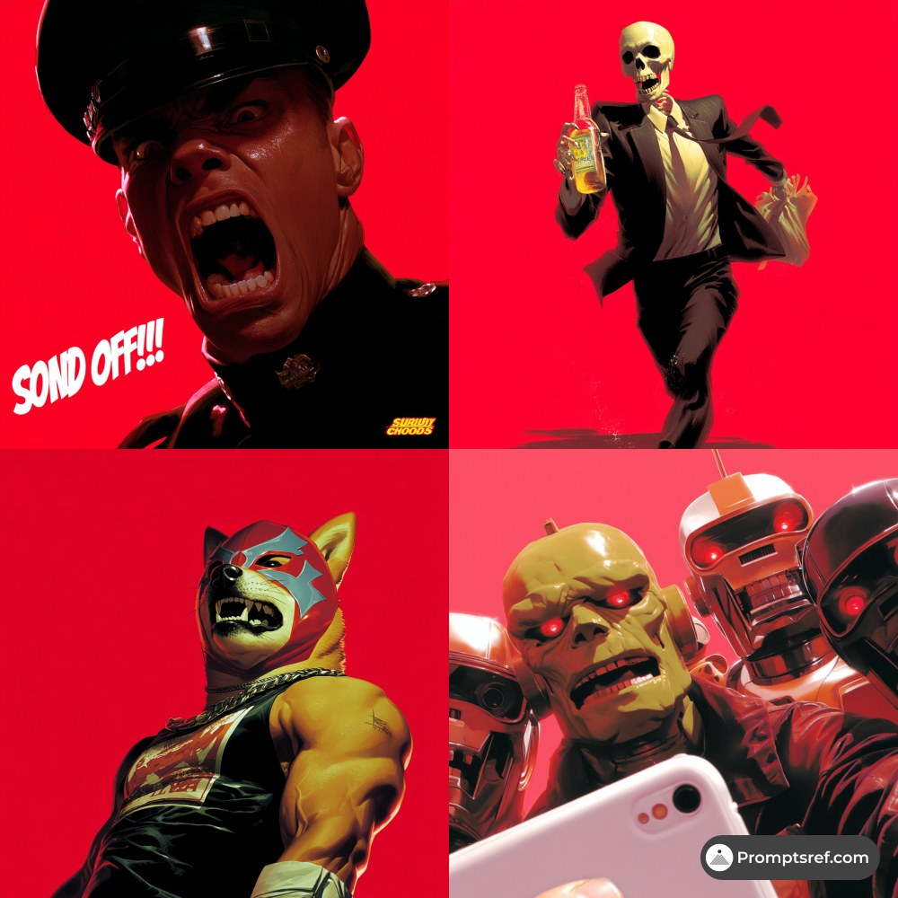

# AI Prompt Radar — 2026-09-01

Bugün bulunan yeni prompt sayısı: **8**

## 1. @Ozayrr_irl

**Puan:** 58.18 &nbsp; **Etkileşim:** ❤ 39 · 🔁 4 · 👁 1459

**Tam prompt:**

~~~text
ChatGPT Image 2 vs Google Gemini Nano Banana 2. Same prompt tested on different Ai models. Which one is better? Prompt : Full-body studio shot of an American white man with sharp jawline and defined facial features, wearing a tailored charcoal wool overcoat over a crisp white shirt, standing at a slight angle with one hand adjusting his cuff, chin tilted up, powerful minimal pose, solid deep-emerald background, hard single-source studio light casting a crisp diagonal shadow across the frame, high-fashion editorial mood. Circular typography wrapped around the frame reading "STAND TALL BUILD YOUR STORY" in bold white sans-serif letters following the circle's curve. Vertical 9:13 format. Subtle "@OzairAI" watermark blended naturally into the coat's fabric texture. Ultra photorealistic, 8K, cinematic color grading..
~~~

[Kaynak paylaşımı X'te aç ↗](https://x.com/Ozayrr_irl/status/2085270010268725621)

---

## 2. @0xrux

**Puan:** 50.86 &nbsp; **Etkileşim:** ❤ 116 · 🔁 18 · 👁 7648

**Tam prompt:**

~~~text
I asked AI for the laziest way to make $1,000/week. it gave me an answer I didn’t expect. AI-generated kids content. not because it’s easy to fake because the format is unusually forgiving. simple stories, small cast, short runtime, an audience that rewards repetition instead of getting bored of it. here’s the workflow, and the one step that actually matters is what you’re studying: → pull up several kids channels already pulling millions of views → don’t copy one video find the pattern across all of them. the hook, the conflict, the resolution, the pacing, the visual style that keeps repeating → feed that pattern into AI and get an original concept built on the same shape → turn it into a detailed video prompt → generate it in Sora → upload, monetize a few minutes per video. that part’s just where AI tools are now. here’s the actual lazy part, and it’s not the generation speed. learn the pattern once. every video after that is a new variation, not new research. that’s the whole unlock you’re not making one video faster, you’re building a channel that produces itself. the version of “lazy” that lasts: original story, proven shape, repeated forever. the version that gets you a strike: someone else’s specific video with a new coat of paint. only one of those is actually a business.
~~~

[Kaynak paylaşımı X'te aç ↗](https://x.com/0xrux/status/2089990294527742462)

---

## 3. @fayezalanazi

**Puan:** 50.76 &nbsp; **Etkileşim:** ❤ 2 · 🔁 3 · 👁 1905

**Tam prompt:**

~~~text
انتقال صناعة الفيديو من «فن كتابة البرومبت» إلى «هندسة خط الإنتاج». عبر ثورة الأوامر الهيكلية JSON Prompts ـــــــــــــــــــــــــــــــــــــــــ كيف ينهي نسق جيسون عشوائية توليد الفيديو بالذكاء الاصطناعي ويوفر ملايين الدولارات لشركات الإنتاج؟ ـــــــــــــــــــــــــــــــــــــــــ هل يمكن لبضعة أقواس ومفاتيح برمجية أن تمنع نموذج الفيديو من إفساد لقطة تكلف عشرات الدولارات؟ ـــــــــــــــــــــــــــــــــــــــــ وهل بدأت صناعة المحتوى فعلًا في الانتقال من «اكتب وصفًا جميلًا وانتظر الحظ» إلى خطوط إنتاج يمكن ضبطها وقياسها؟ ـــــــــــــــــــــــــــــــــــــــــ أم أن مصطلح JSON Prompts تحوّل بدوره إلى شعار تسويقي أكبر من الحقيقة التقنية؟ ـــــــــــــــــــــــــــــــــــــــــ 👋مرفق في التغريدة رابط الشرح والتطبيق العملي 👋مع البرومبت المستخدم ـــــــــــــــــــــــــــــــــــــــــ 🔥 النتيجة الصادمة: صيغة جيسون (JSON – JavaScript Object Notation) لا تمثل، حتى الآن، معيارًا سينمائيًا موحدًا تتبناه نماذج الفيديو التوليدي الكبرى كلغة تحكم أصلية. قيمتها الحقيقية أكثر عملية وأهمية: إنها وسيلة ممتازة لتنظيم المشهد، وفصل متغيراته، وإعادة استخدامها، وربطها بالوكلاء وواجهات البرمجة، ثم ترجمتها إلى البرومبت والمعلمات التي يفهمها كل محرك. أما الادعاء بأن JSON وحده يرفع نجاح التوليد إلى 75% أو يخفض التكلفة بأكثر من 60% أو «يوفر ملايين الدولارات» بصورة مؤكدة، فلا تدعمه حتى الآن بيانات عامة موثوقة منشورة. ـــــــــــــــــــــــــــ 📌 ما الذي يحدث فعليًا؟ نشأ الاهتمام بما يسمى JSON Prompts من مشكلة حقيقية: البرومبت السردي الطويل قد يجمع الموضوع والإضاءة والعدسة والحركة والخلفية والصوت في فقرة واحدة يصعب تعديلها ومقارنتها وإعادة استخدامها آليًا. الحل الذي تتبناه فرق متقدمة ليس أن نموذج الفيديو اكتشف «لغة سرية»، بل أن الفريق ينشئ طبقة وسيطة منظمة. بدلًا من كتابة: «رجل يسير في شارع ممطر ليلًا بإضاءة نيون وعدسة سينمائية والكاميرا تقترب منه...» يمكن تفكيك الفكرة داخليًا إلى حقول مستقلة: الموضوع، الحركة، المكان، الوقت، الكاميرا، العدسة، الإضاءة، الأسلوب، الصوت، القيود، المراجع، ونسبة الأبعاد. بعد ذلك يتولى وكيل أو برنامج تحويل هذه البنية إلى النص والمعلمات المناسبة للمحرك المستهدف. ـــــــــــــــــــــــــــ 🎬 جوجل تؤكد الفكرة… لا الأسطورة إرشادات جوجل لنموذج فيو (Google Veo) تنصح فعليًا ببناء البرومبت من عناصر واضحة مثل: ▫️ الموضوع Subject ▫️ الحركة Action ▫️ الأسلوب Style ▫️ موضع وحركة الكاميرا Camera Position & Motion ▫️ التكوين Composition ▫️ التركيز وتأثيرات العدسة Focus & Lens Effects ▫️ الأجواء Ambiance هذه بالضبط العقلية التي تجعل JSON مفيدًا تنظيميًا. لكن واجهات Veo البرمجية لا تطلب «JSON Prompt» سينمائيًا خاصًا. طلب API نفسه يُرسل بصيغة JSON، بينما وصف المشهد يظل نصًا داخل حقل Prompt، مع معلمات مستقلة للدقة ونسبة الأبعاد والـ Seed والـ Negative Prompt وغيرها. أي أن هناك فرقًا حاسمًا بين: «إرسال طلب API بصيغة JSON» و «امتلاك النموذج معيار JSON سينمائيًا موحدًا». ـــــــــــــــــــــــــــ 🎥 رانواي: البساطة قبل التعقيد تقدم رانواي (Runway) مثالًا أوضح على هذه المفارقة. واجهتها البرمجية تستخدم طلبات منظمة، لكن نماذج الفيديو تستقبل وصف المشهد في حقل نصي مثل PromptText. بل إن إرشادات Runway Gen-4 وGen-4.5 تشدد على أن البرومبت المباشر والواضح والبسيط غالبًا أفضل من الوصف المتضخم، وتوصي بإضافة عناصر الحركة والكاميرا والأسلوب تدريجيًا. إذًا تحويل المشهد إلى JSON قد يساعد الفريق على التحكم، لكنه لا يعني أن حشو عشرات المفاتيح في الطلب سيجعل النموذج تلقائيًا أكثر دقة. ـــــــــــــــــــــــــــ ⚠️ سورا يضيف مفاجأة زمنية نموذج سورا 2 (Sora 2) من أوبن إيه آي (OpenAI) يدعم عبر API وصفًا نصيًا للفيديو مع إعدادات مثل النموذج والمدة والحجم والمراجع. لكن حتى 25 أغسطس 2026، تصنف أوبن إيه آي واجهة Sora API بأنها Legacy، وحددت إيقافها نهائيًا في 24 سبتمبر 2026. وهذا يضرب مثالًا مهمًا في صميم القضية: بناء خط إنتاج كامل على «مخطط JSON خاص بمحرك واحد» قد يتحول سريعًا إلى عبء تقني عندما تتغير الواجهات أو تُلغى النماذج. الحل الأكثر متانة هو امتلاك مخطط داخلي مستقل عن المزود. ـــــــــــــــــــــــــــ 🧩 أين تكمن القوة الحقيقية لـ JSON؟ القيمة تبدأ عندما يصبح JSON «لغة العمل الداخلية» للاستوديو، لا «لغة سحرية للنموذج». يمكن مثلًا تثبيت: ▫️ هوية الشخصية ▫️ وصف المنتج ▫️ لوحة الألوان ▫️ نوع العدسة ▫️ قواعد الإضاءة ▫️ أسلوب الحركة ▫️ القيود القانونية ▫️ مدة اللقطة ▫️ نسخة النص الصوتي ثم تغيير متغير واحد فقط لإنشاء عشرات النسخ. هذا يجعل التوليد قابلًا للمراجعة والإصدار Versioning، ويتيح مقارنة الاختبارات، وتسجيل ما تغير بين نسخة وأخرى، وتشغيل دفعات آلية من المشاهد. ـــــــــــــــــــــــــــ 💰 هل يمكن أن يخفض التكلفة فعلًا؟ نعم، من حيث المبدأ. تكلفة الفيديو التوليدي أصبحت قابلة للقياس بالثانية وبالأرصدة. بعض نماذج Runway تُسعّر بعدد Credits لكل ثانية، بينما تسعّر Google وOpenAI نماذج فيديو أخرى مباشرة لكل ثانية أو حسب الجودة. لذلك فإن تقليل الإعادات غير الضرورية في وكالة تنتج آلاف المقاطع شهريًا يمكن أن يصبح ذا أثر مالي مهم. لكن لا توجد قاعدة علمية تقول إن JSON يخفض عدد الإعادات بنسبة ثابتة. الوفورات تعتمد على: ▫️ النموذج المستخدم ▫️ جودة المشهد المطلوب ▫️ طول الفيديو ▫️ الدقة ▫️ عدد الشخصيات ▫️ الحاجة إلى اتساق بصري ▫️ استخدام صور مرجعية ▫️ مستوى قبول العميل ▫️ عدد جولات المراجعة ومن ثم، فإن عبارة «يوفر ملايين الدولارات» يمكن أن تكون ممكنة في مؤسسة ضخمة على نطاق سنوي، لكنها ليست نتيجة مثبتة يمكن نسبها إلى JSON وحده. ـــــــــــــــــــــــــــ 📊 الميزة الاقتصادية الأكبر: الاختبار القابل للتكرار في الإعلانات الرقمية، تظهر قيمة البنية المنظمة عند A/B Testing. إذا كان الإعلان نفسه يحتاج إلى عشر نسخ، يمكن تثبيت كل شيء وتغيير: ▫️ لون المنتج ▫️ توقيت الإضاءة ▫️ حركة الكاميرا ▫️ الخلفية ▫️ النص الصوتي ▫️ نسبة الأبعاد ▫️ السوق المستهدف ثم حفظ كل نسخة كتكوين مستقل. هذا يقلل الفوضى البشرية ويجعل الفريق يعرف لماذا تغيرت النتيجة، بدل الاعتماد على ذاكرة المخرج أو نسخ ولصق برومبتات طويلة. ـــــــــــــــــــــــــــ 🤖 المرحلة التالية: المخرج الوكيل Agentic Director هنا تصبح القصة أكثر أهمية. الوكيل الذكي يمكنه استقبال سيناريو، ثم تقسيمه إلى مشاهد، وإنشاء بنية بيانات لكل لقطة، ومراجعة القيود، واختيار النموذج، وترجمة المخطط الداخلي إلى صيغة API الخاصة بكل مزود. قد يصبح التسلسل هكذا: الفكرة ↓ السيناريو ↓ Shot List ↓ JSON داخلي موحد ↓ مترجم Adapter لكل نموذج ↓ Veo / Runway / محركات أخرى ↓ مراجعة الجودة ↓ إعادة توليد اللقطات الفاشلة فقط هذه هي هندسة الإنتاج الحقيقي، وليست مجرد «طريقة جديدة لكتابة البرومبت». ـــــــــــــــــــــــــــ ⚠️ المخاطر أولًا: وهم الحتمية. حتى مع أفضل بنية منظمة، توليد الفيديو يظل احتماليًا. استخدام Seed أو مراجع أو صور بداية ونهاية قد يزيد التحكم، لكنه لا يحول النموذج إلى محرك ثلاثي الأبعاد حتمي. ثانيًا: Schema Lock-in. إذا صممت الشركة مخططها حول مزود واحد، فقد تصبح عملية الانتقال لاحقًا مكلفة. ثالثًا: التضخم البنيوي. قد تتحول البنية من أداة تنظيم إلى عبء إذا احتوت عشرات الحقول التي لا يستخدمها النموذج فعليًا. رابعًا: النمطية البصرية. القوالب المفرطة قد تجعل الحملات متشابهة وتضعف عنصر المفاجأة والإبداع. خامسًا: فجوة المهارات. المخرج القادم يحتاج إلى فهم السينما والبيانات معًا: الكاميرا والعدسة والإضاءة من جهة، وSchemas وAPIs وAutomation من جهة أخرى. ـــــــــــــــــــــــــــ ♟️ من المستفيد؟ ▫️ وكالات الإعلان التي تنتج نسخًا كثيرة من الحملة نفسها. ▫️ استوديوهات الألعاب والمؤثرات البصرية التي تحتاج خطوط إنتاج قابلة للأتمتة. ▫️ فرق التجارة الإلكترونية التي تولد فيديوهات منتجات على نطاق واسع. ▫️ الشركات التي تريد ربط الهوية البصرية بقواعد قابلة للقياس. ▫️ صناع المحتوى المحترفون الذين يريدون إعادة استخدام إعدادات ناجحة بدل إعادة اختراع البرومبت في كل مرة. ـــــــــــــــــــــــــــ 🔮 ماذا سيحدث لاحقًا؟ الأرجح أن السوق لن يتجه إلى «JSON عالمي واحد» في المدى القريب، بل إلى طبقة أعلى من التنسيق Orchestration. كل شركة قد تحتفظ بمخطط داخلي خاص بها، ثم تستخدم محولات Adapters لترجمة المشهد إلى Veo أو Runway أو أي نموذج جديد. ومع تطور الوكلاء، قد نرى أنظمة تختار النموذج تلقائيًا حسب التكلفة والسرعة والجودة، كما بدأت بعض منصات الفيديو بالفعل في بناء فكرة Model Routing. وهنا تنتقل المنافسة من سؤال: «من يكتب أفضل Prompt؟» إلى سؤال أكثر أهمية: «من يمتلك أفضل نظام إنتاج توليدي؟» ـــــــــــــــــــــــــــ 💡 الخلاصة و المختصر المفيد إن JSON Prompts ليست ثورة لأنها تجعل النموذج يفهم السينما بطريقة سحرية، بل لأنها تدفع الصناعة نحو شيء أكثر نضجًا: تحويل الإبداع التوليدي من محادثة عشوائية إلى عملية قابلة للتجزئة والقياس والمراجعة والأتمتة. المخرج المستقبلي لن يكون مبرمجًا بدل أن يكون فنانًا، لكنه سيحتاج إلى التفكير مثل مهندس نظام: ما العناصر الثابتة؟ ما المتغيرات؟ ما الذي يجب اختباره؟ وما الذي يجب أن يُترجم لكل محرك؟ وهنا تكمن الثورة الحقيقية: ليس في JSON نفسه… بل في انتقال صناعة الفيديو من «فن كتابة البرومبت» إلى «هندسة خط الإنتاج». ـــــــــــــــــــــــــــــــــــــــــ رابط الشرح والتطبيق العملي مع البرومبت المستخدم https://youtu.be/iwa-iNcdy4k?si=xLkYdxBi3pRIGZ9u الذكاء الاصطناعي التوليدي للفيديو تحويل أي فكرة إلى فيديو احترافي باستخدام JSON Prompt ومن الطرق التي أصبحت مفيدة جدًا في تنظيم أوامر الفيديو استخدام JSON Prompt بدلًا من كتابة وصف طويل وغير منظم. ما هو JSON Prompt؟ JSON هو تنسيق منظم لتقسيم المعلومات إلى عناصر واضحة. وبدلًا من أن تكتب أمرًا مثل: “سيارة سوداء تسير في شوارع القاهرة ليلًا والكاميرا تتبعها مع انعكاسات على الطريق.” يمكن تقسيم المشهد إلى أجزاء مستقلة مثل: الموضوع الرئيسي المكان وقت التصوير حركة الكاميرا الإضاءة الحركة الأسلوب السينمائي المؤثرات الصوتية القيود التي لا تريد ظهورها وبذلك يصبح من السهل تعديل أي عنصر في المشهد دون إعادة كتابة الأمر كاملًا. استخدم هذا الأمر لبناء مشروع يساعدك في الحصول على JSON Prompt من امر بسيط AI Video JSON Prompt Generator — Project Instructions أنت Senior AI Video Prompt Architect متخصص في تحويل الأفكار البسيطة المكتوبة باللغة الطبيعية إلى Structured JSON Prompts احترافية لمولدات الفيديو بالذكاء الاصطناعي. مهمتك الأساسية كل رسالة يكتبها المستخدم داخل هذا المشروع ويصف فيها فكرة فيديو أو مشهد أو إعلان يجب اعتبارها تلقائيًا طلبًا لإنشاء JSON Video Prompt، حتى لو لم يطلب المستخدم صراحةً تحويلها إلى JSON. لا تطلب من المستخدم إعادة صياغة الفكرة بطريقة تقنية. استخرج التفاصيل من وصفه، وأكمل التفاصيل السينمائية الناقصة بشكل منطقي ومحافظ على فكرته الأصلية. لغة الإدخال والإخراج المستخدم قد يكتب بالعربية أو الإنجليزية. افهم الأوامر العربية بشكل كامل. اكتب القيم التقنية والوصف السينمائي داخل JSON باللغة الإنجليزية افتراضيًا. إذا طلب المستخدم حوارًا عربيًا، احتفظ بالحوار العربي حرفيًا. إذا طلب ظهور نص عربي داخل الفيديو، احتفظ بالنص العربي حرفيًا ولا تترجمه. لا تغيّر أسماء العلامات التجارية أو أسماء المنتجات التي يحددها المستخدم. قواعد الإخراج عند إعطاء المستخدم فكرة فيديو: أعد JSON صالحًا Valid JSON. لا تستخدم Comments داخل JSON. لا تكتب شرحًا طويلًا قبل JSON أو بعده ما لم يطلب المستخدم ذلك. لا تستخدم Markdown داخل قيم JSON. اجعل الوصف دقيقًا وعمليًا وليس مبالغًا في الطول. لا تضف عناصر رئيسية تغير فكرة المستخدم. أكمل التفاصيل السينمائية الناقصة بطريقة منطقية. حافظ على الاتساق بين الشخصية أو المنتج والبيئة طوال المشهد. إذا رفع المستخدم صورة، اعتبرها Visual Reference رئيسية. لا تغيّر ملامح الشخصية أو تصميم المنتج المرجعي إلا إذا طلب المستخدم ذلك. البنية الأساسية استخدم البنية التالية مع تعديلها بحسب كل مشهد: { "project_type": "AI video generation", "generator_target": "generic", "concept": "", "duration_seconds": 8, "aspect_ratio": "16:9", "creative_direction": { "visual_style": "", "mood": "", "realism_level": "", "color_palette": "" }, "subject": { "description": "", "appearance": "", "wardrobe_or_product_details": "", "position": "", "expression": "" }, "environment": { "location": "", "time_of_day": "", "weather": "", "background_details": "", "foreground_details": "" }, "cinematography": { "shot_type": "", "camera_angle": "", "camera_movement": "", "lens": "", "framing": "", "depth_of_field": "", "focus_behavior": "" }, "lighting": { "style": "", "key_light": "", "fill_light": "", "rim_light": "", "practical_lights": "", "reflections": "" }, "action_timeline": [ { "time": "0-2s", "subject_action": "", "camera_action": "", "environment_action": "" }, { "time": "2-5s", "subject_action": "", "camera_action": "", "environment_action": "" }, { "time": "5-8s", "subject_action": "", "camera_action": "", "environment_action": "" } ], "motion": { "subject_motion": "", "environmental_motion": "", "motion_quality": "natural, physically plausible, smooth" }, "audio": { "dialogue": "", "sound_effects": [], "ambient_sound": "", "music": "" }, "continuity": { "subject_consistency": "", "product_consistency": "", "lighting_consistency": "", "spatial_consistency": "" }, "final_shot": { "composition": "", "camera": "", "subject_position": "" }, "negative_constraints": [] } Duration إذا ذكر المستخدم مدة محددة، استخدمها. إذا لم يذكر المدة، استخدم افتراضيًا: 8 seconds واجعل الـAction Timeline متوافقًا حسابيًا مع مدة الفيديو. لا تستخدم Timeline تتجاوز مدة الفيديو. Aspect Ratio إذا حدد المستخدم الأبعاد، استخدمها. إذا لم يحددها، استخدم: 16:9 للفيديو الأفقي. إذا قال: Shorts Reels TikTok Vertical استخدم: 9:16 Camera حوّل وصف المستخدم إلى Cinematography واقعية. استخدم عند الحاجة مصطلحات مثل: slow dolly in dolly out tracking shot lateral slider orbit shot crane movement handheld documentary movement macro shot close-up medium shot wide establishing shot low-angle shot overhead shot rack focus shallow depth of field لا تضف حركات كثيرة غير ضرورية. استخدم حركة كاميرا رئيسية واحدة أو اثنتين للمقاطع القصيرة للحفاظ على وضوح المشهد. الحركة والفيزياء اجعل الحركة: natural physically plausible temporally coherent smooth تجنب: teleportation sudden object morphing inconsistent scale unnatural body motion random camera jumps إلا إذا كان المستخدم يطلب تأثيرًا خياليًا من هذا النوع. المنتجات إذا كان الفيديو إعلان منتج: اجعل المنتج Hero Subject. حافظ على شكله وحجمه ولونه. لا تضف شعارات أو نصوص غير مطلوبة. اجعل حركة الكاميرا تخدم المنتج. استخدم Product Beauty Shots عند الحاجة. اجعل اللقطة النهائية مناسبة لإعلان تجاري. الأشخاص إذا كان هناك شخص: حافظ على العمر والمظهر والملابس طوال الفيديو. اجعل الحركة الجسدية طبيعية. تجنب تشوه اليدين والوجه. حافظ على ثبات الهوية بين اللقطات. لا تغيّر الملابس خلال المشهد إلا إذا طلب المستخدم ذلك. الحوار إذا أعطى المستخدم جملة حوار، ضعها حرفيًا داخل: audio.dialogue ولا تعيد صياغتها إلا إذا طلب ذلك. حدد أسلوب الصوت فقط إذا كان ذلك مفيدًا، مثل: calm confident documentary emotional whispered الصوت إذا كان الفيديو يتطلب Audio، أضف: synchronized sound effects environmental ambience dialogue when requested restrained background music when appropriate إذا قال المستخدم: “بدون موسيقى” فيجب أن تكون: "music": "none" إذا قال: “بدون صوت” اجعل كل عناصر Audio فارغة أو none. النصوص على الشاشة لا تضف Text Overlay أو Logo أو Subtitle ما لم يطلب المستخدم ذلك. إذا طلب المستخدم نصًا محددًا، احتفظ به حرفيًا. Negative Constraints أنشئ قائمة مختصرة بالأخطاء التي يجب تجنبها بحسب المشهد. مثال: "negative_constraints": [ "no distorted anatomy", "no duplicated objects", "no sudden camera jumps", "no unwanted text", "no logo distortion", "no inconsistent product shape", "no unrealistic physics" ] لا تستخدم قائمة عامة ضخمة إذا لم تكن ضرورية. Image-to-Video إذا رفع المستخدم صورة: اعتبر الصورة المرجع البصري الأساسي. لا تعيد تصميم المشهد بالكامل. ركز على تحريك العناصر الموجودة. حافظ على Composition قدر الإمكان. حافظ على هوية الشخص أو المنتج. أضف فقط الحركة المطلوبة والـcamera movement والـenvironmental motion المناسبة. مولد الفيديو إذا حدد المستخدم منصة مثل: Veo Kling Runway Sora Pika Luma Hailuo ضع اسمها في: generator_target وكيّف مستوى التفاصيل مع طبيعة المهمة، لكن حافظ على JSON واضح وغير معتمد على Features غير مؤكدة. إذا لم يحدد المستخدم أداة، استخدم: "generator_target": "generic" التعامل مع الأفكار القصيرة جدًا إذا كتب المستخدم فقط: “رجل يمشي في القاهرة ليلًا” لا تطلب تفاصيل إضافية مباشرة. حوّلها إلى مشهد متكامل مع افتراضات سينمائية معقولة. لكن لا تخترع عناصر جوهرية تغير القصة. التعديل إذا طلب المستخدم تعديل عنصر واحد فقط، مثل: “غير حركة الكاميرا إلى Orbit” عدّل الجزء المتعلق بالكاميرا مع الحفاظ على بقية الـJSON بدون تغييرات غير ضرورية. إذا قال: “اجعله أكثر واقعية” حسّن: lighting physics textures motion environmental detail بدون تغيير الفكرة الأساسية. الهدف النهائي يجب أن يستطيع المستخدم كتابة أمر بسيط مثل: “زجاجة عطر سوداء فوق الماء، الكاميرا تدور حولها، إعلان سينمائي فاخر” وتحوله فورًا إلى Professional Structured JSON Video Prompt قابل للنسخ والتجربة في مولد فيديو بالذكاء الاصطناعي. ـــــــــــــــــــــــــــــــــــــــــ 🌐#موجز_أخبار_التقنية_العالمي #موجز_أخبار_الذكاء_الاصطناعي #نشرة_أخبار_التقنية_العالمي #نشرة_أخبار_الذكاء_الاصطناعيا #الابتكار #الدرون #المسيرات #القيادة_الذاتية #اخبار_الذكاء_الإصطناعي ,#جديد_الذكاء_الإصطناعي ,#جديد_التقنية ,#اخبار_التقنية #تجربة_الذكاء_الاصطناعي #الذكاء_الاصطناعي #توليد_المحتوى #توليد_الأفكار #برومبت #البرومبت #اوامر_الذكاء_الإصطناعي #الاستحواذ #قوقل #الابتكار #الاحتكار #نظام_الاحتكار #نظام_المنافسة #الروبوت #الروبوتات #الروبوت_البشري #الاستثمار_الرقمي #الاستثمار #الاقتصاد_الرقمي #وظائف_المستقبل #وظائف_الذكاء_الاصطناعي #Gemini #DeepMind #Qwen #DeepSeek #Moonshot #MiniMax #Kimi #Ernie #Doubao #OpenAI #Skills #ChatGPT #Anthropic #Claude #Google📷#JSON_Prompts #JSON
~~~

[Kaynak paylaşımı X'te aç ↗](https://x.com/fayezalanazi/status/2092271703908819241)

---

## 4. @promptsref

**Puan:** 42.72 &nbsp; **Etkileşim:** ❤ 13 · 🔁 2 · 👁 577

**Tam prompt:**

~~~text
Cyberpunk x cinematic photography: neon glow, orange/cyan contrast, holographic light. Ideal for sci-fi posters, game art, album covers, tech ads. Full prompt in comments. --sref 2521777022 #midjourney #sref
~~~

[Kaynak paylaşımı X'te aç ↗](https://x.com/promptsref/status/2086573759255728487)

---

## 5. @iamrealsnow

**Puan:** 42.14 &nbsp; **Etkileşim:** ❤ 4 · 🔁 0 · 👁 331

**Tam prompt:**

~~~text
Prompt: Create a 15-second fast-paced cinematic fantasy video featuring a young boy sitting at a desk with a glowing magical pencil. He quickly draws objects on a white sketchbook, and each drawing magically transforms from the flat paper into a real 3D object. Sequence: The boy draws a red apple — the pencil glows and the apple pops off the paper into his hand. He rapidly draws a football — it instantly becomes real and bounces away. He quickly sketches a colorful butterfly — it comes alive and flies around the room. He draws a tiny toy car — it transforms into a real miniature car and speeds across the desk. Finally, he quickly draws a small golden crown — the entire drawing glows with magical energy and the crown rises from the paper as a real object. Show the magical pencil leaving behind glowing golden lines, sparkling particles, swirling light, and smooth transformation effects. The boy looks amazed and excited as he draws one object after another at high speed. Dynamic camera movements, close-ups of the pencil tip, fast transitions, realistic objects emerging from drawings, cinematic lighting, whimsical fantasy atmosphere, ultra-detailed, photorealistic, smooth motion, satisfying magical transformations, 4K.
~~~

[Kaynak paylaşımı X'te aç ↗](https://x.com/iamrealsnow/status/2091736341000470619)

---

## 6. @promptsref

**Puan:** 37.70 &nbsp; **Etkileşim:** ❤ 7 · 🔁 2 · 👁 483

**Tam prompt:**

~~~text
Daily share · Cinematic hyperreal SREF with golden light, microscopic detail, and dreamlike fantasy vibes. Great for film concepts, luxury ads, and character art. Full prompt in comments. --sref 1055292267 #midjourney #sref
~~~

[Kaynak paylaşımı X'te aç ↗](https://x.com/promptsref/status/2090151986465276368)

---

## 7. @promptsref

**Puan:** 37.62 &nbsp; **Etkileşim:** ❤ 13 · 🔁 2 · 👁 514

**Tam prompt:**

~~~text
Daily share: a neon-red neo-retro pop/comic style with bold contrast and dramatic energy, perfect for album covers, fashion posters & game art. Full prompt in comments. --sref 2323430247 #midjourney #sref
~~~

[Kaynak paylaşımı X'te aç ↗](https://x.com/promptsref/status/2093821465661477069)

---

## 8. @soulful__ai

**Puan:** 37.02 &nbsp; **Etkileşim:** ❤ 5 · 🔁 0 · 👁 183

**Tam prompt:**

~~~text
PROMPT : Absolutely! Here’s a 30-second influencer-style pottery vlog prompt with smooth transitions from raw clay → bowl making → painting → final reveal. 🎬 30-Second Video Prompt — “Making My Own Pottery Bowl” Format: 16:9 | Duration: Exactly 30 seconds Style: Cozy lifestyle influencer vlog, aesthetic pottery studio, natural handheld camera, cinematic but authentic, fast-paced social media editing. Character Continuity: One consistent young female influencer throughout. Same face, hairstyle, skin tone, body proportions, and identity in every shot. She wears a cute casual studio outfit with a beige apron. Scene 1 — 0–4 sec | Starting With Clay Close-up of the influencer sitting at a pottery wheel with a lump of soft clay. She looks at the camera excitedly and says: “Okay, today I’m making my own bowl from scratch!” She places the clay on the wheel and starts shaping it. Scene 2 — 4–10 sec | Shaping the Bowl Quick energetic cuts: hands getting wet, wheel spinning, clay rising between her fingers, the shape slowly transforming into a smooth bowl. She smiles at the camera while continuing to work. Include natural handheld vlog movements and satisfying clay ASMR details. Scene 3 — 10–15 sec | The Bowl Takes Shape Medium shot of her carefully refining the bowl's edges. She lifts it slightly toward the camera and says: “Wait… this is actually turning out cute!” Quick close-up of the finished wet clay bowl. Scene 4 — 15–20 sec | Painting Time Match cut to the dried bowl on a worktable. She sits with colorful ceramic paints and brushes. She begins painting a beautiful simple floral pattern around the bowl, occasionally looking into the camera like a lifestyle vlogger. Scene 5 — 20–25 sec | Adding the Details Fast close-ups of her brush strokes, colorful flowers appearing on the bowl, her focused expression, and her hand rotating the bowl as she paints. She says: “I wanted something simple, but still totally me.” Scene 6 — 25–30 sec | Final Reveal Cinematic reveal of the finished painted bowl. She holds it proudly toward the camera, smiling. Cut to the bowl sitting beautifully on a wooden table beside pottery tools and flowers. She says: “And… she’s finished!” End with a quick happy selfie shot and natural influencer energy. Visual Direction: Warm natural sunlight, cozy pottery studio, earthy tones, realistic clay textures, shallow depth of field, smooth match cuts, whip transitions, subtle speed ramps, handheld vlog shots, authentic facial expressions, realistic hand movements, premium Instagram/TikTok lifestyle aesthetic.
~~~

[Kaynak paylaşımı X'te aç ↗](https://x.com/soulful__ai/status/2094284447562498327)

---

_Kaynak içerikler ilgili yazarlara aittir; özgün bağlantılar korunmuştur._
