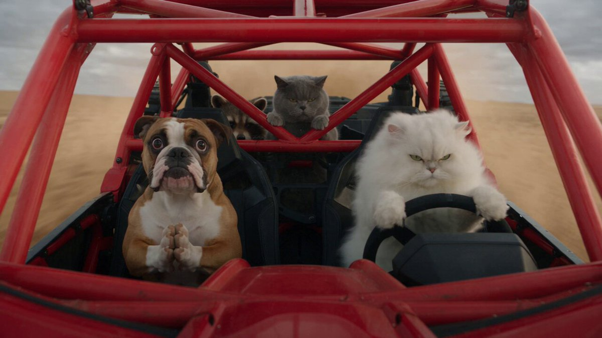
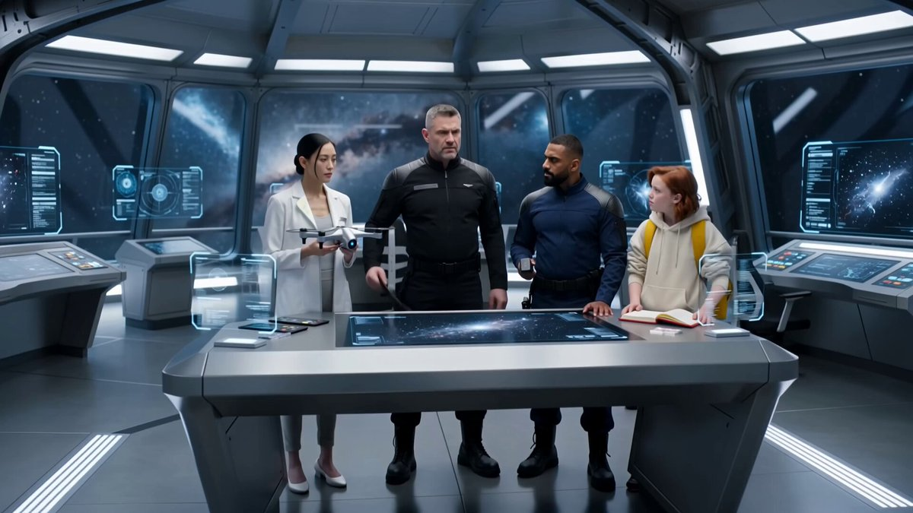
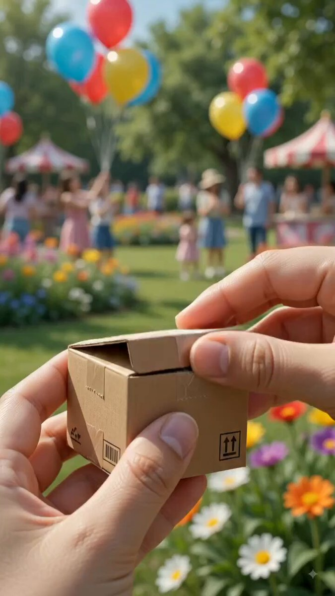
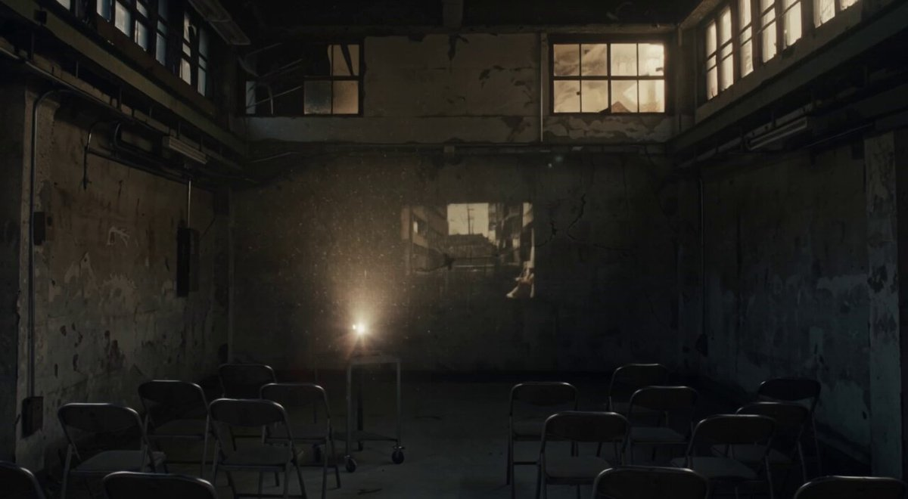

# AI Prompt Radar — 2026-09-02

Bugün bulunan yeni prompt sayısı: **7**

## 1. @woleswoosh

**Puan:** 58.26 &nbsp; **Etkileşim:** ❤ 46 · 🔁 3 · 👁 3371

**Tam prompt:**

~~~text
[Seedance 2.5 Video Prompt] ar 16:9 720p 30s 30-Second Video Storyboard & Detailed Generation Prompt Title: POV: Just Got My License Style: Hyper-realistic AI-generated animal comedy, cinematic, high-speed action, anthropomorphic animals with expressive faces, vibrant colors, motion blur, dynamic camera work. Vertical 9:16 format (phone-optimized). Overall Prompt Seed (use as base for AI video tools like Kling, Runway, Luma, Pika, etc.): “Hyper-realistic cinematic POV-style video of a fluffy pure-white Persian cat with angry green eyes intensely driving a bright-red open-frame off-road buggy at high speed through a dusty desert landscape. Brown-and-white pitbull-type dog in the passenger seat, terrified, paws clasped in prayer, wide eyes, seatbelted. Gray British Shorthair cat and a raccoon in the back seats looking nervous. Red roll-cage, black racing seats, motion blur, wind-blown fur, realistic fur details, dramatic lighting, funny expressions, 30 seconds.” Detailed 30-Second Storyboard 0–4s | Opening Wide Shot – Chaos Begins Camera: Wide interior view from slightly behind, looking forward through the red roll-cage. Action: Red off-road buggy racing fast across a dry, sandy desert trail under overcast sky. White fluffy Persian cat (driver) grips the black steering wheel with both paws, eyes narrowed in pure concentration/anger, body leaning into turns. Brown-and-white dog (passenger) sits bolt upright in black racing seat with harness, paws pressed together in front of chest like praying, eyes huge and terrified. Gray cat and raccoon visible in the back, holding on. Wind rips through fur, slight camera shake, motion blur on background. Audio cue: Engine roar + wind. Prompt detail: “White Persian cat angrily driving red buggy, terrified praying dog passenger, gray cat and raccoon in back, high-speed desert, motion blur, realistic fur.” 4–9s | Close-up on Driver – Focus Mode Camera: Slow push-in / close-up on the white Persian cat’s face and paws on the wheel. Action: Cat’s green eyes locked forward, brows furrowed, fluffy white fur whipping in the wind, paws firmly turning the wheel left and right as the vehicle swerves. Background slightly blurred with speed. Dog’s praying paws and part of the gray cat visible at the edge of frame. Prompt detail: “Extreme close-up of fluffy white Persian cat with angry green eyes gripping black steering wheel, wind-blown fur, intense driving expression, red roll-cage visible.” 9–15s | Passenger Panic Close-up Camera: Quick cut to tight close-up of the dog’s face and upper body. Action: Dog’s eyes even wider, mouth slightly open in silent scream/prayer, paws still clasped tightly under chin, head slightly bouncing with every bump. Raccoon peeks from behind the seat looking worried. Red cage and desert blur past. Prompt detail: “Close-up of brown-and-white dog with huge terrified eyes and paws clasped in prayer, seatbelted in red buggy, raccoon peeking behind, high-speed motion.” 15–22s | Wide Group Shot – Full Chaos Camera: Return to wide interior shot, slight handheld shake. Action: Full view again – white cat still aggressively steering, dog still praying with eyes closed for a second then reopening in horror, gray cat looking stoic but tense in middle back, raccoon gripping the cage. Buggy hits a small bump, all animals bounce slightly. Dust flies. Prompt detail: “Wide shot inside red off-road buggy: angry white Persian cat driving, praying terrified dog, gray cat and raccoon in back, all reacting to high-speed desert driving, realistic animal expressions.” 22–28s | Escalation – Maximum Fear Camera: Alternating quick cuts – 1s on dog’s praying face (eyes squeezed shut), 1s on cat’s focused angry face, back to wide. Action: Dog now has eyes tightly closed while still praying, cat’s fur more dramatically blown, vehicle feels even faster. Background rushes past. Prompt detail: “Rapid cuts between terrified dog praying with eyes closed and determined white cat driving furiously, red buggy speeding through desert.” 28–30s | Freeze / End Beat Camera: Final wide shot freezes for a beat or slows slightly. Action: Dog still praying, cat still locked in, everyone holding on. Subtle text overlay possible: “POV: Just Got My License”. Fade or hard cut to black. Prompt detail: “Final wide shot of the same animal crew in the red buggy at high speed, dog praying, cat driving angrily, freeze-frame energy.” Extra Tips for Generation Keep the same characters consistent across clips: white fluffy Persian (driver), brown-white praying dog (passenger), gray cat + raccoon (back). Emphasize: realistic fur physics, exaggerated but believable facial expressions, strong motion blur, red cage reflections. Sound design suggestion (add in post): roaring engine, wind howl, occasional tire skid, dramatic music that builds then cuts. Total runtime target: exactly 30 seconds by slightly extending the wide shots and adding one extra bump reaction. This storyboard recreates and extends the original ~20s video into a clean 30-second version while staying true to the hilarious “new driver” energy.
~~~

[Kaynak paylaşımı X'te aç ↗](https://x.com/woleswoosh/status/2089995739078529271)

---

## 2. @john_my07

**Puan:** 53.19 &nbsp; **Etkileşim:** ❤ 51 · 🔁 1 · 👁 2046

**Tam prompt:**

~~~text
Seedance 2.0 on OpenArt AI Prompt: 15-second ultra-realistic cinematic sci-fi sequence. Inside a breathtaking futuristic spaceship command bridge overlooking a glowing blue nebula through massive panoramic windows. Sleek metallic architecture, holographic control panels, animated star maps, soft blue volumetric lighting, premium Hollywood sci-fi production. Four recurring characters remain perfectly consistent throughout the sequence: Character A: Mission Captain in a black tactical uniform carrying a black command tablet. Character B: Lead Scientist in a white futuristic lab coat carrying a silver drone. Character C: Chief Security Officer in a navy tactical uniform carrying a holographic scanner. Character D: Young Systems Engineer wearing a cream hoodie and yellow technical backpack, carrying a red engineering notebook. Every character must preserve the exact same face, hairstyle, outfit, body proportions and assigned prop across every shot. Never swap identities, clothing or props. The camera begins with a wide establishing shot of the bridge before smoothly pushing toward the Captain. It gently orbits around the command table as the Scientist activates the hovering drone, the Security Officer scans holographic displays, and the Engineer studies the notebook while operating nearby consoles. The camera transitions into a cinematic tracking shot as the team collaborates around the glowing galaxy map. A slow crane-up reveals the full bridge, panoramic windows, distant stars, animated holograms and every character working naturally together. Finish with a dramatic pull-back showing the entire bridge and the four characters maintaining perfect continuity. Natural interactions, subtle gestures, realistic eye contact, believable teamwork, physically accurate lighting, reflections on metallic surfaces, coherent environment, premium production design, smooth camera transitions, blockbuster cinematography, highly detailed live action, excellent prompt adherence, strong multi-character consistency, stable identity preservation and accurate prop binding. Negative: identity drift, face changes, prop swapping, wardrobe changes, duplicated characters, disappearing objects, incorrect props, flickering faces, unstable camera, blurry details, distorted anatomy, CGI look, cartoon, low quality.
~~~

[Kaynak paylaşımı X'te aç ↗](https://x.com/john_my07/status/2088284675446108165)

---

## 3. @Nexoraupnp

**Puan:** 49.64 &nbsp; **Etkileşim:** ❤ 18 · 🔁 3 · 👁 517

**Tam prompt:**

~~~text
Video Prompt: A cinematic ultra-realistic macro video of a miniature cotton candy machine being assembled in a colorful outdoor festival garden. A hand carefully opens a tiny cardboard package, revealing polished miniature machine parts. The camera smoothly pushes in as the transparent dome is unwrapped from protective plastic, reflecting sunlight and vibrant balloons floating in the background. Delicate fingers place the crystal-clear dome onto the shiny metal spinner, creating satisfying ASMR-style assembly moments. The miniature cotton candy cart sits among blooming flowers while colorful balloons sway gently in the breeze. Soft golden sunlight creates beautiful bokeh and dreamy depth of field. The machine powers on with subtle mechanical movements, and pastel pink and blue cotton candy begins forming inside the transparent dome. The camera slowly circles around the tiny machine, capturing intricate details, reflections, and spinning motion. Ultra-detailed miniature craftsmanship, shallow depth of field, vibrant festival atmosphere, photorealistic textures, cinematic lighting, smooth camera movements, macro lens photography, premium product-commercial style, 8K quality, HDR, realistic hand interactions, colorful flowers, floating balloons, magical whimsical mood, highly satisfying visual storytelling.
~~~

[Kaynak paylaşımı X'te aç ↗](https://x.com/Nexoraupnp/status/2094014916789416350)

---

## 4. @KrishnaBio1

**Puan:** 43.62 &nbsp; **Etkileşim:** ❤ 3 · 🔁 1 · 👁 397

**Tam prompt:**

~~~text
VIDEO PROMPT 1 Create a 13-second ultra-realistic cinematic vertical 9:16 travel video of a breathtaking Mediterranean cliffside village overlooking crystal-clear turquoise sea. Start from a high scenic viewpoint and slowly move the camera forward along the coastline, revealing beautiful whitewashed houses, blue doors, balconies, stone terraces, historic towers, and dramatic rocky cliffs. The camera gently glides downward toward the sea while several small wooden boats and luxury yachts move naturally across the water. Sunlight sparkles on the turquoise waves, while trees and flowering plants move softly in the coastal breeze. Use smooth drone-style movement, realistic water and boat physics, warm golden sunlight, atmospheric depth, subtle lens flare, cinematic depth of field, premium travel-film look, ultra-photorealistic 4K/8K quality.
~~~

[Kaynak paylaşımı X'te aç ↗](https://x.com/KrishnaBio1/status/2094751769075085600)

---

## 5. @ImaStudio_ai

**Puan:** 37.53 &nbsp; **Etkileşim:** ❤ 8 · 🔁 2 · 👁 697

**Tam prompt:**

~~~text
A 30-second AI video prompt isn’t really a prompt anymore. It’s a director’s brief. 🎬 For this luxury watch UGC ad, I structured it like this: → Lock character + product consistency → Break the 30s into clear story beats → Define the camera for each moment → Add negative constraints for common failures The flow: Unboxing → Product Detail → Wrist Macro → Mirror Try-On → Testimonial → Hero Shot What I’m learning from longer AI video is simple: You’re not describing one beautiful shot anymore. You’re directing continuity. And for commercial work, I care less about the price of one generation and more about: Prompt adherence × consistency × usable rate. That’s the real cost. Full Canvas + prompt: https://www.imastudio.com/canvas-editor/detail/prj_1786599379405_5c2be6919a5f6f0f Try Seedance 2.5: https://bit.ly/43v08Oh #AIVideo #AIAdvertising #AIUGC #Seedance25
~~~

[Kaynak paylaşımı X'te aç ↗](https://x.com/ImaStudio_ai/status/2087854426266509547)

---

## 6. @theo

**Puan:** 33.49 &nbsp; **Etkileşim:** ❤ 67 · 🔁 0 · 👁 7686

**Tam prompt:**

~~~text
@SoraKalden I put two days into tuning our prompt for this. Not opposed to making it customizable
~~~

[Kaynak paylaşımı X'te aç ↗](https://x.com/theo/status/2087634221301195249)

---

## 7. @jeffbarry

**Puan:** 33.44 &nbsp; **Etkileşim:** ❤ 0 · 🔁 0 · 👁 260

**Tam prompt:**

~~~text
Flux 3 from a prompt with 8 shots, 20 seconds. Overall really good. Main problems: the video projecting against the wrong wall. And writing the え character is off but all models are having problems writing Japanese kana. Prompt: S04-001 — Dust and light A wide interior view of a small screening room inside an abandoned factory in Kanda. Afternoon light leaks through high windows. Dust floats thickly in the projector beam, sparkling like static. The walls are rough and stained, barely containing the light. S04-002 — Images on the wall A medium-wide shot of the projected film on a cracked wall. Flickering images—trains passing, blurred faces, puddles, street signs—bleed into one another. The frame trembles slightly as the projector hums. S04-003 — Watching A medium shot of Alex seated near the wall, turned three-quarters toward the projection. The moving images wash across his face, fragmenting his features. He watches intently, leaning forward. S04-004 — The frame A tight close-up of Emi’s fingers holding a single frame of film up to the light. The tiny image inside the frame is barely legible. Her fingertips glow where the light passes through. S04-005 — Writing on film A close-up of Emi’s hand writing え on the edge of a discarded reel with a wax pencil. The white mark contrasts sharply against the dark film stock. The background is soft projector flicker. S04-006 — Horizon memory A close-up of Alex’s eyes as he studies the character. Reflected in his pupils is a thin horizontal line of light, reminiscent of a distant horizon dividing sky from city. S04-007 — Shared glow A medium two-shot of Emi and Alex standing close beside the projector. Light spills between them, dust drifting through the beam. Emi glances toward Alex as the images continue to flicker behind them. S04-008 — Light as memory A final close shot of the projected wall as the image momentarily flares brighter, nearly washing out the picture before settling back into grain and shadow.
~~~

[Kaynak paylaşımı X'te aç ↗](https://x.com/jeffbarry/status/2087976501157281962)

---

_Kaynak içerikler ilgili yazarlara aittir; özgün bağlantılar korunmuştur._
