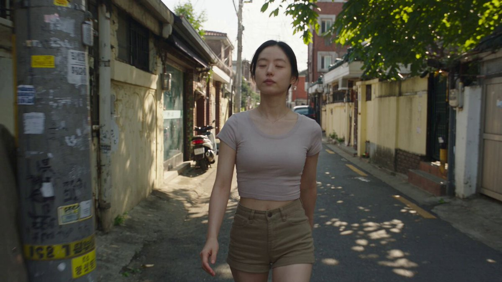
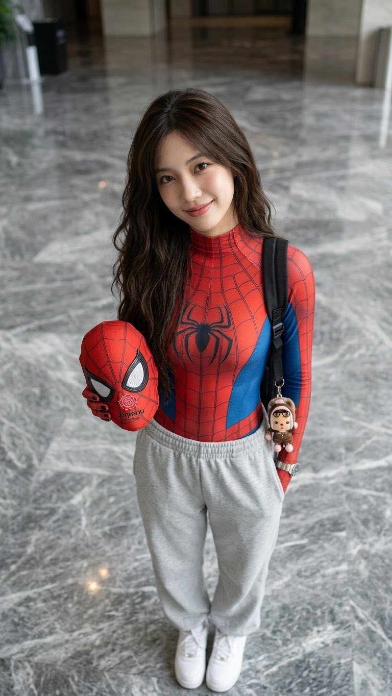
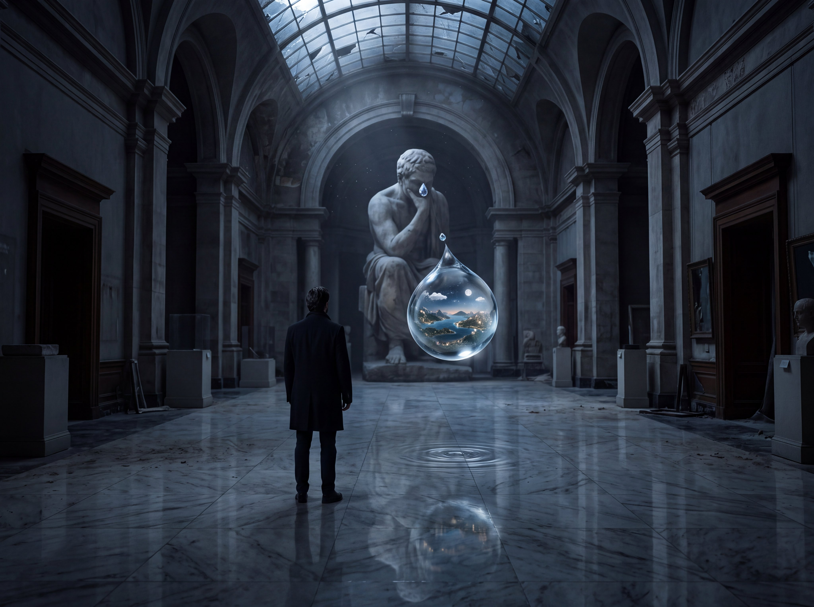
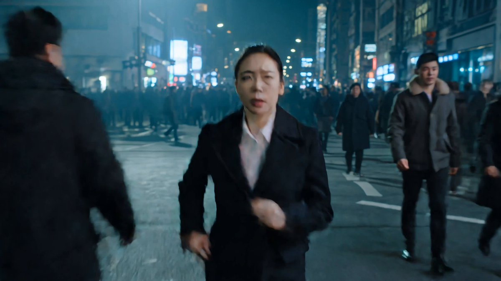
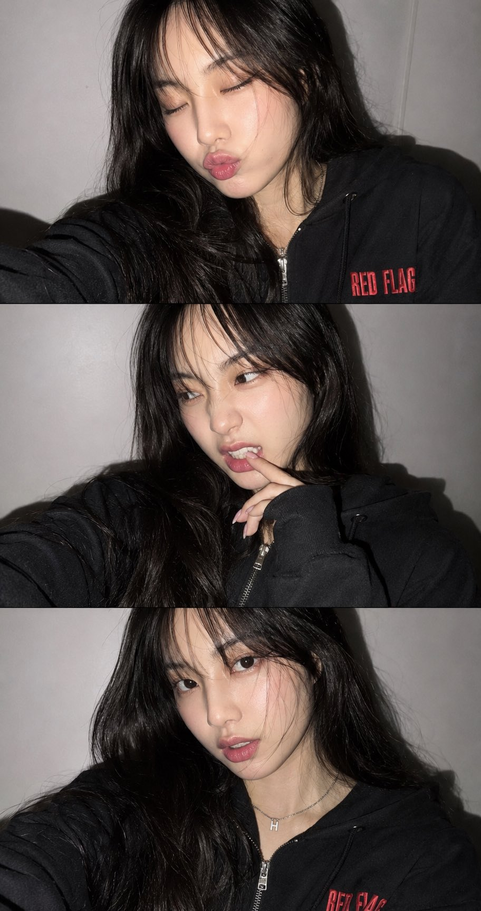
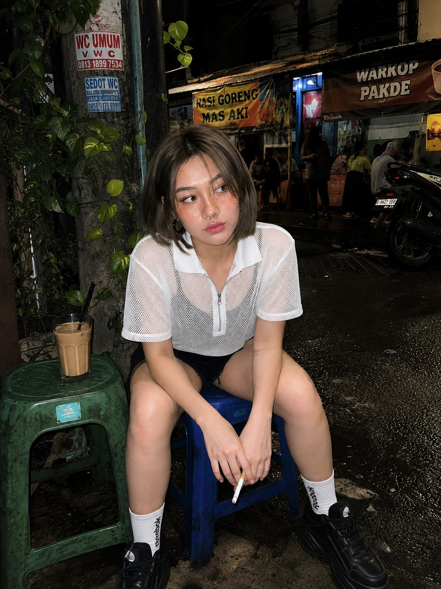

# AI Prompt Radar — 2026-09-03

Bugün bulunan yeni prompt sayısı: **7**

## 1. @john_my07

**Puan:** 65.04 &nbsp; **Etkileşim:** ❤ 146 · 🔁 9 · 👁 8293

**Tam prompt:**

~~~text
Seedance 2.5 at 1080p on OpenArt AI Prompt: Create a highly realistic, cinematic 30-second video for Seedance 2.5 featuring the same young Korean woman throughout the entire sequence, with consistent facial identity, body proportions, hairstyle, clothing, and natural skin texture. SUBJECT: A beautiful Korean woman in her early 20s with a natural, believable appearance. She wears an attractive everyday summer outfit: a fitted cropped T-shirt, stylish high-waisted casual shorts that are fashionable but natural for everyday streetwear, clean black sneakers, and a delicate simple necklace. Her black hair is loosely tied back with a few natural strands framing her face. Minimal makeup, realistic skin texture, subtle imperfections, expressive eyes and a relaxed, confident personality. SETTING: A charming older Korean neighborhood on a warm late-afternoon day. Narrow residential streets, low concrete houses, small local shops, parked bicycles and scooters, utility poles, faded signs, leafy trees, pedestrians in the distance and authentic Korean street details. The environment must feel genuinely lived-in rather than staged. VISUAL STYLE: Ultra-photorealistic cinematic documentary footage with the feeling of an authentic viral street-life video. Natural sunlight, realistic shadows, physically accurate reflections, believable skin and fabric textures, subtle lens imperfections, realistic depth of field and natural motion. High-quality modern capture with occasional handheld movement that feels human-operated, not artificially generated. No excessive beauty filter, plastic skin, CGI appearance or overly perfect composition. 30-SECOND SEQUENCE: 0–5 SEC: The woman walks casually through the narrow neighborhood street toward the camera, occasionally glancing around. A gentle breeze moves her hair and T-shirt naturally. The camera follows her from slightly behind and then moves alongside her. 5–10 SEC: She notices a tiny neighborhood snack shop and slows down. She looks through the open storefront, smiles naturally and walks closer. Capture small spontaneous gestures and realistic eye movement. 10–16 SEC: She orders a popular Korean street snack from the vendor. Show close-up details of the food being prepared: steam rising, utensils moving, sizzling sounds and realistic hand movements. She watches with genuine curiosity and exchanges a short laugh with the vendor. 16–22 SEC: She receives the hot snack, carefully blows on it because it is still hot, then takes her first bite. Her reaction is spontaneous and genuinely happy. Capture a brief close-up of her expression followed by a wider handheld shot. 22–27 SEC: She suddenly notices the camera filming her. She gives a playful surprised smile, steps slightly toward the lens and casually gestures as if inviting the viewer to follow her. Keep the interaction natural and unscripted-looking. 27–30 SEC: She turns and continues walking down the neighborhood lane. The camera follows for a few steps before naturally falling behind. End with her disappearing around a corner while the warm afternoon street ambience continues. CAMERA: Natural handheld cinematography, subtle operator movement, realistic walking camera motion, occasional focus adjustment, natural rack focus between the woman and surroundings, realistic motion blur, mild exposure adaptation and imperfect framing. Mix medium tracking shots, environmental wides, natural close-ups and over-the-shoulder shots. Avoid excessive camera movement or artificial cinematic effects. AUDIO: Authentic Korean neighborhood ambience only: footsteps, distant conversations, birds, passing scooters, bicycles, cooking sounds, light traffic, food sizzling, utensils and natural street noise. Include short natural Korean conversation between the woman and vendor, but keep dialogue casual and understated. NO background music. REALISM REQUIREMENTS: Maintain exact character identity across every shot. No face changes, age changes, hairstyle changes, clothing changes, duplicate people, warped hands, extra fingers, distorted food, floating objects, impossible shadows, inconsistent lighting, artificial facial expressions, unnatural walking, rubbery motion, text artifacts or CGI-looking environments. Every interaction must obey real-world physics. Make the entire sequence feel like genuine footage captured spontaneously in a real Korean neighborhood. FORMAT: 30 seconds, high-quality Seedance 2.5 generation, cinematic realism, natural 16:9 composition, detailed environmental textures, believable human motion, coherent continuity between shots, professional image quality while retaining the authenticity of real handheld street footage.
~~~

[Kaynak paylaşımı X'te aç ↗](https://x.com/john_my07/status/2091554022297936297)

---

## 2. @Naiknelofar788

**Puan:** 60.60 &nbsp; **Etkileşim:** ❤ 70 · 🔁 8 · 👁 2298

**Tam prompt:**

~~~text
GPT image 2 vs Nano Banana Pro Prompt: Create a vintage hand-illustrated travel poster celebrating [COUNTRY / DESTINATION], designed as a poetic visual collage rather than focusing on a single landmark. Feature the destination’s most recognizable landmark, natural landscape, cultural symbols, architecture, local traditions, wildlife, food, transportation, and everyday life, thoughtfully blended into one harmonious scene. Create a strong central focal point featuring [ICONIC LANDMARK / SYMBOL], surrounded by atmospheric layers of [MOUNTAINS / COASTLINE / CITY / COUNTRYSIDE / FOREST / DESERT / RIVER]. Subtly incorporate distinctive local elements such as [CULTURAL ELEMENT 1], [CULTURAL ELEMENT 2], [FOOD / OBJECT], [WILDLIFE], [TRANSPORTATION], and [ARCHITECTURAL DETAILS]. Include tiny human figures, birds, vegetation, distant structures, and delicate environmental details to create a sense of scale, story, and place. Use intricate black ink engraving linework, fine crosshatching, simplified graphic shapes, restrained vintage colors, distressed screen-print texture, subtle ink imperfections, and softly weathered paper. Choose a sophisticated palette inspired by the destination, using 2–5 muted colors such as faded reds, aged blues, sage greens, warm ivory, ochre, dusty browns, or muted charcoal. Create strong visual depth through layered foreground, middle ground, and atmospheric background, with cinematic perspective and generous negative space. The composition should feel handmade, nostalgic, elegant, sophisticated, collectible, and instantly recognizable, while avoiding clutter and excessive photorealism. Add elegant period-inspired vintage typography: “[COUNTRY / DESTINATION]” prominently at the top “[SHORT TAGLINE]” beneath it Authentic 1940s–1950s international travel-poster aesthetic, vintage editorial illustration, hand-printed character, subtle film grain, aged paper texture, imperfect registration, nostalgic yet timeless design, sophisticated visual storytelling, cinematic composition, premium collectible art print, vertical 9:16.
~~~

[Kaynak paylaşımı X'te aç ↗](https://x.com/Naiknelofar788/status/2095040547878765034)

---

## 3. @Naiknelofar788

**Puan:** 58.57 &nbsp; **Etkileşim:** ❤ 57 · 🔁 2 · 👁 2931

**Tam prompt:**

~~~text
Catch if if you can Gemini nano banana pro Prompt: { "generation_directive": { "identity_source": { "instruction": "The uploaded reference photograph is the sole and definitive source for the subject's identity", "requirements": [ "Preserve facial identity with maximum precision", "Maintain exact face shape and jawline", "Replicate eye shape and eyebrow structure precisely", "Match nose, lips, and skin tone exactly", "Preserve beard/mustache if present in reference", "Retain original hairstyle, texture, and hairline", "Keep ears and natural facial proportions unchanged", "Match original expression" ], "restriction": "No redesigning, beautifying, stylizing, or altering the person's appearance in any way" }, "pose_and_composition": { "instruction": "Duplicate the composition from the reference photo with maximum fidelity", "match_parameters": [ "head tilt", "neck angle", "shoulder positioning", "body orientation", "arm placement", "wrist rotation", "finger positioning", "hand placement", "hip alignment", "leg stance", "foot placement", "weight distribution", "overall posture" ] }, "camera_setup": { "angle": "elevated, downward-looking shot", "height": "identical to reference", "focal_length": "approximately 35-50mm equivalent", "subject_distance": "identical to reference", "crop": "identical to reference", "vertical_composition": "identical to reference", "perspective_distortion": "matched to reference" }, "wardrobe": { "instruction": "Outfit must match the reference exactly", "items": [ "fitted red-and-blue Spider-Man compression suit with classic spider emblem on chest", "light grey oversized jogger sweatpants", "clean white sneakers", "black backpack worn on both shoulders", "Spider-Man mask held naturally in the left hand" ], "detail_matching": "Every clothing detail, color, fit, wrinkle, fold, logo, proportion, and texture must closely mirror the reference" }, "setting": { "location": "contemporary indoor building lobby", "flooring": "polished grey marble", "lighting_quality": "soft, neutral", "reflections": "realistic on floor surface", "background": "minimal distractions", "depth_of_field": "shallow" }, "lighting": { "type": "soft, natural indoor lighting", "skin_rendering": "realistic tones", "exposure": "balanced", "dynamic_range": "cinematic HDR", "shadows": "natural, no harsh contrast" }, "rendering_style": { "type": "ultra-realistic DSLR photography, editorial portrait style", "resolution": "8K", "detail_level": "extremely detailed skin texture, realistic hair strands", "anatomy": "accurate", "lighting_physics": "physically correct", "color": "premium grading", "focus": "sharp", "quality": "photorealistic, free of AI artifacts" }, "priority_hierarchy": [ "Exact facial identity from uploaded reference", "Exact pose replication", "Exact camera angle and framing", "Exact outfit recreation", "Maximum overall realism" ], "negative_prompt": { "exclude": [ "different face", "altered hairstyle", "different expression", "different body proportions", "different pose", "different hand position", "different camera angle", "different perspective", "different crop", "different clothing", "different backpack", "different shoes", "missing Spider-Man mask", "extra accessories", "unrealistic anatomy", "oversmoothed skin", "cartoon style",
~~~

[Kaynak paylaşımı X'te aç ↗](https://x.com/Naiknelofar788/status/2084616399713104363)

---

## 4. @Madhuribhai

**Puan:** 58.14 &nbsp; **Etkileşim:** ❤ 58 · 🔁 1 · 👁 4827

**Tam prompt:**

~~~text
4k AI IMAGE PROMPT — THE WORLD INSIDE A TEAR Created with nano banana pro @openart_ai Create an extraordinarily detailed, photorealistic cinematic image of a solitary human figure standing completely still in an enormous abandoned museum at night. The museum is dark, silent, and architecturally majestic, with towering classical walls, enormous empty frames, marble floors, and faint moonlight entering through a shattered glass ceiling. The person is seen from behind, wearing a simple, elegant black coat. Their face is NOT visible. The central visual phenomenon: a single enormous tear is falling from one of the eyes of a gigantic stone statue positioned at the far end of the museum. But instead of ordinary liquid, the tear is a perfectly transparent miniature universe. Inside the falling droplet exists an impossibly detailed alternate world — tiny mountains, oceans, cities, thunderstorms, forests, roads filled with microscopic headlights, and a tiny moon — all physically contained inside the spherical tear. The tear is frozen in midair approximately one meter above the marble floor, creating a breathtaking optical illusion. Its surface reflects the entire museum with perfect physical accuracy while the miniature world inside remains alive and illuminated. Hundreds of ordinary museum objects subtly interact with the phenomenon: dust particles suspended in moonlight, fragments of broken glass reflecting tiny galaxies, old paintings whose subjects appear to be looking toward the tear, and shallow ripples forming on the marble beneath it despite the droplet never touching the floor. Make the human figure extremely small compared with the statue and architecture, emphasizing scale and existential wonder. Lighting: realistic moonlight mixed with extremely subtle natural illumination coming from inside the tear. Strong volumetric light rays, physically accurate reflections, realistic refraction through the water, delicate shadows, cinematic contrast, natural atmospheric haze. Camera: low cinematic perspective, 35mm full-frame lens, shallow but controlled depth of field, extremely high dynamic range, carefully composed leading lines directing the eye from the person → statue → floating tear. Aesthetic: surreal concept executed with absolute photorealism. It must look like a real photograph captured by an elite cinematographer, NOT digital art. Ultra-fine skin, fabric, marble, dust, glass and water textures. Physically believable optics. Ray-traced reflections and refractions. Micro-details everywhere. Natural film grain. Subtle lens imperfections. No excessive glow. Composition should feel like a once-in-a-lifetime photograph that makes the viewer stop scrolling and stare. 8K detail, photorealistic, cinematic masterpiece, museum-scale composition, surreal realism, optical illusion, emotionally haunting, sophisticated visual storytelling, award-winning photography.
~~~

[Kaynak paylaşımı X'te aç ↗](https://x.com/Madhuribhai/status/2094049290142532056)

---

## 5. @Diplomeme

**Puan:** 54.64 &nbsp; **Etkileşim:** ❤ 79 · 🔁 4 · 👁 1854

**Tam prompt:**

~~~text
Kling 3.0 4K Try it with prompt : High-octane, hyper-realistic KITKAT commercial sequence in the style of Christopher Nolan, shot on actual 70mm IMAX cameras in a city. Fast-paced multi-shot editing with cinematic cuts timed at exactly one shot every 2 seconds across a complete 15-second timeline. A woman rushes through the city before stopping for KITKAT break. Nolan-esque grading with deep shadows, cold teals, and bright KITKAT red highlights. Headlights and screens pierce the night, reflecting across the wrapper and pavement. Rapid sequence of intense cuts: •Shot 1 (0-2s): Eye-level tracking shot of the woman rushing through a crowded city street as commuters surround her. •Shot 2 (2-4s): Tight close-up of her tired face and skin texture, phone notifications and city lights reflecting in her eyes. •Shot 3 (4-6s): Low-angle handheld camera whip-panning upward from her hands to her silhouette as she reaches into her bag for a KITKAT. •Shot 4 (6-8s): Ground-level macro shot of the wrapper, crisp chocolate surface, wafer layers, and her fingers opening the bar naturally. •Shot 5 (8-10s): Fast tracking shot behind the woman as she breaks the KITKAT cleanly in two, the iconic snap cutting through chaos. •Shot 6 (10-12s): High-angle wide shot of the city intersection, crowds, vehicles, and particles slowing dramatically as she takes a bite. •Shot 7 (12-14s): Shaky handheld tracking shot following her moment as the city moves around her, KITKAT held naturally in frame. •Shot 8 (14-15s): Hard cut to KITKAT red with the product centered as the chocolate snap fades into silence, ending on: “HAVE A BREAK, HAVE A KITKAT.” Raw documentary camera textures, organic lens flares, lifelike physics, authentic chocolate texture, realistic skin texture, natural crowd movement, cinematic motion blur, and the contrast between urban chaos and a KITKAT break. Ultra-detailed, 4k.
~~~

[Kaynak paylaşımı X'te aç ↗](https://x.com/Diplomeme/status/2093559937746313606)

---

## 6. @Naiknelofar788

**Puan:** 51.76 &nbsp; **Etkileşim:** ❤ 105 · 🔁 3 · 👁 4277

**Tam prompt:**

~~~text
GPT image 2 on chatGPT Prompt: Do not change the facial features or hair color. 100% likeness. Create a realistic image. A three-frame vertical collage (photo booth / photo booth grid) consisting of three close-up selfies of the same girl, showing different natural, lively emotions. Camera angle: Close-up face / portrait, vertical format. Frames & Emotions Top frame: The girl has her eyes closed and is making a duck-face pout. Middle frame: Playfully bold expression — the girl slightly scrunches her nose and casually bites her finger while looking sideways. Bottom frame: A carefree, confident expression — looking directly into the camera through a slightly falling strand of hair, with her lips slightly parted in a flirtatious expression. Around her neck is a delicate silver chain with a pendant. Well-groomed manicure. Clothing, Background & Lighting Clothing: Black (charcoal) oversized hoodie / zip-up hoodie with a red “RED FLAG” print. Background & Lighting: Minimalist white/light-colored wall. Lighting is a harsh direct camera flash, creating sharp, defined shadows of the girl on the wall, in a Y2K and late-night party photography style. Shot on an iPhone 17, with realistic mobile-phone processing, no excessive plastic-like skin smoothing, natural depth of field, subtle digital noise, and delicate film grain.
~~~

[Kaynak paylaşımı X'te aç ↗](https://x.com/Naiknelofar788/status/2088319375694827602)

---

## 7. @Naiknelofar788

**Puan:** 48.68 &nbsp; **Etkileşim:** ❤ 63 · 🔁 1 · 👁 2692

**Tam prompt:**

~~~text
GPT image 2 on chatGPT Prompt: Create an image using the uploaded reference photo without changing the face Subject: A young woman with fair skin and a natural rosy complexion, featuring subtle natural freckles across her nose and cheeks, giving her an innocent and youthful appearance. She has short, layered ash-brown bob hair with a middle part, with a few loose strands falling across part of her face and forehead. Her most striking features are her light brown eyes and naturally curled eyelashes. She has naturally pink, soft, plump, glossy lips and wears a septum piercing. She is dressed in the outfit shown in the second reference image. Preserve the subject’s facial identity exactly as in the uploaded reference photo, including all facial features, proportions, skin tone, hairstyle, tattoos, and piercings. Pose: The subject is sitting casually on a small blue plastic stool. Her legs are slightly apart, and her hands rest on her lap or are holding a cigarette. She is wearing a subtle smile or softly laughing while looking to her left (outside the frame), creating a relaxed, candid, and natural expression. Camera Angle: Eye-level shot. Background: A busy Indonesian urban alleyway or neighborhood street. Beside her is an electrical pole or signboard partially covered with green climbing vines. Behind her are small roadside food stalls or kiosks with colorful banners, along with several parked motorcycles. An iced coffee drink sits on a green plastic stool to her left. The ground appears dusty or slightly wet, adding to the authentic street atmosphere. Lighting: Harsh direct flash photography, creating strong, well-defined shadows behind the subject and causing parts of her skin to appear slightly overexposed, resulting in a raw, candid snapshot aesthetic. generate one more pose
~~~

[Kaynak paylaşımı X'te aç ↗](https://x.com/Naiknelofar788/status/2084827784007008557)

---

_Kaynak içerikler ilgili yazarlara aittir; özgün bağlantılar korunmuştur._
