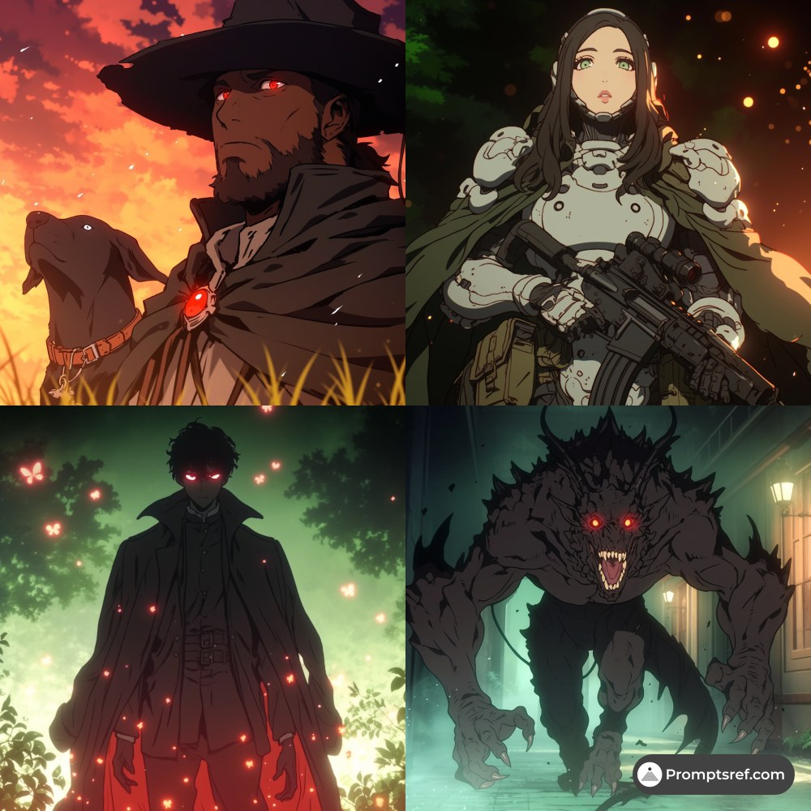
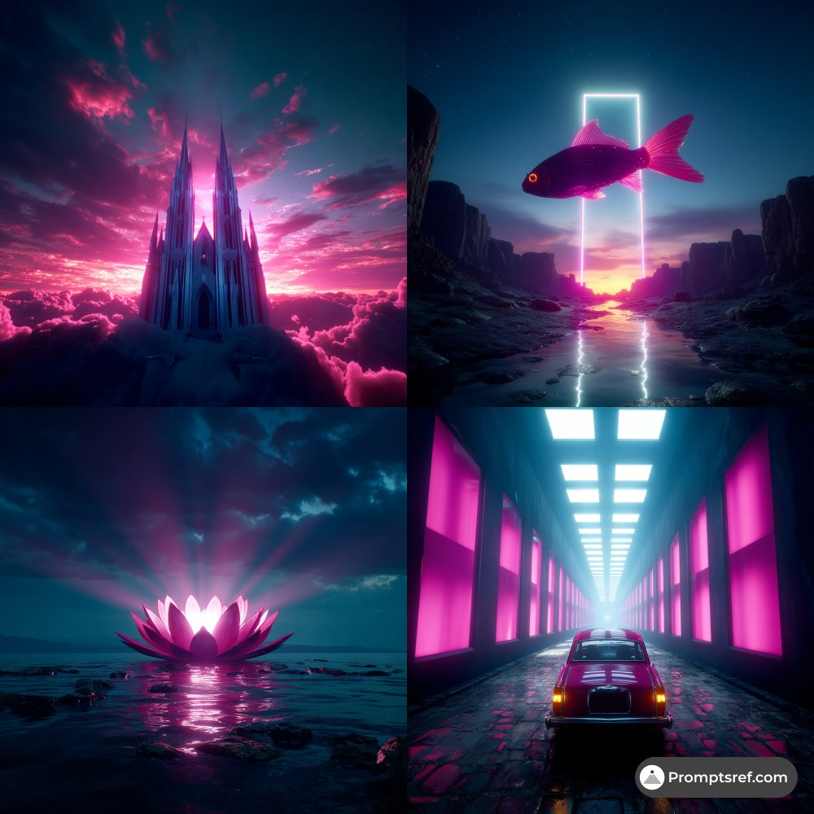
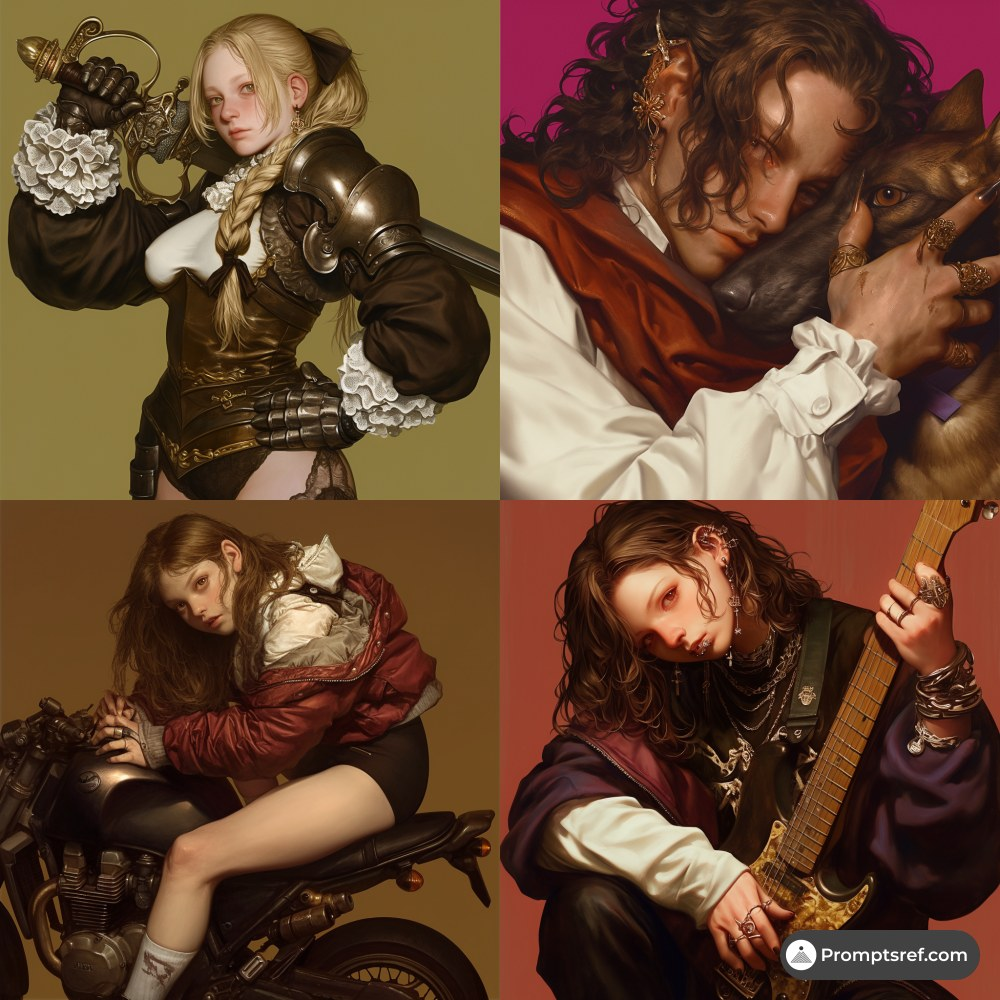
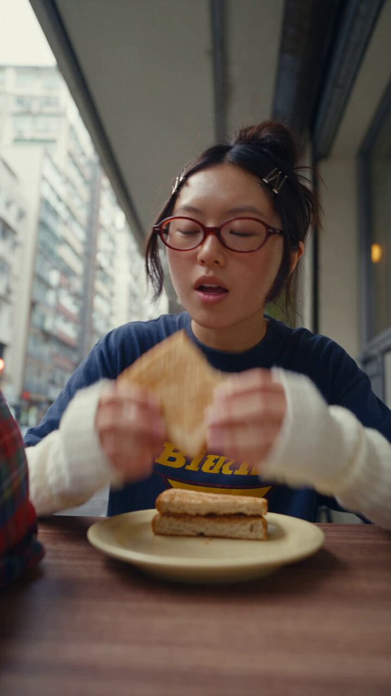

# AI Prompt Radar — 2026-09-04

Bugün bulunan yeni prompt sayısı: **5**

## 1. @Shubhambais05

**Puan:** 45.54 &nbsp; **Etkileşim:** ❤ 87 · 🔁 21 · 👁 4013

**Tam prompt:**

~~~text
🚨 AI VIDEO PROMPTS ARE GETTING CRAZY GOOD. Most people type “make a cinematic video” and wonder why the result looks generic. The real difference is in the instructions. Here are 8 prompts to turn your AI video ideas into scroll-stopping content. 👇
~~~

[Kaynak paylaşımı X'te aç ↗](https://x.com/Shubhambais05/status/2086128956370293227)

---

## 2. @promptsref

**Puan:** 44.09 &nbsp; **Etkileşim:** ❤ 13 · 🔁 4 · 👁 607

**Tam prompt:**

~~~text
Dark anime meets film noir: red glows, deep shadows, cinematic tension. Perfect for game characters, dark fantasy posters, album covers, and moody concept art. Full prompt in comments. --sref 1251982947 #midjourney #sref
~~~

[Kaynak paylaşımı X'te aç ↗](https://x.com/promptsref/status/2086528251296419845)

---

## 3. @promptsref

**Puan:** 43.24 &nbsp; **Etkileşim:** ❤ 15 · 🔁 2 · 👁 501

**Tam prompt:**

~~~text
Neon magenta + cyan, cinematic cyberpunk vibes with a dreamy retro-future edge. Perfect for game art, album covers, and sci-fi posters. Full prompt in comments to recreate it: --sref 3752849068 #midjourney #sref
~~~

[Kaynak paylaşımı X'te aç ↗](https://x.com/promptsref/status/2090922029218197781)

---

## 4. @promptsref

**Puan:** 40.10 &nbsp; **Etkileşim:** ❤ 11 · 🔁 0 · 👁 750

**Tam prompt:**

~~~text
Neo-Baroque meets fashion editorial: cinematic portraits with sculpted light, tactile metals/leather, and melancholic luxury. Perfect for fantasy characters, luxury ads, cover art. Full prompt in comments. --sref 374056684 #midjourney #sref
~~~

[Kaynak paylaşımı X'te aç ↗](https://x.com/promptsref/status/2085803327887938007)

---

## 5. @ImaStudio_ai

**Puan:** 38.30 &nbsp; **Etkileşim:** ❤ 17 · 🔁 1 · 👁 814

**Tam prompt:**

~~~text
100% AI. Cost me a few dollars. 30 seconds. One Seedance 2.5 generation. No shoot, no creator, no reshoots, no editing. She doesn’t exist. The face stays consistent. The voice syncs. The camera shake feels handheld. The little pauses actually feel human. This is what AI UGC looks like now. The expensive part isn’t just the generation. It’s the bad prompt that makes you run it 5 times. 😭 For 30s AI video, prompt structure matters more than ever. Full Canvas + prompt 👇 https://www.imastudio.com/canvas-editor/detail/prj_1786603926947_fefd7b4d61166b21 Try more : https://bit.ly/4fES5pl #AIVideo #AIUGC #Seedance25 #AIAdvertising
~~~

[Kaynak paylaşımı X'te aç ↗](https://x.com/ImaStudio_ai/status/2088826833428988264)

---

_Kaynak içerikler ilgili yazarlara aittir; özgün bağlantılar korunmuştur._
