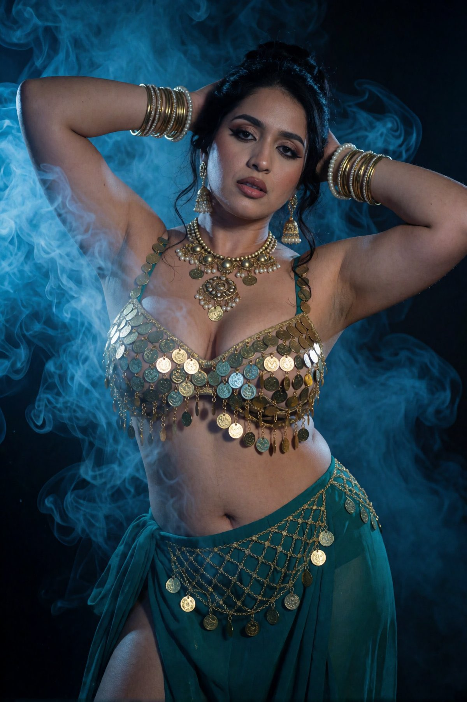
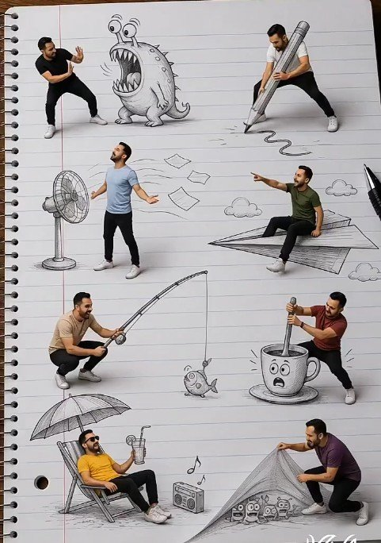
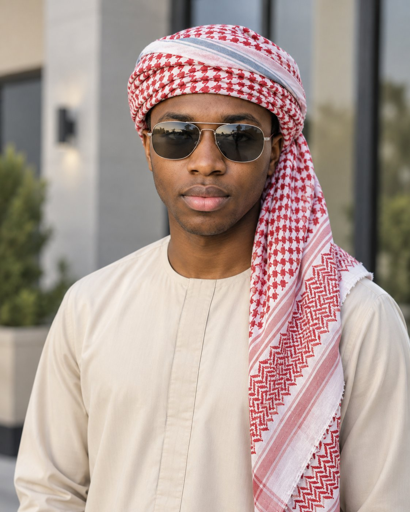
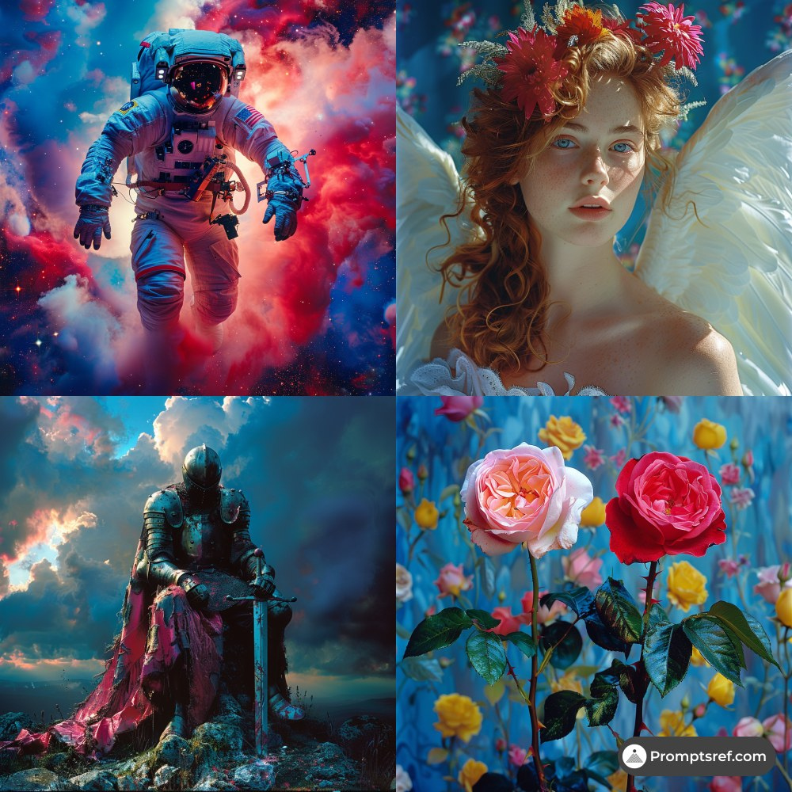
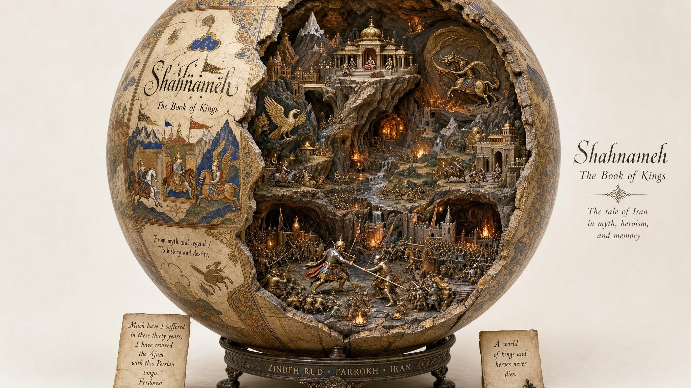

# AI Prompt Radar — 2026-09-05

Bugün bulunan yeni prompt sayısı: **7**

## 1. @jarvis_og_AI

**Puan:** 60.62 &nbsp; **Etkileşim:** ❤ 177 · 🔁 12 · 👁 9975

**Tam prompt:**

~~~text
Prompt: Generate an ultra-photorealistic 8K cinematic portrait recreating this exact image. Keep the face 100% identical to the reference — same facial structure, eyes, nose, lips, skin texture, expression, and identity. Do not alter or beautify the face. Subject & Pose A voluptuous Indian woman standing facing the camera with both arms raised, hands behind her head, elbows flared outward. Confident, direct gaze with slightly parted lips and defined smoky eye makeup. Dark hair pulled into a messy high bun with a few loose strands framing the face. Natural skin with visible pores, subtle sheen, and realistic body texture. Wardrobe & Jewelry Teal-green coin-covered bralette densely layered with hanging gold coins of mixed sizes and tones that drape over the chest. Matching sheer teal wrap skirt with high side slit, gold chain-link mesh overlay across the hips, and dangling gold coins. Heavy traditional gold jewelry: large statement necklace with pearls and layered coin pendants, ornate jhumka earrings, stacks of thick gold bangles mixed with pearl bangles on both wrists. Environment & Atmosphere Dark studio setting with thick swirling blue-tinted smoke and fog wrapping around her body and fading into the background. Moody, atmospheric haze. Lighting & Mood Dramatic cinematic lighting with cool blue rim light and soft volumetric glow cutting through the smoke. Subtle highlights on the gold coins and skin, deep shadows for contrast. High dynamic range, rich color, slightly mysterious and sensual mood. Camera & Technical Shot on Sony A7R V, 85mm f/1.4 lens, f/1.8, shallow depth of field, creamy bokeh, 8K UHD, RAW quality. Hyper-detailed textures on coins, fabric, jewelry, and skin. Natural film grain. Negative prompt altered face, different identity, plastic skin, over-smoothed skin, extra limbs, deformed hands, extra jewelry, wrong outfit color, bright background, cartoon, illustration, low resolution, watermark, text.
~~~

[Kaynak paylaşımı X'te aç ↗](https://x.com/jarvis_og_AI/status/2095208808670953839)

---

## 2. @Arzoo12sh

**Puan:** 56.70 &nbsp; **Etkileşim:** ❤ 1107 · 🔁 208 · 👁 77960

**Tam prompt:**

~~~text
Try this prompt with your favorite video 0 👇 ① Open Gemini / Grok / GPT video 0 2.0 ② Choose a picture ③ Copy the prompt ④ Create your video. Prompt:2️⃣)(⤵️
~~~

[Kaynak paylaşımı X'te aç ↗](https://x.com/Arzoo12sh/status/2088076688249041383)

---

## 3. @Arzoo12sh

**Puan:** 52.05 &nbsp; **Etkileşim:** ❤ 62 · 🔁 9 · 👁 6689

**Tam prompt:**

~~~text
Prompt video🎬 Create a cinematic surreal animation starting with a large white spiral notebook covered with detailed pencil drawings on a wooden table. The pencil drawings magically come to life and interact with photorealistic human characters. Show smooth dynamic movements: a giant pencil is used for drawing, a cartoon monster reacts to a frightened man, a powerful fan blows loose paper sheets through the scene, a man rides a giant paper airplane, another man fishes for a tiny cartoon fish, a giant coffee cup reacts with a surprised face while being stirred, a man relaxes under a beach umbrella with music playing nearby, and another man lifts a giant paper sheet revealing tiny cartoon characters underneath. Use realistic camera movement, close-ups, smooth transitions between each scene, natural human motion, realistic shadows, detailed pencil textures, cinematic depth of field, playful surreal comedy, seamless integration between 2D pencil sketches and 3D real people, high-quality photorealistic AI video, vertical 9:16.
~~~

[Kaynak paylaşımı X'te aç ↗](https://x.com/Arzoo12sh/status/2088076698172694544)

---

## 4. @abs_uiux

**Puan:** 49.22 &nbsp; **Etkileşim:** ❤ 42 · 🔁 4 · 👁 1408

**Tam prompt:**

~~~text
Wait… this isn’t a real photoshoot. One reference image. One detailed prompt. And somehow AI created this. Created using GPT 2 image. Prompt: Use the uploaded photo as the facial identity reference. Create an ultra-realistic outdoor portrait of an adult man, framed vertically from the mid-torso upward. Position him slightly off-center, standing upright and facing the camera with a calm, composed expression and relaxed closed lips. Dress him in a traditional light beige/cream long-sleeve kaftan, made from smooth premium fabric with a minimalist round neckline and subtle vertical stitching down the center. Keep the outfit simple, elegant, and free of visible logos or excessive embroidery. Wrap a large red-and-white patterned keffiyeh/shemagh scarf around his head in a layered turban-style arrangement. The scarf should feature detailed red geometric checkered and zigzag woven patterns against a white base. Wrap it securely around the crown while allowing a long section to fall naturally down one side of his face, across his shoulder, and over the front of his chest. Include a subtle light-blue accent stripe within the upper wrapped section. Give him a clean-shaven face with no beard or mustache. Most of the hair should remain concealed beneath the headscarf. Add stylish silver metal-frame aviator sunglasses with large lightly mirrored gray lenses, a thin double bridge, and slim temples. Include realistic but subtle outdoor reflections across the lenses. Use a softly blurred modern architectural exterior in the background, featuring neutral beige and gray walls, large glass surfaces, vertical structural elements, and understated contemporary details. Keep the background heavily defocused with smooth creamy bokeh so all attention remains on the subject. Use soft natural daylight with gentle illumination across the face, realistic medium-brown skin texture, balanced highlights, subtle shadows, natural lip color, and accurate fabric textures. Maintain a sophisticated warm-neutral color palette dominated by beige, cream, red, white, and muted gray. Shot with the aesthetic of a professional 85mm portrait lens at approximately f/1.8, shallow depth of field, eye-level camera angle, sharp facial details, realistic skin pores, highly detailed woven scarf texture, natural proportions, premium editorial photography, photorealistic DSLR quality, high dynamic range, clean color grading, ultra-realistic, 8K detail, vertical 4:5 composition. Avoid: beard, mustache, jewelry, necklace, earrings, logos, text, excessive skin smoothing, distorted facial features, unrealistic scarf patterns, oversaturated colors, artificial-looking skin, harsh shadows, or distracting background elements.
~~~

[Kaynak paylaşımı X'te aç ↗](https://x.com/abs_uiux/status/2095838115692757421)

---

## 5. @promptsref

**Puan:** 39.06 &nbsp; **Etkileşim:** ❤ 8 · 🔁 0 · 👁 464

**Tam prompt:**

~~~text
Daily share: this sref delivers a clean cinematic vibe with strong contrast and polished detail - ideal for posters, product shots, and moody concepts. Full prompt in comments. Try your prompt --sref 4232064976 #midjourney #sref
~~~

[Kaynak paylaşımı X'te aç ↗](https://x.com/promptsref/status/2094757892263952615)

---

## 6. @Gdgtify

**Puan:** 36.07 &nbsp; **Etkileşim:** ❤ 3 · 🔁 1 · 👁 211

**Tam prompt:**

~~~text
Mai 2.6 vs. Nano Banana Pro vs GPT vs. Reve. I like Nano Banana for this because it lets me do manga and other topics but GPT handles the details much better Prompt: 16:9 select * from artifact_diorama_archives where subject_media = '[media_title]' and base_structure = 'giant_hollowed_out_sphere_cracked_open' and exterior_shell = ( select manuscript_aesthetic, typography from cultural_heritage_db where lore = '[media_title]' format as 'flat_2d_painted_fresco_and_calligraphy_on_outer_curve' ) and interior_payload_strata = array[ (level: 'upper_apex', asset: 'infer_climactic_fortress_or_throne([media_title])'), (level: 'middle_caverns', asset: 'infer_mythological_creatures_and_terrain([media_title])'), (level: 'lower_basin', asset: 'infer_epic_armies_and_waterways([media_title])') ] and materials = 'carved_stone_wood_and_antiqued_gold' and optical_engine = 'macro_photography_depth_of_field';
~~~

[Kaynak paylaşımı X'te aç ↗](https://x.com/Gdgtify/status/2095942973934698532)

---

## 7. @TechieBySA

**Puan:** 33.22 &nbsp; **Etkileşim:** ❤ 8 · 🔁 0 · 👁 528

**Tam prompt:**

~~~text
MiniMax H3 video prompt: “Create a 15-second 16:9 animated MEME POPS website UI video in pop art comic style — bold black outlines, Ben-Day halftone dots, CMYK colors, Roy Lichtenstein aesthetic. UI LAYOUT: MEME POPS logo top-left. Nav bar center (HOME, MEMES, GAMES, COLLECTION). Star score top-right. Left sidebar with 6 character rows. Large hero center. Title and tagline right. SEND MEME button bottom-right. UI never moves or rotates. SIDEBAR ORDER — FIXED, NEVER CHANGES: Row 1 = Roll Safe (man pointing finger to temple) — “ROLL SAFE” Row 2 = Doge (Shiba Inu dog) — “DOGE” Row 3 = Success Kid (toddler with clenched fist) — “SUCCESS KID” Row 4 = Salt Bae (man sprinkling salt) — “SALT BAE” Row 5 = Nick Young (man with question marks) — “NICK YOUNG” Row 6 = Side Eye Chloe (blonde girl in car seat) — “SIDE EYE CHLOE” Every thumbnail face must exactly match its label. No shifting. No mismatches. CURSOR: Moves forward only, top to bottom, never backward. One character per timestamp. BACKGROUNDS — NEVER GREY OR DARK: ROLL SAFE = electric blue, starburst rays, pink brains, lightbulbs DOGE = bright yellow, “wow” speech bubbles, paw prints SUCCESS KID = sandy orange-yellow, fist icons, star bursts SALT BAE = rich gold, salt sparkles, sunglasses icons NICK YOUNG = bright purple, floating question marks, comic bursts SIDE EYE CHLOE = lavender-pink, side-arrow doodles, deadpan icons SEQUENCE: 0:00–0:02.4 — ROLL SAFE hero. Title: ROLL SAFE. Tagline: THINK SMARTER, NOT HARDER. Voice: “Roll Safe!” 0:02.4–0:04.6 — DOGE hero. Title: DOGE. Tagline: MUCH WOW, VERY ICE CREAM. Voice: “Doge!” 0:04.6–0:06.8 — SUCCESS KID hero. Title: SUCCESS KID. Tagline: NAILED IT. Voice: “Success Kid!” 0:06.8–0:09.0 — SALT BAE hero. Title: SALT BAE. Tagline: EXTRA. ALWAYS. Voice: “Salt Bae!” 0:09.0–0:11.2 — NICK YOUNG hero. Title: NICK YOUNG. Tagline: WAIT… WHAT? Voice: “Nick Young!” 0:11.2–0:13.5 — SIDE EYE CHLOE hero. Title: SIDE EYE CHLOE. Tagline: NOT IMPRESSED. Voice: “Side Eye Chloe!” 0:13.5–0:15 — Side Eye Chloe remains. Cursor clicks SEND MEME. Button jelly bounces with comic burst. MEME POPS logo pulses. Freeze. TRANSITIONS: Each cursor move triggers — sidebar row highlights → character swooshes in with 360° Y-axis spin + motion blur → eases out front-facing with soft bounce → title, tagline and background all update simultaneously. AUDIO: Upbeat comic music, brass hits, record scratches. Per transition: hover tick → swoosh → boing → voice callout. STRICT: No backward cursor. No mismatched thumbnails. No grey backgrounds. No UI rotation. No spelling errors. Vivid saturated backgrounds always. 16:9 exactly 15 seconds.”
~~~

[Kaynak paylaşımı X'te aç ↗](https://x.com/TechieBySA/status/2094739955041935569)

---

_Kaynak içerikler ilgili yazarlara aittir; özgün bağlantılar korunmuştur._
