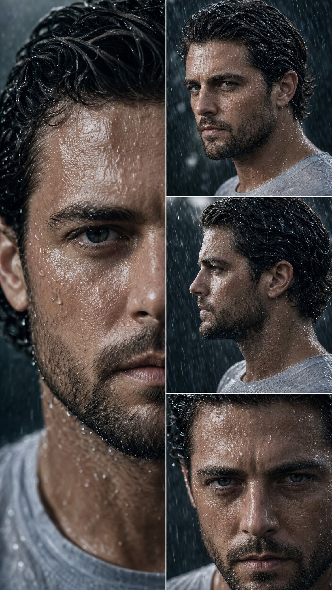

# AI Prompt Radar — 2026-09-11

Bugün bulunan yeni prompt sayısı: **4**

## 1. @Mayz1169

**Puan:** 48.15 &nbsp; **Etkileşim:** ❤ 150 · 🔁 16 · 👁 12356

**Tam prompt:**

~~~text
GPT Image 2.5 is so good for dance references generated with Seedance 2.5 on @itsPolloAI Prompt below 👇
~~~

[Kaynak paylaşımı X'te aç ↗](https://x.com/Mayz1169/status/2098051966685635064)

---

## 2. @Adnan_Ai4

**Puan:** 47.90 &nbsp; **Etkileşim:** ❤ 86 · 🔁 44 · 👁 3113

**Tam prompt:**

~~~text
Your photo + this prompt = 🔥 ① Open Gemini / Grok / GPT Image 2.0 ② Upload your photo ③ Copy the prompt ④ Generate. Prompt: ⤵️ part3
~~~

[Kaynak paylaşımı X'te aç ↗](https://x.com/Adnan_Ai4/status/2097154992985735340)

---

## 3. @Alina_with_Ai

**Puan:** 39.63 &nbsp; **Etkileşim:** ❤ 6 · 🔁 0 · 👁 1263

**Tam prompt:**

~~~text
Prompt ⤵️ Prompt Create a high-end editorial travel poster for Colmar, Alsace, France, using the reference image as the visual composition. Top section: a wide, ultra-photorealistic daytime photograph of Colmar’s historic canal district. Show colorful traditional Alsatian half-timbered houses tightly lining a calm canal, with red, pink, cream, yellow, blue, and brown façades, steep tiled roofs, wooden beams, white shutters, flower-filled hanging baskets, pedestrians walking along the waterfront, and a small wooden riverside restaurant terrace. Clear blue sky with soft white clouds, natural sunlight, realistic water reflections, authentic European architecture, cinematic travel photography, sharp architectural details, natural colors, realistic textures, subtle depth of field. Add elegant minimalist typography in the upper-right: “COLMAR” small spaced uppercase letters, with “ALSACE, FRANCE” underneath in a refined minimalist serif/sans-serif style. Bottom section: transform the same Colmar canal scene into a beautiful miniature architectural diorama / isometric 3D model. Show the colorful half-timbered houses, canal, tiny pedestrians, flower baskets, waterfront promenade, and wooden terrace as a carefully crafted physical miniature placed on a clean warm-white rectangular base. Soft studio lighting, realistic miniature materials, detailed model-making craftsmanship, subtle shadows, premium architectural visualization, slightly elevated isometric perspective. Add refined editorial typography around the miniature: “A Little Town by the River” in delicate handwritten script on the left. On the right: “SAME TOWN DIFFERENT PERSPECTIVE” At the lower-left: “Colmar Colorful houses, quiet river, and a slower pace.” Minimal cream/off-white background, sophisticated luxury travel-magazine aesthetic, balanced negative space, muted elegant palette, premium graphic design, clean typography, realistic photography seamlessly contrasted with the miniature 3D interpretation, vertical 4:5 composition, ultra-detailed, photorealistic, 8K quality.
~~~

[Kaynak paylaşımı X'te aç ↗](https://x.com/Alina_with_Ai/status/2098011906732941804)

---

## 4. @meAsifAi

**Puan:** 28.31 &nbsp; **Etkileşim:** ❤ 32 · 🔁 7 · 👁 3544

**Tam prompt:**

~~~text
Created with @openart_ai Prompt 👇🏻
~~~

[Kaynak paylaşımı X'te aç ↗](https://x.com/meAsifAi/status/2096709257102323712)

---

_Kaynak içerikler ilgili yazarlara aittir; özgün bağlantılar korunmuştur._
