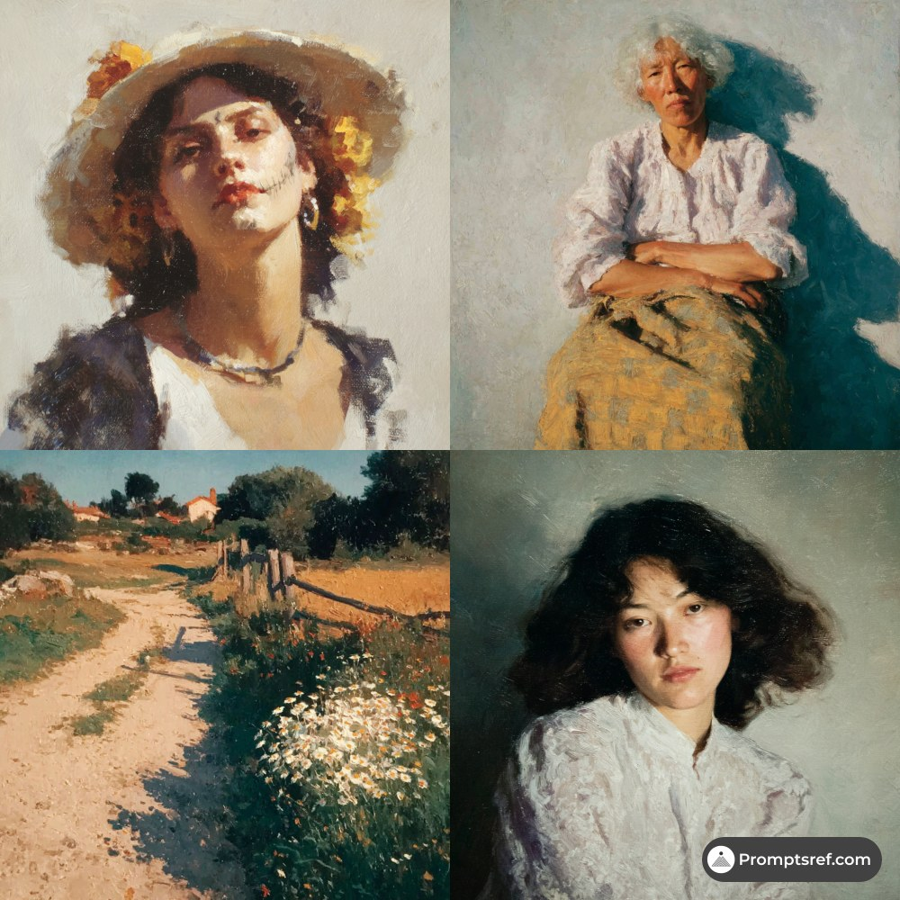

# AI Prompt Radar — 2026-09-13

Bugün bulunan yeni prompt sayısı: **3**

## 1. @Peter05704721

**Puan:** 56.32 &nbsp; **Etkileşim:** ❤ 822 · 🔁 88 · 👁 75026

**Tam prompt:**

~~~text
How I use GPT-6 Astra with Fusion 360 — copy this. 1. Open Fusion. New empty design. 2. Preferences → General → API → enable Fusion MCP Server. 3. Open Codex. Let it install/connect the Fusion MCP. 4. Prompt: connect to Fusion MCP, list tools, confirm the active document. 5. Then ask it to build your part. Put print constraints in the prompt (split shell, clearances, no thin walls). Not GPT desktop clicking. Agent + MCP. https://help.autodesk.com/view/fusion360/ENU/?guid=FMCP-OVERVIEW
~~~

[Kaynak paylaşımı X'te aç ↗](https://x.com/Peter05704721/status/2096409914461856106)

---

## 2. @promptsref

**Puan:** 41.89 &nbsp; **Etkileşim:** ❤ 20 · 🔁 7 · 👁 901

**Tam prompt:**

~~~text
This SREF blends impressionist oil and contemporary portraiture: soft light, muted tones, visible brushwork. Ideal for luxury portraits, book covers, and brand visuals. Full prompt in comments. --sref 2565961260 #midjourney #sref
~~~

[Kaynak paylaşımı X'te aç ↗](https://x.com/promptsref/status/2097037426128511469)

---

## 3. @Soaima_Ai

**Puan:** 39.40 &nbsp; **Etkileşim:** ❤ 13 · 🔁 1 · 👁 1342

**Tam prompt:**

~~~text
Prompt: "A dynamic, high-quality 15-second commercial for a modern aesthetic insulated travel tumbler, TikTok/Reels style, 4k resolution, cinematic commercial lighting. Fast-paced clean cuts: First, a close-up hero reveal of a sleek cream-colored tumbler. Then, hands opening the flip-lid mechanism with a satisfying click. Next, clear water and ice cubes splashing smoothly inside from a top-down view. Transition to the tumbler sitting perfectly in a car cup holder. Then, a cinematic pan across four stylish pastel color variations on a wooden table. A stylish person easily placing the lightweight tumbler into an aesthetic tote bag. Finishes with a crisp hero shot of the product with soft natural daylight and vibrant studio tones."
~~~

[Kaynak paylaşımı X'te aç ↗](https://x.com/Soaima_Ai/status/2097697794408755375)

---

_Kaynak içerikler ilgili yazarlara aittir; özgün bağlantılar korunmuştur._
