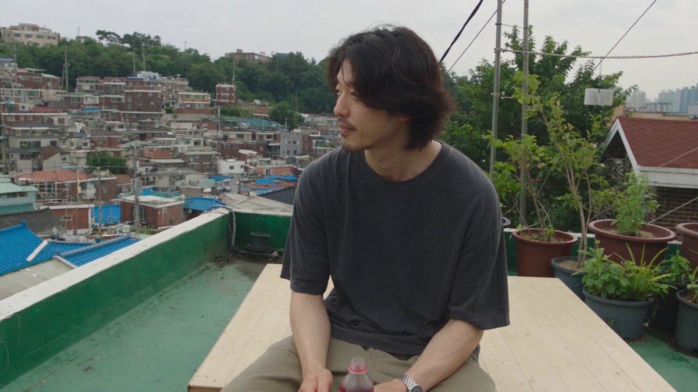
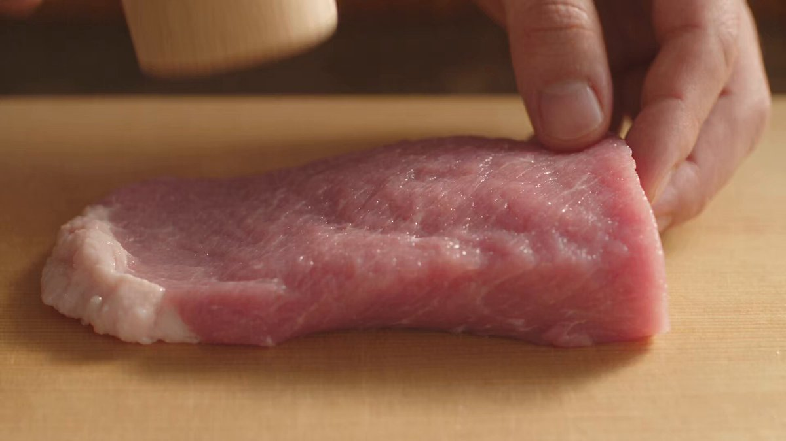
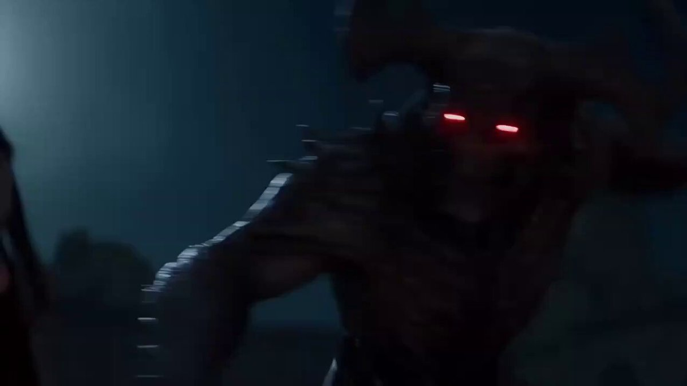
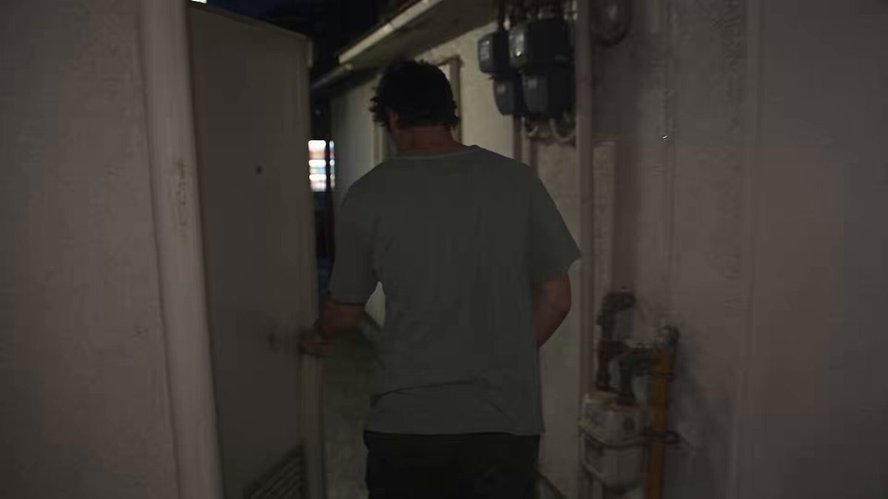
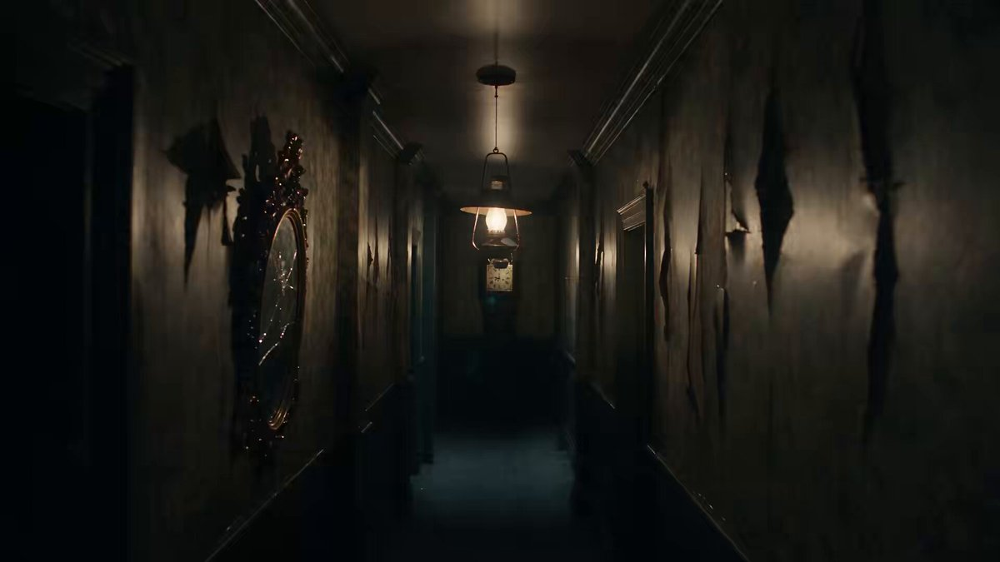
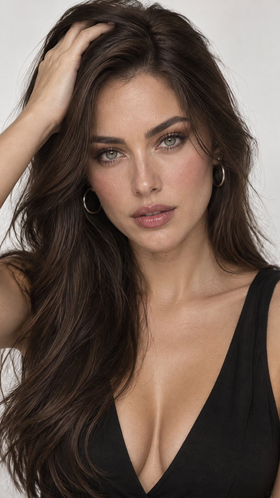
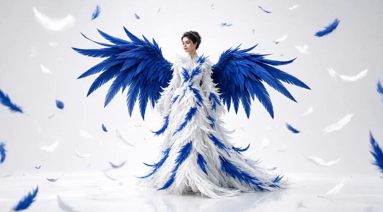
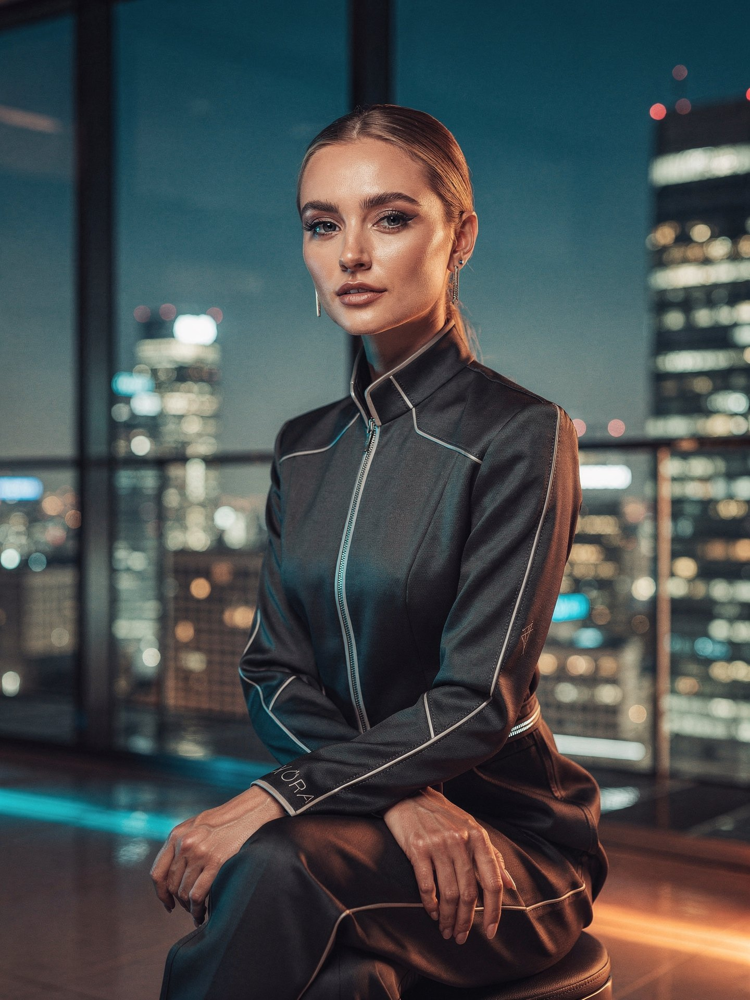

# AI Prompt Radar — 2026-09-16

Bugün bulunan yeni prompt sayısı: **11**

## 1. @Sheldon056

**Puan:** 87.85 &nbsp; **Etkileşim:** ❤ 7067 · 🔁 382 · 👁 5320310

**Tam prompt:**

~~~text
If this is AI slop, keep serving it. Seedance 2.5 on Higgsfield. Prompt: Create a 30-second, 1080p ultra-realistic documentary-style personal home video showing an ordinary summer day in the life of a young Korean man. The footage should feel spontaneous, intimate, imperfect, and genuinely observed rather than performed. MAIN SUBJECT The same young Korean man in his early 20s throughout the entire video. Naturally handsome, realistic skin texture, minimal styling, relaxed expression, slightly tired but peaceful eyes. He has naturally messy medium-length dark hair with a few strands falling over his forehead and very subtle stubble. He wears a loose washed-black T-shirt, relaxed olive-beige trousers, worn white sneakers, and a simple silver wristwatch. Keep his face, identity, body proportions, hairstyle, clothing, watch, and overall appearance completely consistent from beginning to end. LOCATION A quiet older residential neighborhood in Seoul during a warm summer afternoon. Narrow concrete alleys, low-rise homes, rooftop terraces, external staircases, potted plants, laundry lines, parked bicycles, utility poles, overhead wires, mature trees, concrete walls, small residential courtyards, and distant city sounds. The neighborhood should feel authentic and lived-in. No crowds, tourist attractions, advertisements, recognizable brands, or commercial activity. CAMERA / VISUAL STYLE Authentic casual personal-video footage captured with an older consumer digital camera. Handheld camera operated by a friend walking nearby. Natural camera shake, imperfect framing, occasional autofocus changes, slight exposure adjustments when moving between sunlight and shade, soft image detail, mild motion blur, subtle digital noise, slightly muted colors, imperfect white balance, and natural compression. The camera operator occasionally reacts a little late, cuts off part of the subject, or briefly loses focus. No stabilization, gimbal movement, drone shots, cinematic camera choreography, dramatic lighting, slow motion, modern commercial color grading, or polished cinematography. The footage should feel like someone simply decided to record his friend during an ordinary day. --- 00:00–00:05 — MORNING ROOFTOP He sits casually on a small rooftop beside an old plastic chair. A cold bottled drink rests beside him. He looks quietly across the neighborhood while the wind moves his hair and T-shirt. He takes a sip, notices something happening in the distance, and smiles faintly. He briefly notices the camera and gives a subtle nod before looking away. The camera takes a moment to find focus on his face. --- 00:05–00:10 — WALKING THROUGH THE ALLEY He gets up and walks downstairs into the neighborhood. He walks casually through a narrow concrete alley with his hands in his pockets. He passes parked bicycles, potted plants, laundry hanging from balconies, and old residential walls. The camera follows several steps behind him. He occasionally looks back toward the camera but never deliberately poses. His footsteps remain naturally synchronized with his movement. --- 00:10–00:14 — SMALL EVERYDAY MOMENT He notices an old basketball resting near a wall. He picks it up, casually bounces it twice, then takes a simple shot toward a nearby hoop. The shot misses. He laughs quietly, shakes his head, and leaves the ball where he found it. The camera briefly loses focus during the movement and recovers naturally. No exaggerated athletic movement. --- 00:14–00:19 — LOCAL SHOP He walks to a tiny neighborhood shop and buys a cold drink. He exchanges a few natural words with the shopkeeper but the conversation is not clearly audible. He steps outside, opens the bottle, takes a drink, and leans casually against the wall. He watches bicycles and pedestrians passing in the distance. The camera remains handheld and slightly imperfect. --- 00:19–00:23 — SUMMER RAIN A sudden summer shower begins. He looks toward the sky with mild surprise. Instead of immediately running for shelter, he smiles and slowly walks into the rain. The rain becomes heavier. His hair becomes wet and falls naturally across his forehead. He eventually starts running down the alley, laughing genuinely. He briefly spins around while running, then continues toward a covered walkway. His clothes become visibly damp. Maintain realistic rain interaction, wet fabric, wet hair, reflections, and foot contact with the ground. --- 00:23–00:27 — QUIET MOMENT He reaches the covered walkway and catches his breath. Rain falls heavily behind him. He wipes water from his forehead and looks quietly toward the street. For a moment, everything becomes still. He notices the camera again. He gives a small genuine smile, not a posed expression. --- 00:27–00:30 — WALKING AWAY The rain becomes lighter. He walks away down the wet residential lane. The camera follows from behind. Reflections shimmer across the concrete. He turns his head once, gives a tiny wave toward the camera, smiles, and continues walking. The camera remains pointed toward the empty street for a brief moment. At approximately 00:29, the recording abruptly cuts to black mid-motion. No fade-out. --- PHYSICAL REALISM Maintain believable real-world physics throughout. Hands, fingers, feet, clothing, hair, rain, bottle, basketball, and background objects must behave naturally. No extra fingers, fused hands, duplicated limbs, distorted anatomy, floating objects, teleportation, disappearing objects, or sudden transformations. The bottle remains a separate physical object and never intersects with his face. The basketball behaves naturally and remains where it lands. Parked bicycles and background objects remain stationary unless physically moved. His feet remain properly connected to the ground while walking and running. Keep the environment and subject consistent between shots. --- AUDIO Natural environmental audio only. Footsteps on concrete, distant traffic, birds, leaves moving in the wind, bicycles, faint neighborhood conversations, shop sounds, bottle opening, basketball bouncing, rain hitting concrete, water dripping from rooftops, and subtle camera-handling noise. No music. No narration. No soundtrack. No artificial sound effects. No spoken dialogue is necessary. --- FINAL FEEL The result should feel like a forgotten personal recording of an ordinary summer day. Not a commercial. Not a fashion film. Not a music video. Not a professional cinematic production. The emotional appeal should come from small human moments: sitting alone, wandering through familiar streets, missing a basketball shot, drinking something cold, getting caught in the rain, laughing, and walking home. Quiet, masculine, youthful, nostalgic, slightly melancholic, warm, spontaneous, and deeply human. Prioritize natural behavior, consistent identity, believable physics, imperfect handheld framing, authentic environmental details, and the feeling that the camera happened to be there.
~~~

[Kaynak paylaşımı X'te aç ↗](https://x.com/Sheldon056/status/2091396663718117706)

---

## 2. @Goodmanprotocol

**Puan:** 79.61 &nbsp; **Etkileşim:** ❤ 4875 · 🔁 266 · 👁 10355796

**Tam prompt:**

~~~text
So delicious 😋 Seedance 2.5 Prompt: Create a 30-second fast-paced cinematic Japanese anime cooking video showing the preparation of authentic katsudon, entirely from the text description below. IMPORTANT: Do not display, recreate, trace, reference, or imitate any storyboard, sketch, reference image, panel, annotation, or source material. Generate only original anime-style animation. STYLE High-quality Japanese anime film style, cinematic summer lighting, ultra-detailed food textures, realistic cooking physics, visible steam and moisture, shallow depth of field, macro close-ups, smooth camera movement, warm Japanese kitchen atmosphere. Fast rhythmic editing with natural match cuts based on movement, shape, texture, and composition. TIMELINE 0–2.5s — Prepare Pork Close-up of hands pounding a thick pork loin with a wooden mallet on a cutting board. The meat gradually flattens and its fibers loosen. Sprinkle salt and pepper evenly. Crisp rhythmic impacts. 2.5–5s — Bread the Pork Quick match cuts: press the pork into flour, dip into beaten egg, then firmly coat with coarse panko breadcrumbs. Show realistic egg dripping and breadcrumbs adhering to the surface. 5–7.5s — Fry Lower the breaded pork into hot golden oil. Intense bubbling surrounds the cutlet as the crust turns golden brown and crispy. Warm cinematic lighting and detailed oil movement. 7.5–9.5s — Slice Place the fried tonkatsu on a wooden board. A sharp knife cuts it into even strips. The crispy crust cracks naturally, revealing juicy white pork with gentle steam escaping. 9.5–12s — Simmer Dashi & Onion Thinly sliced onions gently simmer in amber dashi inside a shallow pan. Small bubbles rise while the onions become translucent. Chopsticks gently move them through the broth. 12–14s — Add Tonkatsu Place the sliced tonkatsu carefully over the simmering onions using chopsticks. The broth begins soaking into the crispy edges while steam rises. 14–16.5s — Pour Egg Slowly pour beaten golden egg over the tonkatsu and onions. The egg spreads naturally through the gaps and begins setting around the hot edges. 16.5–19s — Set the Egg Close-up of the egg gently coagulating over low heat. Edges become soft and golden while the center remains glossy, slightly runny, and trembling. No stirring. 19–21s — Prepare Rice A white ceramic donburi bowl receives a generous mound of steaming Japanese short-grain rice. The rice looks fluffy and slightly glossy. 21–24s — Assemble Carefully slide the egg-and-tonkatsu mixture from the pan onto the rice. The egg settles naturally in a soft wave while dashi lightly absorbs into the rice. 24–26s — Final Close-Up The finished katsudon rests on the counter. Glossy egg slowly settles over the tonkatsu and rice, gently trembling. Slow cinematic push-in. 26–30s — Hero Reveal Present the finished katsudon in a traditional blue-and-white ceramic bowl on a wooden surface. Golden egg covers crispy tonkatsu over glossy rice, topped with fresh mitsuba. Steam rises as the camera slowly arcs around the bowl for a beautiful anime-food-film ending. AUDIO Bright 1980s-inspired Japanese city-pop instrumental, 110–120 BPM, with subtle koto and light chime percussion. Synchronize realistic ASMR cooking sounds: mallet impacts, knife slicing, frying sizzle, bubbling dashi, chopsticks, egg pouring, steam, and a soft ceramic clink. End with one delicate wind-chime tone during the final reveal. NEGATIVE No storyboard, reference image, sketch, panels, borders, numbers, arrows, annotations, subtitles, captions, UI, logos, or text overlays. No unrelated ingredients or dishes. Katsudon only. Keep the food, hands, utensils, lighting, and environment visually consistent throughout.
~~~

[Kaynak paylaşımı X'te aç ↗](https://x.com/Goodmanprotocol/status/2098845134326808734)

---

## 3. @DuaFatimaAi

**Puan:** 65.18 &nbsp; **Etkileşim:** ❤ 105 · 🔁 21 · 👁 4001

**Tam prompt:**

~~~text
Gpt image 2 via chat gpt Prompt Video Prompt Create a 15-second cinematic, ultra-realistic luxury haircare commercial for Pantene Pro-V. Scene 1: A beautiful young woman in a premium modern shower gently massages rich white shampoo foam into her long, wet dark hair. Close-up beauty shots, smooth wet skin, natural expression, soft steam, warm golden lighting, elegant bathroom atmosphere. Scene 2: Transition into an extreme macro product shot of a glossy golden Pantene Pro-V capsule/oil droplet resting on sleek wet black hair. Tiny water droplets and sparkling particles surround it. Use dramatic reflections, shallow depth of field, creamy golden bokeh, premium beauty-ad aesthetic, slow-motion camera movement. Scene 3: Reveal the complete Pantene Pro-V haircare range — shampoo, conditioner, and treatment — beautifully arranged on a glossy marble surface. Warm sunlight streams through elegant windows in the background, with floating golden particles and water droplets creating a luxurious atmosphere. Camera: cinematic macro photography, slow dolly movements, smooth transitions, extreme close-ups, 85mm beauty lens, shallow depth of field, realistic skin and hair textures, HDR, soft highlights, premium commercial lighting. End with a clean luxury beauty composition and the message: “PANTENE PRO-V — STRONG HAIR, BEAUTIFUL YOU” Photorealistic, high-end beauty advertising, elegant, sophisticated, visually rich, realistic product packaging, no distorted hands, no extra products, no flickering, no warped text
~~~

[Kaynak paylaşımı X'te aç ↗](https://x.com/DuaFatimaAi/status/2091116976588411347)

---

## 4. @DuaFatimaAi

**Puan:** 60.96 &nbsp; **Etkileşim:** ❤ 60 · 🔁 11 · 👁 1061

**Tam prompt:**

~~~text
Gpt image 2 via chat gpt Prompt Bilku— is video jaisaEnglishAI video prompt: Prompt: > Create a cinematic, ultra-realistic coffee commercial featuring a premium blue coffee sachet placed beside a clear glass of iced black coffee. The scene is set on a bed of roasted coffee beans inside a warm, cozy café, with a softly blurred coffee-shop background and beautiful shallow depth of field. Start with a wide product shot, then slowly push the camera toward the coffee. Show the blue sachet pouring rich, dark coffee smoothly into a glass filled with crystal-clear ice cubes, creating realistic swirling liquid, reflections, and condensation. Use warm café lighting, natural highlights, detailed coffee beans, realistic liquid physics, and premium commercial cinematography. End with a clean hero shot of the coffee sachet standing beside the finished iced black coffee. Smooth camera movement, macro details, photorealistic textures, elegant advertising aesthetic, 4K, cinematic depth of field
~~~

[Kaynak paylaşımı X'te aç ↗](https://x.com/DuaFatimaAi/status/2099814272926994882)

---

## 5. @AiwithAlyar

**Puan:** 58.81 &nbsp; **Etkileşim:** ❤ 45 · 🔁 4 · 👁 1492

**Tam prompt:**

~~~text
A woman swallows a sword of light, transforming into a winged archangel to battle demons in dark ruins. Created with Seedance 2.0 Prompt: Cinematic dark fantasy video. A young woman in a blood-stained white dress swallows a glowing sword of pure white light. Divine energy bursts from her, her eyes flash solid blinding white, and massive white feathered angel wings erupt from her back with a floating halo above her head. She transforms into a radiant archangel holding a luminous glowing weapon, fighting shadowy demonic monsters with glowing red eyes in ancient stone ruins under a full moon. Beams of holy light crash from the sky into the ground, vaporizing the dark creatures. Ultra-detailed, 8k resolution, cinematic lighting, epic motion effects, unreal engine 5 render style. ​AI Image Prompt (For Midjourney / DALL-E 3 / Stable Diffusion) ​Epic dark fantasy screenshot, a female archangel warrior in a blood-splattered white dress standing in ancient stone ruins under a full moon. She has glowing white eyes, a luminous halo, and massive magnificent white wings fully spread out. She holds a vertical staff of blinding white light touching the ground. Massive pillars of celestial light beam down into a circular courtyard surrounding her, dark fantasy mood, hyper-realistic detail, 8k resolution, cinematic film still. --ar 16:9
~~~

[Kaynak paylaşımı X'te aç ↗](https://x.com/AiwithAlyar/status/2099004075329073647)

---

## 6. @Sheldon056

**Puan:** 55.68 &nbsp; **Etkileşim:** ❤ 94 · 🔁 1 · 👁 11539

**Tam prompt:**

~~~text
The closer AI gets to real life, the crazier this gets. Seedance 2.5 on Higgsfield. Prompt: WORLD: A quiet residential neighborhood at night with a warm, nostalgic atmosphere. A young man steps out for a late-night snack and slowly walks home through familiar streets. He buys food, sits outside for a while, encounters a small everyday moment, and continues home. The world feels ordinary, lived-in, nostalgic, and real. CHARACTER: Young man, early 20s, natural appearance, slightly messy dark hair, subtle stubble. Wearing a faded grey T-shirt, loose dark trousers, worn sneakers, and a simple wristwatch. Tired but relaxed. Signature gesture: runs his fingers through his hair when thinking. Keep his face, identity, hairstyle, clothing, and proportions consistent. STYLE: Raw handheld personal-video footage. Natural camera shake, imperfect framing, autofocus hunting, exposure shifts between bright shop lights and dark streets, soft details, mild digital noise, muted colors, slight motion blur, and realistic low-light imperfections. No cinematic lighting, stabilization, dramatic camera movement, slow motion, or polished commercial look. SCENE: An older residential neighborhood at night. Narrow streets, modest apartment buildings, small food shops, vending machines, parked bicycles, concrete sidewalks, overhead wires, trees, quiet storefronts, and warm windows in the distance. Natural audio: footsteps, distant traffic, insects, refrigerator hum, shop door sounds, bicycles, faint conversations, wind, and nighttime city ambience. FULL SCRIPT: LOCK: Maintain the same character, clothing, environment, objects, and realistic physics throughout. Camera remains handheld and physically present. OPEN — 0:00–0:06 He leaves his apartment carrying a small wallet. He locks the door, checks his pockets, and starts walking. He looks toward the camera and says, “Just getting something to eat.” BUILD — 0:06–0:12 He enters a small neighborhood shop and looks through the shelves. He picks up a bottled drink and a simple snack, pays, and steps outside. The bright indoor light briefly causes the camera exposure to adjust. TURN — 0:12–0:18 He sits on a low wall outside the shop and opens his snack. A stray cat appears nearby. He notices it, breaks off a tiny piece of food, and places it on the ground. The cat approaches cautiously. He smiles quietly. SUSTAIN — 0:18–0:25 He continues walking home. The street is almost empty. He passes parked bicycles and apartment entrances. He stops beneath a streetlight, takes a drink, looks up at the night sky for a moment, then continues walking. CLOSE — 0:25–0:30 He reaches his apartment entrance. Before going inside, he turns toward the camera and says, “I’m going to sleep.” He gives a small tired smile, opens the door, and disappears inside. The camera remains outside for a few seconds before the recording cuts to black. NEGATIVE: No modern smartphones, recognizable brands, advertisements, logos, famous people, copyrighted characters, contemporary luxury environments, cinematic glamour, perfect framing, stabilization, drone shots, slow motion, exaggerated acting, identity changes, outfit changes, distorted anatomy, floating objects, teleportation, unrealistic physics, music, narration, subtitles, or artificial sound effects. FINAL FEEL: A forgotten personal recording of a completely ordinary night. Quiet, slightly lonely but comforting, masculine, nostalgic, imperfect, and deeply human. The realism should come from small details, natural movement, believable nighttime lighting, subtle expressions, and the feeling that the camera happened to be there.
~~~

[Kaynak paylaşımı X'te aç ↗](https://x.com/Sheldon056/status/2093184863746551815)

---

## 7. @iamrealsnow

**Puan:** 47.03 &nbsp; **Etkileşim:** ❤ 70 · 🔁 0 · 👁 1596

**Tam prompt:**

~~~text
I created this 30 sec horror clip entirely with Seedance 2.5 and the quality is INSANE. The lighting, the shadows, the pacing, it feels like an actual movie scene, not AI. We are so back with how far AI video has come this year. Seedance 2.5 is genuinely next level. No reshoots, no crew, no budget, just a prompt and pure cinematic horror. AI is completely changing what’s possible for solo creators. Prompt: 👇 👇
~~~

[Kaynak paylaşımı X'te aç ↗](https://x.com/iamrealsnow/status/2093192176448778509)

---

## 8. @AIPromptmaste

**Puan:** 40.53 &nbsp; **Etkileşim:** ❤ 0 · 🔁 0 · 👁 28

**Tam prompt:**

~~~text
Stop scrolling. 👀 This luxury beauty editorial portrait is 100% AI-generated. Natural skin texture. Individual hair strands. Realistic eyes. Precise hand anatomy. No plastic, over-processed look. ✨ Generation Specs • Model: GPT Image 2.5 Sunburst • Resolution: 1K / High • Aspect Ratio: 9:16 • Background: Opaque • Built with @Imagvio_AI Prompt: Create a photorealistic luxury beauty editorial portrait of an elegant adult woman facing the camera directly, with a calm, confident, slightly mysterious expression. She has naturally balanced facial features, realistic skin texture with visible fine details, a healthy natural complexion and subtle luminous glow. Greenish-gray eyes looking directly into the camera. Makeup is refined soft glam: naturally defined brows, soft nude-brown eyeshadow, subtle eyeliner, long curled lashes, soft pink-peach blush, delicate nose highlight, and glossy nude-pink lips. Her long, thick dark-brown hair is naturally straight with soft waves toward the ends, parted slightly off-center, with a few fine strands falling naturally around her forehead and face. Medium-sized silver hoop earrings. Pose: one hand gently resting on the top of her head, fingers naturally and elegantly positioned. Shoulders slightly exposed. Front-facing posture. Medium close-up portrait, with the face as the primary focal point. Wardrobe: minimalist black fashion top with a sophisticated deep V-neckline. Background: clean seamless off-white to very light gray studio background with no objects or distractions. Lighting: professional front-facing beauty lighting, large soft diffused source, gentle facial shadows, natural highlights on the skin and hair, subtle cinematic depth. Visual direction: premium luxury beauty campaign, high-fashion editorial photography, sophisticated commercial aesthetic, natural human appearance, realistic skin pores, detailed individual hair strands, realistic hands and fingers, shallow depth of field, crisp facial details, clean composition. Negative Prompt: anime, cartoon, illustration, 3D render, doll-like face, plastic skin, waxy skin, excessive skin smoothing, artificial beauty filter, overprocessed face, distorted facial features, asymmetrical eyes, unnatural eyes, deformed hands, extra fingers, missing fingers, fused fingers, malformed limbs, blurry face, low detail, harsh shadows, oversaturated colors, excessive makeup, messy hair, cluttered background, unnatural body proportions, duplicate features, text, watermark, logo
~~~

[Kaynak paylaşımı X'te aç ↗](https://x.com/AIPromptmaste/status/2099513946453745799)

---

## 9. @AIPromptmaste

**Puan:** 39.51 &nbsp; **Etkileşim:** ❤ 0 · 🔁 0 · 👁 17

**Tam prompt:**

~~~text
Majestic AI Motion Showcase ✨ Transforming a simple concept into a cinematic haute couture fashion film using Grok Video on @Imagvio_AI. Prompt: Cinematic 4K haute couture fashion film of an elegant woman walking gracefully in a pristine pure-white studio, wearing an extravagant white-and-cobalt-blue feather gown. She performs a slow, fluid turn as massive dramatic cobalt-blue feathered wings fully expand around her silhouette. Loose white and blue feathers drift slowly across the frame. Smooth dynamic camera movement: a wide full-body tracking shot smoothly pushes in to a tight detail shot of the layered feather textures and her serene face, then pulls back to reveal the breathtaking wing silhouette. Soft high-key studio lighting, hyper-realistic feather physics, ultra-slow-motion aesthetic, photorealistic details, cinematic lighting. Negative Prompt: Blurry, distorted face, extra limbs, low quality, unnatural wing movement, chaotic motion, overexposed, artifacting, visual glitches, draft render. Recommended Settings — https://imagvio.ai/: Model: Grok Video (xAI Grok Imagine — T2V) Aspect Ratio: 16:9 for a cinematic look or 9:16 for mobile viewing Motion Strength / Intensity: Medium-Low (3/5) for smooth, controlled movement Frame Rate / FPS: High (60fps or 120fps model
~~~

[Kaynak paylaşımı X'te aç ↗](https://x.com/AIPromptmaste/status/2099931468982280511)

---

## 10. @givros

**Puan:** 38.51 &nbsp; **Etkileşim:** ❤ 75 · 🔁 3 · 👁 11112

**Tam prompt:**

~~~text
In just 30 minutes, GPT-6 Astra built a complete Mario Kart-like racer directly inside Roblox Studio using only this prompt. It handled the racing system, AI opponents, drifting, boosts, collisions, lap tracking, countdown, results, restart, and the assets needed to make the whole thing actually playable. Astra’s execution speed is seriously impressive. prompt below ‍🔧
~~~

[Kaynak paylaşımı X'te aç ↗](https://x.com/givros/status/2096219700879331665)

---

## 11. @AIPromptmaste

**Puan:** 38.40 &nbsp; **Etkileşim:** ❤ 0 · 🔁 0 · 👁 4

**Tam prompt:**

~~~text
Exploring High-Fashion AI Portraiture ✨ Created this cinematic fashion portrait with @Imagvio_AI, focusing on natural skin texture, refined fabric details, realistic reflections, and atmospheric night lighting. 📌 Workflow: • Platform: http://imagvio.ai • Model: Flux 2 Pro • Resolution: 2K • Aspect Ratio: 3:4 💬 Exact Prompt: Create an ultra-realistic, sophisticated high-fashion editorial portrait of a beautiful adult female model with sleek, polished hair, refined facial features, and a confident yet natural expression. She is seated gracefully inside a contemporary luxury glass room overlooking a breathtaking illuminated city skyline at night. She wears an elegant, impeccably tailored modern fashion outfit with subtle futuristic accents and refined luminous details, keeping the overall styling sophisticated and understated. Floor-to-ceiling glass panels reveal the glowing cityscape behind her, with realistic reflections, soft bokeh lights, and atmospheric depth. Use cinematic low-key lighting combining cool cyan highlights with warm amber practical lights, creating a luxurious contrast across her face, hair, and clothing. Preserve natural skin texture, realistic pores, fine facial details, individual hair strands, and authentic material textures without an overly smooth or artificial appearance. Shot as premium fashion photography with an 85mm portrait lens, shallow depth of field, natural perspective, precise focus on the eyes and face, realistic lens compression, subtle background bokeh, controlled highlights, soft shadows, and cinematic tonal separation. Sophisticated professional color grading, rich but natural colors, elegant contrast, realistic reflections, subtle film grain, impeccable composition, premium luxury campaign aesthetic, Vogue-inspired digital fashion photography, photorealistic, extremely detailed, ultra-high-resolution finish. Created with @Imagvio_AI https://imagvio.ai/
~~~

[Kaynak paylaşımı X'te aç ↗](https://x.com/AIPromptmaste/status/2100180920779383192)

---

_Kaynak içerikler ilgili yazarlara aittir; özgün bağlantılar korunmuştur._
