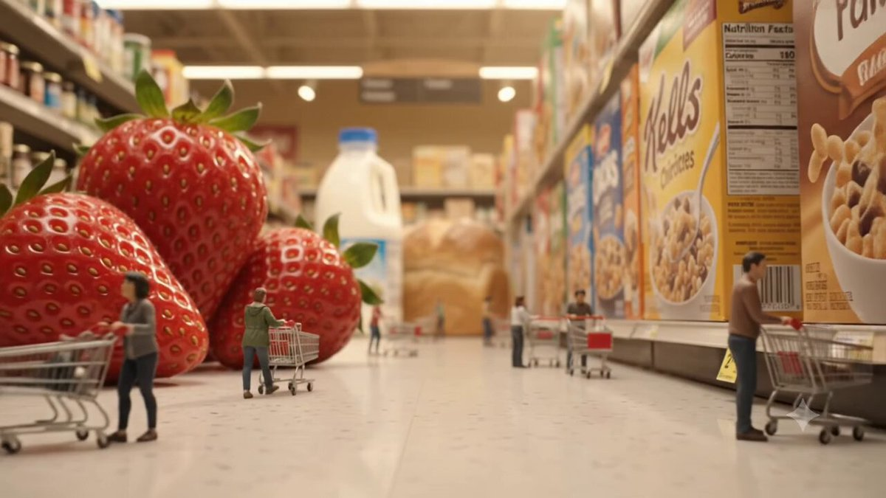
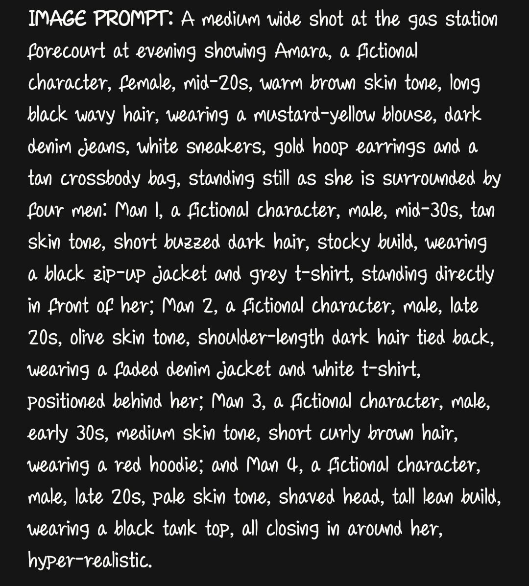

# AI Prompt Radar — 2026-09-18

Bugün bulunan yeni prompt sayısı: **3**

## 1. @Aiwithmaha

**Puan:** 62.82 &nbsp; **Etkileşim:** ❤ 172 · 🔁 12 · 👁 12848

**Tam prompt:**

~~~text
Turning a chaotic classroom into a cinematic AI scene.Realistic motion, natural emotions, and stunning details. Created on seedance 2.0 Prompt: 15-second cinematic video prompt: A realistic young Korean schoolgirl stands in the center of a messy classroom, wearing a white short-sleeve school uniform shirt with a red ribbon tie and a dark gray pleated skirt, while several students sit and move around behind her. Books, papers, notebooks, and classroom objects are scattered and flying through the air, creating a chaotic but realistic atmosphere. She slowly walks forward toward the camera with a serious, calm expression while the background students react naturally to the sudden chaos. The camera tracks backward smoothly, keeping her centered in a vertical 9:16 composition with realistic handheld movement. Papers and objects continue falling around her with believable gravity, motion blur, and natural physics. Around the middle of the video, she raises one hand slightly while continuing to approach the camera, maintaining the same face, hairstyle, uniform, and body proportions. In the final seconds, the camera moves closer to her face as she gently brushes her hair away from her eyes, looking directly into the lens with a subtle emotional expression. Use natural classroom lighting, realistic skin texture, detailed fabric, authentic shadows, cinematic depth of field, and photorealistic visuals throughout, with smooth continuous motion and no cuts.
~~~

[Kaynak paylaşımı X'te aç ↗](https://x.com/Aiwithmaha/status/2100787710424416603)

---

## 2. @AiwithBloodline

**Puan:** 57.70 &nbsp; **Etkileşim:** ❤ 81 · 🔁 6 · 👁 2836

**Tam prompt:**

~~~text
Generated with Gemini Flash Lite on Gemini App "Ant Sized Factory 🏭 " Prompt ⤵️; 🎬 10-Second Video Prompt — 🐜 Ant-Sized Grocery Store Prompt: > Ultra-realistic cinematic macro miniature world, 10-second video. A bustling grocery store where tiny ant-sized human shoppers move through enormous aisles of oversized food products. Tiny shoppers push miniature shopping carts between giant tomatoes, massive strawberries, towering cereal boxes, huge milk bottles, and enormous bread loaves. One tiny shopper struggles to push a cart carrying a single giant blueberry, while another climbs a gigantic loaf of bread. Smooth cinematic tracking camera at ground level, shallow depth of field, realistic miniature textures, detailed tiny people and carts, warm supermarket lighting, subtle ambient grocery-store sounds, natural movement, playful sense of scale, photorealistic, 8K detail, cinematic realism, seamless action, no text, no subtitles, no logos. Vertical 9:16, exactly 10 seconds.
~~~

[Kaynak paylaşımı X'te aç ↗](https://x.com/AiwithBloodline/status/2098390370854002711)

---

## 3. @OlatundeAI

**Puan:** 34.45 &nbsp; **Etkileşim:** ❤ 50 · 🔁 3 · 👁 3535

**Tam prompt:**

~~~text
The process is simple, but your Image Prompts have to be detailed. That is how you stay in control of the AI. Upload all your image Production Sheets at once to Flow AI or Grok Imagine. Then paste your Video Prompt and run it. Repeat the same process until you finish generating all your videos. Remember, your image prompt should be stronger and more detailed than anything else. The more clearly you define what the AI should see, the more control you have over the final result.
~~~

[Kaynak paylaşımı X'te aç ↗](https://x.com/OlatundeAI/status/2100503047386415131)

---

_Kaynak içerikler ilgili yazarlara aittir; özgün bağlantılar korunmuştur._
