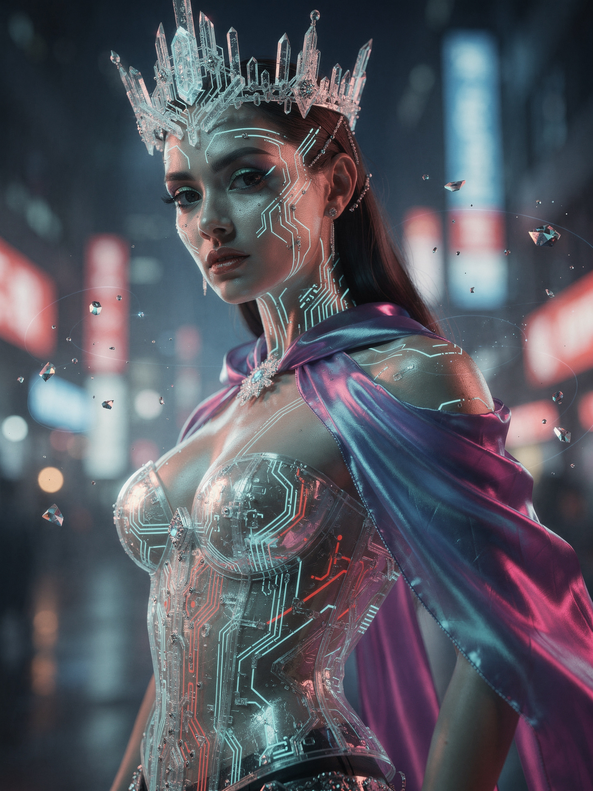

# AI Prompt Radar — 2026-09-19

Bugün bulunan yeni prompt sayısı: **1**

## 1. @AIPromptmaste

**Puan:** 46.44 &nbsp; **Etkileşim:** ❤ 1 · 🔁 0 · 👁 4621

**Tam prompt:**

~~~text
The future of AI fashion rendering is here ✨👑 Intricate glass corset refractions, glowing micro-circuitry, and crystal crown details—all rendered seamlessly in 2K using Flux AI on @Imagvio_AI. Prompt Snippet: A hyper-realistic cinematic fashion portrait of a powerful futuristic cyberpunk empress, captured at the exact moment she turns slightly toward the camera with an intense, commanding gaze. Her presence dominates the frame. She wears an extraordinary transparent glass corset with intricate illuminated circuitry embedded beneath the surface, refracting electric cyan and crimson light across her body, paired with a flowing neon iridescent silk cape that catches the air with elegant motion. Her skin features extremely fine, naturally integrated bioluminescent circuitry patterns that subtly pulse with light. Create a striking futuristic crown made of delicate translucent crystal and luminous micro-circuitry, forming an unmistakable royal silhouette. A few elegant holographic particles and tiny fragments of light orbit around her, creating depth without clutter. Set her on a futuristic Tokyo-inspired night street, but keep the environment heavily defocused and secondary. Deep cobalt-blue shadows contrast against vivid crimson and electric-cyan neon reflections, creating rich cinematic color separation and atmospheric depth. Lighting should be exceptionally dramatic: a powerful soft key light sculpting her face, sharp cyan rim light outlining her silhouette, subtle crimson edge lighting from the environment, realistic reflections through the glass corset, and volumetric beams cutting through faint atmospheric haze. Ultra-realistic skin pores, individual hair strands, realistic eyes, physically accurate glass refraction, detailed silk fabric, micro-surface textures, natural facial anatomy, realistic reflections, cinematic depth of field, premium luxury fashion editorial aesthetic. Shot on Hasselblad 100MP, 85mm portrait lens, shallow depth of field, precise focus on the eyes and face, sophisticated composition, slightly low camera angle, centered heroic framing, high dynamic range, photorealistic materials, cinematic contrast, subtle filmic highlight roll-off, Unreal Engine 5-quality realism, breathtaking detail, premium sci-fi fashion campaign aesthetic, 8K. No text, no logo, no watermark, no excessive holograms, no clutter, no distorted anatomy, no extra fingers, no plastic-looking skin, no cartoon appearance. Level up your creative workflows today at http://Imagvio.ai! 🚀
~~~

[Kaynak paylaşımı X'te aç ↗](https://x.com/AIPromptmaste/status/2101046780309930093)

---

_Kaynak içerikler ilgili yazarlara aittir; özgün bağlantılar korunmuştur._
