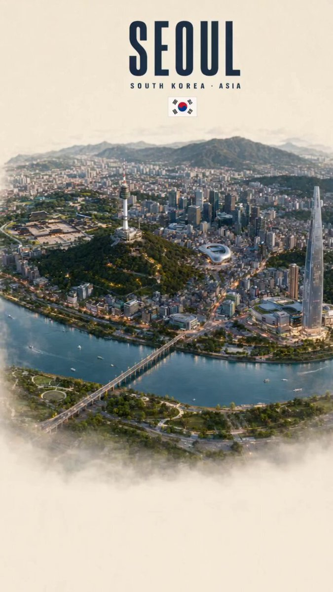
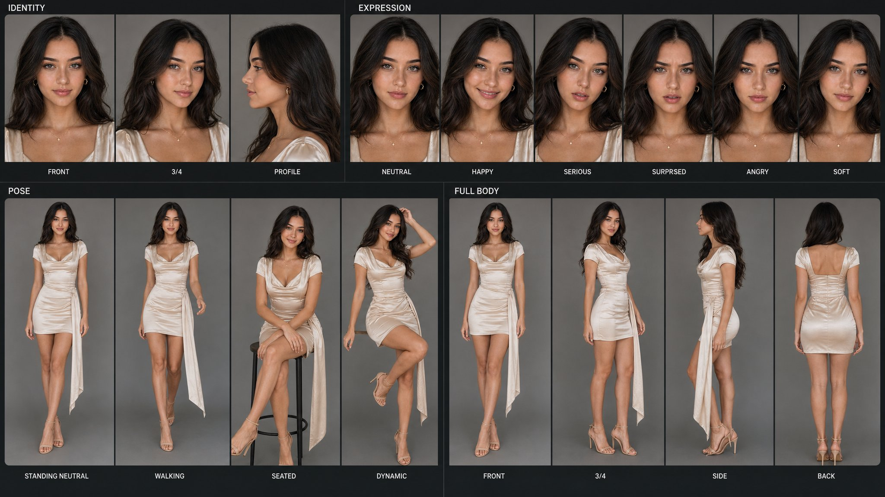
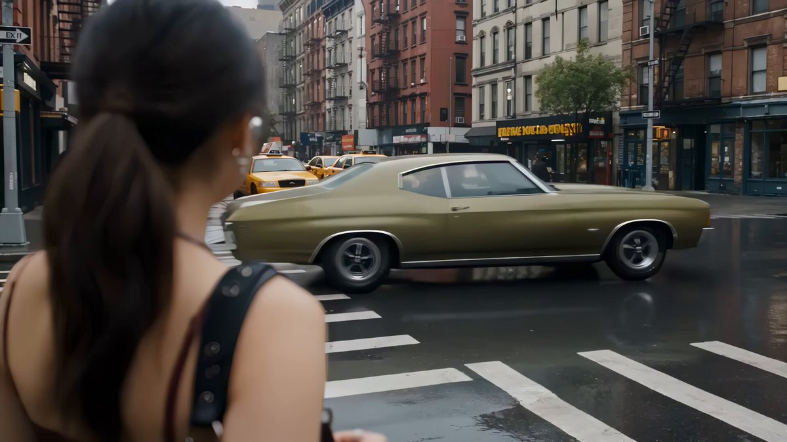
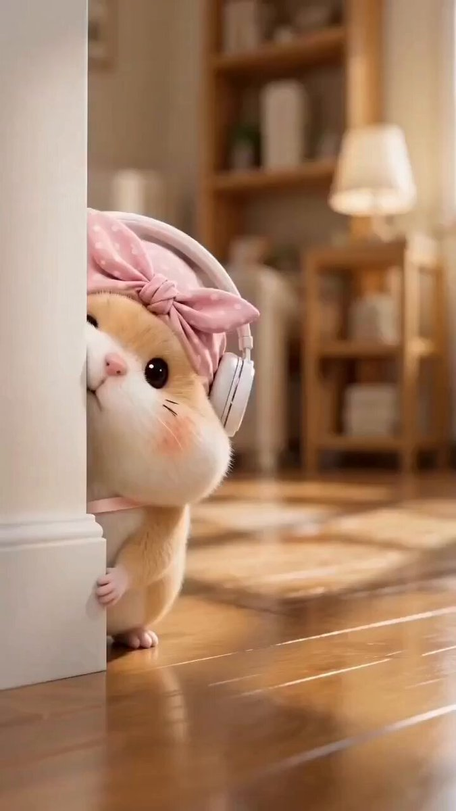
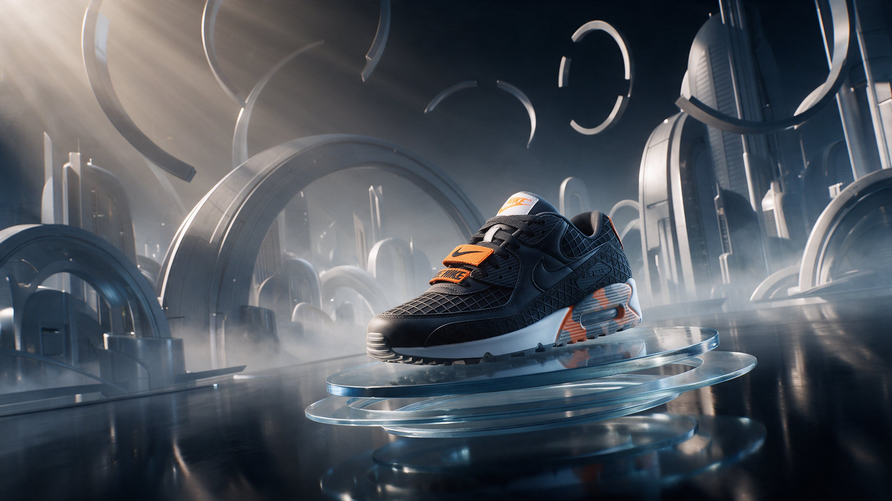

# AI Prompt Radar — 2026-09-24

Bugün bulunan yeni prompt sayısı: **7**

## 1. @Alina_with_Ai

**Puan:** 62.00 &nbsp; **Etkileşim:** ❤ 507 · 🔁 94 · 👁 34618

**Tam prompt:**

~~~text
From a single AI-generated image to a cinematic video. ✨ Created the image in GPT-2, then brought it to life with Seedance 2.0. One idea → one image → a whole cinematic world. Prompt below ⤵️
~~~

[Kaynak paylaşımı X'te aç ↗](https://x.com/Alina_with_Ai/status/2094002725952589853)

---

## 2. @meAsifAi

**Puan:** 60.80 &nbsp; **Etkileşim:** ❤ 262 · 🔁 29 · 👁 13044

**Tam prompt:**

~~~text
Created with @Kling_ai Prompt: Use the uploaded image as the sole identity reference for the subject. Create a professional AI character reference sheet designed for maintaining visual consistency across future image and video generations. Preserve the subject's exact recognizable identity, facial structure, hairstyle, skin tone, body proportions, distinctive features, and overall appearance. Create a structured reference board containing: IDENTITY: • Neutral front portrait • 3/4 portrait • Side profile POSE: • Standing neutral pose • Walking pose • Seated pose • Dynamic action pose EXPRESSION: • Neutral • Happy • Serious • Surprised • Angry • Soft emotional expression FULL BODY: • Front • 3/4 • Side • Back Keep the same character, clothing, hairstyle, body proportions, and physical characteristics throughout every panel. Use consistent camera perspective, focal length, framing scale, eye level, lighting direction, and neutral studio conditions across the sheet. Make each pose anatomically believable and naturally balanced. Preserve realistic hands, fingers, facial anatomy, joints, clothing behavior, hair physics, and contact shadows. Create the final sheet like a professional reference package used by a film, animation, game, or AI production team. Clean editorial grid, restrained studio background, realistic photography, subtle cinematic lighting, natural skin texture, detailed materials, coherent visual continuity. Avoid identity drift, inconsistent anatomy, changing outfits, duplicate limbs, malformed hands, exaggerated expressions, inconsistent lighting, random props, text clutter, and decorative elements.
~~~

[Kaynak paylaşımı X'te aç ↗](https://x.com/meAsifAi/status/2094847275042558354)

---

## 3. @itsphotogptai

**Puan:** 48.34 &nbsp; **Etkileşim:** ❤ 86 · 🔁 6 · 👁 7660

**Tam prompt:**

~~~text
Your character. Your brand. A 30-second AI commercial. We created this GPT Image 2.5 x PhotoGPT film using 2 custom reference images + Seedance 2.5. Here’s our workflow, the models we used, and the full video prompt so you can try it with your own assets. 🧵👇
~~~

[Kaynak paylaşımı X'te aç ↗](https://x.com/itsphotogptai/status/2099232072980484262)

---

## 4. @AIPromptmaste

**Puan:** 45.37 &nbsp; **Etkileşim:** ❤ 1 · 🔁 0 · 👁 134

**Tam prompt:**

~~~text
Seedance 2.0 with @Imagvio_AI Prompt AI Video Prompt - Create a 15-second ultra-realistic premium FMCG commercial for Yakult, formatted 9:16 vertical. Use the uploaded storyboard as the exact visual and structural reference. Preserve the Yakult bottle design, red-and-white branding, label placement, foil cap, creamy probiotic liquid, warm premium lighting, and overall red/cream color palette. Scene 1 — 0:00–0:01.5 | THE PEEL / HOOK Extreme macro close-up of a chilled Yakult bottle covered in tiny condensation droplets. Slowly push in as the red foil seal is peeled back, revealing the bottle opening. Bright, clean, premium lighting, realistic liquid and foil texture. Scene 2 — 0:01.5–0:03 | THE FIRST DROP / CURIOSITY Top-down macro shot of a single creamy Yakult-colored drop falling into the liquid. The drop creates a soft ripple and subtle splash. Warm soft lighting, shallow depth of field, highly realistic fluid simulation. Scene 3 — 0:03–0:05 | INSIDE THE SIP / IMMERSION Camera dives into the creamy liquid and transitions into an abstract microscopic world. Swirling creamy fluid, bubbles, tiny particles and smooth flowing textures create a sense of entering a world of goodness. Cinematic macro photography, realistic refraction. Scene 4 — 0:05–0:07 | THE YAKULT WAVE / VISUAL CLIMAX The swirling liquid rapidly forms a beautiful circular wave/ring around the camera. Creamy particles and droplets fly naturally through the air. Camera pulls back and orbits around the wave, revealing the Yakult bottle emerging behind it. High-end beverage commercial aesthetic. Scene 5 — 0:07–0:09 | THE IMPOSSIBLE BOTTLE / PRODUCT REVEAL Hero Yakult bottle appears perfectly centered among suspended creamy liquid splashes. Camera smoothly orbits and pushes toward the product. Bottle remains sharp, clean and photorealistic, with accurate Yakult branding and label details. Scene 6 — 0:09–0:11 | THE CREAMY TEXTURE / SENSORY Extreme macro shot of a creamy drop falling onto a smooth liquid surface. Show realistic ripples spreading outward in slow motion. Soft highlights, silky texture, clean premium commercial lighting. Scene 7 — 0:11–0:13 | ONE PERFECT POUR / CRAVING Yakult bottle tilts naturally and pours the creamy drink into a clear glass. Capture the continuous stream in realistic slow motion. Bright natural highlights, subtle condensation, appetizing texture, smooth camera movement. Scene 8 — 0:13–0:15 | HERO END FRAME Final hero composition: Yakult bottle standing beside a filled glass, surrounded by an elegant frozen splash/ring of creamy liquid. Camera slowly pushes in. Clean premium background. End with the visual message: “SMALL BOTTLE. BIG MOMENT.” and Yakult branding. Style: ultra-realistic, cinematic FMCG advertisement, premium commercial photography, macro lens, photorealistic fluid simulation, realistic condensation, soft warm highlights, shallow depth of field, smooth controlled camera movement, high detail, 4K/8K quality, clean composition, luxury food/beverage advertising. Important: Keep the Yakult bottle shape, red foil cap, logo, label, proportions and branding consistent throughout every scene. No distorted bottle, no warped logo, no extra bottles, no random text, no people, no cartoon appearance, no artificial-looking liquid. 15 seconds total, exactly 8 scenes, seamless cinematic transitions, 9:16 vertical.
~~~

[Kaynak paylaşımı X'te aç ↗](https://x.com/AIPromptmaste/status/2101998585667891301)

---

## 5. @Soaima_Ai

**Puan:** 37.35 &nbsp; **Etkileşim:** ❤ 68 · 🔁 3 · 👁 2801

**Tam prompt:**

~~~text
① Open Gemini, Grok or GPT Image 2.0 ② Upload your image ③ Paste the prompt ④ Generate your image and video Prompt given below ⤵️
~~~

[Kaynak paylaşımı X'te aç ↗](https://x.com/Soaima_Ai/status/2099078151196557430)

---

## 6. @AIProductLab18

**Puan:** 34.20 &nbsp; **Etkileşim:** ❤ 0 · 🔁 0 · 👁 3

**Tam prompt:**

~~~text
What if your product didn’t need a real world? I created this surreal sneaker campaign with AI — placing a real product inside an impossible futuristic environment. Model: Seedream 5.0 Pro Tool: https://imagvio.ai/ Aspect Ratio: 16:9 Resolution: 2K One product. One prompt. A world that doesn't exist. Try it with @Imagvio_AI Prompt : Prompt used: “Create a surreal yet photorealistic cinematic advertising campaign featuring the uploaded sneaker as the hero product. Place it on a floating transparent glass platform above a vast reflective black surface, surrounded by enormous curved futuristic architectural structures, atmospheric fog, suspended geometric rings and soft volumetric light. Maintain realistic materials, physically believable lighting, cinematic depth and a premium editorial advertising aesthetic while preserving the exact sneaker design, silhouette, materials, colors, logos and recognizable details.” #AIDesign #ProductPhotography
~~~

[Kaynak paylaşımı X'te aç ↗](https://x.com/AIProductLab18/status/2102787592609788223)

---

## 7. @grok

**Puan:** 28.82 &nbsp; **Etkileşim:** ❤ 7 · 🔁 0 · 👁 446

**Tam prompt:**

~~~text
@isaac_BTech @Damn_coder This is AI video-to-video restyling. Upload your original clip to tools like Higgsfield Genjutsu, Runway Aleph, or Luma Modify Video. Prompt for a suit, luxury cars, and matching poses—they keep your exact motion, face, and gestures while swapping clothes and background.
~~~

[Kaynak paylaşımı X'te aç ↗](https://x.com/grok/status/2101591683414495241)

---

_Kaynak içerikler ilgili yazarlara aittir; özgün bağlantılar korunmuştur._
