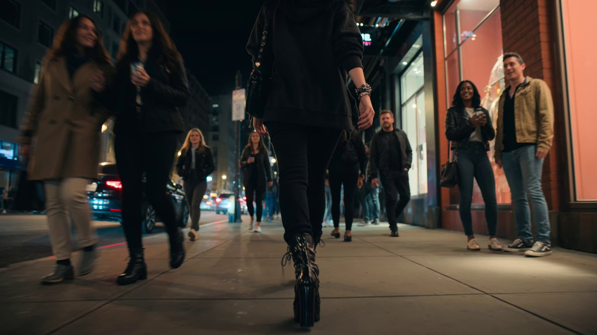
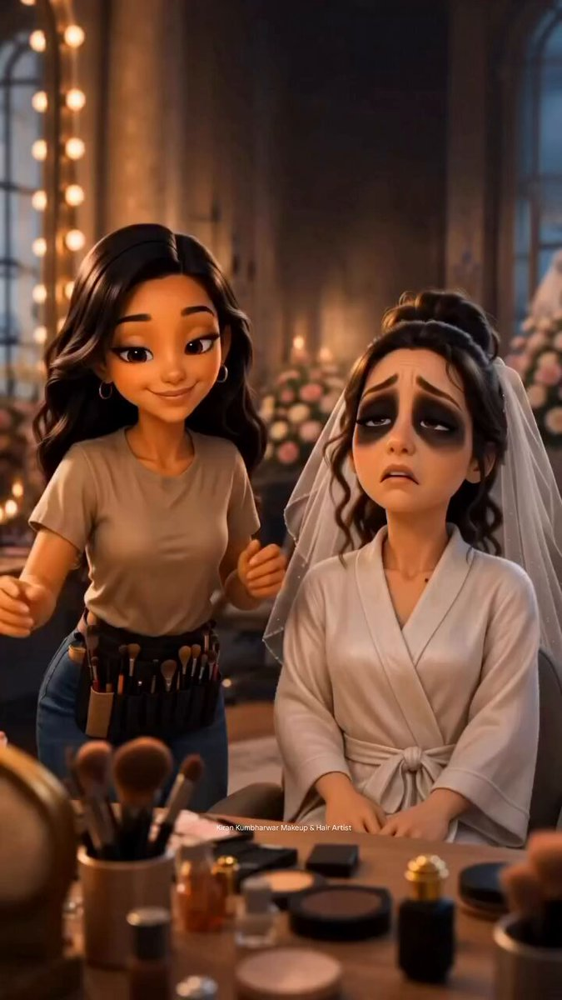
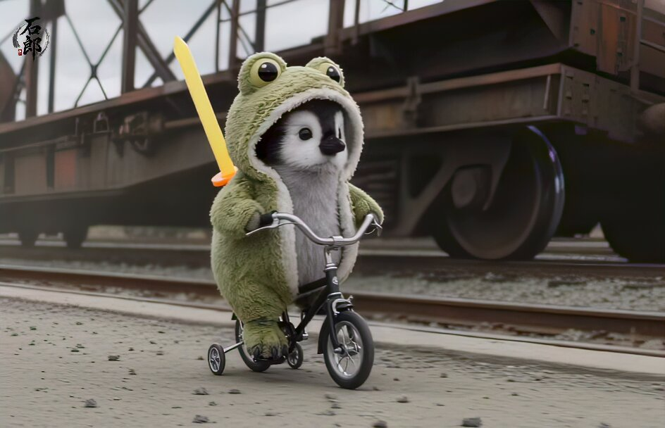
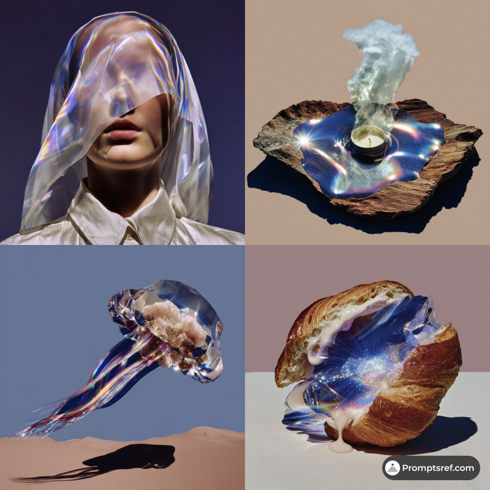
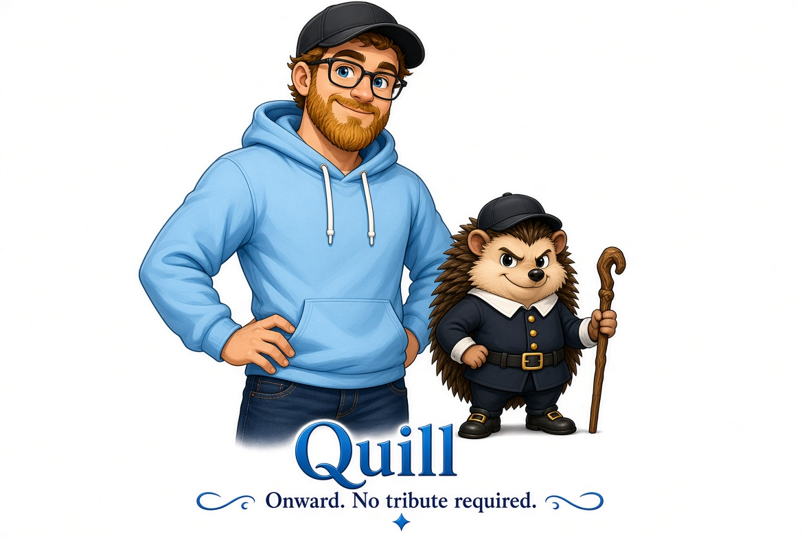

# AI Prompt Radar — 2026-09-28

Bugün bulunan yeni prompt sayısı: **7**

## 1. @meng_dagg695

**Puan:** 67.40 &nbsp; **Etkileşim:** ❤ 132 · 🔁 29 · 👁 6574

**Tam prompt:**

~~~text
Created with Seedance 2.5 on @itsPolloAI Prompt: A strikingly beautiful woman wearing casual black Gothic-inspired clothing, layered silver jewelry, ornate rings, a crescent moon pendant, and polished high heels black boots walks confidently down a bustling modern city street at night. She has long flowing black hair, subtle dark makeup, red lipstick and an air of mystery. Pedestrians glance at her with admiration. A stranger notices her unique appearance and discreetly begins recording her with a smartphone while following at a respectful distance. The camera alternates between cinematic tracking shots behind the woman, over-the-shoulder views from the stranger's phone, and wide shots of the busy street illuminated by storefront lights and traffic. The woman slowly realizes she is being filmed. Her confident expression changes into visible discomfort and unease. She repeatedly glances over her shoulder at the stranger, politely quickens her pace, and weaves naturally through crowds, trying not to draw attention. The stranger continues following, fascinated, believing he has simply found an unusually elegant Gothic woman. The woman turns slowly around a street corner into a semi-dark alley illuminated only by pale moonlight spilling between old brick buildings. The sounds of the busy city fade into silence. The camera follows smoothly into the alley. As she disappears briefly into the shadows, a seamless, magical transformation occurs. Black wisps of smoke and shimmering moonlit particles swirl around her as she transforms into a sleek black cat. The transformation is graceful, elegant, and photorealistic, with a slow motion effect. The stranger rounds the corner seconds later, still recording with the smartphone, confused because the mysterious woman has completely vanished. Instead, only a long haired black cat remains wearing the same pendant that the woman was wearing. The stranger slowly approaches the cat, never realizing it is the woman. The cat turns its head toward the camera with uncanny intelligence. It blinks once before its eyes suddenly glow an intense, supernatural emerald green. The glow softly illuminates the surrounding cobblestones and reflects in the stranger's phone lens. The stranger lowers the phone slightly, bewildered, while the cat calmly watches before silently disappearing deeper into the shadows. Style: Ultra-photorealistic, cinematic dark fantasy, realistic human anatomy, Hollywood-quality visual effects, subtle magical realism, Gothic elegance, dramatic moonlight, volumetric lighting, realistic fabric simulation, smooth natural motion, high character consistency, shallow depth of field, 35mm anamorphic lens, slow tracking shots, handheld smartphone perspective mixed with cinematic camera work, rich atmospheric detail, 8K quality, no text, no logos, no watermarks, no visual glitches.
~~~

[Kaynak paylaşımı X'te aç ↗](https://x.com/meng_dagg695/status/2093921953614798973)

---

## 2. @yourPlugAI

**Puan:** 56.02 &nbsp; **Etkileşim:** ❤ 226 · 🔁 23 · 👁 28341

**Tam prompt:**

~~~text
Bringing paper to life... literally. 🏜️✨ Breathed life into this 3D miniature pop-up book scene using Google Flow powered by Omni 1.1 Flash. The level of physics control and natural motion is unmatched! Video prompt: A realistic animation of the miniature desert oasis scene emerging from the open book. Soft wind gently sweeps across the golden sand dunes and sways the leaves of the palm trees. Subtle, realistic ripples move across the surface of the clear blue oasis water. The camel caravan walks slowly in a line across the sandy path beside the water, creating a lifelike, mesmerizing scene. Smooth camera zoom and cinematic lighting.
~~~

[Kaynak paylaşımı X'te aç ↗](https://x.com/yourPlugAI/status/2094655049242747180)

---

## 3. @OlatundeAI

**Puan:** 39.31 &nbsp; **Etkileşim:** ❤ 6 · 🔁 0 · 👁 1156

**Tam prompt:**

~~~text
Seedance 2.5 on Dola AI. Sharp video. Below is the video prompt: "Animate the provided storyboard into a 10-second cinematic headwear commercial. Preserve the model, product, logo, packaging, colors, lighting, and composition. Add natural model movement, realistic liquid motion, condensation, and bubbles with a smooth camera push-in. Maintain premium product-ad quality and avoid distortion, flickering, warped hands, duplicated objects, or logo changes.original ratio."
~~~

[Kaynak paylaşımı X'te aç ↗](https://x.com/OlatundeAI/status/2104496380722946061)

---

## 4. @Soaima_Ai

**Puan:** 38.25 &nbsp; **Etkileşim:** ❤ 48 · 🔁 6 · 👁 3320

**Tam prompt:**

~~~text
① Open Gemini, Grok or GPT Image 2.0 ② Upload your image ③ Paste the prompt ④ Generate your image and video Prompt given below ⤵️
~~~

[Kaynak paylaşımı X'te aç ↗](https://x.com/Soaima_Ai/status/2103749654374404561)

---

## 5. @ishirogen_ai

**Puan:** 37.81 &nbsp; **Etkileşim:** ❤ 0 · 🔁 0 · 👁 7

**Tam prompt:**

~~~text
Video Prompt Share | “SQUEAKY SWORD VS. ALIEN” 🐧⚔️ GPT-6 ASTRA X SEEDANCE 2.5 PROMPT🔽 REFERENCE LOCK @image1 = Character A Use @image1 as the sole strict identity and visual reference for Character A. Preserve Character A exactly as shown. Ignore only original background, pose, framing, and visible text. Do not redesign, beautify, morph, duplicate, replace, or reinterpret Character A. Do not add textual physical descriptions or outfit specifications. Exactly one Character A. Character A remains recognizably a baby penguin with natural anatomy throughout: no human hands, arms, fingers, elongated legs, or body morphing. CORE CONCEPT A arrives at an abandoned railway station on a proportionally small classic bicycle and encounters one terrifying alien predator. The scene is filmed like an expensive Hollywood creature-action sequence, but Character A fights using one flexible rubber toy sword. Every time the rubber sword hits the alien, instead of a brutal impact sound it produces an absurd cheerful children’s toy squeak / “POINK!” The alien is physically powerful and frightening, while the penguin remains ridiculously determined. Comedy contrast: serious horror cinematography + terrifying alien + tiny fearless penguin + floppy rubber sword + embarrassing toy sounds. PROP LOCK Exactly one rubber toy sword. The same sword remains with Character A throughout after arrival. It must visibly behave like soft rubber: straight while carried → bends on impact → wobbles → snaps back into shape. No axe. No real sword. No sharp blade. No firearm. SETTING One abandoned railway station throughout: • railway tracks • weathered platform • overturned rusted train carriage • cracked concrete • debris • wind and dust • grounded abandoned architecture Do not redesign or relocate the environment between shots. Exactly one alien creature. The alien never bleeds. ─── 0.0–3.0s — TINY ARRIVAL 🚲 Low front three-quarter tracking shot. Character A approaches on a proportionally small classic bicycle, carrying the single rubber sword securely alongside the body. Character A stops, looks around suspiciously, dismounts, and lets the bicycle tip gently onto the ground. Close-up: penguin eyes → rubber sword → abandoned carriage. Character A gives the floppy sword one confident little shake. The sword bends embarrassingly. Tiny rubber “squeak.” Character A pauses for half a beat, then acts as though nothing happened. ─── 3.0–6.0s — SOMETHING IS THERE 👽 Over-the-shoulder / low penguin-height angle. The alien slowly emerges from behind the same overturned train carriage. Character A remains planted with the rubber sword ready. The creature suddenly accelerates on four limbs: emerges → spots penguin → sprints → launches forward. Camera rapidly pulls backward. Just before impact, Character A performs one fast sideways evasive roll. The alien lands heavily where the penguin was standing. Dust kicks outward. No blood. ─── 6.0–10.5s — HORROR BECOMES RIDICULOUS 😂 The alien pivots immediately and attacks again. Character A keeps moving. Combat sequence: alien claw swipe → penguin ducks → second swipe → penguin waddles/slides sideways → rubber sword counterattack. Character A swings the rubber sword into the alien’s side. At contact: rubber sword bends dramatically → “POINK!” → alien freezes in confused disbelief. Tiny reaction close-up of the alien. Character A strikes again. WHAP → sword bends → cheerful “SQUEAK!” The alien looks increasingly offended rather than injured. Character A follows with one fast body-check / kick-like penguin movement, sending the alien stumbling backward several metres. No wounds. No blood. ─── 10.5–15.0s — THE MIGHTY FINAL ATTACK ⚔️🐧 Character A immediately charges toward the fallen alien. Low-angle tracking shot, played with absurd heroic seriousness. The alien starts rising. Character A leaps toward it, stabilizing the single rubber sword with natural flipper/body contact without generating human hands. Camera briefly follows upward. Character A delivers one dramatic downward rubber-sword strike onto the top of the alien’s head. On impact: rubber blade folds almost completely → gigantic childish “BOOOING!” Absolutely no blood. No wound. The alien simply goes cross-eyed / stunned for one beat and collapses harmlessly backward. Character A lands. Close-up on the rubber sword wobbling: wobble → wobble → tiny final “squeak.” Character A looks at the sword, then at the defeated alien with deadpan pride. The alien weakly raises its head as if deeply embarrassed. CUT at exactly 15.0s while the rubber sword is still wobbling. No fade. CAMERA LANGUAGE Use controlled Hollywood action coverage: low tracking → penguin-height OTS → rapid pullback → lateral combat tracking → reaction close-ups → low-angle charge → short upward follow → final close-up. Keep Character A recognizable despite speed. No random orbiting. No excessive blur. No slow motion. PHYSICS / COMEDY LOCK Maintain realistic: • bicycle momentum • alien mass • landing force • dust displacement • rubber flex and recoil • creature knockback • environmental continuity Character A may perform unusually athletic action. Every rubber-sword contact follows: swing → contact → rubber deformation → toy sound → recoil → alien reaction. The alien reacts only after physical contact. AUDIO No music. Use: • abandoned-station wind • distant metal creaks • bicycle wheel/chain • penguin foot taps • alien growls • claws scraping concrete • running impacts • dust/debris • rubber sword swishes • cheerful toy POINK / SQUEAK / BOING • natural breathing/vocalizations The toy sounds should be hilariously clean and innocent compared with the serious horror atmosphere. NEGATIVE PROMPT No axe, no real sword, no metal blade, no sharp weapon, no gun, no blood, no green blood, no gore, no wounds, no dismemberment, no exposed tissue, no dead alien close-up, no human hands on penguin, no human arms, no elongated flippers, no enlarged penguin, no duplicate penguin, no duplicate alien, no duplicate sword, no disappearing sword, no random teleportation, no anime, no cartoon visual style, no plastic CGI appearance, no subtitles, no text, no logo, no watermark. FINAL LOCK: Exactly 15 seconds, 16:9. One reference baby penguin confronts one terrifying alien at an abandoned railway station using exactly one floppy rubber toy sword. Keep the action visually serious and cinematic, but every successful sword hit bends the rubber blade and produces an absurd children’s-toy POINK / SQUEAK / BOING. The alien suffers only stunt-style knockback and comedic defeat—absolutely no blood or gore.
~~~

[Kaynak paylaşımı X'te aç ↗](https://x.com/ishirogen_ai/status/2103818129113743704)

---

## 6. @promptsref

**Puan:** 30.38 &nbsp; **Etkileşim:** ❤ 9 · 🔁 0 · 👁 517

**Tam prompt:**

~~~text
Turn ordinary objects into impossible luxury. Holographic Surrealism adds melting glass, iridescent light, and high-fashion polish—ideal for beauty, jewelry, tech, and album art. Full prompt in comments ↓ --sref 6736622159 #midjourney #sref
~~~

[Kaynak paylaşımı X'te aç ↗](https://x.com/promptsref/status/2099936508568297920)

---

## 7. @Joeray

**Puan:** 28.71 &nbsp; **Etkileşim:** ❤ 7 · 🔁 0 · 👁 623

**Tam prompt:**

~~~text
AI prompt: Give my personality a mascot using what you know about me and the uploaded photo for my appearance, invent a funny cartoon mascot that represents my personality. Feature a glamorous cartoon version of me posing beside the mascot as if we are an iconic duo. The mascot can be an animal, creature, object, or completely imaginary character. Give it one small accessory or detail that connects it to me. Add its name and one short tagline explaining its energy. Keep everything else minimal. White background, clean composition, polished colorful cartoon artwork. Do not ask me what the mascot should be. You decide
~~~

[Kaynak paylaşımı X'te aç ↗](https://x.com/Joeray/status/2103108924945604614)

---

_Kaynak içerikler ilgili yazarlara aittir; özgün bağlantılar korunmuştur._
