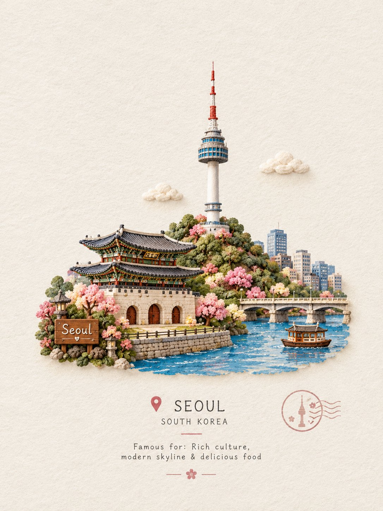
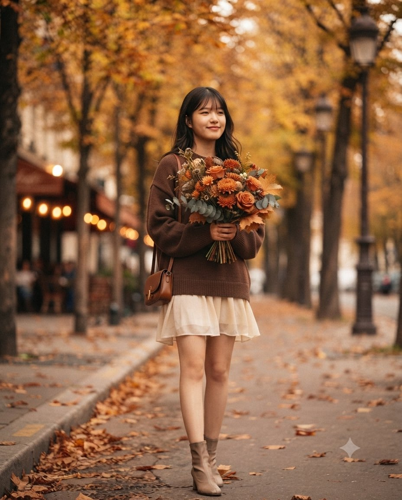
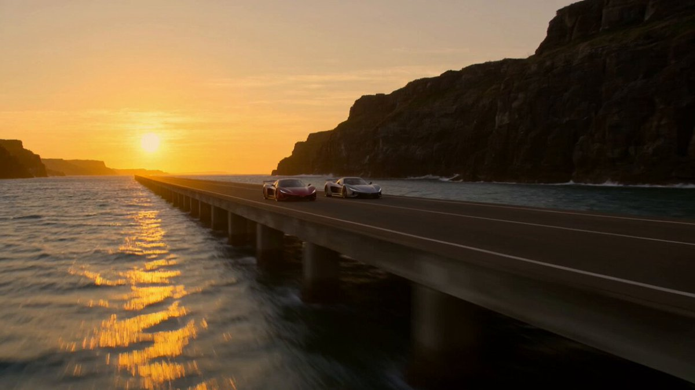
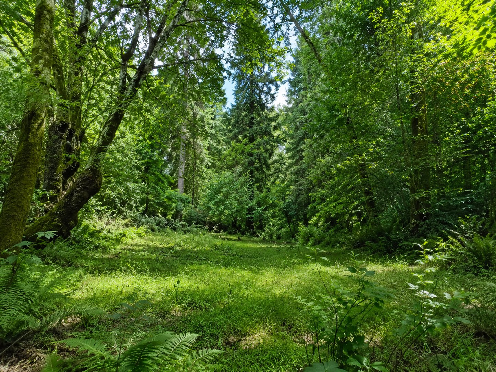
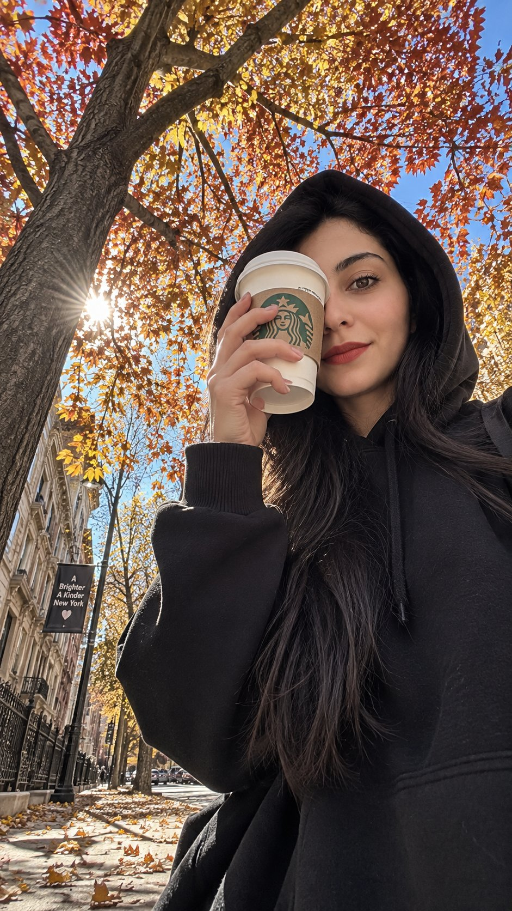
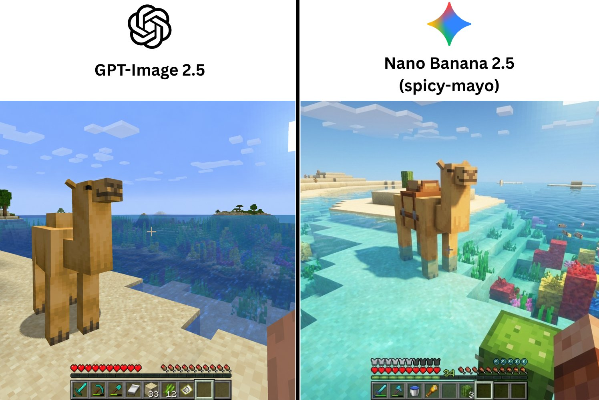
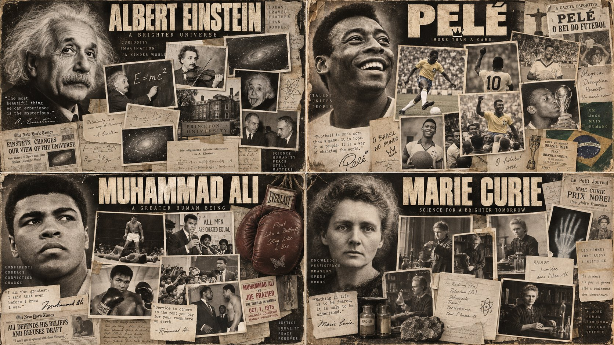
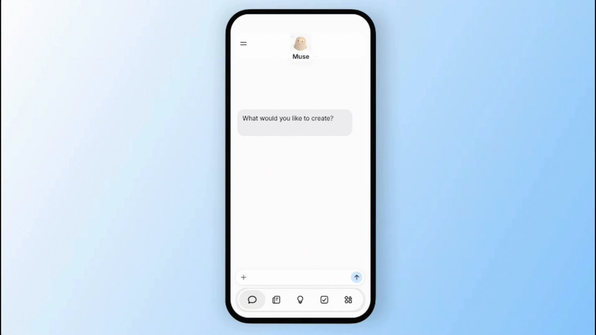
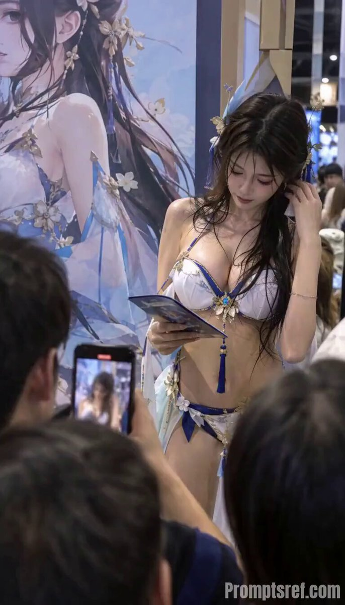

# AI Prompt Radar — 2026-10-02

Bugün bulunan yeni prompt sayısı: **12**

## 1. @Naiknelofar788

**Puan:** 63.68 &nbsp; **Etkileşim:** ❤ 241 · 🔁 43 · 👁 10863

**Tam prompt:**

~~~text
GPT image 2.5 on ChatGPT Prompt: Create a charming handcrafted miniature travel scene featuring [ICONIC STRUCTURE] as the main focal point. Show the landmark as a beautifully sculpted tiny 3D model, with soft rounded details, handmade textures, delicate imperfections, and a whimsical storybook feeling. Surround it with a few subtle elements that represent its location—such as tiny trees, flowers, streets, boats, mountains, clouds, or local objects—without making the scene crowded. Place everything on a clean warm-white textured paper background, with plenty of elegant negative space. Add a small tasteful wooden or paper travel plaque containing: [STRUCTURE NAME] [CITY, COUNTRY] Famous for: [SHORT UNIQUE FACT] Use soft natural lighting, gentle shadows, pastel yet realistic colors, miniature diorama depth, handcrafted clay/paper textures, and a premium cute travel-journal aesthetic. Centered composition, highly detailed landmark, adorable but sophisticated, clean and collectible travel-card design, no photorealistic people, no clutter.
~~~

[Kaynak paylaşımı X'te aç ↗](https://x.com/Naiknelofar788/status/2097646788258021837)

---

## 2. @Naiknelofar788

**Puan:** 56.79 &nbsp; **Etkileşim:** ❤ 37 · 🔁 3 · 👁 1977

**Tam prompt:**

~~~text
Gemini nano banana pro Autumn Flower Walk Prompt: Create a dreamy, cinematic autumn portrait of the girl from the reference image, preserving her facial identity, natural features, skin tone, and recognizable appearance. She is walking along a beautiful European-style tree-lined street in peak fall, surrounded by golden, burnt-orange and deep amber foliage. She wears a cozy oversized chocolate-brown knit sweater over a soft cream flowing mini dress, with subtle ankle boots and a small leather shoulder bag. She holds a large, romantic bouquet of autumn flowers—burnt-orange roses, chrysanthemums, dried wildflowers, eucalyptus, and maple leaves—partially covering the lower half of her face. A few loose strands of hair move naturally in the cool breeze. Warm café lights glow softly behind her, fallen leaves cover the pavement, vintage street lamps line the sidewalk, and the background fades into beautiful creamy bokeh. Golden-hour autumn light, warm muted earthy tones, soft film grain, editorial fashion photography, natural skin texture, realistic fabric details, shallow depth of field, intimate romantic atmosphere, candid luxury travel-magazine aesthetic. Composition: full-body vertical portrait, girl slightly off-center, bouquet as a strong foreground element, natural walking pose, cinematic depth, elegant but effortless. Aspect ratio: 4:5 Mood: cozy • romantic • nostalgic • dreamy • effortlessly beautiful No text, no watermark, no exaggerated makeup, no plastic skin, no distorted hands.
~~~

[Kaynak paylaşımı X'te aç ↗](https://x.com/Naiknelofar788/status/2098965989815931325)

---

## 3. @AllaAisling

**Puan:** 51.86 &nbsp; **Etkileşim:** ❤ 27 · 🔁 3 · 👁 1695

**Tam prompt:**

~~~text
My first try with @Kling_ai 4.0 Flash Prompt: 15-second ultra-cinematic racing film. Photorealistic. Premium blockbuster aesthetics. A spectacular race track built across a vast tidal ocean basin at sunrise. The track consists of a narrow elevated road that periodically disappears beneath massive waves. 0-3s Two hypercars race across the exposed ocean floor with enormous cliffs and golden sunlight surrounding them. 3-6s Water begins rushing across sections of the track behind them. 6-9s The cars accelerate toward a section completely covered by a wall of seawater. 9-12s They burst through the water curtain at full speed, water exploding around the vehicles. 12-15s They emerge onto dry track as the ocean closes behind them, racing toward the sunrise. Photorealistic water physics. Gorgeous golden reflections. Huge scale. No fantasy creatures.
~~~

[Kaynak paylaşımı X'te aç ↗](https://x.com/AllaAisling/status/2104678461084155918)

---

## 4. @mark_k

**Puan:** 51.01 &nbsp; **Etkileşim:** ❤ 417 · 🔁 12 · 👁 39821

**Tam prompt:**

~~~text
GPT-Image-2.5 has arrived in @ChatGPT 🔥 It features many improvements, but I couldn't help myself from doing the infamous "noise artifact" test. The results are mixed! Prompt: "Photo of a clearing in the woods with lots of green foliage, highly detailed" See for yourself:
~~~

[Kaynak paylaşımı X'te aç ↗](https://x.com/mark_k/status/2097411028510179759)

---

## 5. @ScaleWthAI

**Puan:** 50.65 &nbsp; **Etkileşim:** ❤ 15 · 🔁 0 · 👁 1085

**Tam prompt:**

~~~text
Image created by nano banana 🤩 Prompt: Create a **photorealistic autumn street-style photograph** captured from an extremely low, ground-level angle, looking upward toward the girl. She is standing naturally and facing the camera, with her face turned directly toward the lens. Her expression is calm and effortless, with a subtle genuine smile. She is wearing an **oversized black hoodie**, with the loose hood naturally pulled over her head. Her long hair flows freely from beneath the hood, falling naturally across her chest and shoulders on both sides. Individual strands move slightly in a gentle autumn breeze. In one hand, she holds a **Starbucks coffee cup extremely close to her face at eye level**, creating a natural foreground element. The cup partially covers one eye, while her other eye remains completely visible and looks directly into the camera. Keep the cup realistic in size, texture, lighting, and perspective. Position her slightly toward the **right third of the composition**, leaving more visual space toward the left side. Her body should feel naturally close to the camera, with parts of her figure subtly extending beyond the frame for an immersive, candid composition. Directly overhead is a **large mature tree covered in rich autumn foliage**, featuring deep red, orange, amber, and warm golden leaves. Sunlight streams naturally through gaps in the branches and leaves, creating bright scattered highlights and realistic patches of light across the scene. Small fragments of clear blue sky are visible between the branches. Maintain **maximum depth of field**. The girl, face, visible eye, coffee cup, hoodie, hood, individual strands of hair, tree trunk, branches, leaves, and distant surroundings must all remain **perfectly sharp and highly detailed from foreground to infinity**. Absolutely **no bokeh, no portrait blur, no artificial background separation, and no shallow depth of field**. The perspective should feel like a real photograph captured on an **iPhone 16 Pro**, using a 24mm equivalent wide-angle lens, f/8, 1/500s, ISO 50. Vertical 9:16 composition, extreme low-angle perspective, realistic wide-angle geometry, natural skin texture, accurate proportions, realistic sunlight, authentic shadows, subtle lens characteristics, natural color science, crisp micro-details, and documentary-style realism. **Style:** authentic iPhone photography, cinematic but completely natural, realistic autumn atmosphere, high dynamic range, true-to-life colors, physically accurate lighting, realistic textures, no artificial beauty retouching, no plastic skin, no CGI appearance, no illustration, no painting, **absolute photorealism**.
~~~

[Kaynak paylaşımı X'te aç ↗](https://x.com/ScaleWthAI/status/2096943419767804050)

---

## 6. @TimJayas

**Puan:** 50.37 &nbsp; **Etkileşim:** ❤ 317 · 🔁 11 · 👁 60058

**Tam prompt:**

~~~text
GPT-Image 2.5 vs Nano-Banana 2.5 (spicy-mayo) i used same exact prompt for both to generate a minecraft camel in ocean biome gpt-image 2.5 gave the most accurate UI and nano banana 2.5 looks more visually appealing here which one do you prefer?
~~~

[Kaynak paylaşımı X'te aç ↗](https://x.com/TimJayas/status/2097780644193661236)

---

## 7. @Gdgtify

**Puan:** 50.05 &nbsp; **Etkileşim:** ❤ 11 · 🔁 1 · 👁 1333

**Tam prompt:**

~~~text
This is my first attempt with GPT Images 2.5. I am already seeing more details but with prompts like this, it's a bit harder GPT Images 2.5 vs. 2.0 vs Nano Banana Pro vs Grok Prompt: 2x2 grid, 16:9, pick Einstein, Pele and 2 other GOATs in their fields who passed away: class Documentary_Montage_Poster: def __init__(self, subject="[FIGURE]", era="[VIBE/ERA]"): self.medium = "Vintage silver gelatin photography, sepia tones, film grain" self.layout = "Overlapping cinematic collage, physical photo prints with white borders" def generate_legacy_assets(self): # AI INFERENCE: Deduce the life and times of the subject typography = f"Massive, bold, distressed sans-serif title spelling '{subject}' at the top." hero_portrait = f"A giant, intensely detailed, fading portrait of {subject} anchoring the left side of the poster." # The Mosaic of Memories inset_photos = f"AI_INFER(5 to 7 distinct, varying-sized rectangular photographs showing key moments, vehicles, or peers from the life of {subject})." ephemera = f"AI_INFER(Scrapbook elements like handwritten letters, chalkboards, or newspaper clippings related to {subject}) wedged between the photos." return [typography, hero_portrait, inset_photos, ephemera, self.medium] # EXECUTE: Render as a cohesive, masterpiece movie poster. The inset photos must physically overlap like a scrapbook.
~~~

[Kaynak paylaşımı X'te aç ↗](https://x.com/Gdgtify/status/2097438835328369117)

---

## 8. @motion_so

**Puan:** 49.44 &nbsp; **Etkileşim:** ❤ 483 · 🔁 30 · 👁 68489

**Tam prompt:**

~~~text
Introducing Muse for motion design. Give Muse your website and ask it to write a launch video prompt. It researches the product, plans the scenes, and writes the visual direction. Paste the prompt into Motion and let it build the video. Muse wrote the prompt for this one 👇
~~~

[Kaynak paylaşımı X'te aç ↗](https://x.com/motion_so/status/2101743483123892677)

---

## 9. @magnific

**Puan:** 44.85 &nbsp; **Etkileşim:** ❤ 11 · 🔁 5 · 👁 1234

**Tam prompt:**

~~~text
VYRO · Kling 3.0 Prompt: SHOT 1 — 0–3s Cinematic live-action mountaineering, exact dusty sunglasses and reflected climber from reference. Extreme macro: in the lens reflection the helmeted climber with grey backpack takes one deliberate step upward on rock; wind, breathing, subtle handheld motion. Preserve believable reflection and gritty natural sunlight. Film grain, no graphics. SHOT 2 — 3–5s Hard cut to ground-level insert of that reflected climber's hiking boot planting firmly on a dry rock ledge. Grey trouser leg, taut climbing rope running uphill beside boot. Crisp gritty stone, hard mountain sunlight, realistic weight transfer, brief gravel crunch. SHOT 3 — 5–8s Hard cut, close side view of the same helmeted climber with grey backpack gripping the upper rock lip with one hand and pulling their torso upward. Rope secured to climbing harness, anatomically natural movement. Intimate handheld 35mm film look, wind and fabric rustle. SHOT 4 — 8–11s Hard cut, low rear medium shot: same helmet, grey backpack and trousers as previous shots. Climber steps up onto the broad flat summit, straightens and stops. Camera rises gently with them, rocky horizon opens beyond. No jump, no transformation, natural continuous action. SHOT 5 — 11–15s Hard cut to wide rear three-quarter shot of same climber standing safely on broad summit, looking across immense sunlit mountain ranges and distant cloud layers. Slow lateral camera reveal, foreground rock passing, restrained triumph through posture. Warm sun, cool shadows, tangible 35mm grain. Wind and relieved breath, no dialogue, no text.
~~~

[Kaynak paylaşımı X'te aç ↗](https://x.com/magnific/status/2098121137184247822)

---

## 10. @AiWithIqra

**Puan:** 35.34 &nbsp; **Etkileşim:** ❤ 3 · 🔁 0 · 👁 733

**Tam prompt:**

~~~text
1/ 🎬 MAKE ANY VIDEO LOOK CINEMATIC Turn ordinary footage into a polished cinematic sequence while preserving the original subject, action, and important details. Prompt: «Transform this video into a premium cinematic sequence. Preserve the subject, identity, outfit, actions, and all important details exactly as they appear. Apply [lighting style], [camera movement], [color grade], and [visual mood]. Add realistic depth, shadows, reflections, motion, and cinematic atmosphere while maintaining natural skin tones and seamless frame-to-frame consistency. Do not alter [specific details that must remain unchanged].»
~~~

[Kaynak paylaşımı X'te aç ↗](https://x.com/AiWithIqra/status/2102210723690758500)

---

## 11. @ewura__abena

**Puan:** 30.67 &nbsp; **Etkileşim:** ❤ 9 · 🔁 5 · 👁 794

**Tam prompt:**

~~~text
AI video creation isn’t as difficult as people think. You just need to know how to give the AI app you’re using the right instructions. You can create an AI video in less than 5 minutes. A lot of it comes down to having the right video prompt or command. I usually use Meta AI and ChatGPT to help me generate the exact prompt I need. I give the AI the idea I have and explain how I want the video to look, the scenes I want, and what should happen in the video. Once I get the response, I go through it and make my own edits… adding what was missing, removing things that shouldn’t be there, and adjusting anything that isn’t exactly how I want it. Then I take the final prompt to Grok Imagine or CapCut to generate the video. Higgsfield AI is also another good option for AI video generation. The more you practice, the better you get at it.
~~~

[Kaynak paylaşımı X'te aç ↗](https://x.com/ewura__abena/status/2105307009553711218)

---

## 12. @underwoodxie96

**Puan:** 29.87 &nbsp; **Etkileşim:** ❤ 6 · 🔁 0 · 👁 3314

**Tam prompt:**

~~~text
Let our Agent turn an image into a polished 6-second video prompt — it works really well. Then generate the video directly on the platform with MiniMax H3. The whole workflow feels incredibly smooth 👀 prompt：https://promptsref.com/tool/AI-Video-Generator/share/d4b96c168e552d52422ce3b625c8f278 @ Image 1 locks the adult female cosplayer’s facial features, long damp black hair, blue-white-and-gold original summer costume, floral hair ornaments, promotional backdrop, convention crowd, and vertical composition. Create a 6-second, 9:16 realistic documentary-style video at a busy convention booth. The photographer stands behind the crowd, capturing her on the right side of the frame as she reads a brochure and adjusts the loose ends of her wind-tousled hair. Preserve the authentic convention lighting, natural skin texture, shallow crowd blur, foreground smartphone obstruction, and candid unposed atmosphere. 0–2 seconds｜Medium shot｜Eye-level, slightly right-offset camera｜50mm｜Slow push-in: she looks down at the brochure in her hands while damp strands of hair rest against her face. A smartphone in the foreground moves slightly out of focus, and convention attendees pass slowly in the background. 2–4 seconds｜Medium close-up｜Eye-level three-quarter side angle｜85mm｜Locked-off shot: she gently tucks the loose hair beside her face behind her ear with her right hand while continuing to read. The gold ornaments on her hair and costume catch subtle reflections from the booth lighting. 4–6 seconds｜Close-up｜Slight low angle｜85mm｜Subtle lateral camera move: she briefly looks toward the crowd outside the booth with a naturally distracted expression, then returns her gaze to the brochure. End with her face, brochure, and promotional backdrop held in the same frame. Keep the character’s identity, facial features, hairstyle, costume structure, accessories, brochure, promotional backdrop, and crowd placement consistent throughout. Hair movement should remain subtle and physically natural, with stable body balance and realistic hand motion. Preserve the foreground smartphone and blurred heads as partial obstructions. Use authentic convention ambience, distant crowd chatter, footsteps, and a few soft camera-shutter sounds. No dialogue, subtitles, or music. Negative constraints: do not change the character’s identity or costume design, do not add or remove accessories, no extra arms or fingers, no distorted hands, no warped brochure, no deformed hair ornaments, no background characters taking focus, no excessive skin smoothing or plastic-looking skin, no exaggerated facial expressions, no large posing gestures, no dramatic camera shake, no excessive background blur, no garbled text, no warped logos, no sudden lighting changes, no subject cropping, and no abrupt changes in camera direction or composition.
~~~

[Kaynak paylaşımı X'te aç ↗](https://x.com/underwoodxie96/status/2101307085497499773)

---

_Kaynak içerikler ilgili yazarlara aittir; özgün bağlantılar korunmuştur._
