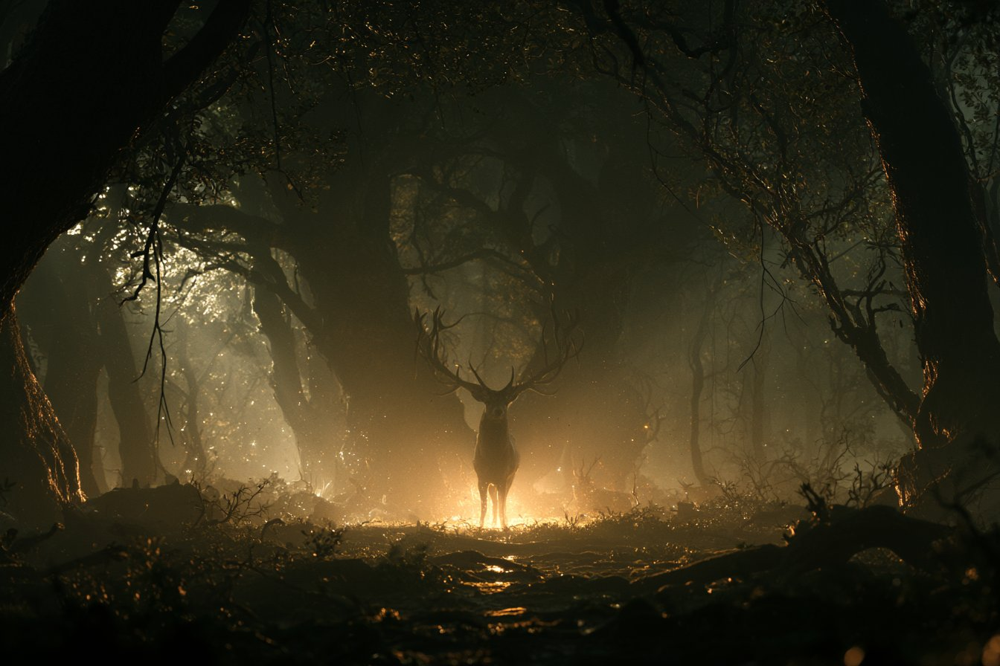
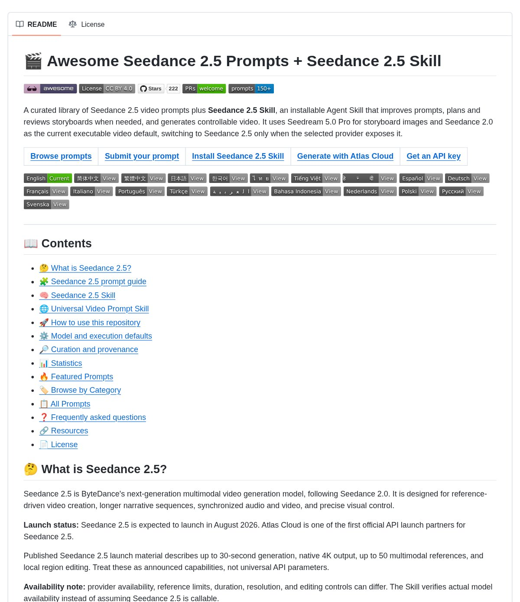
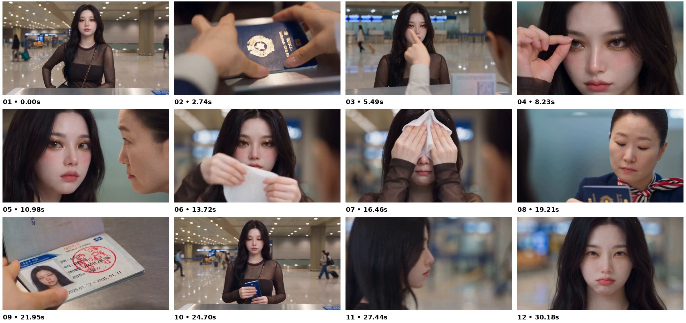

# AI Prompt Radar — 2026-10-06

Bugün bulunan yeni prompt sayısı: **3**

## 1. @azed_ai

**Puan:** 57.45 &nbsp; **Etkileşim:** ❤ 234 · 🔁 23 · 👁 11325

**Tam prompt:**

~~~text
Prompt share: Atmospheric Light Veil 💬 Prompt: A cinematic rendering of the [subject] illuminated by [lighting style], with dense fog breaking the scene into atmospheric layers, warm backlighting, subtle glowing particles, deep shadows, cinematic depth, mysterious mood, dramatic atmosphere Try it and share yours ✨
~~~

[Kaynak paylaşımı X'te aç ↗](https://x.com/azed_ai/status/2098365453987135892)

---

## 2. @DanKornas

**Puan:** 44.54 &nbsp; **Etkileşim:** ❤ 13 · 🔁 4 · 👁 2042

**Tam prompt:**

~~~text
Video prompting gets messy when every example starts from scratch. Awesome Seedance 2.5 Prompts + Seedance 2.5 Skill is a curated GitHub library of video prompts and an installable Agent Skill for builders working with Seedance models. It helps you move from a creative brief or rough idea to a clearer video prompt by combining a browsable prompt collection with guidance for references, actions, camera work, style, audio, and constraints. Key features: • 150+ curated prompts – browse examples with video previews instead of starting from a blank prompt • Prompt structure guide – break prompts into reference binding, observable action, camera, style, audio, and constraints • Installable Agent Skill – adapt a brief, existing prompt, references, or storyboard into a clearer prompt and execution flow • Selective storyboard workflow – plan and review storyboards only when multi-shot planning or visual consistency needs it • Availability-aware execution – uses the best available Seedance model and checks whether Seedance 2.5 is actually callable It’s open-source (CC BY 4.0 license). Link in the reply 👇
~~~

[Kaynak paylaşımı X'te aç ↗](https://x.com/DanKornas/status/2106666637227143507)

---

## 3. @ElsaSofia__AI

**Puan:** 38.14 &nbsp; **Etkileşim:** ❤ 8 · 🔁 0 · 👁 1210

**Tam prompt:**

~~~text
VIDEO PROMPT — 30 seconds total, 16:9, live-action cinematic realism, soft natural airport light, shallow depth of field, clean commercial look. Comedic drama, played straight. Keep the same faces, outfits and location in every shot. NO slow motion anywhere, everything runs in REAL TIME. CHARACTERS (repeat in every part) HEROINE: young Korean woman in her 20s, long wavy black hair, porcelain skin. FULL GLAM makeup at first: gold shimmer eyeshadow, long dramatic false lashes, pink blush, glossy rose lips. Wears a sheer dark-brown mesh long-sleeve top over a black bandeau, with a thin gold-chain crossbody bag strap. In the walking shot she also wears a denim mini skirt, black ankle boots, and pulls a pink rolling suitcase. OFFICER: Korean woman in her 40s, dark hair pulled back tight, strict calm face, navy uniform jacket with a red-white-navy striped scarf. PASSPORT: dark-blue Korean passport. The photo page shows the heroine's BARE-FACED, tired, messy-haired ID photo, with Korean text and a small blue flag icon. LOCATION: Korean international airport immigration hall — shiny marble floor, rows of small round ceiling lights, beige columns, blue digital signs, travelers with suitcases walking in the background. ===== PART 1 (0:00-0:13) ===== SHOT 1 (00:00-00:02.2) — Counter Wide [Panel 1] Front-facing medium-wide, eye level. The heroine stands behind the immigration counter, one hand on her hip, then takes the blue passport from her bag and places it on the counter edge. Travelers walk in the blurred background. Camera static. SHOT 2 (00:02.2-00:04.6) — Passport POV [Panel 2] Over-the-counter POV close-up of the officer's hands picking up the passport, turning it, then opening it to the photo page with her thumb. The bare-faced ID photo is clearly readable. Camera static, shallow depth of field. SHOT 3 (00:04.6-00:06.6) — Suspicious Finger [Panel 3] Medium shot over the officer's shoulder (back of her head on the right). The officer points a finger at the heroine's face and moves it up and down as if comparing. The heroine looks uneasy with a small frown. Airport counters blurred behind. SHOT 4 (00:06.6-00:10.2) — Eyelash Peel [Panel 4] Extreme close-up of the heroine's glam face looking straight into the camera. Her fingers pinch the false lash and she slowly peels it off, holding it between her fingertips. Camera static. SHOT 5 (00:10.2-00:12.9) — Face-Off Two-Shot [Panel 5] Medium close-up: the heroine's face on the left, the officer's face in sharp profile on the right, very close, staring at her. The heroine looks back with a stiff blank expression, then purses her lips. ===== PART 2 (0:13-0:22) ===== SHOT 6 (00:13.0-00:14.0) — Wipe Out [Panel 6] Close-up, airport lights blurred into soft bokeh behind her. The heroine pouts, takes out a white wet makeup wipe, and unfolds it with both hands. SHOT 7 (00:14.0-00:19.0) — Makeup Removal [Panel 7] Same close-up. She presses the wipe over her eyes, then wipes her cheeks and lips with both hands, eyes closed. At the end she lowers the wipe to reveal a fresh, bare, natural face and looks calmly into the camera. SHOT 8 (00:19.0-00:20.6) — Officer Verdict [Panel 8] Medium close-up of the officer, blurred teal-grey wall behind her. She looks down at the passport, then up at the heroine, and breaks into a satisfied small smile. SHOT 9 (00:20.6-00:22.0) — The Stamp [Panel 9] Close-up of the open passport on the counter. The officer's hand brings down a black-and-red rubber stamp onto the photo page and lifts it, leaving a round red stamp mark. Camera static. ===== PART 3 (0:22-0:30) ===== SHOT 10 (00:22.0-00:25.2) — Passport Returned [Panel 10] Back to the opening wide shot. The heroine now has full glam makeup again. The officer's hand slides the passport across the counter. She picks it up and holds it with both hands at chest height, looking down at it, then glances toward the camera. SHOT 11 (00:25.2-00:27.0) — Walk Away Rear tracking shot: the heroine walks away through the terminal in denim mini skirt and black boots, pulling the pink suitcase. Travelers cross in the background, blue digital signs glow. Camera follows at eye level. SHOT 12 (00:27.0-00:30.4) — Final Pout [Panel 11-12] Close-up: she looks back over her shoulder, then turns to face the camera. She pouts, scrunches her face and squints in cute annoyance, then returns to a flat pout. Blurred airport behind. Hold, then end. MASTER EFFECTS INVENTORY 1. Eyelash peel close-up (Shot 4). 2. Makeup wipe transformation: glam to bare face (Shots 6-7). 3. Over-the-shoulder suspicion framing (Shots 3, 5). 4. Passport insert close-ups and stamp (Shots 2, 9). 5. Shallow depth-of-field bokeh throughout. ENERGY ARC Part 1 (0-13s): tension, suspicion. Part 2 (13-22s): transformation, then relief. Part 3 (22-30s): she walks off, final grumpy pout.
~~~

[Kaynak paylaşımı X'te aç ↗](https://x.com/ElsaSofia__AI/status/2107290806747038029)

---

_Kaynak içerikler ilgili yazarlara aittir; özgün bağlantılar korunmuştur._
