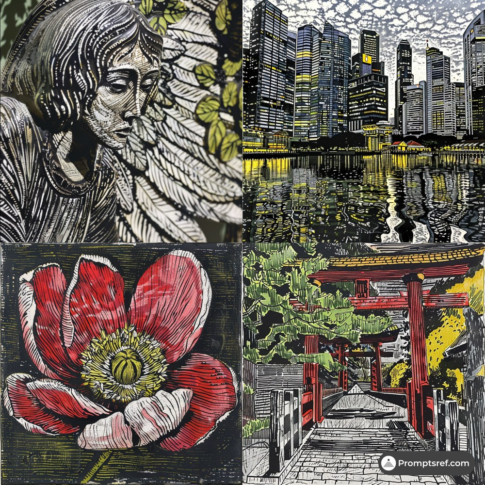

# AI Prompt Radar — 2026-10-09

Bugün bulunan yeni prompt sayısı: **5**

## 1. @IanCrossland

**Puan:** 42.43 &nbsp; **Etkileşim:** ❤ 82 · 🔁 5 · 👁 5742

**Tam prompt:**

~~~text
If you are just getting started with Ai, or would like to enhance your workflow, allow me to offer some efficiencies I have uncovered. You can tell your AI to consider implementing any or all of these into your workflow. I'd love to hear your feedback! Each method is followed by a prompt you can feed your machine (or copy and paste it all). The following was written, mostly, by ChatGPT: Astra/High ‐---- 1. Match AI models/depths to specific jobs: planning, building, and checking. Use the right brain & brain depth (high, low, etc.) for the job - conserve compute and save time. Reserve expensive reasoning for difficult problems. A separate reviewer checks finished work against the original requirements and actual test results. AI prompt: Inspect the project instructions. Add a small task queue with a suggested model and reasoning effort per task. Separate building from independent review. Require test evidence before marking work complete. Reuse existing tools. Tests required to catch deliberate mistakes 2. Passing tests can hide broken software. Introduce a deliberate mistake in a disposable project copy and check whether the tests notice. A test capable of catching a known bug provides stronger evidence than a green checkmark alone. AI prompt: Run the existing tests. In a disposable copy, introduce one realistic bug. Confirm a relevant test fails for the intended reason. Improve weak tests using written requirements. Keep deliberate bugs out of the main project. Record the results. 3.Project memory surviving a fresh chat Save project memory in files: completed work, decisions, test results, unfinished tasks, and the next action. A fresh AI chat can continue from a short handoff instead of rebuilding context from a long conversation. AI prompt: Create or update HANDOFF.md with the goal, current project version, completed work, evidence, remaining problems, and next task. Link detailed records instead of copying long logs. Add an instruction to read the handoff before continuing. 4. Publishing with automatic safeguards Publishing becomes safer when a small program checks the finished files, catches suspicious deletions, detects competing changes, and verifies the uploaded result. A saved receipt connects every release to the exact work and test evidence. AI prompt: Inspect the publishing process. Add a dry-run check listing exact files, flagging sensitive files and large deletions, and stopping on competing changes. Verify published files and save a receipt. Test in a disposable repository. Follow existing approval rules. 5. Shared tools proven in real projects Build a shared tool after a repeated need appears in real projects. Test the shared part in both projects, keep project-specific rules separate, and record the tested version. Useful reuse reduces work without forcing simultaneous upgrades. AI prompt: Find one repeated task across two real projects. Check existing tools first. Propose the smallest shared component and compare upkeep costs. Prove compatibility in both projects, record the tested version, and document independent upgrade and removal steps.
~~~

[Kaynak paylaşımı X'te aç ↗](https://x.com/IanCrossland/status/2108159410463821878)

---

## 2. @AIPromptmaste

**Puan:** 39.00 &nbsp; **Etkileşim:** ❤ 0 · 🔁 0 · 👁 9

**Tam prompt:**

~~~text
Here’s the prompt I used to create this video 👇 Create a breathtaking 15-second cinematic fashion-tech film with a bold, futuristic and premium visual identity. Concept: “THE FUTURE HAS A LOOK.” Format: 9:16 vertical Duration: 15 seconds Style: ultra-modern, high-fashion editorial, futuristic luxury, cinematic, sophisticated, visually striking Quality: photorealistic, premium commercial production, highly detailed SCENE 1 — 0–3s Extreme close-up of a sleek futuristic metallic surface in a dark studio. A thin beam of light sweeps across the surface, revealing subtle reflections and floating particles. The atmosphere feels mysterious, expensive and futuristic. Slow cinematic camera movement, shallow depth of field. SCENE 2 — 3–7s Reveal a confident futuristic fashion character wearing an elegant avant-garde black outfit with subtle metallic details. No recognizable brand logos. The character walks slowly through a massive minimalist futuristic environment filled with reflective surfaces and soft atmospheric haze. Powerful posture, editorial fashion photography aesthetic. Dynamic tracking camera, realistic fabric movement. SCENE 3 — 7–11s The environment suddenly transforms around the character. Geometric light structures rise from the floor and curve through the air like futuristic architecture. Reflections, volumetric light, floating particles and subtle motion blur create a premium sci-fi atmosphere. Camera performs a smooth cinematic orbit around the subject. SCENE 4 — 11–15s Close-up hero shot. The character stops and looks directly toward the camera with a calm, confident expression. The environment becomes almost completely dark while a dramatic rim light outlines the silhouette. Minimal glowing typography appears: “DON’T FOLLOW THE FUTURE. CREATE IT.” End with a subtle cinematic light flare and clean fade to black. CAMERA: Smooth dolly movements, controlled tracking shots, cinematic orbit, macro close-ups, shallow depth of field, realistic lens behavior, subtle anamorphic flare. LIGHTING: Dark luxury studio lighting, dramatic rim light, soft volumetric beams, controlled highlights, realistic reflections. COLOR: Black, graphite, silver and subtle electric-blue accents. MOTION: Elegant, confident, slow-to-medium pacing with perfectly timed transitions. No excessive effects. IMPORTANT: Keep the character realistic and sophisticated. No sexualized poses, no exaggerated body proportions, no nudity, no logos, no text distortion, no cartoon appearance. Every frame should feel like a premium futuristic fashion campaign created by a world-class creative studio. Experiment with it, change the visual direction, and make it your own.
~~~

[Kaynak paylaşımı X'te aç ↗](https://x.com/AIPromptmaste/status/2107871847660630533)

---

## 3. @promptsref

**Puan:** 34.74 &nbsp; **Etkileşim:** ❤ 9 · 🔁 0 · 👁 582

**Tam prompt:**

~~~text
Make your next prompt look like a modern woodcut: bold lines, stark contrast, and pops of color. Perfect for editorial art, posters, and cultural visuals. Full prompt in the comments. --sref 2713582720 #midjourney #sref
~~~

[Kaynak paylaşımı X'te aç ↗](https://x.com/promptsref/status/2107184503080759713)

---

## 4. @Eric_Smith08

**Puan:** 32.97 &nbsp; **Etkileşim:** ❤ 9 · 🔁 0 · 👁 152

**Tam prompt:**

~~~text
(Feature 1 — What Grok Bot Just Became): What Grok Bot Just Became — the first AI assistant that doesn't try to do everything itself. "Every major AI chatbot right now uses one model for everything. Your coding question, your image prompt, your music request, your legal analysis — all routed to the same neural network." Grok Bot just broke that pattern. Instead of forcing every task through one model, it routes each task to whichever AI on Earth is best at that specific job. Ask it to reason through a complex problem → it sends the job to Claude Opus 5.5. Ask it to generate an image → Midjourney. Ask it to create music → Suno. "You don't pick the model. The system picks it for you. Every time. Automatically."
~~~

[Kaynak paylaşımı X'te aç ↗](https://x.com/Eric_Smith08/status/2108193833188307319)

---

## 5. @Eric_Smith08

**Puan:** 32.29 &nbsp; **Etkileşim:** ❤ 4 · 🔁 0 · 👁 196

**Tam prompt:**

~~~text
(MATH POST): Here's what the default AI experience looks like: → Pick one chatbot — ChatGPT, Claude, Gemini, or Grok → Use that one model for every task → Coding goes to a model optimized for conversation → Image prompts go to a model optimized for text → Music requests get a poem instead of a song → Pay for one subscription, get one model's strengths and weaknesses → Switch between 3-4 apps when you need different capabilities → Manually decide which AI is best for each job That's the default in October 2026. Now here's Grok Bot with model routing: → One interface for every task → Coding → Claude Opus 5.5 (top-tier reasoning) → Images → Midjourney (best-in-class generation) → Music → Suno (full song production from text) → Plus Canva, GitHub, Notion, Linear, Vercel integrations → Bots that keep working while your device is closed → Automatic model selection — zero manual switching → Built on 300+ MW of compute at Colossus 1 Default: one model tries to do everything. Routed: the best model in the world does each thing. Same user. Same prompt. Completely different result.
~~~

[Kaynak paylaşımı X'te aç ↗](https://x.com/Eric_Smith08/status/2108193868856574239)

---

_Kaynak içerikler ilgili yazarlara aittir; özgün bağlantılar korunmuştur._
