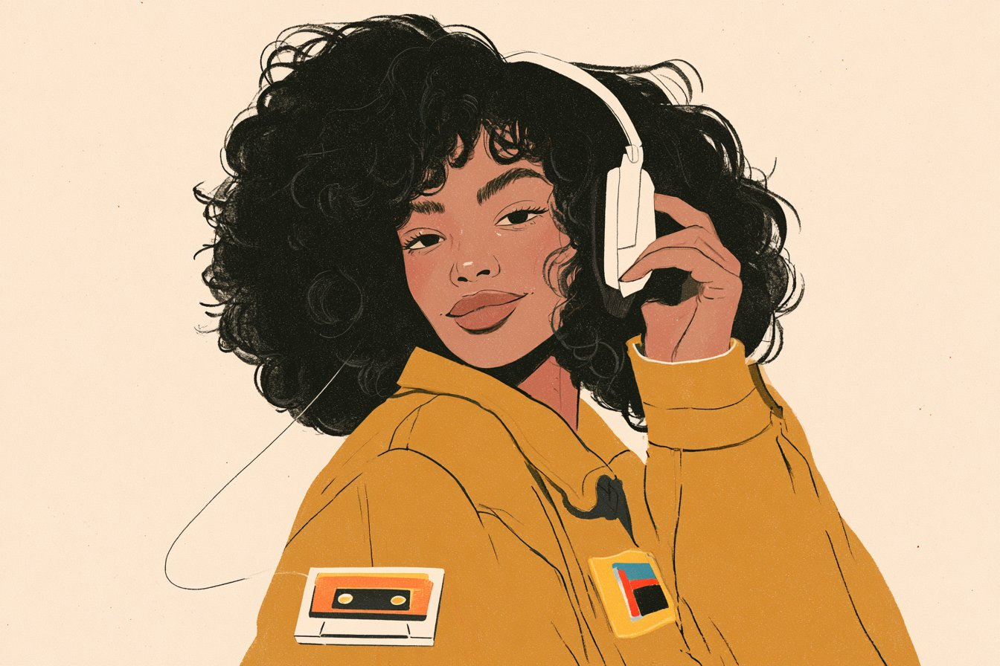
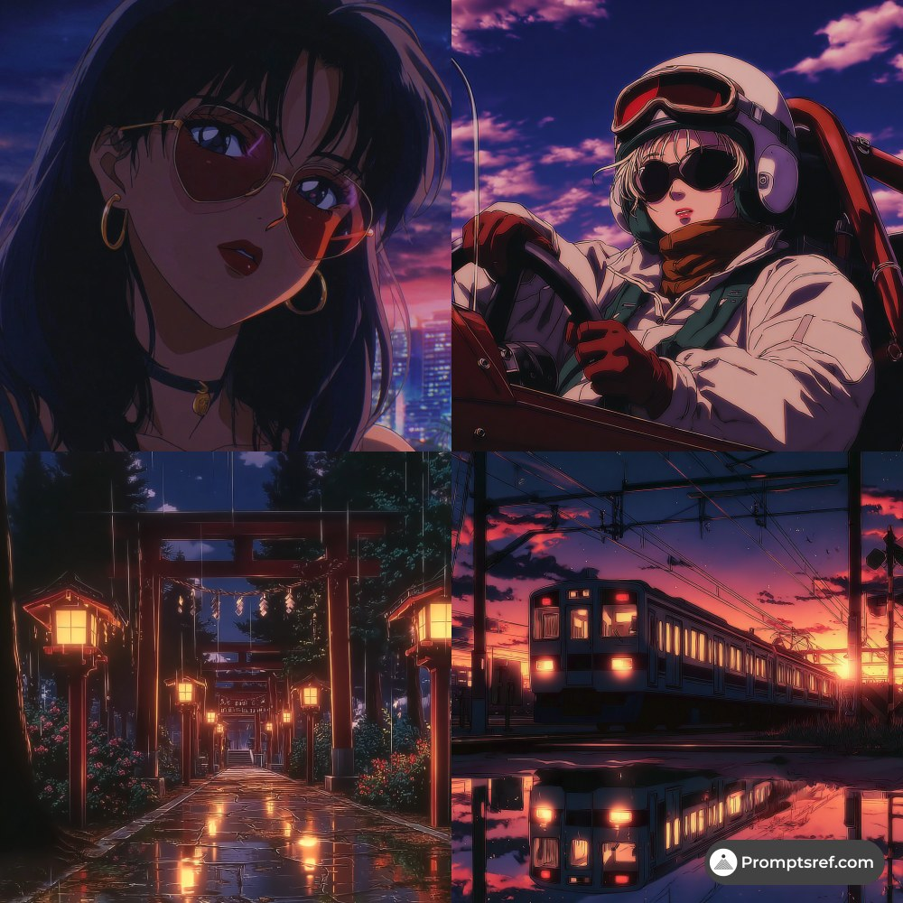

# AI Prompt Radar — 2026-10-10

Bugün bulunan yeni prompt sayısı: **3**

## 1. @azed_ai

**Puan:** 47.17 &nbsp; **Etkileşim:** ❤ 98 · 🔁 10 · 👁 3744

**Tam prompt:**

~~~text
Prompt share: Minimal Editorial Character 💬 Prompt: A minimalist illustration of a [subject] on a soft beige background, [hair description], subtle [facial details], [expression], wearing [clothing], posed with [hand pose/action], accented by [small foreground detail] and [small clothing detail], clean simplified shapes, delicate linework, muted color palette, subtle texture, modern editorial illustration, generous negative space Try it and share yours ✨
~~~

[Kaynak paylaşımı X'te aç ↗](https://x.com/azed_ai/status/2105613717895512409)

---

## 2. @promptsref

**Puan:** 36.80 &nbsp; **Etkileşim:** ❤ 9 · 🔁 1 · 👁 496

**Tam prompt:**

~~~text
Anime dusk, cyberpunk glow, Shinkai-style light—--sref 867249656 turns rainy streets, MV covers, VN scenes and app splash screens into cinematic posters. Full prompt in comments. --sref 867249656 #midjourney #sref
~~~

[Kaynak paylaşımı X'te aç ↗](https://x.com/promptsref/status/2106821856636338576)

---

## 3. @abxxai

**Puan:** 32.25 &nbsp; **Etkileşim:** ❤ 8 · 🔁 0 · 👁 172

**Tam prompt:**

~~~text
second scene (dance) uploade any viral video and upload that to seedance 2.5 and write a simple prompt Prompt: replace character (men) in video 1 with the character (men) in image 1 and the location in video 1 with the location in image 2 and the rest will be same
~~~

[Kaynak paylaşımı X'te aç ↗](https://x.com/abxxai/status/2108573368995983747)

---

_Kaynak içerikler ilgili yazarlara aittir; özgün bağlantılar korunmuştur._
